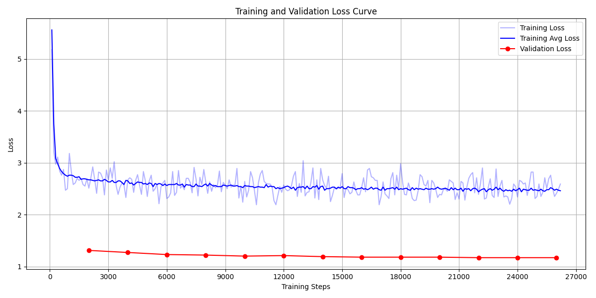

# 简介
本项目旨在使用两种框架（pytorch/jittor）复现LoRA论文中在GPT-2模型上的NLG任务中E2E数据集上的实验。


注：将环境配置、数据准备脚本、训练脚本、测试脚本、与pytorch实现对齐的实验log，性能log都放在README中。

注：这是作者初次复现大模型代码，参考了许多相关资料，详见主要参考部分。


# 主要内容
在readme中加入了log，文件较长，下面是主要内容目录。

```
# 关于jittor的安装
# lora实验复现-pytorch
# lora实验复现-jittor
# 文件组织结构
# 主要参考

```


# 关于jittor的安装-windows

## 核心语句
```shell
### 创建环境
conda create -n jittor_env python=3.8
conda activate jittor_env

### 按照帮助文档进行安装
python --version  
conda install pywin32  
nvcc --version

python -m pip install jittor==1.3.1.18 -i https://pypi.tuna.tsinghua.edu.cn/simple # 此处参考稳定性，安装版本：1.3.1.18
python -m jittor.test.test_core
python -m jittor.test.test_example
python -m jittor.test.test_cudnn_op

### 全部测试通过
```
## 安装日志
```shell
(base) C:\Users\86177>conda create -n jittor_env python=3.8
Channels:
 - https://mirrors.tuna.tsinghua.edu.cn/anaconda/pkgs/free
 - defaults
 - conda-forge
Platform: win-64
Collecting package metadata (repodata.json): done
Solving environment: done


==> WARNING: A newer version of conda exists. <==
    current version: 24.11.3
    latest version: 25.3.1

Please update conda by running

    $ conda update -n base -c defaults conda


## Package Plan ##

  environment location: D:\miniconda3\envs\jittor_env

  added / updated specs:
    - python=3.8


The following packages will be downloaded:

    package                    |            build
    ---------------------------|-----------------
    pip-24.2                   |   py38haa95532_0         2.4 MB  defaults
    python-3.8.20              |       h8205438_0        19.4 MB  defaults
    setuptools-75.1.0          |   py38haa95532_0         1.6 MB  defaults
    wheel-0.44.0               |   py38haa95532_0         137 KB  defaults
    ------------------------------------------------------------
                                           Total:        23.5 MB

The following NEW packages will be INSTALLED:

  ca-certificates    pkgs/main/win-64::ca-certificates-2025.2.25-haa95532_0
  libffi             pkgs/main/win-64::libffi-3.4.4-hd77b12b_1
  openssl            pkgs/main/win-64::openssl-3.0.16-h3f729d1_0
  pip                pkgs/main/win-64::pip-24.2-py38haa95532_0
  python             pkgs/main/win-64::python-3.8.20-h8205438_0
  setuptools         pkgs/main/win-64::setuptools-75.1.0-py38haa95532_0
  sqlite             pkgs/main/win-64::sqlite-3.45.3-h2bbff1b_0
  vc                 pkgs/main/win-64::vc-14.42-haa95532_5
  vs2015_runtime     pkgs/main/win-64::vs2015_runtime-14.42.34433-hbfb602d_5
  wheel              pkgs/main/win-64::wheel-0.44.0-py38haa95532_0


Proceed ([y]/n)? y


Downloading and Extracting Packages:

Preparing transaction: done
Verifying transaction: done
Executing transaction: done
#
# To activate this environment, use
#
#     $ conda activate jittor_env
#
# To deactivate an active environment, use
#
#     $ conda deactivate


(base) C:\Users\86177>conda activate jittor_env

(jittor_env) C:\Users\86177>conda install pywin32
Channels:
 - https://mirrors.tuna.tsinghua.edu.cn/anaconda/pkgs/free
 - defaults
 - conda-forge
Platform: win-64
Collecting package metadata (repodata.json): done
Solving environment: done


==> WARNING: A newer version of conda exists. <==
    current version: 24.11.3
    latest version: 25.3.1

Please update conda by running

    $ conda update -n base -c defaults conda


## Package Plan ##

  environment location: D:\miniconda3\envs\jittor_env

  added / updated specs:
    - pywin32


The following packages will be downloaded:

    package                    |            build
    ---------------------------|-----------------
    pywin32-305                |   py38h2bbff1b_0        10.7 MB  defaults
    ------------------------------------------------------------
                                           Total:        10.7 MB

The following NEW packages will be INSTALLED:

  pywin32            pkgs/main/win-64::pywin32-305-py38h2bbff1b_0


Proceed ([y]/n)? y


Downloading and Extracting Packages:

Preparing transaction: done
Verifying transaction: done
Executing transaction: done

(jittor_env) C:\Users\86177>Nvcc --version
Nvcc: NVIDIA (R) Cuda compiler driver
Copyright (c) 2005-2023 NVIDIA Corporation
Built on Tue_Jun_13_19:42:34_Pacific_Daylight_Time_2023
Cuda compilation tools, release 12.2, V12.2.91
Build cuda_12.2.r12.2/compiler.32965470_0

(jittor_env) C:\Users\86177>python -m pip install jittor==1.3.1.18 -i https://pypi.tuna.tsinghua.edu.cn/simple
Looking in indexes: https://pypi.tuna.tsinghua.edu.cn/simple
Collecting jittor==1.3.1.18
  Downloading https://pypi.tuna.tsinghua.edu.cn/packages/c0/66/3e8857589f650fcd80a04e9f006a0190ceaf44b493289f2028b9c612efe6/jittor-1.3.1.18.tar.gz (1.4 MB)
     ━━━━━━━━━━━━━━━━━━━━━━━━━━━━━━━━━━━━━━━━ 1.4/1.4 MB 8.3 MB/s eta 0:00:00
  Preparing metadata (setup.py) ... done
Requirement already satisfied: numpy in d:\miniconda3\envs\jittor_env\lib\site-packages (from jittor==1.3.1.18) (1.24.4)
Requirement already satisfied: tqdm in d:\miniconda3\envs\jittor_env\lib\site-packages (from jittor==1.3.1.18) (4.67.1)
Requirement already satisfied: pillow in d:\miniconda3\envs\jittor_env\lib\site-packages (from jittor==1.3.1.18) (10.4.0)
Requirement already satisfied: astunparse in d:\miniconda3\envs\jittor_env\lib\site-packages (from jittor==1.3.1.18) (1.6.3)
Requirement already satisfied: pywin32>=1.0 in d:\miniconda3\envs\jittor_env\lib\site-packages (from jittor==1.3.1.18) (305.1)
Requirement already satisfied: wheel<1.0,>=0.23.0 in d:\miniconda3\envs\jittor_env\lib\site-packages (from astunparse->jittor==1.3.1.18) (0.44.0)
Requirement already satisfied: six<2.0,>=1.6.1 in d:\miniconda3\envs\jittor_env\lib\site-packages (from astunparse->jittor==1.3.1.18) (1.17.0)
Requirement already satisfied: colorama in d:\miniconda3\envs\jittor_env\lib\site-packages (from tqdm->jittor==1.3.1.18) (0.4.6)
Building wheels for collected packages: jittor
  Building wheel for jittor (setup.py) ... done
  Created wheel for jittor: filename=jittor-1.3.1.18-py3-none-any.whl size=1741732 sha256=96652f6ee7704247246ce7cc8a1693f1ffefa5b25efc7704ba1a6d06ccb1e95e
  Stored in directory: c:\users\86177\appdata\local\pip\cache\wheels\0e\09\9e\70acc7d001d7feb8fd5b71d379b53a2161557888a072953a71
Successfully built jittor
Installing collected packages: jittor
  Attempting uninstall: jittor
    Found existing installation: jittor 1.3.9.14
    Uninstalling jittor-1.3.9.14:
      Successfully uninstalled jittor-1.3.9.14
Successfully installed jittor-1.3.1.18

(jittor_env) C:\Users\86177>python -m jittor.test.test_core
[i 0520 16:49:45.385678 68 lock.py:78] Create lock file:C:\Users\86177\.cache\jittor\jt1.3.1\cl\py3.8.20\Windows-10-10.x57\IntelRCoreTMi5x4f\jittor.lock
[i 0520 16:49:45.442411 68 compiler.py:944] Jittor(1.3.1.18) src: d:\miniconda3\envs\jittor_env\lib\site-packages\jittor
[i 0520 16:49:45.484897 68 compiler.py:945] cl at C:\Users\86177\.cache\jittor\msvc\VC\_\_\_\_\_\bin\cl.exe(19.29.30133)
[i 0520 16:49:45.485901 68 compiler.py:946] cache_path: C:\Users\86177\.cache\jittor\jt1.3.1\cl\py3.8.20\Windows-10-10.x57\IntelRCoreTMi5x4f\default
[i 0520 16:49:45.494958 68 install_cuda.py:51] cuda_driver_version: [12, 8, 0]
Downloading https://cg.cs.tsinghua.edu.cn/jittor/assets/cuda11.4_cudnn8_win.zip to C:\Users\86177\.cache\jittor\jtcuda\cuda11.4_cudnn8_win.zip
1.85GB [02:05, 15.8MB/s]
[i 0520 16:52:19.752359 68 __init__.py:372] Found C:\Users\86177\.cache\jittor\jtcuda\cuda11.4_cudnn8_win\bin\nvcc.exe(11.4.100) at C:\Users\86177\.cache\jittor\jtcuda\cuda11.4_cudnn8_win\bin\nvcc.exe.
[i 0520 16:52:20.010598 68 __init__.py:372] Found gdb(8.1) at C:\Program Files\mingw64\bin\gdb.EXE.
[i 0520 16:52:20.099146 68 __init__.py:372] Found addr2line(2.30) at C:\Program Files\mingw64\bin\addr2line.EXE.
[i 0520 16:52:20.531370 68 compiler.py:997] cuda key:cu11.4.100_sm_61
[i 0520 16:52:20.532371 68 compiler.py:34] Create cache dir: C:\Users\86177\.cache\jittor\jt1.3.1\cl\py3.8.20\Windows-10-10.x57\IntelRCoreTMi5x4f\default\cu11.4.100_sm_61
[i 0520 16:52:20.533373 68 compiler.py:34] Create cache dir: C:\Users\86177\.cache\jittor\jt1.3.1\cl\py3.8.20\Windows-10-10.x57\IntelRCoreTMi5x4f\default\cu11.4.100_sm_61\jit
[i 0520 16:52:20.534373 68 compiler.py:34] Create cache dir: C:\Users\86177\.cache\jittor\jt1.3.1\cl\py3.8.20\Windows-10-10.x57\IntelRCoreTMi5x4f\default\cu11.4.100_sm_61\obj_files
[i 0520 16:52:20.535373 68 compiler.py:34] Create cache dir: C:\Users\86177\.cache\jittor\jt1.3.1\cl\py3.8.20\Windows-10-10.x57\IntelRCoreTMi5x4f\default\cu11.4.100_sm_61\gen
[i 0520 16:52:20.536370 68 compiler.py:34] Create cache dir: C:\Users\86177\.cache\jittor\jt1.3.1\cl\py3.8.20\Windows-10-10.x57\IntelRCoreTMi5x4f\default\cu11.4.100_sm_61\tmp
[i 0520 16:52:20.538392 68 compiler.py:34] Create cache dir: C:\Users\86177\.cache\jittor\jt1.3.1\cl\py3.8.20\Windows-10-10.x57\IntelRCoreTMi5x4f\default\cu11.4.100_sm_61\checkpoints
[i 0520 16:52:20.542370 68 __init__.py:187] Total mem: 15.76GB, using 5 procs for compiling.
Compiling jit_utils_core(5/5) used: 4.047s eta: 0.000s
Compiling jit_utils_core(5/5) used: 2.995s eta: 0.000s
Compiling jittor_core(146/146) used: 79.361s eta: 0.000ss
[i 0520 16:54:04.104000 68 jit_compiler.cc:27] Load cc_path: C:\Users\86177\.cache\jittor\msvc\VC\_\_\_\_\_\bin\cl.exe
[i 0520 16:54:04.225000 68 init.cc:61] Found cuda archs: [61,]
[i 0520 16:54:04.582000 68 compile_extern.py:497] mpicc not found, distribution disabled.
[i 0520 16:54:04.582000 68 compiler.py:34] Create cache dir: C:\Users\86177\.cache\jittor\cutt
[i 0520 16:54:04.584000 68 compile_extern.py:313] Downloading cutt...
Downloading https://codeload.github.com/Jittor/cutt/zip/v1.2 to C:\Users\86177\.cache\jittor\cutt\cutt-1.2.zip
296kB [00:01, 235kB/s]
[i 0520 16:54:05.912000 68 compile_extern.py:326] installing cutt...
Compiling libcutt(9/9) used: 110.815s eta: 0.000s
[i 0520 16:55:57.475000 68 compiler.py:34] Create cache dir: C:\Users\86177\.cache\jittor\jt1.3.1\cl\py3.8.20\Windows-10-10.x57\IntelRCoreTMi5x4f\default\cu11.4.100_sm_61\custom_ops
[i 0520 16:55:59.697000 68 compiler.py:34] Create cache dir: C:\Users\86177\.cache\jittor\mkl
[i 0520 16:55:59.698000 68 compile_extern.py:64] Downloading mkl...
Downloading https://cg.cs.tsinghua.edu.cn/jittor/assets/dnnl_win_2.2.0_cpu_vcomp.zip to C:\Users\86177\.cache\jittor\mkl\dnnl_win_2.2.0_cpu_vcomp.zip
6.70MB [00:00, 8.39MB/s]
cnn_inference_f32.cpp
Use time: 31.57 ms per iteration.
Example passed on CPU.
Compiling gen_ops_mkl_conv_backward_w_mkl_conv_backward_x_mk___hashc4699b(7/7) used: 3.544s eta: 0.000s
[i 0520 16:56:09.419000 68 compiler.py:34] Create cache dir: C:\Users\86177\.cache\jittor\jt1.3.1\cl\py3.8.20\Windows-10-10.x57\IntelRCoreTMi5x4f\default\cu11.4.100_sm_61\cuda
Compiling libcuda_extern(3/3) used: 2.992s eta: 0.000s
Compiling gen_ops_cub_argsort_cub_arg_reduce_cub_cumsum_cub____hash7542fc(6/6) used: 2.134s eta: 0.000s
Compiling gen_ops_cublas_batched_matmul_cublas_matmul_cublas___hashde0e83(7/7) used: 2.167s eta: 0.000s
Compiling gen_ops_cudnn_conv3d_backward_w_cudnn_conv3d_backw___hash78c3ee(16/16) used: 6.989s eta: 0.000s
Compiling gen_ops_curand_random(4/4) used: 2.407s eta: 0.000s
.......
----------------------------------------------------------------------
Ran 7 tests in 7.459s

OK

(jittor_env) C:\Users\86177>python -m jittor.test.test_example
[i 0520 16:56:53.571000 68 compiler.py:944] Jittor(1.3.1.18) src: d:\miniconda3\envs\jittor_env\lib\site-packages\jittor
[i 0520 16:56:53.614000 68 compiler.py:945] cl at C:\Users\86177\.cache\jittor\msvc\VC\_\_\_\_\_\bin\cl.exe(19.29.30133)
[i 0520 16:56:53.614000 68 compiler.py:946] cache_path: C:\Users\86177\.cache\jittor\jt1.3.1\cl\py3.8.20\Windows-10-10.x57\IntelRCoreTMi5x4f\default
[i 0520 16:56:53.620000 68 install_cuda.py:51] cuda_driver_version: [12, 8, 0]
[i 0520 16:56:53.658000 68 __init__.py:372] Found C:\Users\86177\.cache\jittor\jtcuda\cuda11.4_cudnn8_win\bin\nvcc.exe(11.4.100) at C:\Users\86177\.cache\jittor\jtcuda\cuda11.4_cudnn8_win\bin\nvcc.exe.
[i 0520 16:56:53.893000 68 __init__.py:372] Found gdb(8.1) at C:\Program Files\mingw64\bin\gdb.EXE.
[i 0520 16:56:53.977000 68 __init__.py:372] Found addr2line(2.30) at C:\Program Files\mingw64\bin\addr2line.EXE.
[i 0520 16:56:54.287000 68 compiler.py:997] cuda key:cu11.4.100_sm_61
[i 0520 16:56:54.289000 68 __init__.py:187] Total mem: 15.76GB, using 5 procs for compiling.
[i 0520 16:56:55.320000 68 jit_compiler.cc:27] Load cc_path: C:\Users\86177\.cache\jittor\msvc\VC\_\_\_\_\_\bin\cl.exe
[i 0520 16:56:55.322000 68 init.cc:61] Found cuda archs: [61,]
[i 0520 16:56:55.547000 68 compile_extern.py:497] mpicc not found, distribution disabled.

Compiling Operators(10/10) used: 2.56s eta:    0s
step 0, loss = 0.17297527194023132 {'hold_vars': 14, 'lived_vars': 64, 'lived_ops': 57}

Compiling Operators(10/10) used: 3.71s eta:    0s
step 1, loss = 0.10625168681144714 {'hold_vars': 14, 'lived_vars': 64, 'lived_ops': 56}
step 2, loss = 0.16380245983600616 {'hold_vars': 14, 'lived_vars': 64, 'lived_ops': 56}
step 3, loss = 0.11234966665506363 {'hold_vars': 14, 'lived_vars': 64, 'lived_ops': 56}
step 4, loss = 0.0933552160859108 {'hold_vars': 14, 'lived_vars': 64, 'lived_ops': 56}
step 5, loss = 0.17556409537792206 {'hold_vars': 14, 'lived_vars': 64, 'lived_ops': 56}
step 6, loss = 0.0665908083319664 {'hold_vars': 14, 'lived_vars': 64, 'lived_ops': 56}
step 7, loss = 0.1112009659409523 {'hold_vars': 14, 'lived_vars': 64, 'lived_ops': 56}
step 8, loss = 0.12045945227146149 {'hold_vars': 14, 'lived_vars': 64, 'lived_ops': 56}
step 9, loss = 0.11565545201301575 {'hold_vars': 14, 'lived_vars': 64, 'lived_ops': 56}
step 10, loss = 0.07345755398273468 {'hold_vars': 14, 'lived_vars': 64, 'lived_ops': 56}
step 11, loss = 0.13001315295696259 {'hold_vars': 14, 'lived_vars': 64, 'lived_ops': 56}
step 12, loss = 0.09793171286582947 {'hold_vars': 14, 'lived_vars': 64, 'lived_ops': 56}
step 13, loss = 0.06286901980638504 {'hold_vars': 14, 'lived_vars': 64, 'lived_ops': 56}
step 14, loss = 0.08703870326280594 {'hold_vars': 14, 'lived_vars': 64, 'lived_ops': 56}
step 15, loss = 0.10288067907094955 {'hold_vars': 14, 'lived_vars': 64, 'lived_ops': 56}
step 16, loss = 0.07789818197488785 {'hold_vars': 14, 'lived_vars': 64, 'lived_ops': 56}
step 17, loss = 0.08222698420286179 {'hold_vars': 14, 'lived_vars': 64, 'lived_ops': 56}
step 18, loss = 0.08562955260276794 {'hold_vars': 14, 'lived_vars': 64, 'lived_ops': 56}
step 19, loss = 0.0927530825138092 {'hold_vars': 14, 'lived_vars': 64, 'lived_ops': 56}
step 20, loss = 0.0877925381064415 {'hold_vars': 14, 'lived_vars': 64, 'lived_ops': 56}
step 21, loss = 0.0950084701180458 {'hold_vars': 14, 'lived_vars': 64, 'lived_ops': 56}
step 22, loss = 0.09783554822206497 {'hold_vars': 14, 'lived_vars': 64, 'lived_ops': 56}
step 23, loss = 0.08850836008787155 {'hold_vars': 14, 'lived_vars': 64, 'lived_ops': 56}
step 24, loss = 0.10320419818162918 {'hold_vars': 14, 'lived_vars': 64, 'lived_ops': 56}
step 25, loss = 0.09891989827156067 {'hold_vars': 14, 'lived_vars': 64, 'lived_ops': 56}
step 26, loss = 0.09916054457426071 {'hold_vars': 14, 'lived_vars': 64, 'lived_ops': 56}
step 27, loss = 0.07924723625183105 {'hold_vars': 14, 'lived_vars': 64, 'lived_ops': 56}
step 28, loss = 0.08794482052326202 {'hold_vars': 14, 'lived_vars': 64, 'lived_ops': 56}
step 29, loss = 0.09613388776779175 {'hold_vars': 14, 'lived_vars': 64, 'lived_ops': 56}
step 30, loss = 0.08696203678846359 {'hold_vars': 14, 'lived_vars': 64, 'lived_ops': 56}
step 31, loss = 0.09201446175575256 {'hold_vars': 14, 'lived_vars': 64, 'lived_ops': 56}
step 32, loss = 0.09207715839147568 {'hold_vars': 14, 'lived_vars': 64, 'lived_ops': 56}
step 33, loss = 0.07529407739639282 {'hold_vars': 14, 'lived_vars': 64, 'lived_ops': 56}
step 34, loss = 0.08863430470228195 {'hold_vars': 14, 'lived_vars': 64, 'lived_ops': 56}
step 35, loss = 0.08062980324029922 {'hold_vars': 14, 'lived_vars': 64, 'lived_ops': 56}
step 36, loss = 0.09011635184288025 {'hold_vars': 14, 'lived_vars': 64, 'lived_ops': 56}
step 37, loss = 0.08681892603635788 {'hold_vars': 14, 'lived_vars': 64, 'lived_ops': 56}
step 38, loss = 0.08157888054847717 {'hold_vars': 14, 'lived_vars': 64, 'lived_ops': 56}
step 39, loss = 0.08171100914478302 {'hold_vars': 14, 'lived_vars': 64, 'lived_ops': 56}
step 40, loss = 0.07518237084150314 {'hold_vars': 14, 'lived_vars': 64, 'lived_ops': 56}
step 41, loss = 0.0694880485534668 {'hold_vars': 14, 'lived_vars': 64, 'lived_ops': 56}
step 42, loss = 0.07326982915401459 {'hold_vars': 14, 'lived_vars': 64, 'lived_ops': 56}
step 43, loss = 0.09633630514144897 {'hold_vars': 14, 'lived_vars': 64, 'lived_ops': 56}
step 44, loss = 0.08717181533575058 {'hold_vars': 14, 'lived_vars': 64, 'lived_ops': 56}
step 45, loss = 0.0774107426404953 {'hold_vars': 14, 'lived_vars': 64, 'lived_ops': 56}
step 46, loss = 0.0827961415052414 {'hold_vars': 14, 'lived_vars': 64, 'lived_ops': 56}
step 47, loss = 0.08229496330022812 {'hold_vars': 14, 'lived_vars': 64, 'lived_ops': 56}
step 48, loss = 0.08481067419052124 {'hold_vars': 14, 'lived_vars': 64, 'lived_ops': 56}
step 49, loss = 0.06560064852237701 {'hold_vars': 14, 'lived_vars': 64, 'lived_ops': 56}
step 50, loss = 0.08550102263689041 {'hold_vars': 14, 'lived_vars': 64, 'lived_ops': 56}
step 51, loss = 0.08785639703273773 {'hold_vars': 14, 'lived_vars': 64, 'lived_ops': 56}
step 52, loss = 0.06988082826137543 {'hold_vars': 14, 'lived_vars': 64, 'lived_ops': 56}
step 53, loss = 0.07682090997695923 {'hold_vars': 14, 'lived_vars': 64, 'lived_ops': 56}
step 54, loss = 0.0725381001830101 {'hold_vars': 14, 'lived_vars': 64, 'lived_ops': 56}
step 55, loss = 0.06807945668697357 {'hold_vars': 14, 'lived_vars': 64, 'lived_ops': 56}
step 56, loss = 0.09616025537252426 {'hold_vars': 14, 'lived_vars': 64, 'lived_ops': 56}
step 57, loss = 0.08846761286258698 {'hold_vars': 14, 'lived_vars': 64, 'lived_ops': 56}
step 58, loss = 0.08808409422636032 {'hold_vars': 14, 'lived_vars': 64, 'lived_ops': 56}
step 59, loss = 0.0807020366191864 {'hold_vars': 14, 'lived_vars': 64, 'lived_ops': 56}
step 60, loss = 0.07187913358211517 {'hold_vars': 14, 'lived_vars': 64, 'lived_ops': 56}
step 61, loss = 0.06960427761077881 {'hold_vars': 14, 'lived_vars': 64, 'lived_ops': 56}
step 62, loss = 0.08879712224006653 {'hold_vars': 14, 'lived_vars': 64, 'lived_ops': 56}
step 63, loss = 0.0592106468975544 {'hold_vars': 14, 'lived_vars': 64, 'lived_ops': 56}
step 64, loss = 0.08148450404405594 {'hold_vars': 14, 'lived_vars': 64, 'lived_ops': 56}
step 65, loss = 0.10133301466703415 {'hold_vars': 14, 'lived_vars': 64, 'lived_ops': 56}
step 66, loss = 0.0919867753982544 {'hold_vars': 14, 'lived_vars': 64, 'lived_ops': 56}
step 67, loss = 0.07346579432487488 {'hold_vars': 14, 'lived_vars': 64, 'lived_ops': 56}
step 68, loss = 0.06967055797576904 {'hold_vars': 14, 'lived_vars': 64, 'lived_ops': 56}
step 69, loss = 0.0747140571475029 {'hold_vars': 14, 'lived_vars': 64, 'lived_ops': 56}
step 70, loss = 0.06969478726387024 {'hold_vars': 14, 'lived_vars': 64, 'lived_ops': 56}
step 71, loss = 0.07161737233400345 {'hold_vars': 14, 'lived_vars': 64, 'lived_ops': 56}
step 72, loss = 0.06955922394990921 {'hold_vars': 14, 'lived_vars': 64, 'lived_ops': 56}
step 73, loss = 0.08352448046207428 {'hold_vars': 14, 'lived_vars': 64, 'lived_ops': 56}
step 74, loss = 0.04916569963097572 {'hold_vars': 14, 'lived_vars': 64, 'lived_ops': 56}
step 75, loss = 0.0921410471200943 {'hold_vars': 14, 'lived_vars': 64, 'lived_ops': 56}
step 76, loss = 0.07305807620286942 {'hold_vars': 14, 'lived_vars': 64, 'lived_ops': 56}
step 77, loss = 0.05532393977046013 {'hold_vars': 14, 'lived_vars': 64, 'lived_ops': 56}
step 78, loss = 0.05413983389735222 {'hold_vars': 14, 'lived_vars': 64, 'lived_ops': 56}
step 79, loss = 0.070480115711689 {'hold_vars': 14, 'lived_vars': 64, 'lived_ops': 56}
step 80, loss = 0.07982664555311203 {'hold_vars': 14, 'lived_vars': 64, 'lived_ops': 56}
step 81, loss = 0.0668056309223175 {'hold_vars': 14, 'lived_vars': 64, 'lived_ops': 56}
step 82, loss = 0.07115336507558823 {'hold_vars': 14, 'lived_vars': 64, 'lived_ops': 56}
step 83, loss = 0.05035173520445824 {'hold_vars': 14, 'lived_vars': 64, 'lived_ops': 56}
step 84, loss = 0.07953663915395737 {'hold_vars': 14, 'lived_vars': 64, 'lived_ops': 56}
step 85, loss = 0.06669357419013977 {'hold_vars': 14, 'lived_vars': 64, 'lived_ops': 56}
step 86, loss = 0.07839372754096985 {'hold_vars': 14, 'lived_vars': 64, 'lived_ops': 56}
step 87, loss = 0.04974968731403351 {'hold_vars': 14, 'lived_vars': 64, 'lived_ops': 56}
step 88, loss = 0.06988010555505753 {'hold_vars': 14, 'lived_vars': 64, 'lived_ops': 56}
step 89, loss = 0.0578199103474617 {'hold_vars': 14, 'lived_vars': 64, 'lived_ops': 56}
step 90, loss = 0.05371523275971413 {'hold_vars': 14, 'lived_vars': 64, 'lived_ops': 56}
step 91, loss = 0.0639626681804657 {'hold_vars': 14, 'lived_vars': 64, 'lived_ops': 56}
step 92, loss = 0.07825248688459396 {'hold_vars': 14, 'lived_vars': 64, 'lived_ops': 56}
step 93, loss = 0.05908228084445 {'hold_vars': 14, 'lived_vars': 64, 'lived_ops': 56}
step 94, loss = 0.06162983924150467 {'hold_vars': 14, 'lived_vars': 64, 'lived_ops': 56}
step 95, loss = 0.05836141109466553 {'hold_vars': 14, 'lived_vars': 64, 'lived_ops': 56}
step 96, loss = 0.06597650796175003 {'hold_vars': 14, 'lived_vars': 64, 'lived_ops': 56}
step 97, loss = 0.07603640109300613 {'hold_vars': 14, 'lived_vars': 64, 'lived_ops': 56}
step 98, loss = 0.0673438012599945 {'hold_vars': 14, 'lived_vars': 64, 'lived_ops': 56}
step 99, loss = 0.07169254124164581 {'hold_vars': 14, 'lived_vars': 64, 'lived_ops': 56}
step 100, loss = 0.04581441357731819 {'hold_vars': 14, 'lived_vars': 64, 'lived_ops': 56}
step 101, loss = 0.0623411126434803 {'hold_vars': 14, 'lived_vars': 64, 'lived_ops': 56}
step 102, loss = 0.06983307749032974 {'hold_vars': 14, 'lived_vars': 64, 'lived_ops': 56}
step 103, loss = 0.06998435407876968 {'hold_vars': 14, 'lived_vars': 64, 'lived_ops': 56}
step 104, loss = 0.062418121844530106 {'hold_vars': 14, 'lived_vars': 64, 'lived_ops': 56}
step 105, loss = 0.07992520183324814 {'hold_vars': 14, 'lived_vars': 64, 'lived_ops': 56}
step 106, loss = 0.06620632112026215 {'hold_vars': 14, 'lived_vars': 64, 'lived_ops': 56}
step 107, loss = 0.056442733854055405 {'hold_vars': 14, 'lived_vars': 64, 'lived_ops': 56}
step 108, loss = 0.06598374247550964 {'hold_vars': 14, 'lived_vars': 64, 'lived_ops': 56}
step 109, loss = 0.06726576387882233 {'hold_vars': 14, 'lived_vars': 64, 'lived_ops': 56}
step 110, loss = 0.06213453412055969 {'hold_vars': 14, 'lived_vars': 64, 'lived_ops': 56}
step 111, loss = 0.07393795251846313 {'hold_vars': 14, 'lived_vars': 64, 'lived_ops': 56}
step 112, loss = 0.07277648150920868 {'hold_vars': 14, 'lived_vars': 64, 'lived_ops': 56}
step 113, loss = 0.06928341090679169 {'hold_vars': 14, 'lived_vars': 64, 'lived_ops': 56}
step 114, loss = 0.07447683811187744 {'hold_vars': 14, 'lived_vars': 64, 'lived_ops': 56}
step 115, loss = 0.07320910692214966 {'hold_vars': 14, 'lived_vars': 64, 'lived_ops': 56}
step 116, loss = 0.054701317101716995 {'hold_vars': 14, 'lived_vars': 64, 'lived_ops': 56}
step 117, loss = 0.059625811874866486 {'hold_vars': 14, 'lived_vars': 64, 'lived_ops': 56}
step 118, loss = 0.06404450535774231 {'hold_vars': 14, 'lived_vars': 64, 'lived_ops': 56}
step 119, loss = 0.056590933352708817 {'hold_vars': 14, 'lived_vars': 64, 'lived_ops': 56}
step 120, loss = 0.06240908429026604 {'hold_vars': 14, 'lived_vars': 64, 'lived_ops': 56}
step 121, loss = 0.0575227215886116 {'hold_vars': 14, 'lived_vars': 64, 'lived_ops': 56}
step 122, loss = 0.0679064616560936 {'hold_vars': 14, 'lived_vars': 64, 'lived_ops': 56}
step 123, loss = 0.05845649540424347 {'hold_vars': 14, 'lived_vars': 64, 'lived_ops': 56}
step 124, loss = 0.05834929645061493 {'hold_vars': 14, 'lived_vars': 64, 'lived_ops': 56}
step 125, loss = 0.05735095590353012 {'hold_vars': 14, 'lived_vars': 64, 'lived_ops': 56}
step 126, loss = 0.04580775275826454 {'hold_vars': 14, 'lived_vars': 64, 'lived_ops': 56}
step 127, loss = 0.04659644514322281 {'hold_vars': 14, 'lived_vars': 64, 'lived_ops': 56}
step 128, loss = 0.050005294382572174 {'hold_vars': 14, 'lived_vars': 64, 'lived_ops': 56}
step 129, loss = 0.08033932745456696 {'hold_vars': 14, 'lived_vars': 64, 'lived_ops': 56}
step 130, loss = 0.05403895303606987 {'hold_vars': 14, 'lived_vars': 64, 'lived_ops': 56}
step 131, loss = 0.0450214147567749 {'hold_vars': 14, 'lived_vars': 64, 'lived_ops': 56}
step 132, loss = 0.050565313547849655 {'hold_vars': 14, 'lived_vars': 64, 'lived_ops': 56}
step 133, loss = 0.05542277917265892 {'hold_vars': 14, 'lived_vars': 64, 'lived_ops': 56}
step 134, loss = 0.0699717104434967 {'hold_vars': 14, 'lived_vars': 64, 'lived_ops': 56}
step 135, loss = 0.07137362658977509 {'hold_vars': 14, 'lived_vars': 64, 'lived_ops': 56}
step 136, loss = 0.06886138767004013 {'hold_vars': 14, 'lived_vars': 64, 'lived_ops': 56}
step 137, loss = 0.07071130722761154 {'hold_vars': 14, 'lived_vars': 64, 'lived_ops': 56}
step 138, loss = 0.050708621740341187 {'hold_vars': 14, 'lived_vars': 64, 'lived_ops': 56}
step 139, loss = 0.0520145483314991 {'hold_vars': 14, 'lived_vars': 64, 'lived_ops': 56}
step 140, loss = 0.05510937049984932 {'hold_vars': 14, 'lived_vars': 64, 'lived_ops': 56}
step 141, loss = 0.04911695420742035 {'hold_vars': 14, 'lived_vars': 64, 'lived_ops': 56}
step 142, loss = 0.05561072751879692 {'hold_vars': 14, 'lived_vars': 64, 'lived_ops': 56}
step 143, loss = 0.07811761647462845 {'hold_vars': 14, 'lived_vars': 64, 'lived_ops': 56}
step 144, loss = 0.048392824828624725 {'hold_vars': 14, 'lived_vars': 64, 'lived_ops': 56}
step 145, loss = 0.06699664890766144 {'hold_vars': 14, 'lived_vars': 64, 'lived_ops': 56}
step 146, loss = 0.0533558651804924 {'hold_vars': 14, 'lived_vars': 64, 'lived_ops': 56}
step 147, loss = 0.06571203470230103 {'hold_vars': 14, 'lived_vars': 64, 'lived_ops': 56}
step 148, loss = 0.05240791290998459 {'hold_vars': 14, 'lived_vars': 64, 'lived_ops': 56}
step 149, loss = 0.061031125485897064 {'hold_vars': 14, 'lived_vars': 64, 'lived_ops': 56}
step 150, loss = 0.06536039710044861 {'hold_vars': 14, 'lived_vars': 64, 'lived_ops': 56}
step 151, loss = 0.049712806940078735 {'hold_vars': 14, 'lived_vars': 64, 'lived_ops': 56}
step 152, loss = 0.05500216409564018 {'hold_vars': 14, 'lived_vars': 64, 'lived_ops': 56}
step 153, loss = 0.048620760440826416 {'hold_vars': 14, 'lived_vars': 64, 'lived_ops': 56}
step 154, loss = 0.05073269456624985 {'hold_vars': 14, 'lived_vars': 64, 'lived_ops': 56}
step 155, loss = 0.05076364055275917 {'hold_vars': 14, 'lived_vars': 64, 'lived_ops': 56}
step 156, loss = 0.04506964236497879 {'hold_vars': 14, 'lived_vars': 64, 'lived_ops': 56}
step 157, loss = 0.05145731940865517 {'hold_vars': 14, 'lived_vars': 64, 'lived_ops': 56}
step 158, loss = 0.05989094451069832 {'hold_vars': 14, 'lived_vars': 64, 'lived_ops': 56}
step 159, loss = 0.04199874401092529 {'hold_vars': 14, 'lived_vars': 64, 'lived_ops': 56}
step 160, loss = 0.04804573953151703 {'hold_vars': 14, 'lived_vars': 64, 'lived_ops': 56}
step 161, loss = 0.04447875916957855 {'hold_vars': 14, 'lived_vars': 64, 'lived_ops': 56}
step 162, loss = 0.03655199706554413 {'hold_vars': 14, 'lived_vars': 64, 'lived_ops': 56}
step 163, loss = 0.045894768089056015 {'hold_vars': 14, 'lived_vars': 64, 'lived_ops': 56}
step 164, loss = 0.04322364926338196 {'hold_vars': 14, 'lived_vars': 64, 'lived_ops': 56}
step 165, loss = 0.050122346729040146 {'hold_vars': 14, 'lived_vars': 64, 'lived_ops': 56}
step 166, loss = 0.03519183397293091 {'hold_vars': 14, 'lived_vars': 64, 'lived_ops': 56}
step 167, loss = 0.042171791195869446 {'hold_vars': 14, 'lived_vars': 64, 'lived_ops': 56}
step 168, loss = 0.04836597666144371 {'hold_vars': 14, 'lived_vars': 64, 'lived_ops': 56}
step 169, loss = 0.05057545378804207 {'hold_vars': 14, 'lived_vars': 64, 'lived_ops': 56}
step 170, loss = 0.030293097719550133 {'hold_vars': 14, 'lived_vars': 64, 'lived_ops': 56}
step 171, loss = 0.04366809502243996 {'hold_vars': 14, 'lived_vars': 64, 'lived_ops': 56}
step 172, loss = 0.04477931559085846 {'hold_vars': 14, 'lived_vars': 64, 'lived_ops': 56}
step 173, loss = 0.05236281827092171 {'hold_vars': 14, 'lived_vars': 64, 'lived_ops': 56}
step 174, loss = 0.05224624648690224 {'hold_vars': 14, 'lived_vars': 64, 'lived_ops': 56}
step 175, loss = 0.03979156166315079 {'hold_vars': 14, 'lived_vars': 64, 'lived_ops': 56}
step 176, loss = 0.04217538237571716 {'hold_vars': 14, 'lived_vars': 64, 'lived_ops': 56}
step 177, loss = 0.042255036532878876 {'hold_vars': 14, 'lived_vars': 64, 'lived_ops': 56}
step 178, loss = 0.04762900620698929 {'hold_vars': 14, 'lived_vars': 64, 'lived_ops': 56}
step 179, loss = 0.053583234548568726 {'hold_vars': 14, 'lived_vars': 64, 'lived_ops': 56}
step 180, loss = 0.05396050959825516 {'hold_vars': 14, 'lived_vars': 64, 'lived_ops': 56}
step 181, loss = 0.041158244013786316 {'hold_vars': 14, 'lived_vars': 64, 'lived_ops': 56}
step 182, loss = 0.04455742985010147 {'hold_vars': 14, 'lived_vars': 64, 'lived_ops': 56}
step 183, loss = 0.050506751984357834 {'hold_vars': 14, 'lived_vars': 64, 'lived_ops': 56}
step 184, loss = 0.035749372094869614 {'hold_vars': 14, 'lived_vars': 64, 'lived_ops': 56}
step 185, loss = 0.055967364460229874 {'hold_vars': 14, 'lived_vars': 64, 'lived_ops': 56}
step 186, loss = 0.03768381103873253 {'hold_vars': 14, 'lived_vars': 64, 'lived_ops': 56}
step 187, loss = 0.0382704958319664 {'hold_vars': 14, 'lived_vars': 64, 'lived_ops': 56}
step 188, loss = 0.03247322142124176 {'hold_vars': 14, 'lived_vars': 64, 'lived_ops': 56}
step 189, loss = 0.034086424857378006 {'hold_vars': 14, 'lived_vars': 64, 'lived_ops': 56}
step 190, loss = 0.039025891572237015 {'hold_vars': 14, 'lived_vars': 64, 'lived_ops': 56}
step 191, loss = 0.0399913527071476 {'hold_vars': 14, 'lived_vars': 64, 'lived_ops': 56}
step 192, loss = 0.03908158093690872 {'hold_vars': 14, 'lived_vars': 64, 'lived_ops': 56}
step 193, loss = 0.03985061123967171 {'hold_vars': 14, 'lived_vars': 64, 'lived_ops': 56}
step 194, loss = 0.043645843863487244 {'hold_vars': 14, 'lived_vars': 64, 'lived_ops': 56}
step 195, loss = 0.054995909333229065 {'hold_vars': 14, 'lived_vars': 64, 'lived_ops': 56}
step 196, loss = 0.037650421261787415 {'hold_vars': 14, 'lived_vars': 64, 'lived_ops': 56}
step 197, loss = 0.0400259755551815 {'hold_vars': 14, 'lived_vars': 64, 'lived_ops': 56}
step 198, loss = 0.04072974622249603 {'hold_vars': 14, 'lived_vars': 64, 'lived_ops': 56}
step 199, loss = 0.04125223681330681 {'hold_vars': 14, 'lived_vars': 64, 'lived_ops': 56}
step 200, loss = 0.043703921139240265 {'hold_vars': 14, 'lived_vars': 64, 'lived_ops': 56}
step 201, loss = 0.04113374650478363 {'hold_vars': 14, 'lived_vars': 64, 'lived_ops': 56}
step 202, loss = 0.03345869481563568 {'hold_vars': 14, 'lived_vars': 64, 'lived_ops': 56}
step 203, loss = 0.03276180475950241 {'hold_vars': 14, 'lived_vars': 64, 'lived_ops': 56}
step 204, loss = 0.035478800535202026 {'hold_vars': 14, 'lived_vars': 64, 'lived_ops': 56}
step 205, loss = 0.034294381737709045 {'hold_vars': 14, 'lived_vars': 64, 'lived_ops': 56}
step 206, loss = 0.028523791581392288 {'hold_vars': 14, 'lived_vars': 64, 'lived_ops': 56}
step 207, loss = 0.02939959056675434 {'hold_vars': 14, 'lived_vars': 64, 'lived_ops': 56}
step 208, loss = 0.028298938646912575 {'hold_vars': 14, 'lived_vars': 64, 'lived_ops': 56}
step 209, loss = 0.04633573815226555 {'hold_vars': 14, 'lived_vars': 64, 'lived_ops': 56}
step 210, loss = 0.02508232556283474 {'hold_vars': 14, 'lived_vars': 64, 'lived_ops': 56}
step 211, loss = 0.030432572588324547 {'hold_vars': 14, 'lived_vars': 64, 'lived_ops': 56}
step 212, loss = 0.0326029397547245 {'hold_vars': 14, 'lived_vars': 64, 'lived_ops': 56}
step 213, loss = 0.02533617429435253 {'hold_vars': 14, 'lived_vars': 64, 'lived_ops': 56}
step 214, loss = 0.03469797223806381 {'hold_vars': 14, 'lived_vars': 64, 'lived_ops': 56}
step 215, loss = 0.023606009781360626 {'hold_vars': 14, 'lived_vars': 64, 'lived_ops': 56}
step 216, loss = 0.031919751316308975 {'hold_vars': 14, 'lived_vars': 64, 'lived_ops': 56}
step 217, loss = 0.03217553347349167 {'hold_vars': 14, 'lived_vars': 64, 'lived_ops': 56}
step 218, loss = 0.02598343789577484 {'hold_vars': 14, 'lived_vars': 64, 'lived_ops': 56}
step 219, loss = 0.030076926574110985 {'hold_vars': 14, 'lived_vars': 64, 'lived_ops': 56}
step 220, loss = 0.030782263725996017 {'hold_vars': 14, 'lived_vars': 64, 'lived_ops': 56}
step 221, loss = 0.030478503555059433 {'hold_vars': 14, 'lived_vars': 64, 'lived_ops': 56}
step 222, loss = 0.03171472251415253 {'hold_vars': 14, 'lived_vars': 64, 'lived_ops': 56}
step 223, loss = 0.0226545799523592 {'hold_vars': 14, 'lived_vars': 64, 'lived_ops': 56}
step 224, loss = 0.033083442598581314 {'hold_vars': 14, 'lived_vars': 64, 'lived_ops': 56}
step 225, loss = 0.038851987570524216 {'hold_vars': 14, 'lived_vars': 64, 'lived_ops': 56}
step 226, loss = 0.03830801695585251 {'hold_vars': 14, 'lived_vars': 64, 'lived_ops': 56}
step 227, loss = 0.024262376129627228 {'hold_vars': 14, 'lived_vars': 64, 'lived_ops': 56}
step 228, loss = 0.027631886303424835 {'hold_vars': 14, 'lived_vars': 64, 'lived_ops': 56}
step 229, loss = 0.023178404197096825 {'hold_vars': 14, 'lived_vars': 64, 'lived_ops': 56}
step 230, loss = 0.02414253167808056 {'hold_vars': 14, 'lived_vars': 64, 'lived_ops': 56}
step 231, loss = 0.023118916898965836 {'hold_vars': 14, 'lived_vars': 64, 'lived_ops': 56}
step 232, loss = 0.028802959248423576 {'hold_vars': 14, 'lived_vars': 64, 'lived_ops': 56}
step 233, loss = 0.026907052844762802 {'hold_vars': 14, 'lived_vars': 64, 'lived_ops': 56}
step 234, loss = 0.02884806878864765 {'hold_vars': 14, 'lived_vars': 64, 'lived_ops': 56}
step 235, loss = 0.021541927009820938 {'hold_vars': 14, 'lived_vars': 64, 'lived_ops': 56}
step 236, loss = 0.02500881813466549 {'hold_vars': 14, 'lived_vars': 64, 'lived_ops': 56}
step 237, loss = 0.023154471069574356 {'hold_vars': 14, 'lived_vars': 64, 'lived_ops': 56}
step 238, loss = 0.02643941342830658 {'hold_vars': 14, 'lived_vars': 64, 'lived_ops': 56}
step 239, loss = 0.021375376731157303 {'hold_vars': 14, 'lived_vars': 64, 'lived_ops': 56}
step 240, loss = 0.027420321479439735 {'hold_vars': 14, 'lived_vars': 64, 'lived_ops': 56}
step 241, loss = 0.01860920712351799 {'hold_vars': 14, 'lived_vars': 64, 'lived_ops': 56}
step 242, loss = 0.020563330501317978 {'hold_vars': 14, 'lived_vars': 64, 'lived_ops': 56}
step 243, loss = 0.02532499097287655 {'hold_vars': 14, 'lived_vars': 64, 'lived_ops': 56}
step 244, loss = 0.018549934029579163 {'hold_vars': 14, 'lived_vars': 64, 'lived_ops': 56}
step 245, loss = 0.02382797747850418 {'hold_vars': 14, 'lived_vars': 64, 'lived_ops': 56}
step 246, loss = 0.022993246093392372 {'hold_vars': 14, 'lived_vars': 64, 'lived_ops': 56}
step 247, loss = 0.01706690900027752 {'hold_vars': 14, 'lived_vars': 64, 'lived_ops': 56}
step 248, loss = 0.02075853943824768 {'hold_vars': 14, 'lived_vars': 64, 'lived_ops': 56}
step 249, loss = 0.021570149809122086 {'hold_vars': 14, 'lived_vars': 64, 'lived_ops': 56}
step 250, loss = 0.01649286411702633 {'hold_vars': 14, 'lived_vars': 64, 'lived_ops': 56}
step 251, loss = 0.017578985542058945 {'hold_vars': 14, 'lived_vars': 64, 'lived_ops': 56}
step 252, loss = 0.02147246152162552 {'hold_vars': 14, 'lived_vars': 64, 'lived_ops': 56}
step 253, loss = 0.015704039484262466 {'hold_vars': 14, 'lived_vars': 64, 'lived_ops': 56}
step 254, loss = 0.019733266904950142 {'hold_vars': 14, 'lived_vars': 64, 'lived_ops': 56}
step 255, loss = 0.019828015938401222 {'hold_vars': 14, 'lived_vars': 64, 'lived_ops': 56}
step 256, loss = 0.02424602583050728 {'hold_vars': 14, 'lived_vars': 64, 'lived_ops': 56}
step 257, loss = 0.020773597061634064 {'hold_vars': 14, 'lived_vars': 64, 'lived_ops': 56}
step 258, loss = 0.025054385885596275 {'hold_vars': 14, 'lived_vars': 64, 'lived_ops': 56}
step 259, loss = 0.016723254695534706 {'hold_vars': 14, 'lived_vars': 64, 'lived_ops': 56}
step 260, loss = 0.016478560864925385 {'hold_vars': 14, 'lived_vars': 64, 'lived_ops': 56}
step 261, loss = 0.01981504075229168 {'hold_vars': 14, 'lived_vars': 64, 'lived_ops': 56}
step 262, loss = 0.0157821923494339 {'hold_vars': 14, 'lived_vars': 64, 'lived_ops': 56}
step 263, loss = 0.015046298503875732 {'hold_vars': 14, 'lived_vars': 64, 'lived_ops': 56}
step 264, loss = 0.014879786409437656 {'hold_vars': 14, 'lived_vars': 64, 'lived_ops': 56}
step 265, loss = 0.016388466581702232 {'hold_vars': 14, 'lived_vars': 64, 'lived_ops': 56}
step 266, loss = 0.019986676052212715 {'hold_vars': 14, 'lived_vars': 64, 'lived_ops': 56}
step 267, loss = 0.01198307704180479 {'hold_vars': 14, 'lived_vars': 64, 'lived_ops': 56}
step 268, loss = 0.0168729480355978 {'hold_vars': 14, 'lived_vars': 64, 'lived_ops': 56}
step 269, loss = 0.015096891671419144 {'hold_vars': 14, 'lived_vars': 64, 'lived_ops': 56}
step 270, loss = 0.012788191437721252 {'hold_vars': 14, 'lived_vars': 64, 'lived_ops': 56}
step 271, loss = 0.01002826914191246 {'hold_vars': 14, 'lived_vars': 64, 'lived_ops': 56}
step 272, loss = 0.01817961595952511 {'hold_vars': 14, 'lived_vars': 64, 'lived_ops': 56}
step 273, loss = 0.01702229678630829 {'hold_vars': 14, 'lived_vars': 64, 'lived_ops': 56}
step 274, loss = 0.01834476925432682 {'hold_vars': 14, 'lived_vars': 64, 'lived_ops': 56}
step 275, loss = 0.01635122299194336 {'hold_vars': 14, 'lived_vars': 64, 'lived_ops': 56}
step 276, loss = 0.014763754792511463 {'hold_vars': 14, 'lived_vars': 64, 'lived_ops': 56}
step 277, loss = 0.01467225607484579 {'hold_vars': 14, 'lived_vars': 64, 'lived_ops': 56}
step 278, loss = 0.009441743604838848 {'hold_vars': 14, 'lived_vars': 64, 'lived_ops': 56}
step 279, loss = 0.020642459392547607 {'hold_vars': 14, 'lived_vars': 64, 'lived_ops': 56}
step 280, loss = 0.01770373433828354 {'hold_vars': 14, 'lived_vars': 64, 'lived_ops': 56}
step 281, loss = 0.01287145260721445 {'hold_vars': 14, 'lived_vars': 64, 'lived_ops': 56}
step 282, loss = 0.01348467729985714 {'hold_vars': 14, 'lived_vars': 64, 'lived_ops': 56}
step 283, loss = 0.01910133846104145 {'hold_vars': 14, 'lived_vars': 64, 'lived_ops': 56}
step 284, loss = 0.0170479416847229 {'hold_vars': 14, 'lived_vars': 64, 'lived_ops': 56}
step 285, loss = 0.013232753612101078 {'hold_vars': 14, 'lived_vars': 64, 'lived_ops': 56}
step 286, loss = 0.011926536448299885 {'hold_vars': 14, 'lived_vars': 64, 'lived_ops': 56}
step 287, loss = 0.008714002557098866 {'hold_vars': 14, 'lived_vars': 64, 'lived_ops': 56}
step 288, loss = 0.01197868026793003 {'hold_vars': 14, 'lived_vars': 64, 'lived_ops': 56}
step 289, loss = 0.009972295723855495 {'hold_vars': 14, 'lived_vars': 64, 'lived_ops': 56}
step 290, loss = 0.013252888806164265 {'hold_vars': 14, 'lived_vars': 64, 'lived_ops': 56}
step 291, loss = 0.01376340165734291 {'hold_vars': 14, 'lived_vars': 64, 'lived_ops': 56}
step 292, loss = 0.013688283041119576 {'hold_vars': 14, 'lived_vars': 64, 'lived_ops': 56}
step 293, loss = 0.01331759337335825 {'hold_vars': 14, 'lived_vars': 64, 'lived_ops': 56}
step 294, loss = 0.013671940192580223 {'hold_vars': 14, 'lived_vars': 64, 'lived_ops': 56}
step 295, loss = 0.012663578614592552 {'hold_vars': 14, 'lived_vars': 64, 'lived_ops': 56}
step 296, loss = 0.01488441787660122 {'hold_vars': 14, 'lived_vars': 64, 'lived_ops': 56}
step 297, loss = 0.01409860234707594 {'hold_vars': 14, 'lived_vars': 64, 'lived_ops': 56}
step 298, loss = 0.009784460067749023 {'hold_vars': 14, 'lived_vars': 64, 'lived_ops': 56}
step 299, loss = 0.013460895977914333 {'hold_vars': 14, 'lived_vars': 64, 'lived_ops': 56}
step 300, loss = 0.011582564562559128 {'hold_vars': 14, 'lived_vars': 64, 'lived_ops': 56}
step 301, loss = 0.014147117733955383 {'hold_vars': 14, 'lived_vars': 64, 'lived_ops': 56}
step 302, loss = 0.01594322733581066 {'hold_vars': 14, 'lived_vars': 64, 'lived_ops': 56}
step 303, loss = 0.014215881936252117 {'hold_vars': 14, 'lived_vars': 64, 'lived_ops': 56}
step 304, loss = 0.015827270224690437 {'hold_vars': 14, 'lived_vars': 64, 'lived_ops': 56}
step 305, loss = 0.010144166648387909 {'hold_vars': 14, 'lived_vars': 64, 'lived_ops': 56}
step 306, loss = 0.010453927330672741 {'hold_vars': 14, 'lived_vars': 64, 'lived_ops': 56}
step 307, loss = 0.012158830650150776 {'hold_vars': 14, 'lived_vars': 64, 'lived_ops': 56}
step 308, loss = 0.008299064822494984 {'hold_vars': 14, 'lived_vars': 64, 'lived_ops': 56}
step 309, loss = 0.011523401364684105 {'hold_vars': 14, 'lived_vars': 64, 'lived_ops': 56}
step 310, loss = 0.011256169527769089 {'hold_vars': 14, 'lived_vars': 64, 'lived_ops': 56}
step 311, loss = 0.010641680099070072 {'hold_vars': 14, 'lived_vars': 64, 'lived_ops': 56}
step 312, loss = 0.010875316336750984 {'hold_vars': 14, 'lived_vars': 64, 'lived_ops': 56}
step 313, loss = 0.014274184592068195 {'hold_vars': 14, 'lived_vars': 64, 'lived_ops': 56}
step 314, loss = 0.00986655242741108 {'hold_vars': 14, 'lived_vars': 64, 'lived_ops': 56}
step 315, loss = 0.005322029814124107 {'hold_vars': 14, 'lived_vars': 64, 'lived_ops': 56}
step 316, loss = 0.006664184387773275 {'hold_vars': 14, 'lived_vars': 64, 'lived_ops': 56}
step 317, loss = 0.008670500479638577 {'hold_vars': 14, 'lived_vars': 64, 'lived_ops': 56}
step 318, loss = 0.00742196012288332 {'hold_vars': 14, 'lived_vars': 64, 'lived_ops': 56}
step 319, loss = 0.011874726973474026 {'hold_vars': 14, 'lived_vars': 64, 'lived_ops': 56}
step 320, loss = 0.010281827300786972 {'hold_vars': 14, 'lived_vars': 64, 'lived_ops': 56}
step 321, loss = 0.010885857045650482 {'hold_vars': 14, 'lived_vars': 64, 'lived_ops': 56}
step 322, loss = 0.01116363424807787 {'hold_vars': 14, 'lived_vars': 64, 'lived_ops': 56}
step 323, loss = 0.007184063084423542 {'hold_vars': 14, 'lived_vars': 64, 'lived_ops': 56}
step 324, loss = 0.010539236478507519 {'hold_vars': 14, 'lived_vars': 64, 'lived_ops': 56}
step 325, loss = 0.012452083639800549 {'hold_vars': 14, 'lived_vars': 64, 'lived_ops': 56}
step 326, loss = 0.010761532932519913 {'hold_vars': 14, 'lived_vars': 64, 'lived_ops': 56}
step 327, loss = 0.00787360779941082 {'hold_vars': 14, 'lived_vars': 64, 'lived_ops': 56}
step 328, loss = 0.008873377926647663 {'hold_vars': 14, 'lived_vars': 64, 'lived_ops': 56}
step 329, loss = 0.006795694585889578 {'hold_vars': 14, 'lived_vars': 64, 'lived_ops': 56}
step 330, loss = 0.011198769323527813 {'hold_vars': 14, 'lived_vars': 64, 'lived_ops': 56}
step 331, loss = 0.008761622942984104 {'hold_vars': 14, 'lived_vars': 64, 'lived_ops': 56}
step 332, loss = 0.008894951082766056 {'hold_vars': 14, 'lived_vars': 64, 'lived_ops': 56}
step 333, loss = 0.009720663540065289 {'hold_vars': 14, 'lived_vars': 64, 'lived_ops': 56}
step 334, loss = 0.008121605962514877 {'hold_vars': 14, 'lived_vars': 64, 'lived_ops': 56}
step 335, loss = 0.00844222865998745 {'hold_vars': 14, 'lived_vars': 64, 'lived_ops': 56}
step 336, loss = 0.004811055492609739 {'hold_vars': 14, 'lived_vars': 64, 'lived_ops': 56}
step 337, loss = 0.007357433438301086 {'hold_vars': 14, 'lived_vars': 64, 'lived_ops': 56}
step 338, loss = 0.008356348611414433 {'hold_vars': 14, 'lived_vars': 64, 'lived_ops': 56}
step 339, loss = 0.009476805105805397 {'hold_vars': 14, 'lived_vars': 64, 'lived_ops': 56}
step 340, loss = 0.007171343080699444 {'hold_vars': 14, 'lived_vars': 64, 'lived_ops': 56}
step 341, loss = 0.006769388914108276 {'hold_vars': 14, 'lived_vars': 64, 'lived_ops': 56}
step 342, loss = 0.007206393405795097 {'hold_vars': 14, 'lived_vars': 64, 'lived_ops': 56}
step 343, loss = 0.00836724042892456 {'hold_vars': 14, 'lived_vars': 64, 'lived_ops': 56}
step 344, loss = 0.007209803443402052 {'hold_vars': 14, 'lived_vars': 64, 'lived_ops': 56}
step 345, loss = 0.00818186067044735 {'hold_vars': 14, 'lived_vars': 64, 'lived_ops': 56}
step 346, loss = 0.008458416908979416 {'hold_vars': 14, 'lived_vars': 64, 'lived_ops': 56}
step 347, loss = 0.006744773127138615 {'hold_vars': 14, 'lived_vars': 64, 'lived_ops': 56}
step 348, loss = 0.00858536921441555 {'hold_vars': 14, 'lived_vars': 64, 'lived_ops': 56}
step 349, loss = 0.0062982006929814816 {'hold_vars': 14, 'lived_vars': 64, 'lived_ops': 56}
step 350, loss = 0.006801347713917494 {'hold_vars': 14, 'lived_vars': 64, 'lived_ops': 56}
step 351, loss = 0.006527051795274019 {'hold_vars': 14, 'lived_vars': 64, 'lived_ops': 56}
step 352, loss = 0.006511497311294079 {'hold_vars': 14, 'lived_vars': 64, 'lived_ops': 56}
step 353, loss = 0.00880887545645237 {'hold_vars': 14, 'lived_vars': 64, 'lived_ops': 56}
step 354, loss = 0.005993687082082033 {'hold_vars': 14, 'lived_vars': 64, 'lived_ops': 56}
step 355, loss = 0.006141713820397854 {'hold_vars': 14, 'lived_vars': 64, 'lived_ops': 56}
step 356, loss = 0.006358620710670948 {'hold_vars': 14, 'lived_vars': 64, 'lived_ops': 56}
step 357, loss = 0.0074461097829043865 {'hold_vars': 14, 'lived_vars': 64, 'lived_ops': 56}
step 358, loss = 0.008704488165676594 {'hold_vars': 14, 'lived_vars': 64, 'lived_ops': 56}
step 359, loss = 0.005933351349085569 {'hold_vars': 14, 'lived_vars': 64, 'lived_ops': 56}
step 360, loss = 0.0070466347970068455 {'hold_vars': 14, 'lived_vars': 64, 'lived_ops': 56}
step 361, loss = 0.004225034732371569 {'hold_vars': 14, 'lived_vars': 64, 'lived_ops': 56}
step 362, loss = 0.004932281095534563 {'hold_vars': 14, 'lived_vars': 64, 'lived_ops': 56}
step 363, loss = 0.005073250271379948 {'hold_vars': 14, 'lived_vars': 64, 'lived_ops': 56}
step 364, loss = 0.005562788341194391 {'hold_vars': 14, 'lived_vars': 64, 'lived_ops': 56}
step 365, loss = 0.005753546021878719 {'hold_vars': 14, 'lived_vars': 64, 'lived_ops': 56}
step 366, loss = 0.0078856460750103 {'hold_vars': 14, 'lived_vars': 64, 'lived_ops': 56}
step 367, loss = 0.006136038806289434 {'hold_vars': 14, 'lived_vars': 64, 'lived_ops': 56}
step 368, loss = 0.00463068624958396 {'hold_vars': 14, 'lived_vars': 64, 'lived_ops': 56}
step 369, loss = 0.007363135926425457 {'hold_vars': 14, 'lived_vars': 64, 'lived_ops': 56}
step 370, loss = 0.007161935791373253 {'hold_vars': 14, 'lived_vars': 64, 'lived_ops': 56}
step 371, loss = 0.008842820301651955 {'hold_vars': 14, 'lived_vars': 64, 'lived_ops': 56}
step 372, loss = 0.005550629924982786 {'hold_vars': 14, 'lived_vars': 64, 'lived_ops': 56}
step 373, loss = 0.007114223204553127 {'hold_vars': 14, 'lived_vars': 64, 'lived_ops': 56}
step 374, loss = 0.0059399688616395 {'hold_vars': 14, 'lived_vars': 64, 'lived_ops': 56}
step 375, loss = 0.006421261001378298 {'hold_vars': 14, 'lived_vars': 64, 'lived_ops': 56}
step 376, loss = 0.005628689657896757 {'hold_vars': 14, 'lived_vars': 64, 'lived_ops': 56}
step 377, loss = 0.004193481057882309 {'hold_vars': 14, 'lived_vars': 64, 'lived_ops': 56}
step 378, loss = 0.005928901955485344 {'hold_vars': 14, 'lived_vars': 64, 'lived_ops': 56}
step 379, loss = 0.00522085465490818 {'hold_vars': 14, 'lived_vars': 64, 'lived_ops': 56}
step 380, loss = 0.004365432541817427 {'hold_vars': 14, 'lived_vars': 64, 'lived_ops': 56}
step 381, loss = 0.0062062800861895084 {'hold_vars': 14, 'lived_vars': 64, 'lived_ops': 56}
step 382, loss = 0.006383993662893772 {'hold_vars': 14, 'lived_vars': 64, 'lived_ops': 56}
step 383, loss = 0.006006814539432526 {'hold_vars': 14, 'lived_vars': 64, 'lived_ops': 56}
step 384, loss = 0.004951745271682739 {'hold_vars': 14, 'lived_vars': 64, 'lived_ops': 56}
step 385, loss = 0.0067016249522566795 {'hold_vars': 14, 'lived_vars': 64, 'lived_ops': 56}
step 386, loss = 0.005634612403810024 {'hold_vars': 14, 'lived_vars': 64, 'lived_ops': 56}
step 387, loss = 0.005358882248401642 {'hold_vars': 14, 'lived_vars': 64, 'lived_ops': 56}
step 388, loss = 0.004252363927662373 {'hold_vars': 14, 'lived_vars': 64, 'lived_ops': 56}
step 389, loss = 0.003723190166056156 {'hold_vars': 14, 'lived_vars': 64, 'lived_ops': 56}
step 390, loss = 0.006391904316842556 {'hold_vars': 14, 'lived_vars': 64, 'lived_ops': 56}
step 391, loss = 0.004972465801984072 {'hold_vars': 14, 'lived_vars': 64, 'lived_ops': 56}
step 392, loss = 0.005336366128176451 {'hold_vars': 14, 'lived_vars': 64, 'lived_ops': 56}
step 393, loss = 0.003343666438013315 {'hold_vars': 14, 'lived_vars': 64, 'lived_ops': 56}
step 394, loss = 0.007331913337111473 {'hold_vars': 14, 'lived_vars': 64, 'lived_ops': 56}
step 395, loss = 0.004895906429737806 {'hold_vars': 14, 'lived_vars': 64, 'lived_ops': 56}
step 396, loss = 0.004872418474406004 {'hold_vars': 14, 'lived_vars': 64, 'lived_ops': 56}
step 397, loss = 0.006403789855539799 {'hold_vars': 14, 'lived_vars': 64, 'lived_ops': 56}
step 398, loss = 0.004524505231529474 {'hold_vars': 14, 'lived_vars': 64, 'lived_ops': 56}
step 399, loss = 0.004557617474347353 {'hold_vars': 14, 'lived_vars': 64, 'lived_ops': 56}
step 400, loss = 0.005039391107857227 {'hold_vars': 14, 'lived_vars': 64, 'lived_ops': 56}
step 401, loss = 0.005089541431516409 {'hold_vars': 14, 'lived_vars': 64, 'lived_ops': 56}
step 402, loss = 0.005709739867597818 {'hold_vars': 14, 'lived_vars': 64, 'lived_ops': 56}
step 403, loss = 0.003476895857602358 {'hold_vars': 14, 'lived_vars': 64, 'lived_ops': 56}
step 404, loss = 0.0052305664867162704 {'hold_vars': 14, 'lived_vars': 64, 'lived_ops': 56}
step 405, loss = 0.004827232100069523 {'hold_vars': 14, 'lived_vars': 64, 'lived_ops': 56}
step 406, loss = 0.0076378933154046535 {'hold_vars': 14, 'lived_vars': 64, 'lived_ops': 56}
step 407, loss = 0.005262558814138174 {'hold_vars': 14, 'lived_vars': 64, 'lived_ops': 56}
step 408, loss = 0.003762094536796212 {'hold_vars': 14, 'lived_vars': 64, 'lived_ops': 56}
step 409, loss = 0.004146823659539223 {'hold_vars': 14, 'lived_vars': 64, 'lived_ops': 56}
step 410, loss = 0.00476663326844573 {'hold_vars': 14, 'lived_vars': 64, 'lived_ops': 56}
step 411, loss = 0.003667241195216775 {'hold_vars': 14, 'lived_vars': 64, 'lived_ops': 56}
step 412, loss = 0.005339164286851883 {'hold_vars': 14, 'lived_vars': 64, 'lived_ops': 56}
step 413, loss = 0.0044322838075459 {'hold_vars': 14, 'lived_vars': 64, 'lived_ops': 56}
step 414, loss = 0.003106001066043973 {'hold_vars': 14, 'lived_vars': 64, 'lived_ops': 56}
step 415, loss = 0.005846419837325811 {'hold_vars': 14, 'lived_vars': 64, 'lived_ops': 56}
step 416, loss = 0.00600199680775404 {'hold_vars': 14, 'lived_vars': 64, 'lived_ops': 56}
step 417, loss = 0.003809233894571662 {'hold_vars': 14, 'lived_vars': 64, 'lived_ops': 56}
step 418, loss = 0.005266187246888876 {'hold_vars': 14, 'lived_vars': 64, 'lived_ops': 56}
step 419, loss = 0.005562836769968271 {'hold_vars': 14, 'lived_vars': 64, 'lived_ops': 56}
step 420, loss = 0.0050697773694992065 {'hold_vars': 14, 'lived_vars': 64, 'lived_ops': 56}
step 421, loss = 0.004556499887257814 {'hold_vars': 14, 'lived_vars': 64, 'lived_ops': 56}
step 422, loss = 0.005740500520914793 {'hold_vars': 14, 'lived_vars': 64, 'lived_ops': 56}
step 423, loss = 0.005098805762827396 {'hold_vars': 14, 'lived_vars': 64, 'lived_ops': 56}
step 424, loss = 0.004519203212112188 {'hold_vars': 14, 'lived_vars': 64, 'lived_ops': 56}
step 425, loss = 0.00478104455396533 {'hold_vars': 14, 'lived_vars': 64, 'lived_ops': 56}
step 426, loss = 0.006030447315424681 {'hold_vars': 14, 'lived_vars': 64, 'lived_ops': 56}
step 427, loss = 0.0050323461182415485 {'hold_vars': 14, 'lived_vars': 64, 'lived_ops': 56}
step 428, loss = 0.0035496684722602367 {'hold_vars': 14, 'lived_vars': 64, 'lived_ops': 56}
step 429, loss = 0.0034001513849943876 {'hold_vars': 14, 'lived_vars': 64, 'lived_ops': 56}
step 430, loss = 0.004152137786149979 {'hold_vars': 14, 'lived_vars': 64, 'lived_ops': 56}
step 431, loss = 0.003938344772905111 {'hold_vars': 14, 'lived_vars': 64, 'lived_ops': 56}
step 432, loss = 0.004164332058280706 {'hold_vars': 14, 'lived_vars': 64, 'lived_ops': 56}
step 433, loss = 0.00307020777836442 {'hold_vars': 14, 'lived_vars': 64, 'lived_ops': 56}
step 434, loss = 0.0035725922789424658 {'hold_vars': 14, 'lived_vars': 64, 'lived_ops': 56}
step 435, loss = 0.002780506620183587 {'hold_vars': 14, 'lived_vars': 64, 'lived_ops': 56}
step 436, loss = 0.0030702929943799973 {'hold_vars': 14, 'lived_vars': 64, 'lived_ops': 56}
step 437, loss = 0.00508115952834487 {'hold_vars': 14, 'lived_vars': 64, 'lived_ops': 56}
step 438, loss = 0.003599434858188033 {'hold_vars': 14, 'lived_vars': 64, 'lived_ops': 56}
step 439, loss = 0.003543849103152752 {'hold_vars': 14, 'lived_vars': 64, 'lived_ops': 56}
step 440, loss = 0.005090515594929457 {'hold_vars': 14, 'lived_vars': 64, 'lived_ops': 56}
step 441, loss = 0.0034838467836380005 {'hold_vars': 14, 'lived_vars': 64, 'lived_ops': 56}
step 442, loss = 0.0031434474512934685 {'hold_vars': 14, 'lived_vars': 64, 'lived_ops': 56}
step 443, loss = 0.005167456343770027 {'hold_vars': 14, 'lived_vars': 64, 'lived_ops': 56}
step 444, loss = 0.0033835163339972496 {'hold_vars': 14, 'lived_vars': 64, 'lived_ops': 56}
step 445, loss = 0.0039400216192007065 {'hold_vars': 14, 'lived_vars': 64, 'lived_ops': 56}
step 446, loss = 0.00295962649397552 {'hold_vars': 14, 'lived_vars': 64, 'lived_ops': 56}
step 447, loss = 0.0034505962394177914 {'hold_vars': 14, 'lived_vars': 64, 'lived_ops': 56}
step 448, loss = 0.004508893936872482 {'hold_vars': 14, 'lived_vars': 64, 'lived_ops': 56}
step 449, loss = 0.003589322092011571 {'hold_vars': 14, 'lived_vars': 64, 'lived_ops': 56}
step 450, loss = 0.003508329624310136 {'hold_vars': 14, 'lived_vars': 64, 'lived_ops': 56}
step 451, loss = 0.0030880931299179792 {'hold_vars': 14, 'lived_vars': 64, 'lived_ops': 56}
step 452, loss = 0.002647983143106103 {'hold_vars': 14, 'lived_vars': 64, 'lived_ops': 56}
step 453, loss = 0.004317312501370907 {'hold_vars': 14, 'lived_vars': 64, 'lived_ops': 56}
step 454, loss = 0.003499071579426527 {'hold_vars': 14, 'lived_vars': 64, 'lived_ops': 56}
step 455, loss = 0.004760503303259611 {'hold_vars': 14, 'lived_vars': 64, 'lived_ops': 56}
step 456, loss = 0.0026215470861643553 {'hold_vars': 14, 'lived_vars': 64, 'lived_ops': 56}
step 457, loss = 0.004207478370517492 {'hold_vars': 14, 'lived_vars': 64, 'lived_ops': 56}
step 458, loss = 0.005078250076621771 {'hold_vars': 14, 'lived_vars': 64, 'lived_ops': 56}
step 459, loss = 0.0025808962527662516 {'hold_vars': 14, 'lived_vars': 64, 'lived_ops': 56}
step 460, loss = 0.004012103658169508 {'hold_vars': 14, 'lived_vars': 64, 'lived_ops': 56}
step 461, loss = 0.003732880810275674 {'hold_vars': 14, 'lived_vars': 64, 'lived_ops': 56}
step 462, loss = 0.005305856931954622 {'hold_vars': 14, 'lived_vars': 64, 'lived_ops': 56}
step 463, loss = 0.0029623310547322035 {'hold_vars': 14, 'lived_vars': 64, 'lived_ops': 56}
step 464, loss = 0.002963567851111293 {'hold_vars': 14, 'lived_vars': 64, 'lived_ops': 56}
step 465, loss = 0.0026572244241833687 {'hold_vars': 14, 'lived_vars': 64, 'lived_ops': 56}
step 466, loss = 0.0029769146349281073 {'hold_vars': 14, 'lived_vars': 64, 'lived_ops': 56}
step 467, loss = 0.0038285122718662024 {'hold_vars': 14, 'lived_vars': 64, 'lived_ops': 56}
step 468, loss = 0.0032132319174706936 {'hold_vars': 14, 'lived_vars': 64, 'lived_ops': 56}
step 469, loss = 0.00358933606185019 {'hold_vars': 14, 'lived_vars': 64, 'lived_ops': 56}
step 470, loss = 0.0027545124758034945 {'hold_vars': 14, 'lived_vars': 64, 'lived_ops': 56}
step 471, loss = 0.003552489448338747 {'hold_vars': 14, 'lived_vars': 64, 'lived_ops': 56}
step 472, loss = 0.003151658223941922 {'hold_vars': 14, 'lived_vars': 64, 'lived_ops': 56}
step 473, loss = 0.0028916215524077415 {'hold_vars': 14, 'lived_vars': 64, 'lived_ops': 56}
step 474, loss = 0.00261083641089499 {'hold_vars': 14, 'lived_vars': 64, 'lived_ops': 56}
step 475, loss = 0.003310045227408409 {'hold_vars': 14, 'lived_vars': 64, 'lived_ops': 56}
step 476, loss = 0.003886018181219697 {'hold_vars': 14, 'lived_vars': 64, 'lived_ops': 56}
step 477, loss = 0.004920486826449633 {'hold_vars': 14, 'lived_vars': 64, 'lived_ops': 56}
step 478, loss = 0.0030628694221377373 {'hold_vars': 14, 'lived_vars': 64, 'lived_ops': 56}
step 479, loss = 0.004204242490231991 {'hold_vars': 14, 'lived_vars': 64, 'lived_ops': 56}
step 480, loss = 0.003955422434955835 {'hold_vars': 14, 'lived_vars': 64, 'lived_ops': 56}
step 481, loss = 0.003149406984448433 {'hold_vars': 14, 'lived_vars': 64, 'lived_ops': 56}
step 482, loss = 0.0020760889165103436 {'hold_vars': 14, 'lived_vars': 64, 'lived_ops': 56}
step 483, loss = 0.003133532125502825 {'hold_vars': 14, 'lived_vars': 64, 'lived_ops': 56}
step 484, loss = 0.003772107884287834 {'hold_vars': 14, 'lived_vars': 64, 'lived_ops': 56}
step 485, loss = 0.003458172781392932 {'hold_vars': 14, 'lived_vars': 64, 'lived_ops': 56}
step 486, loss = 0.002736561233177781 {'hold_vars': 14, 'lived_vars': 64, 'lived_ops': 56}
step 487, loss = 0.0028983131051063538 {'hold_vars': 14, 'lived_vars': 64, 'lived_ops': 56}
step 488, loss = 0.0021379985846579075 {'hold_vars': 14, 'lived_vars': 64, 'lived_ops': 56}
step 489, loss = 0.0032509304583072662 {'hold_vars': 14, 'lived_vars': 64, 'lived_ops': 56}
step 490, loss = 0.003924707882106304 {'hold_vars': 14, 'lived_vars': 64, 'lived_ops': 56}
step 491, loss = 0.0033386615104973316 {'hold_vars': 14, 'lived_vars': 64, 'lived_ops': 56}
step 492, loss = 0.004463091026991606 {'hold_vars': 14, 'lived_vars': 64, 'lived_ops': 56}
step 493, loss = 0.003212699433788657 {'hold_vars': 14, 'lived_vars': 64, 'lived_ops': 56}
step 494, loss = 0.003797616111114621 {'hold_vars': 14, 'lived_vars': 64, 'lived_ops': 56}
step 495, loss = 0.0031364350579679012 {'hold_vars': 14, 'lived_vars': 64, 'lived_ops': 56}
step 496, loss = 0.003327435813844204 {'hold_vars': 14, 'lived_vars': 64, 'lived_ops': 56}
step 497, loss = 0.0039756144396960735 {'hold_vars': 14, 'lived_vars': 64, 'lived_ops': 56}
step 498, loss = 0.0024260464124381542 {'hold_vars': 14, 'lived_vars': 64, 'lived_ops': 56}
step 499, loss = 0.003155563725158572 {'hold_vars': 14, 'lived_vars': 64, 'lived_ops': 56}
step 500, loss = 0.0025371157098561525 {'hold_vars': 14, 'lived_vars': 64, 'lived_ops': 56}
step 501, loss = 0.003314280416816473 {'hold_vars': 14, 'lived_vars': 64, 'lived_ops': 56}
step 502, loss = 0.002608545357361436 {'hold_vars': 14, 'lived_vars': 64, 'lived_ops': 56}
step 503, loss = 0.002731848042458296 {'hold_vars': 14, 'lived_vars': 64, 'lived_ops': 56}
step 504, loss = 0.002436504466459155 {'hold_vars': 14, 'lived_vars': 64, 'lived_ops': 56}
step 505, loss = 0.0025847512297332287 {'hold_vars': 14, 'lived_vars': 64, 'lived_ops': 56}
step 506, loss = 0.003947168122977018 {'hold_vars': 14, 'lived_vars': 64, 'lived_ops': 56}
step 507, loss = 0.0027722492814064026 {'hold_vars': 14, 'lived_vars': 64, 'lived_ops': 56}
step 508, loss = 0.002473586704581976 {'hold_vars': 14, 'lived_vars': 64, 'lived_ops': 56}
step 509, loss = 0.002511850092560053 {'hold_vars': 14, 'lived_vars': 64, 'lived_ops': 56}
step 510, loss = 0.0031429813243448734 {'hold_vars': 14, 'lived_vars': 64, 'lived_ops': 56}
step 511, loss = 0.0030339353252202272 {'hold_vars': 14, 'lived_vars': 64, 'lived_ops': 56}
step 512, loss = 0.0023342319764196873 {'hold_vars': 14, 'lived_vars': 64, 'lived_ops': 56}
step 513, loss = 0.003645513905212283 {'hold_vars': 14, 'lived_vars': 64, 'lived_ops': 56}
step 514, loss = 0.0029003655072301626 {'hold_vars': 14, 'lived_vars': 64, 'lived_ops': 56}
step 515, loss = 0.0023556814994663 {'hold_vars': 14, 'lived_vars': 64, 'lived_ops': 56}
step 516, loss = 0.0032274750992655754 {'hold_vars': 14, 'lived_vars': 64, 'lived_ops': 56}
step 517, loss = 0.0019793498795479536 {'hold_vars': 14, 'lived_vars': 64, 'lived_ops': 56}
step 518, loss = 0.0033987651113420725 {'hold_vars': 14, 'lived_vars': 64, 'lived_ops': 56}
step 519, loss = 0.0030749354045838118 {'hold_vars': 14, 'lived_vars': 64, 'lived_ops': 56}
step 520, loss = 0.003204347798600793 {'hold_vars': 14, 'lived_vars': 64, 'lived_ops': 56}
step 521, loss = 0.004486205521970987 {'hold_vars': 14, 'lived_vars': 64, 'lived_ops': 56}
step 522, loss = 0.0024074141401797533 {'hold_vars': 14, 'lived_vars': 64, 'lived_ops': 56}
step 523, loss = 0.002866807160899043 {'hold_vars': 14, 'lived_vars': 64, 'lived_ops': 56}
step 524, loss = 0.003267737338319421 {'hold_vars': 14, 'lived_vars': 64, 'lived_ops': 56}
step 525, loss = 0.003001090604811907 {'hold_vars': 14, 'lived_vars': 64, 'lived_ops': 56}
step 526, loss = 0.002126188948750496 {'hold_vars': 14, 'lived_vars': 64, 'lived_ops': 56}
step 527, loss = 0.002985531697049737 {'hold_vars': 14, 'lived_vars': 64, 'lived_ops': 56}
step 528, loss = 0.0035499390214681625 {'hold_vars': 14, 'lived_vars': 64, 'lived_ops': 56}
step 529, loss = 0.002448250073939562 {'hold_vars': 14, 'lived_vars': 64, 'lived_ops': 56}
step 530, loss = 0.003264613216742873 {'hold_vars': 14, 'lived_vars': 64, 'lived_ops': 56}
step 531, loss = 0.0036492759827524424 {'hold_vars': 14, 'lived_vars': 64, 'lived_ops': 56}
step 532, loss = 0.0027297846972942352 {'hold_vars': 14, 'lived_vars': 64, 'lived_ops': 56}
step 533, loss = 0.002201829571276903 {'hold_vars': 14, 'lived_vars': 64, 'lived_ops': 56}
step 534, loss = 0.002392204012721777 {'hold_vars': 14, 'lived_vars': 64, 'lived_ops': 56}
step 535, loss = 0.0023259506560862064 {'hold_vars': 14, 'lived_vars': 64, 'lived_ops': 56}
step 536, loss = 0.0033323457464575768 {'hold_vars': 14, 'lived_vars': 64, 'lived_ops': 56}
step 537, loss = 0.0032543863635510206 {'hold_vars': 14, 'lived_vars': 64, 'lived_ops': 56}
step 538, loss = 0.0027506835758686066 {'hold_vars': 14, 'lived_vars': 64, 'lived_ops': 56}
step 539, loss = 0.002402477664873004 {'hold_vars': 14, 'lived_vars': 64, 'lived_ops': 56}
step 540, loss = 0.0017250722739845514 {'hold_vars': 14, 'lived_vars': 64, 'lived_ops': 56}
step 541, loss = 0.002641507890075445 {'hold_vars': 14, 'lived_vars': 64, 'lived_ops': 56}
step 542, loss = 0.0019365655025467277 {'hold_vars': 14, 'lived_vars': 64, 'lived_ops': 56}
step 543, loss = 0.0029919410590082407 {'hold_vars': 14, 'lived_vars': 64, 'lived_ops': 56}
step 544, loss = 0.003069292986765504 {'hold_vars': 14, 'lived_vars': 64, 'lived_ops': 56}
step 545, loss = 0.001968933502212167 {'hold_vars': 14, 'lived_vars': 64, 'lived_ops': 56}
step 546, loss = 0.0038493676111102104 {'hold_vars': 14, 'lived_vars': 64, 'lived_ops': 56}
step 547, loss = 0.0022128152195364237 {'hold_vars': 14, 'lived_vars': 64, 'lived_ops': 56}
step 548, loss = 0.0025860676541924477 {'hold_vars': 14, 'lived_vars': 64, 'lived_ops': 56}
step 549, loss = 0.0024795844219624996 {'hold_vars': 14, 'lived_vars': 64, 'lived_ops': 56}
step 550, loss = 0.003283813828602433 {'hold_vars': 14, 'lived_vars': 64, 'lived_ops': 56}
step 551, loss = 0.0022671413607895374 {'hold_vars': 14, 'lived_vars': 64, 'lived_ops': 56}
step 552, loss = 0.002557655330747366 {'hold_vars': 14, 'lived_vars': 64, 'lived_ops': 56}
step 553, loss = 0.001974404091015458 {'hold_vars': 14, 'lived_vars': 64, 'lived_ops': 56}
step 554, loss = 0.0020420746877789497 {'hold_vars': 14, 'lived_vars': 64, 'lived_ops': 56}
step 555, loss = 0.0023540721740573645 {'hold_vars': 14, 'lived_vars': 64, 'lived_ops': 56}
step 556, loss = 0.0030395048670470715 {'hold_vars': 14, 'lived_vars': 64, 'lived_ops': 56}
step 557, loss = 0.002487130230292678 {'hold_vars': 14, 'lived_vars': 64, 'lived_ops': 56}
step 558, loss = 0.0028260918334126472 {'hold_vars': 14, 'lived_vars': 64, 'lived_ops': 56}
step 559, loss = 0.0014636644627898932 {'hold_vars': 14, 'lived_vars': 64, 'lived_ops': 56}
step 560, loss = 0.003565085120499134 {'hold_vars': 14, 'lived_vars': 64, 'lived_ops': 56}
step 561, loss = 0.0014080185210332274 {'hold_vars': 14, 'lived_vars': 64, 'lived_ops': 56}
step 562, loss = 0.002185552380979061 {'hold_vars': 14, 'lived_vars': 64, 'lived_ops': 56}
step 563, loss = 0.0029507093131542206 {'hold_vars': 14, 'lived_vars': 64, 'lived_ops': 56}
step 564, loss = 0.002861998276785016 {'hold_vars': 14, 'lived_vars': 64, 'lived_ops': 56}
step 565, loss = 0.0027243972290307283 {'hold_vars': 14, 'lived_vars': 64, 'lived_ops': 56}
step 566, loss = 0.002763556782156229 {'hold_vars': 14, 'lived_vars': 64, 'lived_ops': 56}
step 567, loss = 0.0027676245663315058 {'hold_vars': 14, 'lived_vars': 64, 'lived_ops': 56}
step 568, loss = 0.0024204233195632696 {'hold_vars': 14, 'lived_vars': 64, 'lived_ops': 56}
step 569, loss = 0.002701617544516921 {'hold_vars': 14, 'lived_vars': 64, 'lived_ops': 56}
step 570, loss = 0.002598461927846074 {'hold_vars': 14, 'lived_vars': 64, 'lived_ops': 56}
step 571, loss = 0.002026717644184828 {'hold_vars': 14, 'lived_vars': 64, 'lived_ops': 56}
step 572, loss = 0.001971673686057329 {'hold_vars': 14, 'lived_vars': 64, 'lived_ops': 56}
step 573, loss = 0.002218621550127864 {'hold_vars': 14, 'lived_vars': 64, 'lived_ops': 56}
step 574, loss = 0.0026314498391002417 {'hold_vars': 14, 'lived_vars': 64, 'lived_ops': 56}
step 575, loss = 0.001688541378825903 {'hold_vars': 14, 'lived_vars': 64, 'lived_ops': 56}
step 576, loss = 0.0018836106173694134 {'hold_vars': 14, 'lived_vars': 64, 'lived_ops': 56}
step 577, loss = 0.0024969330988824368 {'hold_vars': 14, 'lived_vars': 64, 'lived_ops': 56}
step 578, loss = 0.0034687300212681293 {'hold_vars': 14, 'lived_vars': 64, 'lived_ops': 56}
step 579, loss = 0.0021005861926823854 {'hold_vars': 14, 'lived_vars': 64, 'lived_ops': 56}
step 580, loss = 0.002774209715425968 {'hold_vars': 14, 'lived_vars': 64, 'lived_ops': 56}
step 581, loss = 0.002398381009697914 {'hold_vars': 14, 'lived_vars': 64, 'lived_ops': 56}
step 582, loss = 0.002616307232528925 {'hold_vars': 14, 'lived_vars': 64, 'lived_ops': 56}
step 583, loss = 0.0019873050041496754 {'hold_vars': 14, 'lived_vars': 64, 'lived_ops': 56}
step 584, loss = 0.002423056634142995 {'hold_vars': 14, 'lived_vars': 64, 'lived_ops': 56}
step 585, loss = 0.002654097741469741 {'hold_vars': 14, 'lived_vars': 64, 'lived_ops': 56}
step 586, loss = 0.003343437099829316 {'hold_vars': 14, 'lived_vars': 64, 'lived_ops': 56}
step 587, loss = 0.002985134720802307 {'hold_vars': 14, 'lived_vars': 64, 'lived_ops': 56}
step 588, loss = 0.002138038631528616 {'hold_vars': 14, 'lived_vars': 64, 'lived_ops': 56}
step 589, loss = 0.002286916598677635 {'hold_vars': 14, 'lived_vars': 64, 'lived_ops': 56}
step 590, loss = 0.002563453745096922 {'hold_vars': 14, 'lived_vars': 64, 'lived_ops': 56}
step 591, loss = 0.003015196183696389 {'hold_vars': 14, 'lived_vars': 64, 'lived_ops': 56}
step 592, loss = 0.002258694963529706 {'hold_vars': 14, 'lived_vars': 64, 'lived_ops': 56}
step 593, loss = 0.002503064926713705 {'hold_vars': 14, 'lived_vars': 64, 'lived_ops': 56}
step 594, loss = 0.0027275048196315765 {'hold_vars': 14, 'lived_vars': 64, 'lived_ops': 56}
step 595, loss = 0.002623771782964468 {'hold_vars': 14, 'lived_vars': 64, 'lived_ops': 56}
step 596, loss = 0.0024768246803432703 {'hold_vars': 14, 'lived_vars': 64, 'lived_ops': 56}
step 597, loss = 0.002017941791564226 {'hold_vars': 14, 'lived_vars': 64, 'lived_ops': 56}
step 598, loss = 0.0016458993777632713 {'hold_vars': 14, 'lived_vars': 64, 'lived_ops': 56}
step 599, loss = 0.001937231165356934 {'hold_vars': 14, 'lived_vars': 64, 'lived_ops': 56}
step 600, loss = 0.0023802132345736027 {'hold_vars': 14, 'lived_vars': 64, 'lived_ops': 56}
step 601, loss = 0.0028737911488860846 {'hold_vars': 14, 'lived_vars': 64, 'lived_ops': 56}
step 602, loss = 0.0017828150885179639 {'hold_vars': 14, 'lived_vars': 64, 'lived_ops': 56}
step 603, loss = 0.0020987195894122124 {'hold_vars': 14, 'lived_vars': 64, 'lived_ops': 56}
step 604, loss = 0.0026116855442523956 {'hold_vars': 14, 'lived_vars': 64, 'lived_ops': 56}
step 605, loss = 0.002392873866483569 {'hold_vars': 14, 'lived_vars': 64, 'lived_ops': 56}
step 606, loss = 0.0021743690595030785 {'hold_vars': 14, 'lived_vars': 64, 'lived_ops': 56}
step 607, loss = 0.002286895178258419 {'hold_vars': 14, 'lived_vars': 64, 'lived_ops': 56}
step 608, loss = 0.0022482750937342644 {'hold_vars': 14, 'lived_vars': 64, 'lived_ops': 56}
step 609, loss = 0.0023958494421094656 {'hold_vars': 14, 'lived_vars': 64, 'lived_ops': 56}
step 610, loss = 0.001746552879922092 {'hold_vars': 14, 'lived_vars': 64, 'lived_ops': 56}
step 611, loss = 0.0024772342294454575 {'hold_vars': 14, 'lived_vars': 64, 'lived_ops': 56}
step 612, loss = 0.002110537840053439 {'hold_vars': 14, 'lived_vars': 64, 'lived_ops': 56}
step 613, loss = 0.002476272638887167 {'hold_vars': 14, 'lived_vars': 64, 'lived_ops': 56}
step 614, loss = 0.0027684790547937155 {'hold_vars': 14, 'lived_vars': 64, 'lived_ops': 56}
step 615, loss = 0.0028487378731369972 {'hold_vars': 14, 'lived_vars': 64, 'lived_ops': 56}
step 616, loss = 0.00190436327829957 {'hold_vars': 14, 'lived_vars': 64, 'lived_ops': 56}
step 617, loss = 0.001891953987069428 {'hold_vars': 14, 'lived_vars': 64, 'lived_ops': 56}
step 618, loss = 0.0019622447434812784 {'hold_vars': 14, 'lived_vars': 64, 'lived_ops': 56}
step 619, loss = 0.0025466897059231997 {'hold_vars': 14, 'lived_vars': 64, 'lived_ops': 56}
step 620, loss = 0.0025586802512407303 {'hold_vars': 14, 'lived_vars': 64, 'lived_ops': 56}
step 621, loss = 0.0025082267820835114 {'hold_vars': 14, 'lived_vars': 64, 'lived_ops': 56}
step 622, loss = 0.002702454337850213 {'hold_vars': 14, 'lived_vars': 64, 'lived_ops': 56}
step 623, loss = 0.002707345876842737 {'hold_vars': 14, 'lived_vars': 64, 'lived_ops': 56}
step 624, loss = 0.002166994847357273 {'hold_vars': 14, 'lived_vars': 64, 'lived_ops': 56}
step 625, loss = 0.00272196251899004 {'hold_vars': 14, 'lived_vars': 64, 'lived_ops': 56}
step 626, loss = 0.0026044982951134443 {'hold_vars': 14, 'lived_vars': 64, 'lived_ops': 56}
step 627, loss = 0.0018765844870358706 {'hold_vars': 14, 'lived_vars': 64, 'lived_ops': 56}
step 628, loss = 0.0020347563549876213 {'hold_vars': 14, 'lived_vars': 64, 'lived_ops': 56}
step 629, loss = 0.002145579783245921 {'hold_vars': 14, 'lived_vars': 64, 'lived_ops': 56}
step 630, loss = 0.0022727600298821926 {'hold_vars': 14, 'lived_vars': 64, 'lived_ops': 56}
step 631, loss = 0.0021298977080732584 {'hold_vars': 14, 'lived_vars': 64, 'lived_ops': 56}
step 632, loss = 0.0022325089666992426 {'hold_vars': 14, 'lived_vars': 64, 'lived_ops': 56}
step 633, loss = 0.0019279253901913762 {'hold_vars': 14, 'lived_vars': 64, 'lived_ops': 56}
step 634, loss = 0.001810075482353568 {'hold_vars': 14, 'lived_vars': 64, 'lived_ops': 56}
step 635, loss = 0.0021598089952021837 {'hold_vars': 14, 'lived_vars': 64, 'lived_ops': 56}
step 636, loss = 0.0017831189325079322 {'hold_vars': 14, 'lived_vars': 64, 'lived_ops': 56}
step 637, loss = 0.001802094280719757 {'hold_vars': 14, 'lived_vars': 64, 'lived_ops': 56}
step 638, loss = 0.0020897001959383488 {'hold_vars': 14, 'lived_vars': 64, 'lived_ops': 56}
step 639, loss = 0.0031368897762149572 {'hold_vars': 14, 'lived_vars': 64, 'lived_ops': 56}
step 640, loss = 0.0021686239633709192 {'hold_vars': 14, 'lived_vars': 64, 'lived_ops': 56}
step 641, loss = 0.0018110743258148432 {'hold_vars': 14, 'lived_vars': 64, 'lived_ops': 56}
step 642, loss = 0.002060655038803816 {'hold_vars': 14, 'lived_vars': 64, 'lived_ops': 56}
step 643, loss = 0.0015838940162211657 {'hold_vars': 14, 'lived_vars': 64, 'lived_ops': 56}
step 644, loss = 0.0024561400059610605 {'hold_vars': 14, 'lived_vars': 64, 'lived_ops': 56}
step 645, loss = 0.0016686402959749103 {'hold_vars': 14, 'lived_vars': 64, 'lived_ops': 56}
step 646, loss = 0.0017228523502126336 {'hold_vars': 14, 'lived_vars': 64, 'lived_ops': 56}
step 647, loss = 0.0026279434096068144 {'hold_vars': 14, 'lived_vars': 64, 'lived_ops': 56}
step 648, loss = 0.0021351478062570095 {'hold_vars': 14, 'lived_vars': 64, 'lived_ops': 56}
step 649, loss = 0.0016040407354012132 {'hold_vars': 14, 'lived_vars': 64, 'lived_ops': 56}
step 650, loss = 0.0017909579910337925 {'hold_vars': 14, 'lived_vars': 64, 'lived_ops': 56}
step 651, loss = 0.0018984872149303555 {'hold_vars': 14, 'lived_vars': 64, 'lived_ops': 56}
step 652, loss = 0.001948274439200759 {'hold_vars': 14, 'lived_vars': 64, 'lived_ops': 56}
step 653, loss = 0.002036064863204956 {'hold_vars': 14, 'lived_vars': 64, 'lived_ops': 56}
step 654, loss = 0.0018981067696586251 {'hold_vars': 14, 'lived_vars': 64, 'lived_ops': 56}
step 655, loss = 0.0014593228697776794 {'hold_vars': 14, 'lived_vars': 64, 'lived_ops': 56}
step 656, loss = 0.0021085194312036037 {'hold_vars': 14, 'lived_vars': 64, 'lived_ops': 56}
step 657, loss = 0.002207058947533369 {'hold_vars': 14, 'lived_vars': 64, 'lived_ops': 56}
step 658, loss = 0.0018007869366556406 {'hold_vars': 14, 'lived_vars': 64, 'lived_ops': 56}
step 659, loss = 0.00213428633287549 {'hold_vars': 14, 'lived_vars': 64, 'lived_ops': 56}
step 660, loss = 0.0013552933232858777 {'hold_vars': 14, 'lived_vars': 64, 'lived_ops': 56}
step 661, loss = 0.0017919117817655206 {'hold_vars': 14, 'lived_vars': 64, 'lived_ops': 56}
step 662, loss = 0.0018598673632368445 {'hold_vars': 14, 'lived_vars': 64, 'lived_ops': 56}
step 663, loss = 0.0015337301883846521 {'hold_vars': 14, 'lived_vars': 64, 'lived_ops': 56}
step 664, loss = 0.0023253157269209623 {'hold_vars': 14, 'lived_vars': 64, 'lived_ops': 56}
step 665, loss = 0.0016154828481376171 {'hold_vars': 14, 'lived_vars': 64, 'lived_ops': 56}
step 666, loss = 0.0015151683473959565 {'hold_vars': 14, 'lived_vars': 64, 'lived_ops': 56}
step 667, loss = 0.001525318599306047 {'hold_vars': 14, 'lived_vars': 64, 'lived_ops': 56}
step 668, loss = 0.0012854631058871746 {'hold_vars': 14, 'lived_vars': 64, 'lived_ops': 56}
step 669, loss = 0.002439124509692192 {'hold_vars': 14, 'lived_vars': 64, 'lived_ops': 56}
step 670, loss = 0.0021012115757912397 {'hold_vars': 14, 'lived_vars': 64, 'lived_ops': 56}
step 671, loss = 0.0017246967181563377 {'hold_vars': 14, 'lived_vars': 64, 'lived_ops': 56}
step 672, loss = 0.00203700945712626 {'hold_vars': 14, 'lived_vars': 64, 'lived_ops': 56}
step 673, loss = 0.00146862945985049 {'hold_vars': 14, 'lived_vars': 64, 'lived_ops': 56}
step 674, loss = 0.0014421389205381274 {'hold_vars': 14, 'lived_vars': 64, 'lived_ops': 56}
step 675, loss = 0.0017969986656680703 {'hold_vars': 14, 'lived_vars': 64, 'lived_ops': 56}
step 676, loss = 0.002388251945376396 {'hold_vars': 14, 'lived_vars': 64, 'lived_ops': 56}
step 677, loss = 0.00127204111777246 {'hold_vars': 14, 'lived_vars': 64, 'lived_ops': 56}
step 678, loss = 0.0014811757719144225 {'hold_vars': 14, 'lived_vars': 64, 'lived_ops': 56}
step 679, loss = 0.001613023690879345 {'hold_vars': 14, 'lived_vars': 64, 'lived_ops': 56}
step 680, loss = 0.0021056376863271 {'hold_vars': 14, 'lived_vars': 64, 'lived_ops': 56}
step 681, loss = 0.0019101959187537432 {'hold_vars': 14, 'lived_vars': 64, 'lived_ops': 56}
step 682, loss = 0.001652633072808385 {'hold_vars': 14, 'lived_vars': 64, 'lived_ops': 56}
step 683, loss = 0.001979592489078641 {'hold_vars': 14, 'lived_vars': 64, 'lived_ops': 56}
step 684, loss = 0.0023538414388895035 {'hold_vars': 14, 'lived_vars': 64, 'lived_ops': 56}
step 685, loss = 0.001355116837657988 {'hold_vars': 14, 'lived_vars': 64, 'lived_ops': 56}
step 686, loss = 0.0018769159214571118 {'hold_vars': 14, 'lived_vars': 64, 'lived_ops': 56}
step 687, loss = 0.0025208762381225824 {'hold_vars': 14, 'lived_vars': 64, 'lived_ops': 56}
step 688, loss = 0.0022311878856271505 {'hold_vars': 14, 'lived_vars': 64, 'lived_ops': 56}
step 689, loss = 0.0019038417376577854 {'hold_vars': 14, 'lived_vars': 64, 'lived_ops': 56}
step 690, loss = 0.001438417937606573 {'hold_vars': 14, 'lived_vars': 64, 'lived_ops': 56}
step 691, loss = 0.0016761207953095436 {'hold_vars': 14, 'lived_vars': 64, 'lived_ops': 56}
step 692, loss = 0.0013489372795447707 {'hold_vars': 14, 'lived_vars': 64, 'lived_ops': 56}
step 693, loss = 0.001913630636408925 {'hold_vars': 14, 'lived_vars': 64, 'lived_ops': 56}
step 694, loss = 0.0016728299669921398 {'hold_vars': 14, 'lived_vars': 64, 'lived_ops': 56}
step 695, loss = 0.0017858941573649645 {'hold_vars': 14, 'lived_vars': 64, 'lived_ops': 56}
step 696, loss = 0.002038810634985566 {'hold_vars': 14, 'lived_vars': 64, 'lived_ops': 56}
step 697, loss = 0.0015245327958837152 {'hold_vars': 14, 'lived_vars': 64, 'lived_ops': 56}
step 698, loss = 0.0015237937914207578 {'hold_vars': 14, 'lived_vars': 64, 'lived_ops': 56}
step 699, loss = 0.002454164670780301 {'hold_vars': 14, 'lived_vars': 64, 'lived_ops': 56}
step 700, loss = 0.0014211476081982255 {'hold_vars': 14, 'lived_vars': 64, 'lived_ops': 56}
step 701, loss = 0.0020768491085618734 {'hold_vars': 14, 'lived_vars': 64, 'lived_ops': 56}
step 702, loss = 0.0018263515084981918 {'hold_vars': 14, 'lived_vars': 64, 'lived_ops': 56}
step 703, loss = 0.0015263593522831798 {'hold_vars': 14, 'lived_vars': 64, 'lived_ops': 56}
step 704, loss = 0.00213605142198503 {'hold_vars': 14, 'lived_vars': 64, 'lived_ops': 56}
step 705, loss = 0.0018361794063821435 {'hold_vars': 14, 'lived_vars': 64, 'lived_ops': 56}
step 706, loss = 0.0011657268041744828 {'hold_vars': 14, 'lived_vars': 64, 'lived_ops': 56}
step 707, loss = 0.0018043980235233903 {'hold_vars': 14, 'lived_vars': 64, 'lived_ops': 56}
step 708, loss = 0.0022875259164720774 {'hold_vars': 14, 'lived_vars': 64, 'lived_ops': 56}
step 709, loss = 0.0030573660042136908 {'hold_vars': 14, 'lived_vars': 64, 'lived_ops': 56}
step 710, loss = 0.00179407955147326 {'hold_vars': 14, 'lived_vars': 64, 'lived_ops': 56}
step 711, loss = 0.0014614490792155266 {'hold_vars': 14, 'lived_vars': 64, 'lived_ops': 56}
step 712, loss = 0.0013906274689361453 {'hold_vars': 14, 'lived_vars': 64, 'lived_ops': 56}
step 713, loss = 0.0011253210250288248 {'hold_vars': 14, 'lived_vars': 64, 'lived_ops': 56}
step 714, loss = 0.002124229446053505 {'hold_vars': 14, 'lived_vars': 64, 'lived_ops': 56}
step 715, loss = 0.0021779926028102636 {'hold_vars': 14, 'lived_vars': 64, 'lived_ops': 56}
step 716, loss = 0.0017525217263028026 {'hold_vars': 14, 'lived_vars': 64, 'lived_ops': 56}
step 717, loss = 0.0018616282613947988 {'hold_vars': 14, 'lived_vars': 64, 'lived_ops': 56}
step 718, loss = 0.0016109092393890023 {'hold_vars': 14, 'lived_vars': 64, 'lived_ops': 56}
step 719, loss = 0.0016134200850501657 {'hold_vars': 14, 'lived_vars': 64, 'lived_ops': 56}
step 720, loss = 0.0013114518951624632 {'hold_vars': 14, 'lived_vars': 64, 'lived_ops': 56}
step 721, loss = 0.0023690597154200077 {'hold_vars': 14, 'lived_vars': 64, 'lived_ops': 56}
step 722, loss = 0.0015980899333953857 {'hold_vars': 14, 'lived_vars': 64, 'lived_ops': 56}
step 723, loss = 0.002340152394026518 {'hold_vars': 14, 'lived_vars': 64, 'lived_ops': 56}
step 724, loss = 0.0016281567513942719 {'hold_vars': 14, 'lived_vars': 64, 'lived_ops': 56}
step 725, loss = 0.0011525010922923684 {'hold_vars': 14, 'lived_vars': 64, 'lived_ops': 56}
step 726, loss = 0.0015833673533052206 {'hold_vars': 14, 'lived_vars': 64, 'lived_ops': 56}
step 727, loss = 0.0020850077271461487 {'hold_vars': 14, 'lived_vars': 64, 'lived_ops': 56}
step 728, loss = 0.002541144145652652 {'hold_vars': 14, 'lived_vars': 64, 'lived_ops': 56}
step 729, loss = 0.002026046859100461 {'hold_vars': 14, 'lived_vars': 64, 'lived_ops': 56}
step 730, loss = 0.0019168618600815535 {'hold_vars': 14, 'lived_vars': 64, 'lived_ops': 56}
step 731, loss = 0.0017817943589761853 {'hold_vars': 14, 'lived_vars': 64, 'lived_ops': 56}
step 732, loss = 0.0016881973715499043 {'hold_vars': 14, 'lived_vars': 64, 'lived_ops': 56}
step 733, loss = 0.0013938742922618985 {'hold_vars': 14, 'lived_vars': 64, 'lived_ops': 56}
step 734, loss = 0.0020718856249004602 {'hold_vars': 14, 'lived_vars': 64, 'lived_ops': 56}
step 735, loss = 0.0015116521390154958 {'hold_vars': 14, 'lived_vars': 64, 'lived_ops': 56}
step 736, loss = 0.0019206476863473654 {'hold_vars': 14, 'lived_vars': 64, 'lived_ops': 56}
step 737, loss = 0.0016817816067487001 {'hold_vars': 14, 'lived_vars': 64, 'lived_ops': 56}
step 738, loss = 0.002281450666487217 {'hold_vars': 14, 'lived_vars': 64, 'lived_ops': 56}
step 739, loss = 0.001314653898589313 {'hold_vars': 14, 'lived_vars': 64, 'lived_ops': 56}
step 740, loss = 0.0011510537005960941 {'hold_vars': 14, 'lived_vars': 64, 'lived_ops': 56}
step 741, loss = 0.0017673653783276677 {'hold_vars': 14, 'lived_vars': 64, 'lived_ops': 56}
step 742, loss = 0.0016470684204250574 {'hold_vars': 14, 'lived_vars': 64, 'lived_ops': 56}
step 743, loss = 0.0012526328209787607 {'hold_vars': 14, 'lived_vars': 64, 'lived_ops': 56}
step 744, loss = 0.0016154154436662793 {'hold_vars': 14, 'lived_vars': 64, 'lived_ops': 56}
step 745, loss = 0.001559937372803688 {'hold_vars': 14, 'lived_vars': 64, 'lived_ops': 56}
step 746, loss = 0.0016326798358932137 {'hold_vars': 14, 'lived_vars': 64, 'lived_ops': 56}
step 747, loss = 0.0008284644572995603 {'hold_vars': 14, 'lived_vars': 64, 'lived_ops': 56}
step 748, loss = 0.0014283524360507727 {'hold_vars': 14, 'lived_vars': 64, 'lived_ops': 56}
step 749, loss = 0.001535415998660028 {'hold_vars': 14, 'lived_vars': 64, 'lived_ops': 56}
step 750, loss = 0.0025570248253643513 {'hold_vars': 14, 'lived_vars': 64, 'lived_ops': 56}
step 751, loss = 0.0017430648440495133 {'hold_vars': 14, 'lived_vars': 64, 'lived_ops': 56}
step 752, loss = 0.0017665582709014416 {'hold_vars': 14, 'lived_vars': 64, 'lived_ops': 56}
step 753, loss = 0.0011494130594655871 {'hold_vars': 14, 'lived_vars': 64, 'lived_ops': 56}
step 754, loss = 0.0015351055189967155 {'hold_vars': 14, 'lived_vars': 64, 'lived_ops': 56}
step 755, loss = 0.0012542835902422667 {'hold_vars': 14, 'lived_vars': 64, 'lived_ops': 56}
step 756, loss = 0.0015135756693780422 {'hold_vars': 14, 'lived_vars': 64, 'lived_ops': 56}
step 757, loss = 0.0015891939401626587 {'hold_vars': 14, 'lived_vars': 64, 'lived_ops': 56}
step 758, loss = 0.001686172909103334 {'hold_vars': 14, 'lived_vars': 64, 'lived_ops': 56}
step 759, loss = 0.001817388809286058 {'hold_vars': 14, 'lived_vars': 64, 'lived_ops': 56}
step 760, loss = 0.0015879056882113218 {'hold_vars': 14, 'lived_vars': 64, 'lived_ops': 56}
step 761, loss = 0.0022084100637584925 {'hold_vars': 14, 'lived_vars': 64, 'lived_ops': 56}
step 762, loss = 0.0016528776613995433 {'hold_vars': 14, 'lived_vars': 64, 'lived_ops': 56}
step 763, loss = 0.001556023838929832 {'hold_vars': 14, 'lived_vars': 64, 'lived_ops': 56}
step 764, loss = 0.00209865253418684 {'hold_vars': 14, 'lived_vars': 64, 'lived_ops': 56}
step 765, loss = 0.0019051438430324197 {'hold_vars': 14, 'lived_vars': 64, 'lived_ops': 56}
step 766, loss = 0.0015640656929463148 {'hold_vars': 14, 'lived_vars': 64, 'lived_ops': 56}
step 767, loss = 0.001276326016522944 {'hold_vars': 14, 'lived_vars': 64, 'lived_ops': 56}
step 768, loss = 0.0016435310244560242 {'hold_vars': 14, 'lived_vars': 64, 'lived_ops': 56}
step 769, loss = 0.0018625090597197413 {'hold_vars': 14, 'lived_vars': 64, 'lived_ops': 56}
step 770, loss = 0.002036303747445345 {'hold_vars': 14, 'lived_vars': 64, 'lived_ops': 56}
step 771, loss = 0.001799602061510086 {'hold_vars': 14, 'lived_vars': 64, 'lived_ops': 56}
step 772, loss = 0.001890051644295454 {'hold_vars': 14, 'lived_vars': 64, 'lived_ops': 56}
step 773, loss = 0.0017104634316638112 {'hold_vars': 14, 'lived_vars': 64, 'lived_ops': 56}
step 774, loss = 0.001995942322537303 {'hold_vars': 14, 'lived_vars': 64, 'lived_ops': 56}
step 775, loss = 0.001139111933298409 {'hold_vars': 14, 'lived_vars': 64, 'lived_ops': 56}
step 776, loss = 0.0020024068653583527 {'hold_vars': 14, 'lived_vars': 64, 'lived_ops': 56}
step 777, loss = 0.0011922316625714302 {'hold_vars': 14, 'lived_vars': 64, 'lived_ops': 56}
step 778, loss = 0.001589410938322544 {'hold_vars': 14, 'lived_vars': 64, 'lived_ops': 56}
step 779, loss = 0.0016272180946543813 {'hold_vars': 14, 'lived_vars': 64, 'lived_ops': 56}
step 780, loss = 0.0019450150430202484 {'hold_vars': 14, 'lived_vars': 64, 'lived_ops': 56}
step 781, loss = 0.0015797067899256945 {'hold_vars': 14, 'lived_vars': 64, 'lived_ops': 56}
step 782, loss = 0.001228035893291235 {'hold_vars': 14, 'lived_vars': 64, 'lived_ops': 56}
step 783, loss = 0.0014656459679827094 {'hold_vars': 14, 'lived_vars': 64, 'lived_ops': 56}
step 784, loss = 0.0014663897454738617 {'hold_vars': 14, 'lived_vars': 64, 'lived_ops': 56}
step 785, loss = 0.001931822276674211 {'hold_vars': 14, 'lived_vars': 64, 'lived_ops': 56}
step 786, loss = 0.001609704690054059 {'hold_vars': 14, 'lived_vars': 64, 'lived_ops': 56}
step 787, loss = 0.0019530297722667456 {'hold_vars': 14, 'lived_vars': 64, 'lived_ops': 56}
step 788, loss = 0.001117422478273511 {'hold_vars': 14, 'lived_vars': 64, 'lived_ops': 56}
step 789, loss = 0.0013868930982425809 {'hold_vars': 14, 'lived_vars': 64, 'lived_ops': 56}
step 790, loss = 0.0014316915767267346 {'hold_vars': 14, 'lived_vars': 64, 'lived_ops': 56}
step 791, loss = 0.001856211107224226 {'hold_vars': 14, 'lived_vars': 64, 'lived_ops': 56}
step 792, loss = 0.0016047536628320813 {'hold_vars': 14, 'lived_vars': 64, 'lived_ops': 56}
step 793, loss = 0.0016824551858007908 {'hold_vars': 14, 'lived_vars': 64, 'lived_ops': 56}
step 794, loss = 0.0012925795745104551 {'hold_vars': 14, 'lived_vars': 64, 'lived_ops': 56}
step 795, loss = 0.0013722465373575687 {'hold_vars': 14, 'lived_vars': 64, 'lived_ops': 56}
step 796, loss = 0.001682513626292348 {'hold_vars': 14, 'lived_vars': 64, 'lived_ops': 56}
step 797, loss = 0.0015386458253487945 {'hold_vars': 14, 'lived_vars': 64, 'lived_ops': 56}
step 798, loss = 0.0010385760106146336 {'hold_vars': 14, 'lived_vars': 64, 'lived_ops': 56}
step 799, loss = 0.0020708313677459955 {'hold_vars': 14, 'lived_vars': 64, 'lived_ops': 56}
step 800, loss = 0.0013023590436205268 {'hold_vars': 14, 'lived_vars': 64, 'lived_ops': 56}
step 801, loss = 0.0011885756393894553 {'hold_vars': 14, 'lived_vars': 64, 'lived_ops': 56}
step 802, loss = 0.001662949100136757 {'hold_vars': 14, 'lived_vars': 64, 'lived_ops': 56}
step 803, loss = 0.001741826650686562 {'hold_vars': 14, 'lived_vars': 64, 'lived_ops': 56}
step 804, loss = 0.001987279625609517 {'hold_vars': 14, 'lived_vars': 64, 'lived_ops': 56}
step 805, loss = 0.0014449156587943435 {'hold_vars': 14, 'lived_vars': 64, 'lived_ops': 56}
step 806, loss = 0.0013868126552551985 {'hold_vars': 14, 'lived_vars': 64, 'lived_ops': 56}
step 807, loss = 0.0014948125462979078 {'hold_vars': 14, 'lived_vars': 64, 'lived_ops': 56}
step 808, loss = 0.0014503343263641 {'hold_vars': 14, 'lived_vars': 64, 'lived_ops': 56}
step 809, loss = 0.0018311748281121254 {'hold_vars': 14, 'lived_vars': 64, 'lived_ops': 56}
step 810, loss = 0.0018707485869526863 {'hold_vars': 14, 'lived_vars': 64, 'lived_ops': 56}
step 811, loss = 0.0013049016706645489 {'hold_vars': 14, 'lived_vars': 64, 'lived_ops': 56}
step 812, loss = 0.0016003455966711044 {'hold_vars': 14, 'lived_vars': 64, 'lived_ops': 56}
step 813, loss = 0.001413167454302311 {'hold_vars': 14, 'lived_vars': 64, 'lived_ops': 56}
step 814, loss = 0.0011467902222648263 {'hold_vars': 14, 'lived_vars': 64, 'lived_ops': 56}
step 815, loss = 0.0010393824195489287 {'hold_vars': 14, 'lived_vars': 64, 'lived_ops': 56}
step 816, loss = 0.0015942403115332127 {'hold_vars': 14, 'lived_vars': 64, 'lived_ops': 56}
step 817, loss = 0.0014579432317987084 {'hold_vars': 14, 'lived_vars': 64, 'lived_ops': 56}
step 818, loss = 0.0016205027932301164 {'hold_vars': 14, 'lived_vars': 64, 'lived_ops': 56}
step 819, loss = 0.0014364758972078562 {'hold_vars': 14, 'lived_vars': 64, 'lived_ops': 56}
step 820, loss = 0.0014546390157192945 {'hold_vars': 14, 'lived_vars': 64, 'lived_ops': 56}
step 821, loss = 0.0014597298577427864 {'hold_vars': 14, 'lived_vars': 64, 'lived_ops': 56}
step 822, loss = 0.0010958029888570309 {'hold_vars': 14, 'lived_vars': 64, 'lived_ops': 56}
step 823, loss = 0.001829473185352981 {'hold_vars': 14, 'lived_vars': 64, 'lived_ops': 56}
step 824, loss = 0.001281778677366674 {'hold_vars': 14, 'lived_vars': 64, 'lived_ops': 56}
step 825, loss = 0.0014749066904187202 {'hold_vars': 14, 'lived_vars': 64, 'lived_ops': 56}
step 826, loss = 0.0011745841475203633 {'hold_vars': 14, 'lived_vars': 64, 'lived_ops': 56}
step 827, loss = 0.0017082049744203687 {'hold_vars': 14, 'lived_vars': 64, 'lived_ops': 56}
step 828, loss = 0.0015091801760718226 {'hold_vars': 14, 'lived_vars': 64, 'lived_ops': 56}
step 829, loss = 0.0016376018757000566 {'hold_vars': 14, 'lived_vars': 64, 'lived_ops': 56}
step 830, loss = 0.001829378423281014 {'hold_vars': 14, 'lived_vars': 64, 'lived_ops': 56}
step 831, loss = 0.0008731858106330037 {'hold_vars': 14, 'lived_vars': 64, 'lived_ops': 56}
step 832, loss = 0.0012300400994718075 {'hold_vars': 14, 'lived_vars': 64, 'lived_ops': 56}
step 833, loss = 0.001799813937395811 {'hold_vars': 14, 'lived_vars': 64, 'lived_ops': 56}
step 834, loss = 0.0009741795947775245 {'hold_vars': 14, 'lived_vars': 64, 'lived_ops': 56}
step 835, loss = 0.002141011180356145 {'hold_vars': 14, 'lived_vars': 64, 'lived_ops': 56}
step 836, loss = 0.0013324534520506859 {'hold_vars': 14, 'lived_vars': 64, 'lived_ops': 56}
step 837, loss = 0.0017838713247328997 {'hold_vars': 14, 'lived_vars': 64, 'lived_ops': 56}
step 838, loss = 0.0015766732394695282 {'hold_vars': 14, 'lived_vars': 64, 'lived_ops': 56}
step 839, loss = 0.0014091626508161426 {'hold_vars': 14, 'lived_vars': 64, 'lived_ops': 56}
step 840, loss = 0.0010557082714512944 {'hold_vars': 14, 'lived_vars': 64, 'lived_ops': 56}
step 841, loss = 0.0014094712678343058 {'hold_vars': 14, 'lived_vars': 64, 'lived_ops': 56}
step 842, loss = 0.0011702640913426876 {'hold_vars': 14, 'lived_vars': 64, 'lived_ops': 56}
step 843, loss = 0.0009810710325837135 {'hold_vars': 14, 'lived_vars': 64, 'lived_ops': 56}
step 844, loss = 0.0016516041941940784 {'hold_vars': 14, 'lived_vars': 64, 'lived_ops': 56}
step 845, loss = 0.001223650760948658 {'hold_vars': 14, 'lived_vars': 64, 'lived_ops': 56}
step 846, loss = 0.001196045195683837 {'hold_vars': 14, 'lived_vars': 64, 'lived_ops': 56}
step 847, loss = 0.0015286700800061226 {'hold_vars': 14, 'lived_vars': 64, 'lived_ops': 56}
step 848, loss = 0.0015169826801866293 {'hold_vars': 14, 'lived_vars': 64, 'lived_ops': 56}
step 849, loss = 0.0010563635732978582 {'hold_vars': 14, 'lived_vars': 64, 'lived_ops': 56}
step 850, loss = 0.0011049882741644979 {'hold_vars': 14, 'lived_vars': 64, 'lived_ops': 56}
step 851, loss = 0.001579844276420772 {'hold_vars': 14, 'lived_vars': 64, 'lived_ops': 56}
step 852, loss = 0.0013627090957015753 {'hold_vars': 14, 'lived_vars': 64, 'lived_ops': 56}
step 853, loss = 0.0013226154260337353 {'hold_vars': 14, 'lived_vars': 64, 'lived_ops': 56}
step 854, loss = 0.00131328497081995 {'hold_vars': 14, 'lived_vars': 64, 'lived_ops': 56}
step 855, loss = 0.0014296764275059104 {'hold_vars': 14, 'lived_vars': 64, 'lived_ops': 56}
step 856, loss = 0.0010145861888304353 {'hold_vars': 14, 'lived_vars': 64, 'lived_ops': 56}
step 857, loss = 0.001186824170872569 {'hold_vars': 14, 'lived_vars': 64, 'lived_ops': 56}
step 858, loss = 0.001686979434452951 {'hold_vars': 14, 'lived_vars': 64, 'lived_ops': 56}
step 859, loss = 0.00116949703078717 {'hold_vars': 14, 'lived_vars': 64, 'lived_ops': 56}
step 860, loss = 0.0014673956902697682 {'hold_vars': 14, 'lived_vars': 64, 'lived_ops': 56}
step 861, loss = 0.001876994501799345 {'hold_vars': 14, 'lived_vars': 64, 'lived_ops': 56}
step 862, loss = 0.0016480915946885943 {'hold_vars': 14, 'lived_vars': 64, 'lived_ops': 56}
step 863, loss = 0.001311643049120903 {'hold_vars': 14, 'lived_vars': 64, 'lived_ops': 56}
step 864, loss = 0.0018080001464113593 {'hold_vars': 14, 'lived_vars': 64, 'lived_ops': 56}
step 865, loss = 0.0010542630916461349 {'hold_vars': 14, 'lived_vars': 64, 'lived_ops': 56}
step 866, loss = 0.0014143161242827773 {'hold_vars': 14, 'lived_vars': 64, 'lived_ops': 56}
step 867, loss = 0.001183092943392694 {'hold_vars': 14, 'lived_vars': 64, 'lived_ops': 56}
step 868, loss = 0.001286119339056313 {'hold_vars': 14, 'lived_vars': 64, 'lived_ops': 56}
step 869, loss = 0.0015637562610208988 {'hold_vars': 14, 'lived_vars': 64, 'lived_ops': 56}
step 870, loss = 0.0016638017259538174 {'hold_vars': 14, 'lived_vars': 64, 'lived_ops': 56}
step 871, loss = 0.00153171899728477 {'hold_vars': 14, 'lived_vars': 64, 'lived_ops': 56}
step 872, loss = 0.0013514969032257795 {'hold_vars': 14, 'lived_vars': 64, 'lived_ops': 56}
step 873, loss = 0.0015399440890178084 {'hold_vars': 14, 'lived_vars': 64, 'lived_ops': 56}
step 874, loss = 0.0016012458363547921 {'hold_vars': 14, 'lived_vars': 64, 'lived_ops': 56}
step 875, loss = 0.0010626898147165775 {'hold_vars': 14, 'lived_vars': 64, 'lived_ops': 56}
step 876, loss = 0.0013089411659166217 {'hold_vars': 14, 'lived_vars': 64, 'lived_ops': 56}
step 877, loss = 0.0010628504678606987 {'hold_vars': 14, 'lived_vars': 64, 'lived_ops': 56}
step 878, loss = 0.0014584643067792058 {'hold_vars': 14, 'lived_vars': 64, 'lived_ops': 56}
step 879, loss = 0.0015943231992423534 {'hold_vars': 14, 'lived_vars': 64, 'lived_ops': 56}
step 880, loss = 0.0008980307029560208 {'hold_vars': 14, 'lived_vars': 64, 'lived_ops': 56}
step 881, loss = 0.0015621462371200323 {'hold_vars': 14, 'lived_vars': 64, 'lived_ops': 56}
step 882, loss = 0.001482351217418909 {'hold_vars': 14, 'lived_vars': 64, 'lived_ops': 56}
step 883, loss = 0.001133464160375297 {'hold_vars': 14, 'lived_vars': 64, 'lived_ops': 56}
step 884, loss = 0.001328716636635363 {'hold_vars': 14, 'lived_vars': 64, 'lived_ops': 56}
step 885, loss = 0.0015219985507428646 {'hold_vars': 14, 'lived_vars': 64, 'lived_ops': 56}
step 886, loss = 0.001320653478614986 {'hold_vars': 14, 'lived_vars': 64, 'lived_ops': 56}
step 887, loss = 0.001426484202966094 {'hold_vars': 14, 'lived_vars': 64, 'lived_ops': 56}
step 888, loss = 0.001295197056606412 {'hold_vars': 14, 'lived_vars': 64, 'lived_ops': 56}
step 889, loss = 0.001228043925948441 {'hold_vars': 14, 'lived_vars': 64, 'lived_ops': 56}
step 890, loss = 0.001436026068404317 {'hold_vars': 14, 'lived_vars': 64, 'lived_ops': 56}
step 891, loss = 0.0011552515206858516 {'hold_vars': 14, 'lived_vars': 64, 'lived_ops': 56}
step 892, loss = 0.0015621777856722474 {'hold_vars': 14, 'lived_vars': 64, 'lived_ops': 56}
step 893, loss = 0.001099953195080161 {'hold_vars': 14, 'lived_vars': 64, 'lived_ops': 56}
step 894, loss = 0.0010571898892521858 {'hold_vars': 14, 'lived_vars': 64, 'lived_ops': 56}
step 895, loss = 0.001067287870682776 {'hold_vars': 14, 'lived_vars': 64, 'lived_ops': 56}
step 896, loss = 0.0014603028539568186 {'hold_vars': 14, 'lived_vars': 64, 'lived_ops': 56}
step 897, loss = 0.0014362204819917679 {'hold_vars': 14, 'lived_vars': 64, 'lived_ops': 56}
step 898, loss = 0.0013333631213754416 {'hold_vars': 14, 'lived_vars': 64, 'lived_ops': 56}
step 899, loss = 0.0009284195839427412 {'hold_vars': 14, 'lived_vars': 64, 'lived_ops': 56}
step 900, loss = 0.001050502178259194 {'hold_vars': 14, 'lived_vars': 64, 'lived_ops': 56}
step 901, loss = 0.0012960077729076147 {'hold_vars': 14, 'lived_vars': 64, 'lived_ops': 56}
step 902, loss = 0.0012091369135305285 {'hold_vars': 14, 'lived_vars': 64, 'lived_ops': 56}
step 903, loss = 0.0009916606359183788 {'hold_vars': 14, 'lived_vars': 64, 'lived_ops': 56}
step 904, loss = 0.0011549551272764802 {'hold_vars': 14, 'lived_vars': 64, 'lived_ops': 56}
step 905, loss = 0.0013130690203979611 {'hold_vars': 14, 'lived_vars': 64, 'lived_ops': 56}
step 906, loss = 0.0013497908366844058 {'hold_vars': 14, 'lived_vars': 64, 'lived_ops': 56}
step 907, loss = 0.0011627270141616464 {'hold_vars': 14, 'lived_vars': 64, 'lived_ops': 56}
step 908, loss = 0.001273888978175819 {'hold_vars': 14, 'lived_vars': 64, 'lived_ops': 56}
step 909, loss = 0.0005683530471287668 {'hold_vars': 14, 'lived_vars': 64, 'lived_ops': 56}
step 910, loss = 0.0013843091437593102 {'hold_vars': 14, 'lived_vars': 64, 'lived_ops': 56}
step 911, loss = 0.001199117163196206 {'hold_vars': 14, 'lived_vars': 64, 'lived_ops': 56}
step 912, loss = 0.001507376553490758 {'hold_vars': 14, 'lived_vars': 64, 'lived_ops': 56}
step 913, loss = 0.0013651226181536913 {'hold_vars': 14, 'lived_vars': 64, 'lived_ops': 56}
step 914, loss = 0.00145629676990211 {'hold_vars': 14, 'lived_vars': 64, 'lived_ops': 56}
step 915, loss = 0.0014657913707196712 {'hold_vars': 14, 'lived_vars': 64, 'lived_ops': 56}
step 916, loss = 0.0013440195471048355 {'hold_vars': 14, 'lived_vars': 64, 'lived_ops': 56}
step 917, loss = 0.0013442415511235595 {'hold_vars': 14, 'lived_vars': 64, 'lived_ops': 56}
step 918, loss = 0.0011977230897173285 {'hold_vars': 14, 'lived_vars': 64, 'lived_ops': 56}
step 919, loss = 0.001187655609101057 {'hold_vars': 14, 'lived_vars': 64, 'lived_ops': 56}
step 920, loss = 0.0014267924707382917 {'hold_vars': 14, 'lived_vars': 64, 'lived_ops': 56}
step 921, loss = 0.0013083565281704068 {'hold_vars': 14, 'lived_vars': 64, 'lived_ops': 56}
step 922, loss = 0.001246761647053063 {'hold_vars': 14, 'lived_vars': 64, 'lived_ops': 56}
step 923, loss = 0.001532873371616006 {'hold_vars': 14, 'lived_vars': 64, 'lived_ops': 56}
step 924, loss = 0.0013235074002295732 {'hold_vars': 14, 'lived_vars': 64, 'lived_ops': 56}
step 925, loss = 0.0009501951863057911 {'hold_vars': 14, 'lived_vars': 64, 'lived_ops': 56}
step 926, loss = 0.0020017591305077076 {'hold_vars': 14, 'lived_vars': 64, 'lived_ops': 56}
step 927, loss = 0.0013753207167610526 {'hold_vars': 14, 'lived_vars': 64, 'lived_ops': 56}
step 928, loss = 0.001160124666057527 {'hold_vars': 14, 'lived_vars': 64, 'lived_ops': 56}
step 929, loss = 0.001153036835603416 {'hold_vars': 14, 'lived_vars': 64, 'lived_ops': 56}
step 930, loss = 0.0013314795214682817 {'hold_vars': 14, 'lived_vars': 64, 'lived_ops': 56}
step 931, loss = 0.0011943274876102805 {'hold_vars': 14, 'lived_vars': 64, 'lived_ops': 56}
step 932, loss = 0.0009151821723207831 {'hold_vars': 14, 'lived_vars': 64, 'lived_ops': 56}
step 933, loss = 0.001331084524281323 {'hold_vars': 14, 'lived_vars': 64, 'lived_ops': 56}
step 934, loss = 0.0017067211447283626 {'hold_vars': 14, 'lived_vars': 64, 'lived_ops': 56}
step 935, loss = 0.0014254292473196983 {'hold_vars': 14, 'lived_vars': 64, 'lived_ops': 56}
step 936, loss = 0.001255806302651763 {'hold_vars': 14, 'lived_vars': 64, 'lived_ops': 56}
step 937, loss = 0.001209906884469092 {'hold_vars': 14, 'lived_vars': 64, 'lived_ops': 56}
step 938, loss = 0.0011905836872756481 {'hold_vars': 14, 'lived_vars': 64, 'lived_ops': 56}
step 939, loss = 0.0012101354077458382 {'hold_vars': 14, 'lived_vars': 64, 'lived_ops': 56}
step 940, loss = 0.001191866584122181 {'hold_vars': 14, 'lived_vars': 64, 'lived_ops': 56}
step 941, loss = 0.0008772095898166299 {'hold_vars': 14, 'lived_vars': 64, 'lived_ops': 56}
step 942, loss = 0.0012881964212283492 {'hold_vars': 14, 'lived_vars': 64, 'lived_ops': 56}
step 943, loss = 0.0009667251724749804 {'hold_vars': 14, 'lived_vars': 64, 'lived_ops': 56}
step 944, loss = 0.0015099220909178257 {'hold_vars': 14, 'lived_vars': 64, 'lived_ops': 56}
step 945, loss = 0.0013531137956306338 {'hold_vars': 14, 'lived_vars': 64, 'lived_ops': 56}
step 946, loss = 0.0012275110930204391 {'hold_vars': 14, 'lived_vars': 64, 'lived_ops': 56}
step 947, loss = 0.0013526680413633585 {'hold_vars': 14, 'lived_vars': 64, 'lived_ops': 56}
step 948, loss = 0.0015186397358775139 {'hold_vars': 14, 'lived_vars': 64, 'lived_ops': 56}
step 949, loss = 0.0012618809705600142 {'hold_vars': 14, 'lived_vars': 64, 'lived_ops': 56}
step 950, loss = 0.0011503704590722919 {'hold_vars': 14, 'lived_vars': 64, 'lived_ops': 56}
step 951, loss = 0.0012315381318330765 {'hold_vars': 14, 'lived_vars': 64, 'lived_ops': 56}
step 952, loss = 0.0006748160230927169 {'hold_vars': 14, 'lived_vars': 64, 'lived_ops': 56}
step 953, loss = 0.001613030326552689 {'hold_vars': 14, 'lived_vars': 64, 'lived_ops': 56}
step 954, loss = 0.001393915619701147 {'hold_vars': 14, 'lived_vars': 64, 'lived_ops': 56}
step 955, loss = 0.001492394250817597 {'hold_vars': 14, 'lived_vars': 64, 'lived_ops': 56}
step 956, loss = 0.0013241022825241089 {'hold_vars': 14, 'lived_vars': 64, 'lived_ops': 56}
step 957, loss = 0.0013248093891888857 {'hold_vars': 14, 'lived_vars': 64, 'lived_ops': 56}
step 958, loss = 0.0010132025927305222 {'hold_vars': 14, 'lived_vars': 64, 'lived_ops': 56}
step 959, loss = 0.0011672978289425373 {'hold_vars': 14, 'lived_vars': 64, 'lived_ops': 56}
step 960, loss = 0.0008615809492766857 {'hold_vars': 14, 'lived_vars': 64, 'lived_ops': 56}
step 961, loss = 0.0013553444296121597 {'hold_vars': 14, 'lived_vars': 64, 'lived_ops': 56}
step 962, loss = 0.001401326386258006 {'hold_vars': 14, 'lived_vars': 64, 'lived_ops': 56}
step 963, loss = 0.0012491154484450817 {'hold_vars': 14, 'lived_vars': 64, 'lived_ops': 56}
step 964, loss = 0.0009711749153211713 {'hold_vars': 14, 'lived_vars': 64, 'lived_ops': 56}
step 965, loss = 0.001102746231481433 {'hold_vars': 14, 'lived_vars': 64, 'lived_ops': 56}
step 966, loss = 0.0010698154801502824 {'hold_vars': 14, 'lived_vars': 64, 'lived_ops': 56}
step 967, loss = 0.0011935086222365499 {'hold_vars': 14, 'lived_vars': 64, 'lived_ops': 56}
step 968, loss = 0.0013327734777703881 {'hold_vars': 14, 'lived_vars': 64, 'lived_ops': 56}
step 969, loss = 0.0014268197119235992 {'hold_vars': 14, 'lived_vars': 64, 'lived_ops': 56}
step 970, loss = 0.0010148322908207774 {'hold_vars': 14, 'lived_vars': 64, 'lived_ops': 56}
step 971, loss = 0.0012239125790074468 {'hold_vars': 14, 'lived_vars': 64, 'lived_ops': 56}
step 972, loss = 0.0009937227005138993 {'hold_vars': 14, 'lived_vars': 64, 'lived_ops': 56}
step 973, loss = 0.0015561897307634354 {'hold_vars': 14, 'lived_vars': 64, 'lived_ops': 56}
step 974, loss = 0.0012687387643381953 {'hold_vars': 14, 'lived_vars': 64, 'lived_ops': 56}
step 975, loss = 0.001249232329428196 {'hold_vars': 14, 'lived_vars': 64, 'lived_ops': 56}
step 976, loss = 0.0014851103769615293 {'hold_vars': 14, 'lived_vars': 64, 'lived_ops': 56}
step 977, loss = 0.0016373204998672009 {'hold_vars': 14, 'lived_vars': 64, 'lived_ops': 56}
step 978, loss = 0.0012709151487797499 {'hold_vars': 14, 'lived_vars': 64, 'lived_ops': 56}
step 979, loss = 0.0011766440002247691 {'hold_vars': 14, 'lived_vars': 64, 'lived_ops': 56}
step 980, loss = 0.001165635883808136 {'hold_vars': 14, 'lived_vars': 64, 'lived_ops': 56}
step 981, loss = 0.0013011632254347205 {'hold_vars': 14, 'lived_vars': 64, 'lived_ops': 56}
step 982, loss = 0.0012056236155331135 {'hold_vars': 14, 'lived_vars': 64, 'lived_ops': 56}
step 983, loss = 0.0013967136619612575 {'hold_vars': 14, 'lived_vars': 64, 'lived_ops': 56}
step 984, loss = 0.0012089982628822327 {'hold_vars': 14, 'lived_vars': 64, 'lived_ops': 56}
step 985, loss = 0.0008456798386760056 {'hold_vars': 14, 'lived_vars': 64, 'lived_ops': 56}
step 986, loss = 0.00110784568823874 {'hold_vars': 14, 'lived_vars': 64, 'lived_ops': 56}
step 987, loss = 0.0010551335290074348 {'hold_vars': 14, 'lived_vars': 64, 'lived_ops': 56}
step 988, loss = 0.000863981491420418 {'hold_vars': 14, 'lived_vars': 64, 'lived_ops': 56}
step 989, loss = 0.001559181953780353 {'hold_vars': 14, 'lived_vars': 64, 'lived_ops': 56}
step 990, loss = 0.0014446350978687406 {'hold_vars': 14, 'lived_vars': 64, 'lived_ops': 56}
step 991, loss = 0.0011313046561554074 {'hold_vars': 14, 'lived_vars': 64, 'lived_ops': 56}
step 992, loss = 0.0011701040202751756 {'hold_vars': 14, 'lived_vars': 64, 'lived_ops': 56}
step 993, loss = 0.001164168119430542 {'hold_vars': 14, 'lived_vars': 64, 'lived_ops': 56}
step 994, loss = 0.000979552511125803 {'hold_vars': 14, 'lived_vars': 64, 'lived_ops': 56}
step 995, loss = 0.001544811180792749 {'hold_vars': 14, 'lived_vars': 64, 'lived_ops': 56}
step 996, loss = 0.0014892290346324444 {'hold_vars': 14, 'lived_vars': 64, 'lived_ops': 56}
step 997, loss = 0.0011573192896321416 {'hold_vars': 14, 'lived_vars': 64, 'lived_ops': 56}
step 998, loss = 0.001136872568167746 {'hold_vars': 14, 'lived_vars': 64, 'lived_ops': 56}
step 999, loss = 0.00110957445576787 {'hold_vars': 14, 'lived_vars': 64, 'lived_ops': 56}
.
----------------------------------------------------------------------
Ran 1 test in 6.860s

OK

(jittor_env) C:\Users\86177>python -m jittor.test.test_cudnn_op
[i 0520 16:57:19.784000 08 compiler.py:944] Jittor(1.3.1.18) src: d:\miniconda3\envs\jittor_env\lib\site-packages\jittor
[i 0520 16:57:19.824000 08 compiler.py:945] cl at C:\Users\86177\.cache\jittor\msvc\VC\_\_\_\_\_\bin\cl.exe(19.29.30133)
[i 0520 16:57:19.824000 08 compiler.py:946] cache_path: C:\Users\86177\.cache\jittor\jt1.3.1\cl\py3.8.20\Windows-10-10.x57\IntelRCoreTMi5x4f\default
[i 0520 16:57:19.829000 08 install_cuda.py:51] cuda_driver_version: [12, 8, 0]
[i 0520 16:57:19.869000 08 __init__.py:372] Found C:\Users\86177\.cache\jittor\jtcuda\cuda11.4_cudnn8_win\bin\nvcc.exe(11.4.100) at C:\Users\86177\.cache\jittor\jtcuda\cuda11.4_cudnn8_win\bin\nvcc.exe.
[i 0520 16:57:20.105000 08 __init__.py:372] Found gdb(8.1) at C:\Program Files\mingw64\bin\gdb.EXE.
[i 0520 16:57:20.185000 08 __init__.py:372] Found addr2line(2.30) at C:\Program Files\mingw64\bin\addr2line.EXE.
[i 0520 16:57:20.493000 08 compiler.py:997] cuda key:cu11.4.100_sm_61
[i 0520 16:57:20.495000 08 __init__.py:187] Total mem: 15.76GB, using 5 procs for compiling.
[i 0520 16:57:21.477000 08 jit_compiler.cc:27] Load cc_path: C:\Users\86177\.cache\jittor\msvc\VC\_\_\_\_\_\bin\cl.exe
[i 0520 16:57:21.479000 08 init.cc:61] Found cuda archs: [61,]
[i 0520 16:57:21.705000 08 compile_extern.py:497] mpicc not found, distribution disabled.
[i 0520 16:57:23.307000 08 cuda_flags.cc:32] CUDA enabled.
[i 0520 16:57:23.669000 08 v10 op.cc:258] Jit op key not found: curand_random[T:float32][R:uniform][JIT:1][JIT_cuda:1][index_t:int32]
[i 0520 16:57:28.513000 08 v10 op.cc:265] Get jit op entry: 00007FFE5BCE1140
[i 0520 16:57:28.519000 08 v100 op.cc:254] Jit op key found: curand_random[T:float32][R:uniform][JIT:1][JIT_cuda:1][index_t:int32] jit op entry: 00007FFE5BCE1140
[i 0520 16:57:33.266000 08 v10 op.cc:258] Jit op key not found: cudnn_conv[Tx:float32][Ty:float32][Tw:float32][XFORMAT:acdb][WFORMAT:oihw][YFORMAT:acdb][JIT:1][JIT_cuda:1][index_t:int32]
[i 0520 16:57:37.645000 08 v10 op.cc:265] Get jit op entry: 00007FFE464E1190
[i 0520 16:57:40.264000 08 cuda_flags.cc:32] CUDA enabled.
[i 0520 16:57:40.265000 08 v100 op.cc:254] Jit op key found: curand_random[T:float32][R:uniform][JIT:1][JIT_cuda:1][index_t:int32] jit op entry: 00007FFE5BCE1140
[i 0520 16:57:40.266000 08 v100 op.cc:254] Jit op key found: curand_random[T:float32][R:uniform][JIT:1][JIT_cuda:1][index_t:int32] jit op entry: 00007FFE5BCE1140
[i 0520 16:57:44.938000 08 v100 op.cc:254] Jit op key found: cudnn_conv[Tx:float32][Ty:float32][Tw:float32][XFORMAT:acdb][WFORMAT:oihw][YFORMAT:acdb][JIT:1][JIT_cuda:1][index_t:int32] jit op entry: 00007FFE464E1190
[i 0520 16:57:45.699000 08 cuda_flags.cc:32] CUDA enabled.
[i 0520 16:57:45.699000 08 v100 op.cc:254] Jit op key found: curand_random[T:float32][R:uniform][JIT:1][JIT_cuda:1][index_t:int32] jit op entry: 00007FFE5BCE1140
[i 0520 16:57:45.700000 08 v100 op.cc:254] Jit op key found: curand_random[T:float32][R:uniform][JIT:1][JIT_cuda:1][index_t:int32] jit op entry: 00007FFE5BCE1140
[i 0520 16:57:50.343000 08 v100 op.cc:254] Jit op key found: cudnn_conv[Tx:float32][Ty:float32][Tw:float32][XFORMAT:acdb][WFORMAT:oihw][YFORMAT:acdb][JIT:1][JIT_cuda:1][index_t:int32] jit op entry: 00007FFE464E1190
.[i 0520 16:57:51.087000 08 cuda_flags.cc:32] CUDA enabled.
[i 0520 16:57:51.087000 08 v100 executor.cc:250] id: 0  type: reduce  addr: Op(00000267EC1BC870:1:1:2:i1:o1:s0,reduce.add->00000267F5CD9AD0)
[i 0520 16:57:51.087000 08 v100 executor.cc:259] input: 4  addr: Op(00000267EC1BCE70:2:1:2:i2:o1:s0,binary.multiply->00000267F5CDBE70)
[i 0520 16:57:51.087000 08 v100 executor.cc:261]
[i 0520 16:57:51.087000 08 v100 executor.cc:250] id: 1  type: element  addr: Op(00000267EC1BCFF0:2:1:2:i2:o1:s0,binary.multiply->00000267F5CDB830)
[i 0520 16:57:51.087000 08 v100 executor.cc:259] input: 5  addr: Op(00000267EC1BC1F0:0:1:1:i0:o1:s0,curand_random->00000267F5CD9A30)
[i 0520 16:57:51.087000 08 v100 executor.cc:259] input: 0  addr: Op(00000267EC1BC870:1:1:2:i1:o1:s0,reduce.add->00000267F5CD9AD0)
[i 0520 16:57:51.087000 08 v100 executor.cc:261]
[i 0520 16:57:51.087000 08 v100 executor.cc:250] id: 2  type: reduce  addr: Op(00000267F8976B20:1:1:2:i1:o1:s0,reindex_reduce.add->00000267F5CDA570)
[i 0520 16:57:51.088000 08 v100 executor.cc:259] input: 6  addr: Op(00000267EC1BCAF0:2:1:2:i2:o1:s0,binary.multiply->00000267F5CDBD30)
[i 0520 16:57:51.088000 08 v100 executor.cc:261]
[i 0520 16:57:51.088000 08 v100 executor.cc:250] id: 3  type: reduce  addr: Op(00000267EC1BCDF0:1:1:2:i1:o1:s0,reduce.add->00000267F5CDB6F0)
[i 0520 16:57:51.088000 08 v100 executor.cc:259] input: 7  addr: Op(00000267EC1BCBF0:2:1:2:i2:o1:s0,binary.multiply->00000267F5CD9E90)
[i 0520 16:57:51.088000 08 v100 executor.cc:261]
[i 0520 16:57:51.088000 08 v100 executor.cc:250] id: 4  type: element  addr: Op(00000267EC1BCE70:2:1:2:i2:o1:s0,binary.multiply->00000267F5CDBE70)
[i 0520 16:57:51.088000 08 v100 executor.cc:259] input: 8  addr: Op(00000267ECF6F1C0:1:1:2:i1:o1:s0,reindex->00000267F5CDB3D0)
[i 0520 16:57:51.088000 08 v100 executor.cc:259] input: 9  addr: Op(00000267F5CDAC50:1:1:2:i1:o1:s0,broadcast_to->00000267F5CD9C10)
[i 0520 16:57:51.088000 08 v100 executor.cc:261]
[i 0520 16:57:51.088000 08 v100 executor.cc:250] id: 5  type: others  addr: Op(00000267EC1BC1F0:0:1:1:i0:o1:s0,curand_random->00000267F5CD9A30)
[i 0520 16:57:51.088000 08 v100 executor.cc:261]
[i 0520 16:57:51.088000 08 v100 executor.cc:250] id: 6  type: element  addr: Op(00000267EC1BCAF0:2:1:2:i2:o1:s0,binary.multiply->00000267F5CDBD30)
[i 0520 16:57:51.088000 08 v100 executor.cc:259] input: 10  addr: Op(00000267F5CDA390:1:1:2:i1:o1:s0,broadcast_to->00000267F5CDBBF0)
[i 0520 16:57:51.088000 08 v100 executor.cc:259] input: 11  addr: Op(00000267F5CDB010:1:1:2:i1:o1:s0,broadcast_to->00000267F5CD9DF0)
[i 0520 16:57:51.088000 08 v100 executor.cc:261]
[i 0520 16:57:51.088000 08 v100 executor.cc:250] id: 7  type: element  addr: Op(00000267EC1BCBF0:2:1:2:i2:o1:s0,binary.multiply->00000267F5CD9E90)
[i 0520 16:57:51.088000 08 v100 executor.cc:259] input: 12  addr: Op(00000267ECF6DE80:1:1:2:i1:o1:s0,reindex->00000267F5CDB470)
[i 0520 16:57:51.089000 08 v100 executor.cc:259] input: 13  addr: Op(00000267F5CDA1B0:1:1:2:i1:o1:s0,broadcast_to->00000267F5CDA750)
[i 0520 16:57:51.089000 08 v100 executor.cc:261]
[i 0520 16:57:51.089000 08 v100 executor.cc:250] id: 8  type: broadcast  addr: Op(00000267ECF6F1C0:1:1:2:i1:o1:s0,reindex->00000267F5CDB3D0)
[i 0520 16:57:51.089000 08 v100 executor.cc:259] input: 14  addr: Op(00000267EC1BBC70:0:1:1:i0:o1:s0,curand_random->00000267F5CDB0B0)
[i 0520 16:57:51.089000 08 v100 executor.cc:261]
[i 0520 16:57:51.089000 08 v100 executor.cc:250] id: 9  type: broadcast  addr: Op(00000267F5CDAC50:1:1:2:i1:o1:s0,broadcast_to->00000267F5CD9C10)
[i 0520 16:57:51.089000 08 v100 executor.cc:259] input: 15  addr: Op(00000267EC1BB470:0:1:1:i0:o1:s0,curand_random->00000267F5CDA4D0)
[i 0520 16:57:51.089000 08 v100 executor.cc:261]
[i 0520 16:57:51.089000 08 v100 executor.cc:250] id: 10  type: broadcast  addr: Op(00000267F5CDA390:1:1:2:i1:o1:s0,broadcast_to->00000267F5CDBBF0)
[i 0520 16:57:51.089000 08 v100 executor.cc:259] input: 15  addr: Op(00000267EC1BB470:0:1:1:i0:o1:s0,curand_random->00000267F5CDA4D0)
[i 0520 16:57:51.089000 08 v100 executor.cc:261]
[i 0520 16:57:51.089000 08 v100 executor.cc:250] id: 11  type: broadcast  addr: Op(00000267F5CDB010:1:1:2:i1:o1:s0,broadcast_to->00000267F5CD9DF0)
[i 0520 16:57:51.089000 08 v100 executor.cc:259] input: 16  addr: Op(00000267EC1BCCF0:1:1:2:i2:o1:s0,binary.multiply->00000267F5CDABB0)
[i 0520 16:57:51.089000 08 v100 executor.cc:261]
[i 0520 16:57:51.089000 08 v100 executor.cc:250] id: 12  type: broadcast  addr: Op(00000267ECF6DE80:1:1:2:i1:o1:s0,reindex->00000267F5CDB470)
[i 0520 16:57:51.089000 08 v100 executor.cc:259] input: 14  addr: Op(00000267EC1BBC70:0:1:1:i0:o1:s0,curand_random->00000267F5CDB0B0)
[i 0520 16:57:51.089000 08 v100 executor.cc:261]
[i 0520 16:57:51.089000 08 v100 executor.cc:250] id: 13  type: broadcast  addr: Op(00000267F5CDA1B0:1:1:2:i1:o1:s0,broadcast_to->00000267F5CDA750)
[i 0520 16:57:51.089000 08 v100 executor.cc:259] input: 16  addr: Op(00000267EC1BCCF0:1:1:2:i2:o1:s0,binary.multiply->00000267F5CDABB0)
[i 0520 16:57:51.089000 08 v100 executor.cc:261]
[i 0520 16:57:51.090000 08 v100 executor.cc:250] id: 14  type: others  addr: Op(00000267EC1BBC70:0:1:1:i0:o1:s0,curand_random->00000267F5CDB0B0)
[i 0520 16:57:51.090000 08 v100 executor.cc:261]
[i 0520 16:57:51.090000 08 v100 executor.cc:250] id: 15  type: others  addr: Op(00000267EC1BB470:0:1:1:i0:o1:s0,curand_random->00000267F5CDA4D0)
[i 0520 16:57:51.090000 08 v100 executor.cc:261]
[i 0520 16:57:51.090000 08 v100 executor.cc:250] id: 16  type: element  addr: Op(00000267EC1BCCF0:1:1:2:i2:o1:s0,binary.multiply->00000267F5CDABB0)
[i 0520 16:57:51.090000 08 v100 executor.cc:259] input: 5  addr: Op(00000267EC1BC1F0:0:1:1:i0:o1:s0,curand_random->00000267F5CD9A30)
[i 0520 16:57:51.090000 08 v100 executor.cc:259] input: 17  addr: Op(00000267F5CDA930:0:1:1:i1:o1:s0,broadcast_to->00000267F5CDA6B0)
[i 0520 16:57:51.090000 08 v100 executor.cc:261]
[i 0520 16:57:51.090000 08 v100 executor.cc:250] id: 17  type: broadcast  addr: Op(00000267F5CDA930:0:1:1:i1:o1:s0,broadcast_to->00000267F5CDA6B0)
[i 0520 16:57:51.090000 08 v100 executor.cc:259] input: 18  addr: Op(00000267F85B9F60:0:1:1:i0:o1:s0,array->00000267F5CDB290)
[i 0520 16:57:51.090000 08 v100 executor.cc:261]
[i 0520 16:57:51.090000 08 v100 executor.cc:250] id: 18  type: element  addr: Op(00000267F85B9F60:0:1:1:i0:o1:s0,array->00000267F5CDB290)
[i 0520 16:57:51.090000 08 v100 executor.cc:261]
[i 0520 16:57:51.090000 08 v1000 executor.cc:426] sharegraph_q []
[i 0520 16:57:51.090000 08 v1000 executor.cc:446] topsort internal [1,]
[i 0520 16:57:51.090000 08 v1000 executor.cc:426] sharegraph_q []
[i 0520 16:57:51.090000 08 v1000 executor.cc:446] topsort internal [13,12,7,3,]
[i 0520 16:57:51.090000 08 v1000 executor.cc:426] sharegraph_q []
[i 0520 16:57:51.091000 08 v1000 executor.cc:446] topsort internal [11,10,6,2,]
[i 0520 16:57:51.091000 08 v1000 executor.cc:426] sharegraph_q []
[i 0520 16:57:51.091000 08 v1000 executor.cc:446] topsort internal [9,8,4,0,]
[i 0520 16:57:51.091000 08 v1000 executor.cc:426] sharegraph_q []
[i 0520 16:57:51.091000 08 v1000 executor.cc:446] topsort internal [18,17,16,]
[i 0520 16:57:51.091000 08 v1000 executor.cc:426] sharegraph_q []
[i 0520 16:57:51.091000 08 v1000 executor.cc:446] topsort internal [15,]
[i 0520 16:57:51.091000 08 v1000 executor.cc:426] sharegraph_q []
[i 0520 16:57:51.091000 08 v1000 executor.cc:446] topsort internal [14,]
[i 0520 16:57:51.091000 08 v1000 executor.cc:426] sharegraph_q []
[i 0520 16:57:51.091000 08 v1000 executor.cc:446] topsort internal [5,]
[i 0520 16:57:51.091000 08 v100 executor.cc:481] Run Op(00000267EC1BC1F0:0:1:1:i0:o1:s0,curand_random->00000267F5CD9A30)
[i 0520 16:57:51.091000 08 v100 executor.cc:490] Run Op(00000267EC1BC1F0:0:1:1:i0:o1:s0,curand_random->00000267F5CD9A30) inputs: [] outputs: [Var(00000267F5CD9A30:1:3:3:i1:o2:s0,float32,,0000000B01600000)[10,5,49,49,],]
[i 0520 16:57:51.091000 08 v100 op.cc:254] Jit op key found: curand_random[T:float32][R:uniform][JIT:1][JIT_cuda:1][index_t:int32] jit op entry: 00007FFE5BCE1140
[i 0520 16:57:51.092000 08 v100 executor.cc:551] Finished Op(curand_random 0/8) output: [Var(00000267F5CD9A30:1:3:3:i1:o2:s0,float32,,0000000B01600000)[10,5,49,49,],]
[i 0520 16:57:51.092000 08 v100 executor.cc:481] Run Op(00000267EC1BBC70:0:1:1:i0:o1:s0,curand_random->00000267F5CDB0B0)
[i 0520 16:57:51.092000 08 v100 executor.cc:490] Run Op(00000267EC1BBC70:0:1:1:i0:o1:s0,curand_random->00000267F5CDB0B0) inputs: [] outputs: [Var(00000267F5CDB0B0:1:3:3:i1:o2:s0,float32,,0000000B00000000)[10,3,100,100,],]
[i 0520 16:57:51.092000 08 v100 op.cc:254] Jit op key found: curand_random[T:float32][R:uniform][JIT:1][JIT_cuda:1][index_t:int32] jit op entry: 00007FFE5BCE1140
[i 0520 16:57:51.092000 08 v100 executor.cc:551] Finished Op(curand_random 1/8) output: [Var(00000267F5CDB0B0:1:3:3:i1:o2:s0,float32,,0000000B00000000)[10,3,100,100,],]
[i 0520 16:57:51.092000 08 v100 executor.cc:481] Run Op(00000267EC1BB470:0:1:1:i0:o1:s0,curand_random->00000267F5CDA4D0)
[i 0520 16:57:51.092000 08 v100 executor.cc:490] Run Op(00000267EC1BB470:0:1:1:i0:o1:s0,curand_random->00000267F5CDA4D0) inputs: [] outputs: [Var(00000267F5CDA4D0:1:3:3:i1:o2:s0,float32,,0000000B01675400)[5,3,3,3,],]
[i 0520 16:57:51.092000 08 v100 op.cc:254] Jit op key found: curand_random[T:float32][R:uniform][JIT:1][JIT_cuda:1][index_t:int32] jit op entry: 00007FFE5BCE1140
[i 0520 16:57:51.092000 08 v100 executor.cc:551] Finished Op(curand_random 2/8) output: [Var(00000267F5CDA4D0:1:3:3:i1:o2:s0,float32,,0000000B01675400)[5,3,3,3,],]
[i 0520 16:57:51.092000 08 v100 executor.cc:60] Prepare fused_op [Op(00000267F85B9F60:0:1:1:i0:o1:s0,array->00000267F5CDB290),Op(00000267F5CDA930:0:1:1:i1:o1:s0,broadcast_to->00000267F5CDA6B0),Op(00000267EC1BCCF0:1:1:2:i2:o1:s0,binary.multiply->00000267F5CDABB0),]
[i 0520 16:57:51.092000 08 v100 executor.cc:481] Run Op(0000009093BEB8F0:0:0:0:i0:o1:s0,fused->00000267F5CDABB0)
[i 0520 16:57:51.092000 08 v100 executor.cc:490] Run Op(0000009093BEB8F0:0:0:0:i0:o1:s0,fused->00000267F5CDABB0) inputs: [] outputs: [Var(00000267F5CDABB0:1:2:3:i1:o2:s0,float32,,0000000B01675800)[10,5,49,49,],]
cl : Command line warning D9025 : overriding '/EHa' with '/EHs'
_opkey0_array_t_float32__o_3f800000__jit_1__jit_cuda_1__index_t_int32___opkey1_broadcast_t___hash_5ec8cd76835febfd_op.cc
cl : Command line warning D9025 : overriding '/EHa' with '/EHs'
_opkey0_array_t_float32__o_3f800000__jit_1__jit_cuda_1__index_t_int32___opkey1_broadcast_t___hash_5ec8cd76835febfd_op.cc
_opkey0_array_t_float32__o_3f800000__jit_1__jit_cuda_1__index_t_int32___opkey1_broadcast_t___hash_5ec8cd76835febfd_op.cc
cl : Command line warning D9025 : overriding '/EHa' with '/EHs'
cl : Command line warning D9025 : overriding '/EHa' with '/EHs'
   Creating library C:\Users\86177\.cache\jittor\jt1.3.1\cl\py3.8.20\Windows-10-10.x57\IntelRCoreTMi5x4f\default\cu11.4.100_sm_61\jit\_opkey0_array_T_float32__o_3f800000__JIT_1__JIT_cuda_1__index_t_int32___opkey1_broadcast_t___hash_5ec8cd76835febfd_op.lib and object C:\Users\86177\.cache\jittor\jt1.3.1\cl\py3.8.20\Windows-10-10.x57\IntelRCoreTMi5x4f\default\cu11.4.100_sm_61\jit\_opkey0_array_T_float32__o_3f800000__JIT_1__JIT_cuda_1__index_t_int32___opkey1_broadcast_t___hash_5ec8cd76835febfd_op.exp
[i 0520 16:57:55.831000 08 v100 executor.cc:551] Finished Op(fused 3/8) output: [Var(00000267F5CDABB0:1:2:3:i1:o2:s0,float32,,0000000B01675800)[10,5,49,49,],]
[i 0520 16:57:55.831000 08 v100 executor.cc:60] Prepare fused_op [Op(00000267F5CDAC50:1:1:2:i1:o1:s0,broadcast_to->00000267F5CD9C10),Op(00000267ECF6F1C0:1:1:2:i1:o1:s0,reindex->00000267F5CDB3D0),Op(00000267EC1BCE70:2:1:2:i2:o1:s0,binary.multiply->00000267F5CDBE70),Op(00000267EC1BC870:1:1:2:i1:o1:s0,reduce.add->00000267F5CD9AD0),]
[i 0520 16:57:55.831000 08 v100 executor.cc:481] Run Op(0000009093BEB8F0:0:0:0:i0:o1:s0,fused->00000267F5CD9AD0)
[i 0520 16:57:55.832000 08 v100 executor.cc:490] Run Op(0000009093BEB8F0:0:0:0:i0:o1:s0,fused->00000267F5CD9AD0) inputs: [] outputs: [Var(00000267F5CD9AD0:2:2:2:i1:o1:s0,float32,,0000000B01C00000)[10,5,49,49,],]
cl : Command line warning D9025 : overriding '/EHa' with '/EHs'
_opkey0_broadcast_to_tx_float32__dim_7__bcast_19__jit_1__jit_cuda_1__index_t_int32___opkey___hash_fb0951a123fd5861_op.cc
cl : Command line warning D9025 : overriding '/EHa' with '/EHs'
_opkey0_broadcast_to_tx_float32__dim_7__bcast_19__jit_1__jit_cuda_1__index_t_int32___opkey___hash_fb0951a123fd5861_op.cc
_opkey0_broadcast_to_tx_float32__dim_7__bcast_19__jit_1__jit_cuda_1__index_t_int32___opkey___hash_fb0951a123fd5861_op.cc
cl : Command line warning D9025 : overriding '/EHa' with '/EHs'
cl : Command line warning D9025 : overriding '/EHa' with '/EHs'
   Creating library C:\Users\86177\.cache\jittor\jt1.3.1\cl\py3.8.20\Windows-10-10.x57\IntelRCoreTMi5x4f\default\cu11.4.100_sm_61\jit\_opkey0_broadcast_to_Tx_float32__DIM_7__BCAST_19__JIT_1__JIT_cuda_1__index_t_int32___opkey___hash_fb0951a123fd5861_op.lib and object C:\Users\86177\.cache\jittor\jt1.3.1\cl\py3.8.20\Windows-10-10.x57\IntelRCoreTMi5x4f\default\cu11.4.100_sm_61\jit\_opkey0_broadcast_to_Tx_float32__DIM_7__BCAST_19__JIT_1__JIT_cuda_1__index_t_int32___opkey___hash_fb0951a123fd5861_op.exp
[i 0520 16:58:00.515000 08 v10 op.cc:258] Jit op key not found: cudnn_conv[Tx:float32][Ty:float32][Tw:float32][XFORMAT:abcd][WFORMAT:oihw][YFORMAT:abcd][JIT:1][JIT_cuda:1][index_t:int32]
cl : Command line warning D9025 : overriding '/EHa' with '/EHs'
cudnn_conv_tx_float32__ty_float32__tw_float32__xformat_abcd__wformat_oihw__yformat_abcd__j___hash_35e07b87f4032090_op.cc
cl : Command line warning D9025 : overriding '/EHa' with '/EHs'
cudnn_conv_tx_float32__ty_float32__tw_float32__xformat_abcd__wformat_oihw__yformat_abcd__j___hash_35e07b87f4032090_op.cc
cudnn_conv_tx_float32__ty_float32__tw_float32__xformat_abcd__wformat_oihw__yformat_abcd__j___hash_35e07b87f4032090_op.cc
cl : Command line warning D9025 : overriding '/EHa' with '/EHs'
cl : Command line warning D9025 : overriding '/EHa' with '/EHs'
   Creating library C:\Users\86177\.cache\jittor\jt1.3.1\cl\py3.8.20\Windows-10-10.x57\IntelRCoreTMi5x4f\default\cu11.4.100_sm_61\jit\cudnn_conv_Tx_float32__Ty_float32__Tw_float32__XFORMAT_abcd__WFORMAT_oihw__YFORMAT_abcd__J___hash_35e07b87f4032090_op.lib and object C:\Users\86177\.cache\jittor\jt1.3.1\cl\py3.8.20\Windows-10-10.x57\IntelRCoreTMi5x4f\default\cu11.4.100_sm_61\jit\cudnn_conv_Tx_float32__Ty_float32__Tw_float32__XFORMAT_abcd__WFORMAT_oihw__YFORMAT_abcd__J___hash_35e07b87f4032090_op.exp
[i 0520 16:58:04.439000 08 v10 op.cc:265] Get jit op entry: 00007FFE5A021190
[i 0520 16:58:04.441000 08 v100 executor.cc:551] Finished Op(fused 4/8) output: [Var(00000267F5CD9AD0:2:2:2:i1:o1:s0,float32,,0000000B01C00000)[10,5,49,49,],]
[i 0520 16:58:04.441000 08 v100 executor.cc:60] Prepare fused_op [Op(00000267F5CDB010:1:1:2:i1:o1:s0,broadcast_to->00000267F5CD9DF0),Op(00000267F5CDA390:1:1:2:i1:o1:s0,broadcast_to->00000267F5CDBBF0),Op(00000267EC1BCAF0:2:1:2:i2:o1:s0,binary.multiply->00000267F5CDBD30),Op(00000267F8976B20:1:1:2:i1:o1:s0,reindex_reduce.add->00000267F5CDA570),]
[i 0520 16:58:04.441000 08 v100 executor.cc:481] Run Op(0000009093BEB8F0:0:0:0:i0:o1:s0,fused->00000267F5CDA570)
[i 0520 16:58:04.441000 08 v100 executor.cc:490] Run Op(0000009093BEB8F0:0:0:0:i0:o1:s0,fused->00000267F5CDA570) inputs: [] outputs: [Var(00000267F5CDA570:2:1:1:i1:o0:s0,float32,,0000000B00125000)[10,3,100,100,],]
cl : Command line warning D9025 : overriding '/EHa' with '/EHs'
_opkey0_broadcast_to_tx_float32__dim_7__bcast_64__jit_1__jit_cuda_1__index_t_int32___opkey___hash_9c0daad6cb1d0f5a_op.cc
cl : Command line warning D9025 : overriding '/EHa' with '/EHs'
_opkey0_broadcast_to_tx_float32__dim_7__bcast_64__jit_1__jit_cuda_1__index_t_int32___opkey___hash_9c0daad6cb1d0f5a_op.cc
_opkey0_broadcast_to_tx_float32__dim_7__bcast_64__jit_1__jit_cuda_1__index_t_int32___opkey___hash_9c0daad6cb1d0f5a_op.cc
cl : Command line warning D9025 : overriding '/EHa' with '/EHs'
cl : Command line warning D9025 : overriding '/EHa' with '/EHs'
   Creating library C:\Users\86177\.cache\jittor\jt1.3.1\cl\py3.8.20\Windows-10-10.x57\IntelRCoreTMi5x4f\default\cu11.4.100_sm_61\jit\_opkey0_broadcast_to_Tx_float32__DIM_7__BCAST_64__JIT_1__JIT_cuda_1__index_t_int32___opkey___hash_9c0daad6cb1d0f5a_op.lib and object C:\Users\86177\.cache\jittor\jt1.3.1\cl\py3.8.20\Windows-10-10.x57\IntelRCoreTMi5x4f\default\cu11.4.100_sm_61\jit\_opkey0_broadcast_to_Tx_float32__DIM_7__BCAST_64__JIT_1__JIT_cuda_1__index_t_int32___opkey___hash_9c0daad6cb1d0f5a_op.exp
[i 0520 16:58:09.018000 08 v10 op.cc:258] Jit op key not found: cudnn_conv_backward_x[Tx:float32][Ty:float32][Tw:float32][XFORMAT:abcd][WFORMAT:oihw][YFORMAT:abcd][JIT:1][JIT_cuda:1][index_t:int32]
cl : Command line warning D9025 : overriding '/EHa' with '/EHs'
cudnn_conv_backward_x_tx_float32__ty_float32__tw_float32__xformat_abcd__wformat_oihw__yfor___hash_32ee9c88cf14cdff_op.cc
cl : Command line warning D9025 : overriding '/EHa' with '/EHs'
cudnn_conv_backward_x_tx_float32__ty_float32__tw_float32__xformat_abcd__wformat_oihw__yfor___hash_32ee9c88cf14cdff_op.cc
cudnn_conv_backward_x_tx_float32__ty_float32__tw_float32__xformat_abcd__wformat_oihw__yfor___hash_32ee9c88cf14cdff_op.cc
cl : Command line warning D9025 : overriding '/EHa' with '/EHs'
cl : Command line warning D9025 : overriding '/EHa' with '/EHs'
   Creating library C:\Users\86177\.cache\jittor\jt1.3.1\cl\py3.8.20\Windows-10-10.x57\IntelRCoreTMi5x4f\default\cu11.4.100_sm_61\jit\cudnn_conv_backward_x_Tx_float32__Ty_float32__Tw_float32__XFORMAT_abcd__WFORMAT_oihw__YFOR___hash_32ee9c88cf14cdff_op.lib and object C:\Users\86177\.cache\jittor\jt1.3.1\cl\py3.8.20\Windows-10-10.x57\IntelRCoreTMi5x4f\default\cu11.4.100_sm_61\jit\cudnn_conv_backward_x_Tx_float32__Ty_float32__Tw_float32__XFORMAT_abcd__WFORMAT_oihw__YFOR___hash_32ee9c88cf14cdff_op.exp
[i 0520 16:58:12.897000 08 v10 op.cc:265] Get jit op entry: 00007FFE59FF1190
[i 0520 16:58:13.019000 08 v100 executor.cc:551] Finished Op(fused 5/8) output: [Var(00000267F5CDA570:2:1:1:i1:o0:s0,float32,,0000000B00125000)[10,3,100,100,],]
[i 0520 16:58:13.019000 08 v100 executor.cc:60] Prepare fused_op [Op(00000267F5CDA1B0:1:1:2:i1:o1:s0,broadcast_to->00000267F5CDA750),Op(00000267ECF6DE80:1:1:2:i1:o1:s0,reindex->00000267F5CDB470),Op(00000267EC1BCBF0:2:1:2:i2:o1:s0,binary.multiply->00000267F5CD9E90),Op(00000267EC1BCDF0:1:1:2:i1:o1:s0,reduce.add->00000267F5CDB6F0),]
[i 0520 16:58:13.019000 08 v100 executor.cc:481] Run Op(0000009093BEB8F0:0:0:0:i0:o1:s0,fused->00000267F5CDB6F0)
[i 0520 16:58:13.019000 08 v100 executor.cc:490] Run Op(0000009093BEB8F0:0:0:0:i0:o1:s0,fused->00000267F5CDB6F0) inputs: [] outputs: [Var(00000267F5CDB6F0:2:1:1:i1:o0:s0,float32,,0000000B016EAC00)[5,3,3,3,],]
cl : Command line warning D9025 : overriding '/EHa' with '/EHs'
_opkey0_broadcast_to_tx_float32__dim_7__bcast_64__jit_1__jit_cuda_1__index_t_int32___opkey___hash_f375f85503ec3a61_op.cc
cl : Command line warning D9025 : overriding '/EHa' with '/EHs'
_opkey0_broadcast_to_tx_float32__dim_7__bcast_64__jit_1__jit_cuda_1__index_t_int32___opkey___hash_f375f85503ec3a61_op.cc
_opkey0_broadcast_to_tx_float32__dim_7__bcast_64__jit_1__jit_cuda_1__index_t_int32___opkey___hash_f375f85503ec3a61_op.cc
cl : Command line warning D9025 : overriding '/EHa' with '/EHs'
cl : Command line warning D9025 : overriding '/EHa' with '/EHs'
   Creating library C:\Users\86177\.cache\jittor\jt1.3.1\cl\py3.8.20\Windows-10-10.x57\IntelRCoreTMi5x4f\default\cu11.4.100_sm_61\jit\_opkey0_broadcast_to_Tx_float32__DIM_7__BCAST_64__JIT_1__JIT_cuda_1__index_t_int32___opkey___hash_f375f85503ec3a61_op.lib and object C:\Users\86177\.cache\jittor\jt1.3.1\cl\py3.8.20\Windows-10-10.x57\IntelRCoreTMi5x4f\default\cu11.4.100_sm_61\jit\_opkey0_broadcast_to_Tx_float32__DIM_7__BCAST_64__JIT_1__JIT_cuda_1__index_t_int32___opkey___hash_f375f85503ec3a61_op.exp
[i 0520 16:58:17.570000 08 v10 op.cc:258] Jit op key not found: cudnn_conv_backward_w[Tx:float32][Ty:float32][Tw:float32][XFORMAT:abcd][WFORMAT:oihw][YFORMAT:abcd][JIT:1][JIT_cuda:1][index_t:int32]
cl : Command line warning D9025 : overriding '/EHa' with '/EHs'
cudnn_conv_backward_w_tx_float32__ty_float32__tw_float32__xformat_abcd__wformat_oihw__yfor___hash_f4df1ceef518f3a6_op.cc
cl : Command line warning D9025 : overriding '/EHa' with '/EHs'
cudnn_conv_backward_w_tx_float32__ty_float32__tw_float32__xformat_abcd__wformat_oihw__yfor___hash_f4df1ceef518f3a6_op.cc
cudnn_conv_backward_w_tx_float32__ty_float32__tw_float32__xformat_abcd__wformat_oihw__yfor___hash_f4df1ceef518f3a6_op.cc
cl : Command line warning D9025 : overriding '/EHa' with '/EHs'
cl : Command line warning D9025 : overriding '/EHa' with '/EHs'
   Creating library C:\Users\86177\.cache\jittor\jt1.3.1\cl\py3.8.20\Windows-10-10.x57\IntelRCoreTMi5x4f\default\cu11.4.100_sm_61\jit\cudnn_conv_backward_w_Tx_float32__Ty_float32__Tw_float32__XFORMAT_abcd__WFORMAT_oihw__YFOR___hash_f4df1ceef518f3a6_op.lib and object C:\Users\86177\.cache\jittor\jt1.3.1\cl\py3.8.20\Windows-10-10.x57\IntelRCoreTMi5x4f\default\cu11.4.100_sm_61\jit\cudnn_conv_backward_w_Tx_float32__Ty_float32__Tw_float32__XFORMAT_abcd__WFORMAT_oihw__YFOR___hash_f4df1ceef518f3a6_op.exp
[i 0520 16:58:21.409000 08 v10 op.cc:265] Get jit op entry: 00007FFE59FC1190
[i 0520 16:58:21.645000 08 v100 executor.cc:551] Finished Op(fused 6/8) output: [Var(00000267F5CDB6F0:2:1:1:i1:o0:s0,float32,,0000000B016EAC00)[5,3,3,3,],]
[i 0520 16:58:21.645000 08 v100 executor.cc:60] Prepare fused_op [Op(00000267EC1BCFF0:2:1:2:i2:o1:s0,binary.multiply->00000267F5CDB830),]
[i 0520 16:58:21.645000 08 v100 executor.cc:481] Run Op(0000009093BEB8F0:0:0:0:i0:o1:s0,fused->00000267F5CDB830)
[i 0520 16:58:21.645000 08 v100 executor.cc:490] Run Op(0000009093BEB8F0:0:0:0:i0:o1:s0,fused->00000267F5CDB830) inputs: [] outputs: [Var(00000267F5CDB830:2:1:1:i1:o0:s0,float32,,0000000B01C75400)[10,5,49,49,],]
cl : Command line warning D9025 : overriding '/EHa' with '/EHs'
_opkey0_binary_tx_float32__ty_float32__tz_float32__op_multiply__jit_1__jit_cuda_1__index_t___hash_7032a227b861e74d_op.cc
cl : Command line warning D9025 : overriding '/EHa' with '/EHs'
_opkey0_binary_tx_float32__ty_float32__tz_float32__op_multiply__jit_1__jit_cuda_1__index_t___hash_7032a227b861e74d_op.cc
_opkey0_binary_tx_float32__ty_float32__tz_float32__op_multiply__jit_1__jit_cuda_1__index_t___hash_7032a227b861e74d_op.cc
cl : Command line warning D9025 : overriding '/EHa' with '/EHs'
cl : Command line warning D9025 : overriding '/EHa' with '/EHs'
   Creating library C:\Users\86177\.cache\jittor\jt1.3.1\cl\py3.8.20\Windows-10-10.x57\IntelRCoreTMi5x4f\default\cu11.4.100_sm_61\jit\_opkey0_binary_Tx_float32__Ty_float32__Tz_float32__OP_multiply__JIT_1__JIT_cuda_1__index_t___hash_7032a227b861e74d_op.lib and object C:\Users\86177\.cache\jittor\jt1.3.1\cl\py3.8.20\Windows-10-10.x57\IntelRCoreTMi5x4f\default\cu11.4.100_sm_61\jit\_opkey0_binary_Tx_float32__Ty_float32__Tz_float32__OP_multiply__JIT_1__JIT_cuda_1__index_t___hash_7032a227b861e74d_op.exp
[i 0520 16:58:26.292000 08 v100 executor.cc:551] Finished Op(fused 7/8) output: [Var(00000267F5CDB830:2:1:1:i1:o0:s0,float32,,0000000B01C75400)[10,5,49,49,],]
[i 0520 16:58:26.292000 08 v10 executor.cc:592] All 19 ops finished, return vars: [Var(00000267F5CD9AD0:2:2:1:i1:o1:s1,float32,,0000000B01C00000)[10,5,49,49,],Var(00000267F5CDB830:2:1:0:i1:o0:s1,float32,,0000000B01C75400)[10,5,49,49,],Var(00000267F5CDA570:2:1:0:i1:o0:s1,float32,,0000000B00125000)[10,3,100,100,],Var(00000267F5CDB6F0:2:1:0:i1:o0:s1,float32,,0000000B016EAC00)[5,3,3,3,],]
[i 0520 16:58:26.292000 08 v10 executor.cc:606] cudaDeviceSynchronize times: 0 / 8 device_sync: 0
[i 0520 16:58:26.293000 08 v1 cuda_flags.cc:34] CUDA disabled.
[i 0520 16:58:26.293000 08 v10 executor.cc:592] All 0 ops finished, return vars: [Var(00000267F5CDB6F0:2:1:0:i1:o0:s1,float32,,0000000B016EAC00)[5,3,3,3,],Var(00000267F5CDA570:2:1:0:i1:o0:s1,float32,,0000000B00125000)[10,3,100,100,],Var(00000267F5CDB830:2:1:0:i1:o0:s1,float32,,0000000B01C75400)[10,5,49,49,],]
[i 0520 16:58:26.293000 08 v10 executor.cc:606] cudaDeviceSynchronize times: 0 / 0 device_sync: 0
[i 0520 16:58:27.964000 08 cuda_flags.cc:32] CUDA enabled.
[i 0520 16:58:27.964000 08 v100 executor.cc:250] id: 0  type: reduce  addr: Op(00000267FD0904F0:1:1:2:i1:o1:s0,reduce.add->00000267FCF36550)
[i 0520 16:58:27.964000 08 v100 executor.cc:259] input: 4  addr: Op(00000267FD090FF0:2:1:2:i2:o1:s0,binary.multiply->00000267FCF356F0)
[i 0520 16:58:27.965000 08 v100 executor.cc:261]
[i 0520 16:58:27.965000 08 v100 executor.cc:250] id: 1  type: element  addr: Op(00000267FD090570:2:1:2:i2:o1:s0,binary.multiply->00000267FCF36EB0)
[i 0520 16:58:27.965000 08 v100 executor.cc:259] input: 5  addr: Op(00000267FD091370:0:1:1:i0:o1:s0,curand_random->00000267FCF358D0)
[i 0520 16:58:27.965000 08 v100 executor.cc:259] input: 0  addr: Op(00000267FD0904F0:1:1:2:i1:o1:s0,reduce.add->00000267FCF36550)
[i 0520 16:58:27.965000 08 v100 executor.cc:261]
[i 0520 16:58:27.965000 08 v100 executor.cc:250] id: 2  type: reduce  addr: Op(00000267F9231270:1:1:2:i1:o1:s0,reindex_reduce.add->00000267FCF364B0)
[i 0520 16:58:27.965000 08 v100 executor.cc:259] input: 6  addr: Op(00000267FD0908F0:2:1:2:i2:o1:s0,binary.multiply->00000267FCF36190)
[i 0520 16:58:27.965000 08 v100 executor.cc:261]
[i 0520 16:58:27.965000 08 v100 executor.cc:250] id: 3  type: reduce  addr: Op(00000267FD091AF0:1:1:2:i1:o1:s0,reduce.add->00000267FCF34890)
[i 0520 16:58:27.965000 08 v100 executor.cc:259] input: 7  addr: Op(00000267FD0902F0:2:1:2:i2:o1:s0,binary.multiply->00000267FCF35BF0)
[i 0520 16:58:27.965000 08 v100 executor.cc:261]
[i 0520 16:58:27.966000 08 v100 executor.cc:250] id: 4  type: element  addr: Op(00000267FD090FF0:2:1:2:i2:o1:s0,binary.multiply->00000267FCF356F0)
[i 0520 16:58:27.966000 08 v100 executor.cc:259] input: 8  addr: Op(00000267ECF6F1C0:1:1:2:i1:o1:s0,reindex->00000267FCF36910)
[i 0520 16:58:27.966000 08 v100 executor.cc:259] input: 9  addr: Op(00000267FCF36690:1:1:2:i1:o1:s0,broadcast_to->00000267FCF36D70)
[i 0520 16:58:27.966000 08 v100 executor.cc:261]
[i 0520 16:58:27.966000 08 v100 executor.cc:250] id: 5  type: others  addr: Op(00000267FD091370:0:1:1:i0:o1:s0,curand_random->00000267FCF358D0)
[i 0520 16:58:27.966000 08 v100 executor.cc:261]
[i 0520 16:58:27.966000 08 v100 executor.cc:250] id: 6  type: element  addr: Op(00000267FD0908F0:2:1:2:i2:o1:s0,binary.multiply->00000267FCF36190)
[i 0520 16:58:27.966000 08 v100 executor.cc:259] input: 10  addr: Op(00000267FCF347F0:1:1:2:i1:o1:s0,broadcast_to->00000267FCF34C50)
[i 0520 16:58:27.966000 08 v100 executor.cc:259] input: 11  addr: Op(00000267FCF35830:1:1:2:i1:o1:s0,broadcast_to->00000267FCF351F0)
[i 0520 16:58:27.966000 08 v100 executor.cc:261]
[i 0520 16:58:27.966000 08 v100 executor.cc:250] id: 7  type: element  addr: Op(00000267FD0902F0:2:1:2:i2:o1:s0,binary.multiply->00000267FCF35BF0)
[i 0520 16:58:27.966000 08 v100 executor.cc:259] input: 12  addr: Op(00000267ECF6EC80:1:1:2:i1:o1:s0,reindex->00000267FCF34930)
[i 0520 16:58:27.966000 08 v100 executor.cc:259] input: 13  addr: Op(00000267FCF34A70:1:1:2:i1:o1:s0,broadcast_to->00000267FCF34D90)
[i 0520 16:58:27.966000 08 v100 executor.cc:261]
[i 0520 16:58:27.966000 08 v100 executor.cc:250] id: 8  type: broadcast  addr: Op(00000267ECF6F1C0:1:1:2:i1:o1:s0,reindex->00000267FCF36910)
[i 0520 16:58:27.966000 08 v100 executor.cc:259] input: 14  addr: Op(00000267FD091CF0:0:1:1:i0:o1:s0,curand_random->00000267FCF349D0)
[i 0520 16:58:27.967000 08 v100 executor.cc:261]
[i 0520 16:58:27.967000 08 v100 executor.cc:250] id: 9  type: broadcast  addr: Op(00000267FCF36690:1:1:2:i1:o1:s0,broadcast_to->00000267FCF36D70)
[i 0520 16:58:27.967000 08 v100 executor.cc:259] input: 15  addr: Op(00000267FD091070:0:1:1:i0:o1:s0,curand_random->00000267FCF34750)
[i 0520 16:58:27.967000 08 v100 executor.cc:261]
[i 0520 16:58:27.967000 08 v100 executor.cc:250] id: 10  type: broadcast  addr: Op(00000267FCF347F0:1:1:2:i1:o1:s0,broadcast_to->00000267FCF34C50)
[i 0520 16:58:27.967000 08 v100 executor.cc:259] input: 15  addr: Op(00000267FD091070:0:1:1:i0:o1:s0,curand_random->00000267FCF34750)
[i 0520 16:58:27.967000 08 v100 executor.cc:261]
[i 0520 16:58:27.967000 08 v100 executor.cc:250] id: 11  type: broadcast  addr: Op(00000267FCF35830:1:1:2:i1:o1:s0,broadcast_to->00000267FCF351F0)
[i 0520 16:58:27.967000 08 v100 executor.cc:259] input: 16  addr: Op(00000267FD092070:1:1:2:i2:o1:s0,binary.multiply->00000267FCF36410)
[i 0520 16:58:27.967000 08 v100 executor.cc:261]
[i 0520 16:58:27.967000 08 v100 executor.cc:250] id: 12  type: broadcast  addr: Op(00000267ECF6EC80:1:1:2:i1:o1:s0,reindex->00000267FCF34930)
[i 0520 16:58:27.967000 08 v100 executor.cc:259] input: 14  addr: Op(00000267FD091CF0:0:1:1:i0:o1:s0,curand_random->00000267FCF349D0)
[i 0520 16:58:27.967000 08 v100 executor.cc:261]
[i 0520 16:58:27.967000 08 v100 executor.cc:250] id: 13  type: broadcast  addr: Op(00000267FCF34A70:1:1:2:i1:o1:s0,broadcast_to->00000267FCF34D90)
[i 0520 16:58:27.967000 08 v100 executor.cc:259] input: 16  addr: Op(00000267FD092070:1:1:2:i2:o1:s0,binary.multiply->00000267FCF36410)
[i 0520 16:58:27.967000 08 v100 executor.cc:261]
[i 0520 16:58:27.967000 08 v100 executor.cc:250] id: 14  type: others  addr: Op(00000267FD091CF0:0:1:1:i0:o1:s0,curand_random->00000267FCF349D0)
[i 0520 16:58:27.967000 08 v100 executor.cc:261]
[i 0520 16:58:27.967000 08 v100 executor.cc:250] id: 15  type: others  addr: Op(00000267FD091070:0:1:1:i0:o1:s0,curand_random->00000267FCF34750)
[i 0520 16:58:27.967000 08 v100 executor.cc:261]
[i 0520 16:58:27.967000 08 v100 executor.cc:250] id: 16  type: element  addr: Op(00000267FD092070:1:1:2:i2:o1:s0,binary.multiply->00000267FCF36410)
[i 0520 16:58:27.967000 08 v100 executor.cc:259] input: 5  addr: Op(00000267FD091370:0:1:1:i0:o1:s0,curand_random->00000267FCF358D0)
[i 0520 16:58:27.967000 08 v100 executor.cc:259] input: 17  addr: Op(00000267FCF353D0:0:1:1:i1:o1:s0,broadcast_to->00000267FCF36B90)
[i 0520 16:58:27.968000 08 v100 executor.cc:261]
[i 0520 16:58:27.968000 08 v100 executor.cc:250] id: 17  type: broadcast  addr: Op(00000267FCF353D0:0:1:1:i1:o1:s0,broadcast_to->00000267FCF36B90)
[i 0520 16:58:27.968000 08 v100 executor.cc:259] input: 18  addr: Op(00000267F85DF0D0:0:1:1:i0:o1:s0,array->00000267FCF36CD0)
[i 0520 16:58:27.968000 08 v100 executor.cc:261]
[i 0520 16:58:27.968000 08 v100 executor.cc:250] id: 18  type: element  addr: Op(00000267F85DF0D0:0:1:1:i0:o1:s0,array->00000267FCF36CD0)
[i 0520 16:58:27.968000 08 v100 executor.cc:261]
[i 0520 16:58:27.968000 08 v1000 executor.cc:426] sharegraph_q []
[i 0520 16:58:27.968000 08 v1000 executor.cc:446] topsort internal [1,]
[i 0520 16:58:27.968000 08 v1000 executor.cc:426] sharegraph_q []
[i 0520 16:58:27.968000 08 v1000 executor.cc:446] topsort internal [13,12,7,3,]
[i 0520 16:58:27.968000 08 v1000 executor.cc:426] sharegraph_q []
[i 0520 16:58:27.968000 08 v1000 executor.cc:446] topsort internal [11,10,6,2,]
[i 0520 16:58:27.968000 08 v1000 executor.cc:426] sharegraph_q []
[i 0520 16:58:27.968000 08 v1000 executor.cc:446] topsort internal [9,8,4,0,]
[i 0520 16:58:27.968000 08 v1000 executor.cc:426] sharegraph_q []
[i 0520 16:58:27.968000 08 v1000 executor.cc:446] topsort internal [18,17,16,]
[i 0520 16:58:27.968000 08 v1000 executor.cc:426] sharegraph_q []
[i 0520 16:58:27.968000 08 v1000 executor.cc:446] topsort internal [15,]
[i 0520 16:58:27.968000 08 v1000 executor.cc:426] sharegraph_q []
[i 0520 16:58:27.968000 08 v1000 executor.cc:446] topsort internal [14,]
[i 0520 16:58:27.968000 08 v1000 executor.cc:426] sharegraph_q []
[i 0520 16:58:27.968000 08 v1000 executor.cc:446] topsort internal [5,]
[i 0520 16:58:27.968000 08 v100 executor.cc:481] Run Op(00000267FD091370:0:1:1:i0:o1:s0,curand_random->00000267FCF358D0)
[i 0520 16:58:27.969000 08 v100 executor.cc:490] Run Op(00000267FD091370:0:1:1:i0:o1:s0,curand_random->00000267FCF358D0) inputs: [] outputs: [Var(00000267FCF358D0:1:3:3:i1:o2:s0,float32,,0000000B01600000)[10,5,38,48,],]
[i 0520 16:58:27.969000 08 v100 op.cc:254] Jit op key found: curand_random[T:float32][R:uniform][JIT:1][JIT_cuda:1][index_t:int32] jit op entry: 00007FFE5BCE1140
[i 0520 16:58:27.969000 08 v100 executor.cc:551] Finished Op(curand_random 0/8) output: [Var(00000267FCF358D0:1:3:3:i1:o2:s0,float32,,0000000B01600000)[10,5,38,48,],]
[i 0520 16:58:27.969000 08 v100 executor.cc:481] Run Op(00000267FD091CF0:0:1:1:i0:o1:s0,curand_random->00000267FCF349D0)
[i 0520 16:58:27.969000 08 v100 executor.cc:490] Run Op(00000267FD091CF0:0:1:1:i0:o1:s0,curand_random->00000267FCF349D0) inputs: [] outputs: [Var(00000267FCF349D0:1:3:3:i1:o2:s0,float32,,0000000B01659200)[10,4,40,50,],]
[i 0520 16:58:27.969000 08 v100 op.cc:254] Jit op key found: curand_random[T:float32][R:uniform][JIT:1][JIT_cuda:1][index_t:int32] jit op entry: 00007FFE5BCE1140
[i 0520 16:58:27.969000 08 v100 executor.cc:551] Finished Op(curand_random 1/8) output: [Var(00000267FCF349D0:1:3:3:i1:o2:s0,float32,,0000000B01659200)[10,4,40,50,],]
[i 0520 16:58:27.969000 08 v100 executor.cc:481] Run Op(00000267FD091070:0:1:1:i0:o1:s0,curand_random->00000267FCF34750)
[i 0520 16:58:27.970000 08 v100 executor.cc:490] Run Op(00000267FD091070:0:1:1:i0:o1:s0,curand_random->00000267FCF34750) inputs: [] outputs: [Var(00000267FCF34750:1:3:3:i1:o2:s0,float32,,0000000B016A7400)[5,4,5,5,],]
[i 0520 16:58:27.970000 08 v100 op.cc:254] Jit op key found: curand_random[T:float32][R:uniform][JIT:1][JIT_cuda:1][index_t:int32] jit op entry: 00007FFE5BCE1140
[i 0520 16:58:27.970000 08 v100 executor.cc:551] Finished Op(curand_random 2/8) output: [Var(00000267FCF34750:1:3:3:i1:o2:s0,float32,,0000000B016A7400)[5,4,5,5,],]
[i 0520 16:58:27.970000 08 v100 executor.cc:60] Prepare fused_op [Op(00000267F85DF0D0:0:1:1:i0:o1:s0,array->00000267FCF36CD0),Op(00000267FCF353D0:0:1:1:i1:o1:s0,broadcast_to->00000267FCF36B90),Op(00000267FD092070:1:1:2:i2:o1:s0,binary.multiply->00000267FCF36410),]
[i 0520 16:58:27.970000 08 v100 executor.cc:481] Run Op(0000009093BEB8F0:0:0:0:i0:o1:s0,fused->00000267FCF36410)
[i 0520 16:58:27.970000 08 v100 executor.cc:490] Run Op(0000009093BEB8F0:0:0:0:i0:o1:s0,fused->00000267FCF36410) inputs: [] outputs: [Var(00000267FCF36410:1:2:3:i1:o2:s0,float32,,0000000B01C00000)[10,5,38,48,],]
[i 0520 16:58:27.970000 08 v100 executor.cc:551] Finished Op(fused 3/8) output: [Var(00000267FCF36410:1:2:3:i1:o2:s0,float32,,0000000B01C00000)[10,5,38,48,],]
[i 0520 16:58:27.970000 08 v100 executor.cc:60] Prepare fused_op [Op(00000267FCF36690:1:1:2:i1:o1:s0,broadcast_to->00000267FCF36D70),Op(00000267ECF6F1C0:1:1:2:i1:o1:s0,reindex->00000267FCF36910),Op(00000267FD090FF0:2:1:2:i2:o1:s0,binary.multiply->00000267FCF356F0),Op(00000267FD0904F0:1:1:2:i1:o1:s0,reduce.add->00000267FCF36550),]
[i 0520 16:58:27.970000 08 v100 executor.cc:481] Run Op(0000009093BEB8F0:0:0:0:i0:o1:s0,fused->00000267FCF36550)
[i 0520 16:58:27.970000 08 v100 executor.cc:490] Run Op(0000009093BEB8F0:0:0:0:i0:o1:s0,fused->00000267FCF36550) inputs: [] outputs: [Var(00000267FCF36550:2:2:2:i1:o1:s0,float32,,0000000B01C59200)[10,5,38,48,],]
cl : Command line warning D9025 : overriding '/EHa' with '/EHs'
_opkey0_broadcast_to_tx_float32__dim_7__bcast_19__jit_1__jit_cuda_1__index_t_int32___opkey___hash_c221471677c738ed_op.cc
cl : Command line warning D9025 : overriding '/EHa' with '/EHs'
_opkey0_broadcast_to_tx_float32__dim_7__bcast_19__jit_1__jit_cuda_1__index_t_int32___opkey___hash_c221471677c738ed_op.cc
_opkey0_broadcast_to_tx_float32__dim_7__bcast_19__jit_1__jit_cuda_1__index_t_int32___opkey___hash_c221471677c738ed_op.cc
cl : Command line warning D9025 : overriding '/EHa' with '/EHs'
cl : Command line warning D9025 : overriding '/EHa' with '/EHs'
   Creating library C:\Users\86177\.cache\jittor\jt1.3.1\cl\py3.8.20\Windows-10-10.x57\IntelRCoreTMi5x4f\default\cu11.4.100_sm_61\jit\_opkey0_broadcast_to_Tx_float32__DIM_7__BCAST_19__JIT_1__JIT_cuda_1__index_t_int32___opkey___hash_c221471677c738ed_op.lib and object C:\Users\86177\.cache\jittor\jt1.3.1\cl\py3.8.20\Windows-10-10.x57\IntelRCoreTMi5x4f\default\cu11.4.100_sm_61\jit\_opkey0_broadcast_to_Tx_float32__DIM_7__BCAST_19__JIT_1__JIT_cuda_1__index_t_int32___opkey___hash_c221471677c738ed_op.exp
[i 0520 16:58:32.608000 08 v100 op.cc:254] Jit op key found: cudnn_conv[Tx:float32][Ty:float32][Tw:float32][XFORMAT:abcd][WFORMAT:oihw][YFORMAT:abcd][JIT:1][JIT_cuda:1][index_t:int32] jit op entry: 00007FFE5A021190
[i 0520 16:58:32.608000 08 v100 executor.cc:551] Finished Op(fused 4/8) output: [Var(00000267FCF36550:2:2:2:i1:o1:s0,float32,,0000000B01C59200)[10,5,38,48,],]
[i 0520 16:58:32.608000 08 v100 executor.cc:60] Prepare fused_op [Op(00000267FCF35830:1:1:2:i1:o1:s0,broadcast_to->00000267FCF351F0),Op(00000267FCF347F0:1:1:2:i1:o1:s0,broadcast_to->00000267FCF34C50),Op(00000267FD0908F0:2:1:2:i2:o1:s0,binary.multiply->00000267FCF36190),Op(00000267F9231270:1:1:2:i1:o1:s0,reindex_reduce.add->00000267FCF364B0),]
[i 0520 16:58:32.609000 08 v100 executor.cc:481] Run Op(0000009093BEB8F0:0:0:0:i0:o1:s0,fused->00000267FCF364B0)
[i 0520 16:58:32.609000 08 v100 executor.cc:490] Run Op(0000009093BEB8F0:0:0:0:i0:o1:s0,fused->00000267FCF364B0) inputs: [] outputs: [Var(00000267FCF364B0:2:1:1:i1:o0:s0,float32,,0000000B016A7C00)[10,4,40,50,],]
cl : Command line warning D9025 : overriding '/EHa' with '/EHs'
_opkey0_broadcast_to_tx_float32__dim_7__bcast_64__jit_1__jit_cuda_1__index_t_int32___opkey___hash_e2e04f6f3eb061fe_op.cc
cl : Command line warning D9025 : overriding '/EHa' with '/EHs'
_opkey0_broadcast_to_tx_float32__dim_7__bcast_64__jit_1__jit_cuda_1__index_t_int32___opkey___hash_e2e04f6f3eb061fe_op.cc
_opkey0_broadcast_to_tx_float32__dim_7__bcast_64__jit_1__jit_cuda_1__index_t_int32___opkey___hash_e2e04f6f3eb061fe_op.cc
cl : Command line warning D9025 : overriding '/EHa' with '/EHs'
cl : Command line warning D9025 : overriding '/EHa' with '/EHs'
   Creating library C:\Users\86177\.cache\jittor\jt1.3.1\cl\py3.8.20\Windows-10-10.x57\IntelRCoreTMi5x4f\default\cu11.4.100_sm_61\jit\_opkey0_broadcast_to_Tx_float32__DIM_7__BCAST_64__JIT_1__JIT_cuda_1__index_t_int32___opkey___hash_e2e04f6f3eb061fe_op.lib and object C:\Users\86177\.cache\jittor\jt1.3.1\cl\py3.8.20\Windows-10-10.x57\IntelRCoreTMi5x4f\default\cu11.4.100_sm_61\jit\_opkey0_broadcast_to_Tx_float32__DIM_7__BCAST_64__JIT_1__JIT_cuda_1__index_t_int32___opkey___hash_e2e04f6f3eb061fe_op.exp
[i 0520 16:58:37.227000 08 v100 op.cc:254] Jit op key found: cudnn_conv_backward_x[Tx:float32][Ty:float32][Tw:float32][XFORMAT:abcd][WFORMAT:oihw][YFORMAT:abcd][JIT:1][JIT_cuda:1][index_t:int32] jit op entry: 00007FFE59FF1190
[i 0520 16:58:37.262000 08 v100 executor.cc:551] Finished Op(fused 5/8) output: [Var(00000267FCF364B0:2:1:1:i1:o0:s0,float32,,0000000B016A7C00)[10,4,40,50,],]
[i 0520 16:58:37.262000 08 v100 executor.cc:60] Prepare fused_op [Op(00000267FCF34A70:1:1:2:i1:o1:s0,broadcast_to->00000267FCF34D90),Op(00000267ECF6EC80:1:1:2:i1:o1:s0,reindex->00000267FCF34930),Op(00000267FD0902F0:2:1:2:i2:o1:s0,binary.multiply->00000267FCF35BF0),Op(00000267FD091AF0:1:1:2:i1:o1:s0,reduce.add->00000267FCF34890),]
[i 0520 16:58:37.262000 08 v100 executor.cc:481] Run Op(0000009093BEB8F0:0:0:0:i0:o1:s0,fused->00000267FCF34890)
[i 0520 16:58:37.262000 08 v100 executor.cc:490] Run Op(0000009093BEB8F0:0:0:0:i0:o1:s0,fused->00000267FCF34890) inputs: [] outputs: [Var(00000267FCF34890:2:1:1:i1:o0:s0,float32,,0000000B016F5E00)[5,4,5,5,],]
cl : Command line warning D9025 : overriding '/EHa' with '/EHs'
_opkey0_broadcast_to_tx_float32__dim_7__bcast_64__jit_1__jit_cuda_1__index_t_int32___opkey___hash_6cb1d12eb6c10dbd_op.cc
cl : Command line warning D9025 : overriding '/EHa' with '/EHs'
_opkey0_broadcast_to_tx_float32__dim_7__bcast_64__jit_1__jit_cuda_1__index_t_int32___opkey___hash_6cb1d12eb6c10dbd_op.cc
_opkey0_broadcast_to_tx_float32__dim_7__bcast_64__jit_1__jit_cuda_1__index_t_int32___opkey___hash_6cb1d12eb6c10dbd_op.cc
cl : Command line warning D9025 : overriding '/EHa' with '/EHs'
cl : Command line warning D9025 : overriding '/EHa' with '/EHs'
   Creating library C:\Users\86177\.cache\jittor\jt1.3.1\cl\py3.8.20\Windows-10-10.x57\IntelRCoreTMi5x4f\default\cu11.4.100_sm_61\jit\_opkey0_broadcast_to_Tx_float32__DIM_7__BCAST_64__JIT_1__JIT_cuda_1__index_t_int32___opkey___hash_6cb1d12eb6c10dbd_op.lib and object C:\Users\86177\.cache\jittor\jt1.3.1\cl\py3.8.20\Windows-10-10.x57\IntelRCoreTMi5x4f\default\cu11.4.100_sm_61\jit\_opkey0_broadcast_to_Tx_float32__DIM_7__BCAST_64__JIT_1__JIT_cuda_1__index_t_int32___opkey___hash_6cb1d12eb6c10dbd_op.exp
[i 0520 16:58:42.201000 08 v100 op.cc:254] Jit op key found: cudnn_conv_backward_w[Tx:float32][Ty:float32][Tw:float32][XFORMAT:abcd][WFORMAT:oihw][YFORMAT:abcd][JIT:1][JIT_cuda:1][index_t:int32] jit op entry: 00007FFE59FC1190
[i 0520 16:58:42.238000 08 v100 executor.cc:551] Finished Op(fused 6/8) output: [Var(00000267FCF34890:2:1:1:i1:o0:s0,float32,,0000000B016F5E00)[5,4,5,5,],]
[i 0520 16:58:42.238000 08 v100 executor.cc:60] Prepare fused_op [Op(00000267FD090570:2:1:2:i2:o1:s0,binary.multiply->00000267FCF36EB0),]
[i 0520 16:58:42.238000 08 v100 executor.cc:481] Run Op(0000009093BEB8F0:0:0:0:i0:o1:s0,fused->00000267FCF36EB0)
[i 0520 16:58:42.239000 08 v100 executor.cc:490] Run Op(0000009093BEB8F0:0:0:0:i0:o1:s0,fused->00000267FCF36EB0) inputs: [] outputs: [Var(00000267FCF36EB0:2:1:1:i1:o0:s0,float32,,0000000B01800000)[10,5,38,48,],]
[i 0520 16:58:42.240000 08 v100 executor.cc:551] Finished Op(fused 7/8) output: [Var(00000267FCF36EB0:2:1:1:i1:o0:s0,float32,,0000000B01800000)[10,5,38,48,],]
[i 0520 16:58:42.240000 08 v10 executor.cc:592] All 19 ops finished, return vars: [Var(00000267FCF36550:2:2:1:i1:o1:s1,float32,,0000000B01C59200)[10,5,38,48,],Var(00000267FCF36EB0:2:1:0:i1:o0:s1,float32,,0000000B01800000)[10,5,38,48,],Var(00000267FCF364B0:2:1:0:i1:o0:s1,float32,,0000000B016A7C00)[10,4,40,50,],Var(00000267FCF34890:2:1:0:i1:o0:s1,float32,,0000000B016F5E00)[5,4,5,5,],]
[i 0520 16:58:42.240000 08 v10 executor.cc:606] cudaDeviceSynchronize times: 0 / 8 device_sync: 0
[i 0520 16:58:42.240000 08 v1 cuda_flags.cc:34] CUDA disabled.
[i 0520 16:58:42.240000 08 v10 executor.cc:592] All 0 ops finished, return vars: [Var(00000267FCF34890:2:1:0:i1:o0:s1,float32,,0000000B016F5E00)[5,4,5,5,],Var(00000267FCF364B0:2:1:0:i1:o0:s1,float32,,0000000B016A7C00)[10,4,40,50,],Var(00000267FCF36EB0:2:1:0:i1:o0:s1,float32,,0000000B01800000)[10,5,38,48,],]
[i 0520 16:58:42.240000 08 v10 executor.cc:606] cudaDeviceSynchronize times: 0 / 0 device_sync: 0
[i 0520 16:58:44.101000 08 cuda_flags.cc:32] CUDA enabled.
[i 0520 16:58:44.102000 08 v100 executor.cc:250] id: 0  type: reduce  addr: Op(00000267FD091670:1:1:2:i1:o1:s0,reduce.add->00000267FCF355B0)
[i 0520 16:58:44.102000 08 v100 executor.cc:259] input: 4  addr: Op(00000267FD0906F0:2:1:2:i2:o1:s0,binary.multiply->00000267FCF35470)
[i 0520 16:58:44.102000 08 v100 executor.cc:261]
[i 0520 16:58:44.102000 08 v100 executor.cc:250] id: 1  type: element  addr: Op(00000267FD091570:2:1:2:i2:o1:s0,binary.multiply->00000267FCF34C50)
[i 0520 16:58:44.102000 08 v100 executor.cc:259] input: 5  addr: Op(00000267FD090BF0:0:1:1:i0:o1:s0,curand_random->00000267FCF36190)
[i 0520 16:58:44.102000 08 v100 executor.cc:259] input: 0  addr: Op(00000267FD091670:1:1:2:i1:o1:s0,reduce.add->00000267FCF355B0)
[i 0520 16:58:44.102000 08 v100 executor.cc:261]
[i 0520 16:58:44.102000 08 v100 executor.cc:250] id: 2  type: reduce  addr: Op(00000267F9233560:1:1:2:i1:o1:s0,reindex_reduce.add->00000267FCF36730)
[i 0520 16:58:44.102000 08 v100 executor.cc:259] input: 6  addr: Op(00000267FD090CF0:2:1:2:i2:o1:s0,binary.multiply->00000267FCF358D0)
[i 0520 16:58:44.102000 08 v100 executor.cc:261]
[i 0520 16:58:44.103000 08 v100 executor.cc:250] id: 3  type: reduce  addr: Op(00000267FD0917F0:1:1:2:i1:o1:s0,reduce.add->00000267FCF36CD0)
[i 0520 16:58:44.103000 08 v100 executor.cc:259] input: 7  addr: Op(00000267FD090370:2:1:2:i2:o1:s0,binary.multiply->00000267FCF34ED0)
[i 0520 16:58:44.103000 08 v100 executor.cc:261]
[i 0520 16:58:44.103000 08 v100 executor.cc:250] id: 4  type: element  addr: Op(00000267FD0906F0:2:1:2:i2:o1:s0,binary.multiply->00000267FCF35470)
[i 0520 16:58:44.103000 08 v100 executor.cc:259] input: 8  addr: Op(00000267ECF6DE80:1:1:2:i1:o1:s0,reindex->00000267FCF347F0)
[i 0520 16:58:44.103000 08 v100 executor.cc:259] input: 9  addr: Op(00000267FCF36EB0:1:1:2:i1:o1:s0,broadcast_to->00000267FCF36230)
[i 0520 16:58:44.103000 08 v100 executor.cc:261]
[i 0520 16:58:44.103000 08 v100 executor.cc:250] id: 5  type: others  addr: Op(00000267FD090BF0:0:1:1:i0:o1:s0,curand_random->00000267FCF36190)
[i 0520 16:58:44.103000 08 v100 executor.cc:261]
[i 0520 16:58:44.104000 08 v100 executor.cc:250] id: 6  type: element  addr: Op(00000267FD090CF0:2:1:2:i2:o1:s0,binary.multiply->00000267FCF358D0)
[i 0520 16:58:44.104000 08 v100 executor.cc:259] input: 10  addr: Op(00000267FCF34E30:1:1:2:i1:o1:s0,broadcast_to->00000267FCF367D0)
[i 0520 16:58:44.104000 08 v100 executor.cc:259] input: 11  addr: Op(00000267FCF36410:1:1:2:i1:o1:s0,broadcast_to->00000267FCF356F0)
[i 0520 16:58:44.104000 08 v100 executor.cc:261]
[i 0520 16:58:44.104000 08 v100 executor.cc:250] id: 7  type: element  addr: Op(00000267FD090370:2:1:2:i2:o1:s0,binary.multiply->00000267FCF34ED0)
[i 0520 16:58:44.104000 08 v100 executor.cc:259] input: 12  addr: Op(00000267ECF6EC80:1:1:2:i1:o1:s0,reindex->00000267FCF35F10)
[i 0520 16:58:44.104000 08 v100 executor.cc:259] input: 13  addr: Op(00000267FCF35C90:1:1:2:i1:o1:s0,broadcast_to->00000267FCF35970)
[i 0520 16:58:44.104000 08 v100 executor.cc:261]
[i 0520 16:58:44.104000 08 v100 executor.cc:250] id: 8  type: broadcast  addr: Op(00000267ECF6DE80:1:1:2:i1:o1:s0,reindex->00000267FCF347F0)
[i 0520 16:58:44.104000 08 v100 executor.cc:259] input: 14  addr: Op(00000267FD091AF0:0:1:1:i0:o1:s0,curand_random->00000267FCF36910)
[i 0520 16:58:44.104000 08 v100 executor.cc:261]
[i 0520 16:58:44.104000 08 v100 executor.cc:250] id: 9  type: broadcast  addr: Op(00000267FCF36EB0:1:1:2:i1:o1:s0,broadcast_to->00000267FCF36230)
[i 0520 16:58:44.104000 08 v100 executor.cc:259] input: 15  addr: Op(00000267FD0914F0:0:1:1:i0:o1:s0,curand_random->00000267FCF353D0)
[i 0520 16:58:44.104000 08 v100 executor.cc:261]
[i 0520 16:58:44.104000 08 v100 executor.cc:250] id: 10  type: broadcast  addr: Op(00000267FCF34E30:1:1:2:i1:o1:s0,broadcast_to->00000267FCF367D0)
[i 0520 16:58:44.104000 08 v100 executor.cc:259] input: 15  addr: Op(00000267FD0914F0:0:1:1:i0:o1:s0,curand_random->00000267FCF353D0)
[i 0520 16:58:44.104000 08 v100 executor.cc:261]
[i 0520 16:58:44.104000 08 v100 executor.cc:250] id: 11  type: broadcast  addr: Op(00000267FCF36410:1:1:2:i1:o1:s0,broadcast_to->00000267FCF356F0)
[i 0520 16:58:44.104000 08 v100 executor.cc:259] input: 16  addr: Op(00000267FD0902F0:1:1:2:i2:o1:s0,binary.multiply->00000267FCF36050)
[i 0520 16:58:44.104000 08 v100 executor.cc:261]
[i 0520 16:58:44.104000 08 v100 executor.cc:250] id: 12  type: broadcast  addr: Op(00000267ECF6EC80:1:1:2:i1:o1:s0,reindex->00000267FCF35F10)
[i 0520 16:58:44.104000 08 v100 executor.cc:259] input: 14  addr: Op(00000267FD091AF0:0:1:1:i0:o1:s0,curand_random->00000267FCF36910)
[i 0520 16:58:44.105000 08 v100 executor.cc:261]
[i 0520 16:58:44.105000 08 v100 executor.cc:250] id: 13  type: broadcast  addr: Op(00000267FCF35C90:1:1:2:i1:o1:s0,broadcast_to->00000267FCF35970)
[i 0520 16:58:44.105000 08 v100 executor.cc:259] input: 16  addr: Op(00000267FD0902F0:1:1:2:i2:o1:s0,binary.multiply->00000267FCF36050)
[i 0520 16:58:44.105000 08 v100 executor.cc:261]
[i 0520 16:58:44.105000 08 v100 executor.cc:250] id: 14  type: others  addr: Op(00000267FD091AF0:0:1:1:i0:o1:s0,curand_random->00000267FCF36910)
[i 0520 16:58:44.105000 08 v100 executor.cc:261]
[i 0520 16:58:44.105000 08 v100 executor.cc:250] id: 15  type: others  addr: Op(00000267FD0914F0:0:1:1:i0:o1:s0,curand_random->00000267FCF353D0)
[i 0520 16:58:44.105000 08 v100 executor.cc:261]
[i 0520 16:58:44.105000 08 v100 executor.cc:250] id: 16  type: element  addr: Op(00000267FD0902F0:1:1:2:i2:o1:s0,binary.multiply->00000267FCF36050)
[i 0520 16:58:44.105000 08 v100 executor.cc:259] input: 5  addr: Op(00000267FD090BF0:0:1:1:i0:o1:s0,curand_random->00000267FCF36190)
[i 0520 16:58:44.105000 08 v100 executor.cc:259] input: 17  addr: Op(00000267FCF35510:0:1:1:i1:o1:s0,broadcast_to->00000267FCF35650)
[i 0520 16:58:44.105000 08 v100 executor.cc:261]
[i 0520 16:58:44.105000 08 v100 executor.cc:250] id: 17  type: broadcast  addr: Op(00000267FCF35510:0:1:1:i1:o1:s0,broadcast_to->00000267FCF35650)
[i 0520 16:58:44.105000 08 v100 executor.cc:259] input: 18  addr: Op(00000267F85DE620:0:1:1:i0:o1:s0,array->00000267FCF34D90)
[i 0520 16:58:44.105000 08 v100 executor.cc:261]
[i 0520 16:58:44.105000 08 v100 executor.cc:250] id: 18  type: element  addr: Op(00000267F85DE620:0:1:1:i0:o1:s0,array->00000267FCF34D90)
[i 0520 16:58:44.105000 08 v100 executor.cc:261]
[i 0520 16:58:44.105000 08 v1000 executor.cc:426] sharegraph_q []
[i 0520 16:58:44.105000 08 v1000 executor.cc:446] topsort internal [1,]
[i 0520 16:58:44.105000 08 v1000 executor.cc:426] sharegraph_q []
[i 0520 16:58:44.105000 08 v1000 executor.cc:446] topsort internal [13,12,7,3,]
[i 0520 16:58:44.105000 08 v1000 executor.cc:426] sharegraph_q []
[i 0520 16:58:44.106000 08 v1000 executor.cc:446] topsort internal [11,10,6,2,]
[i 0520 16:58:44.106000 08 v1000 executor.cc:426] sharegraph_q []
[i 0520 16:58:44.106000 08 v1000 executor.cc:446] topsort internal [9,8,4,0,]
[i 0520 16:58:44.106000 08 v1000 executor.cc:426] sharegraph_q []
[i 0520 16:58:44.106000 08 v1000 executor.cc:446] topsort internal [18,17,16,]
[i 0520 16:58:44.106000 08 v1000 executor.cc:426] sharegraph_q []
[i 0520 16:58:44.106000 08 v1000 executor.cc:446] topsort internal [15,]
[i 0520 16:58:44.106000 08 v1000 executor.cc:426] sharegraph_q []
[i 0520 16:58:44.106000 08 v1000 executor.cc:446] topsort internal [14,]
[i 0520 16:58:44.106000 08 v1000 executor.cc:426] sharegraph_q []
[i 0520 16:58:44.106000 08 v1000 executor.cc:446] topsort internal [5,]
[i 0520 16:58:44.106000 08 v100 executor.cc:481] Run Op(00000267FD090BF0:0:1:1:i0:o1:s0,curand_random->00000267FCF36190)
[i 0520 16:58:44.106000 08 v100 executor.cc:490] Run Op(00000267FD090BF0:0:1:1:i0:o1:s0,curand_random->00000267FCF36190) inputs: [] outputs: [Var(00000267FCF36190:1:3:3:i1:o2:s0,float32,,0000000B01600000)[10,5,13,17,],]
[i 0520 16:58:44.106000 08 v100 op.cc:254] Jit op key found: curand_random[T:float32][R:uniform][JIT:1][JIT_cuda:1][index_t:int32] jit op entry: 00007FFE5BCE1140
[i 0520 16:58:44.107000 08 v100 executor.cc:551] Finished Op(curand_random 0/8) output: [Var(00000267FCF36190:1:3:3:i1:o2:s0,float32,,0000000B01600000)[10,5,13,17,],]
[i 0520 16:58:44.107000 08 v100 executor.cc:481] Run Op(00000267FD091AF0:0:1:1:i0:o1:s0,curand_random->00000267FCF36910)
[i 0520 16:58:44.107000 08 v100 executor.cc:490] Run Op(00000267FD091AF0:0:1:1:i0:o1:s0,curand_random->00000267FCF36910) inputs: [] outputs: [Var(00000267FCF36910:1:3:3:i1:o2:s0,float32,,0000000B0160AE00)[10,4,40,50,],]
[i 0520 16:58:44.107000 08 v100 op.cc:254] Jit op key found: curand_random[T:float32][R:uniform][JIT:1][JIT_cuda:1][index_t:int32] jit op entry: 00007FFE5BCE1140
[i 0520 16:58:44.107000 08 v100 executor.cc:551] Finished Op(curand_random 1/8) output: [Var(00000267FCF36910:1:3:3:i1:o2:s0,float32,,0000000B0160AE00)[10,4,40,50,],]
[i 0520 16:58:44.107000 08 v100 executor.cc:481] Run Op(00000267FD0914F0:0:1:1:i0:o1:s0,curand_random->00000267FCF353D0)
[i 0520 16:58:44.107000 08 v100 executor.cc:490] Run Op(00000267FD0914F0:0:1:1:i0:o1:s0,curand_random->00000267FCF353D0) inputs: [] outputs: [Var(00000267FCF353D0:1:3:3:i1:o2:s0,float32,,0000000B01659000)[5,4,4,4,],]
[i 0520 16:58:44.107000 08 v100 op.cc:254] Jit op key found: curand_random[T:float32][R:uniform][JIT:1][JIT_cuda:1][index_t:int32] jit op entry: 00007FFE5BCE1140
[i 0520 16:58:44.107000 08 v100 executor.cc:551] Finished Op(curand_random 2/8) output: [Var(00000267FCF353D0:1:3:3:i1:o2:s0,float32,,0000000B01659000)[5,4,4,4,],]
[i 0520 16:58:44.107000 08 v100 executor.cc:60] Prepare fused_op [Op(00000267F85DE620:0:1:1:i0:o1:s0,array->00000267FCF34D90),Op(00000267FCF35510:0:1:1:i1:o1:s0,broadcast_to->00000267FCF35650),Op(00000267FD0902F0:1:1:2:i2:o1:s0,binary.multiply->00000267FCF36050),]
[i 0520 16:58:44.107000 08 v100 executor.cc:481] Run Op(0000009093BEB8F0:0:0:0:i0:o1:s0,fused->00000267FCF36050)
[i 0520 16:58:44.107000 08 v100 executor.cc:490] Run Op(0000009093BEB8F0:0:0:0:i0:o1:s0,fused->00000267FCF36050) inputs: [] outputs: [Var(00000267FCF36050:1:2:3:i1:o2:s0,float32,,0000000B01659600)[10,5,13,17,],]
[i 0520 16:58:44.108000 08 v100 executor.cc:551] Finished Op(fused 3/8) output: [Var(00000267FCF36050:1:2:3:i1:o2:s0,float32,,0000000B01659600)[10,5,13,17,],]
[i 0520 16:58:44.108000 08 v100 executor.cc:60] Prepare fused_op [Op(00000267FCF36EB0:1:1:2:i1:o1:s0,broadcast_to->00000267FCF36230),Op(00000267ECF6DE80:1:1:2:i1:o1:s0,reindex->00000267FCF347F0),Op(00000267FD0906F0:2:1:2:i2:o1:s0,binary.multiply->00000267FCF35470),Op(00000267FD091670:1:1:2:i1:o1:s0,reduce.add->00000267FCF355B0),]
[i 0520 16:58:44.108000 08 v100 executor.cc:481] Run Op(0000009093BEB8F0:0:0:0:i0:o1:s0,fused->00000267FCF355B0)
[i 0520 16:58:44.108000 08 v100 executor.cc:490] Run Op(0000009093BEB8F0:0:0:0:i0:o1:s0,fused->00000267FCF355B0) inputs: [] outputs: [Var(00000267FCF355B0:2:2:2:i1:o1:s0,float32,,0000000B01664400)[10,5,13,17,],]
cl : Command line warning D9025 : overriding '/EHa' with '/EHs'
_opkey0_broadcast_to_tx_float32__dim_7__bcast_19__jit_1__jit_cuda_1__index_t_int32___opkey___hash_6abb505bc77fa0e1_op.cc
cl : Command line warning D9025 : overriding '/EHa' with '/EHs'
_opkey0_broadcast_to_tx_float32__dim_7__bcast_19__jit_1__jit_cuda_1__index_t_int32___opkey___hash_6abb505bc77fa0e1_op.cc
_opkey0_broadcast_to_tx_float32__dim_7__bcast_19__jit_1__jit_cuda_1__index_t_int32___opkey___hash_6abb505bc77fa0e1_op.cc
cl : Command line warning D9025 : overriding '/EHa' with '/EHs'
cl : Command line warning D9025 : overriding '/EHa' with '/EHs'
   Creating library C:\Users\86177\.cache\jittor\jt1.3.1\cl\py3.8.20\Windows-10-10.x57\IntelRCoreTMi5x4f\default\cu11.4.100_sm_61\jit\_opkey0_broadcast_to_Tx_float32__DIM_7__BCAST_19__JIT_1__JIT_cuda_1__index_t_int32___opkey___hash_6abb505bc77fa0e1_op.lib and object C:\Users\86177\.cache\jittor\jt1.3.1\cl\py3.8.20\Windows-10-10.x57\IntelRCoreTMi5x4f\default\cu11.4.100_sm_61\jit\_opkey0_broadcast_to_Tx_float32__DIM_7__BCAST_19__JIT_1__JIT_cuda_1__index_t_int32___opkey___hash_6abb505bc77fa0e1_op.exp
[i 0520 16:58:48.733000 08 v100 op.cc:254] Jit op key found: cudnn_conv[Tx:float32][Ty:float32][Tw:float32][XFORMAT:abcd][WFORMAT:oihw][YFORMAT:abcd][JIT:1][JIT_cuda:1][index_t:int32] jit op entry: 00007FFE5A021190
[i 0520 16:58:48.734000 08 v100 executor.cc:551] Finished Op(fused 4/8) output: [Var(00000267FCF355B0:2:2:2:i1:o1:s0,float32,,0000000B01664400)[10,5,13,17,],]
[i 0520 16:58:48.734000 08 v100 executor.cc:60] Prepare fused_op [Op(00000267FCF36410:1:1:2:i1:o1:s0,broadcast_to->00000267FCF356F0),Op(00000267FCF34E30:1:1:2:i1:o1:s0,broadcast_to->00000267FCF367D0),Op(00000267FD090CF0:2:1:2:i2:o1:s0,binary.multiply->00000267FCF358D0),Op(00000267F9233560:1:1:2:i1:o1:s0,reindex_reduce.add->00000267FCF36730),]
[i 0520 16:58:48.734000 08 v100 executor.cc:481] Run Op(0000009093BEB8F0:0:0:0:i0:o1:s0,fused->00000267FCF36730)
[i 0520 16:58:48.734000 08 v100 executor.cc:490] Run Op(0000009093BEB8F0:0:0:0:i0:o1:s0,fused->00000267FCF36730) inputs: [] outputs: [Var(00000267FCF36730:2:1:1:i1:o0:s0,float32,,0000000B0166F200)[10,4,40,50,],]
cl : Command line warning D9025 : overriding '/EHa' with '/EHs'
_opkey0_broadcast_to_tx_float32__dim_7__bcast_64__jit_1__jit_cuda_1__index_t_int32___opkey___hash_fd82680ad09eaaea_op.cc
cl : Command line warning D9025 : overriding '/EHa' with '/EHs'
_opkey0_broadcast_to_tx_float32__dim_7__bcast_64__jit_1__jit_cuda_1__index_t_int32___opkey___hash_fd82680ad09eaaea_op.cc
_opkey0_broadcast_to_tx_float32__dim_7__bcast_64__jit_1__jit_cuda_1__index_t_int32___opkey___hash_fd82680ad09eaaea_op.cc
cl : Command line warning D9025 : overriding '/EHa' with '/EHs'
cl : Command line warning D9025 : overriding '/EHa' with '/EHs'
   Creating library C:\Users\86177\.cache\jittor\jt1.3.1\cl\py3.8.20\Windows-10-10.x57\IntelRCoreTMi5x4f\default\cu11.4.100_sm_61\jit\_opkey0_broadcast_to_Tx_float32__DIM_7__BCAST_64__JIT_1__JIT_cuda_1__index_t_int32___opkey___hash_fd82680ad09eaaea_op.lib and object C:\Users\86177\.cache\jittor\jt1.3.1\cl\py3.8.20\Windows-10-10.x57\IntelRCoreTMi5x4f\default\cu11.4.100_sm_61\jit\_opkey0_broadcast_to_Tx_float32__DIM_7__BCAST_64__JIT_1__JIT_cuda_1__index_t_int32___opkey___hash_fd82680ad09eaaea_op.exp
[i 0520 16:58:53.353000 08 v100 op.cc:254] Jit op key found: cudnn_conv_backward_x[Tx:float32][Ty:float32][Tw:float32][XFORMAT:abcd][WFORMAT:oihw][YFORMAT:abcd][JIT:1][JIT_cuda:1][index_t:int32] jit op entry: 00007FFE59FF1190
[i 0520 16:58:53.364000 08 v100 executor.cc:551] Finished Op(fused 5/8) output: [Var(00000267FCF36730:2:1:1:i1:o0:s0,float32,,0000000B0166F200)[10,4,40,50,],]
[i 0520 16:58:53.364000 08 v100 executor.cc:60] Prepare fused_op [Op(00000267FCF35C90:1:1:2:i1:o1:s0,broadcast_to->00000267FCF35970),Op(00000267ECF6EC80:1:1:2:i1:o1:s0,reindex->00000267FCF35F10),Op(00000267FD090370:2:1:2:i2:o1:s0,binary.multiply->00000267FCF34ED0),Op(00000267FD0917F0:1:1:2:i1:o1:s0,reduce.add->00000267FCF36CD0),]
[i 0520 16:58:53.364000 08 v100 executor.cc:481] Run Op(0000009093BEB8F0:0:0:0:i0:o1:s0,fused->00000267FCF36CD0)
[i 0520 16:58:53.365000 08 v100 executor.cc:490] Run Op(0000009093BEB8F0:0:0:0:i0:o1:s0,fused->00000267FCF36CD0) inputs: [] outputs: [Var(00000267FCF36CD0:2:1:1:i1:o0:s0,float32,,0000000B016BD400)[5,4,4,4,],]
cl : Command line warning D9025 : overriding '/EHa' with '/EHs'
_opkey0_broadcast_to_tx_float32__dim_7__bcast_64__jit_1__jit_cuda_1__index_t_int32___opkey___hash_26c3b5640d6d2da1_op.cc
cl : Command line warning D9025 : overriding '/EHa' with '/EHs'
_opkey0_broadcast_to_tx_float32__dim_7__bcast_64__jit_1__jit_cuda_1__index_t_int32___opkey___hash_26c3b5640d6d2da1_op.cc
_opkey0_broadcast_to_tx_float32__dim_7__bcast_64__jit_1__jit_cuda_1__index_t_int32___opkey___hash_26c3b5640d6d2da1_op.cc
cl : Command line warning D9025 : overriding '/EHa' with '/EHs'
cl : Command line warning D9025 : overriding '/EHa' with '/EHs'
   Creating library C:\Users\86177\.cache\jittor\jt1.3.1\cl\py3.8.20\Windows-10-10.x57\IntelRCoreTMi5x4f\default\cu11.4.100_sm_61\jit\_opkey0_broadcast_to_Tx_float32__DIM_7__BCAST_64__JIT_1__JIT_cuda_1__index_t_int32___opkey___hash_26c3b5640d6d2da1_op.lib and object C:\Users\86177\.cache\jittor\jt1.3.1\cl\py3.8.20\Windows-10-10.x57\IntelRCoreTMi5x4f\default\cu11.4.100_sm_61\jit\_opkey0_broadcast_to_Tx_float32__DIM_7__BCAST_64__JIT_1__JIT_cuda_1__index_t_int32___opkey___hash_26c3b5640d6d2da1_op.exp
[i 0520 16:58:58.045000 08 v100 op.cc:254] Jit op key found: cudnn_conv_backward_w[Tx:float32][Ty:float32][Tw:float32][XFORMAT:abcd][WFORMAT:oihw][YFORMAT:abcd][JIT:1][JIT_cuda:1][index_t:int32] jit op entry: 00007FFE59FC1190
[i 0520 16:58:58.055000 08 v100 executor.cc:551] Finished Op(fused 6/8) output: [Var(00000267FCF36CD0:2:1:1:i1:o0:s0,float32,,0000000B016BD400)[5,4,4,4,],]
[i 0520 16:58:58.055000 08 v100 executor.cc:60] Prepare fused_op [Op(00000267FD091570:2:1:2:i2:o1:s0,binary.multiply->00000267FCF34C50),]
[i 0520 16:58:58.056000 08 v100 executor.cc:481] Run Op(0000009093BEB8F0:0:0:0:i0:o1:s0,fused->00000267FCF34C50)
[i 0520 16:58:58.056000 08 v100 executor.cc:490] Run Op(0000009093BEB8F0:0:0:0:i0:o1:s0,fused->00000267FCF34C50) inputs: [] outputs: [Var(00000267FCF34C50:2:1:1:i1:o0:s0,float32,,0000000B016BDA00)[10,5,13,17,],]
[i 0520 16:58:58.060000 08 v100 executor.cc:551] Finished Op(fused 7/8) output: [Var(00000267FCF34C50:2:1:1:i1:o0:s0,float32,,0000000B016BDA00)[10,5,13,17,],]
[i 0520 16:58:58.060000 08 v10 executor.cc:592] All 19 ops finished, return vars: [Var(00000267FCF355B0:2:2:1:i1:o1:s1,float32,,0000000B01664400)[10,5,13,17,],Var(00000267FCF34C50:2:1:0:i1:o0:s1,float32,,0000000B016BDA00)[10,5,13,17,],Var(00000267FCF36730:2:1:0:i1:o0:s1,float32,,0000000B0166F200)[10,4,40,50,],Var(00000267FCF36CD0:2:1:0:i1:o0:s1,float32,,0000000B016BD400)[5,4,4,4,],]
[i 0520 16:58:58.060000 08 v10 executor.cc:606] cudaDeviceSynchronize times: 0 / 8 device_sync: 0
[i 0520 16:58:58.060000 08 v1 cuda_flags.cc:34] CUDA disabled.
[i 0520 16:58:58.060000 08 v10 executor.cc:592] All 0 ops finished, return vars: [Var(00000267FCF36CD0:2:1:0:i1:o0:s1,float32,,0000000B016BD400)[5,4,4,4,],Var(00000267FCF36730:2:1:0:i1:o0:s1,float32,,0000000B0166F200)[10,4,40,50,],Var(00000267FCF34C50:2:1:0:i1:o0:s1,float32,,0000000B016BDA00)[10,5,13,17,],]
[i 0520 16:58:58.060000 08 v10 executor.cc:606] cudaDeviceSynchronize times: 0 / 0 device_sync: 0
..[i 0520 16:58:59.630000 08 cuda_flags.cc:32] CUDA enabled.

Compiling Operators(4/4) used: 6.55s eta:    0s
[i 0520 16:59:08.931000 08 cuda_flags.cc:32] CUDA enabled.
[i 0520 16:59:11.412000 08 cuda_flags.cc:32] CUDA enabled.
[i 0520 16:59:13.870000 08 cuda_flags.cc:32] CUDA enabled.
[i 0520 16:59:16.315000 08 cuda_flags.cc:32] CUDA enabled.
[i 0520 16:59:16.433000 08 cuda_flags.cc:32] CUDA enabled.
[i 0520 16:59:16.455000 08 cuda_flags.cc:32] CUDA enabled.
.[i 0520 16:59:18.957000 08 cuda_flags.cc:32] CUDA enabled.
[i 0520 16:59:18.986000 08 cuda_flags.cc:32] CUDA enabled.
[i 0520 16:59:20.519000 08 cuda_flags.cc:32] CUDA enabled.
[i 0520 16:59:20.539000 08 cuda_flags.cc:32] CUDA enabled.
[i 0520 16:59:22.134000 08 cuda_flags.cc:32] CUDA enabled.
[i 0520 16:59:22.158000 08 cuda_flags.cc:32] CUDA enabled.
[i 0520 16:59:23.749000 08 cuda_flags.cc:32] CUDA enabled.
[i 0520 16:59:23.770000 08 cuda_flags.cc:32] CUDA enabled.
[i 0520 16:59:25.334000 08 cuda_flags.cc:32] CUDA enabled.
[i 0520 16:59:25.374000 08 cuda_flags.cc:32] CUDA enabled.
[i 0520 16:59:25.495000 08 cuda_flags.cc:32] CUDA enabled.
[i 0520 16:59:25.537000 08 cuda_flags.cc:32] CUDA enabled.
[i 0520 16:59:25.668000 08 cuda_flags.cc:32] CUDA enabled.
[i 0520 16:59:25.692000 08 cuda_flags.cc:32] CUDA enabled.
.
----------------------------------------------------------------------
Ran 5 tests in 123.971s

OK
```

# 关于jittor的安装-linux
主要参考在windows安装时候的笔记
## 核心语句
```shell
### 创建环境
conda create -n jittor_env python=3.8
conda activate jittor_env

python -m pip install jittor==1.3.1.18 -i https://pypi.tuna.tsinghua.edu.cn/simple # 此处参考稳定性，安装版本：1.3.1.18
python -m jittor.test.test_core
python -m jittor.test.test_example
python -m jittor.test.test_cudnn_op
```

## 全部测试通过


---
# lora实验复现-pytorch
autoDL上租用服务器，单卡V100（32G），基础镜像为
- PyTorch  1.7.0
- Python  3.8(ubuntu18.04)
- CUDA  11.0
## 环境配置
```sh
# 论文官方仓库代码
sudo apt-get update
sudo apt-get -y install git jq virtualenv
git clone https://github.com/microsoft/LoRA.git; cd LoRA
virtualenv -p `which python3` ./venv
. ./venv/bin/activate
pip install -r requirement.txt
```

关于环境配置的要点

* cd 路径到  ./LoRA/examples/NLG/
* 按照官方github进行环境配置，注意给定代码中的路径切换中部分有误，如遇到路径问题需要根据情况调整
* spacy包安装冲突，采用csdn轮子法已解决
	* 参考 [python install spacy 报错解决 - 我の前端日记 - 博客园](https://www.cnblogs.com/ljingjing/p/18755900)
* e2e是新构建出的数据库，需要显示构建成功才可以进行下一步
* 仍有一些包没有写在requirement中：
	* 如loralib等，需要pip安装
	* 安装java适配coco数据集的测评`apt-get install -y openjdk-11-jre-headless`
	* 安装scikit-learn
* 中间经历过很多pip的报错，只需逐个pip即可
* 因为服务器是租赁的，可以更换容器实例，且本身系统仅有30G（只能装下一个环境），两个项目采用了两个容器，故不涉相互的包的冲突

#### 配置完成之后的`pip list`输出（包管理工具为virtualenv）
```
(base) root@autodl-container-83304aa2ae-168fff18:~/LoRA/examples/NLG# pip list
Package                        Version
------------------------------ -------------------
absl-py                        0.13.0
anyio                          3.3.1
argon2-cffi                    21.1.0
attrs                          21.2.0
Babel                          2.9.1
backcall                       0.2.0
bleach                         4.1.0
brotlipy                       0.7.0
cachetools                     4.2.2
certifi                        2021.5.30
cffi                           1.14.6
chardet                        4.0.0
conda                          4.10.3
conda-package-handling         1.7.3
cryptography                   3.4.7
cycler                         0.10.0
dataclasses                    0.6
debugpy                        1.4.3
decorator                      5.1.0
defusedxml                     0.7.1
entrypoints                    0.3
future                         0.18.2
google-auth                    1.35.0
google-auth-oauthlib           0.4.6
grpcio                         1.40.0
idna                           2.10
ipykernel                      6.4.1
ipython                        7.27.0
ipython-genutils               0.2.0
ipywidgets                     7.6.5
jedi                           0.18.0
Jinja2                         3.0.1
json5                          0.9.6
jsonschema                     3.2.0
jupyter-client                 7.0.3
jupyter-core                   4.8.1
jupyter-server                 1.11.0
jupyterlab                     3.1.12
jupyterlab-language-pack-zh-CN 0.0.1.dev0
jupyterlab-pygments            0.1.2
jupyterlab-server              2.8.1
jupyterlab-widgets             1.0.2
kiwisolver                     1.3.2
loralib                        0.1.2
Markdown                       3.3.4
MarkupSafe                     2.0.1
matplotlib                     3.4.3
matplotlib-inline              0.1.3
mistune                        0.8.4
nbclassic                      0.3.2
nbclient                       0.5.4
nbconvert                      6.1.0
nbformat                       5.1.3
nest-asyncio                   1.5.1
notebook                       6.4.4
numpy                          1.21.2
oauthlib                       3.1.1
packaging                      21.0
pandocfilters                  1.5.0
parso                          0.8.2
pexpect                        4.8.0
pickleshare                    0.7.5
Pillow                         8.3.2
pip                            21.1.3
prometheus-client              0.11.0
prompt-toolkit                 3.0.20
protobuf                       3.18.0
ptyprocess                     0.7.0
pyasn1                         0.4.8
pyasn1-modules                 0.2.8
pycosat                        0.6.3
pycparser                      2.20
Pygments                       2.10.0
pyOpenSSL                      20.0.1
pyparsing                      2.4.7
pyrsistent                     0.18.0
PySocks                        1.7.1
python-dateutil                2.8.2
pytz                           2021.1
pyzmq                          22.3.0
requests                       2.25.1
requests-oauthlib              1.3.0
requests-unixsocket            0.2.0
rsa                            4.7.2
ruamel-yaml-conda              0.15.100
Send2Trash                     1.8.0
setuptools                     52.0.0.post20210125
six                            1.16.0
sniffio                        1.2.0
supervisor                     4.2.2
tensorboard                    2.6.0
tensorboard-data-server        0.6.1
tensorboard-plugin-wit         1.8.0
terminado                      0.12.1
testpath                       0.5.0
torch                          1.7.0+cu110
torchvision                    0.8.1+cu110
tornado                        6.1
tqdm                           4.61.2
traitlets                      5.1.0
typing-extensions              3.10.0.2
urllib3                        1.26.6
wcwidth                        0.2.5
webencodings                   0.5.1
websocket-client               1.2.1
Werkzeug                       2.0.1
wheel                          0.36.2
widgetsnbextension             3.5.1
```

## 数据准备脚本
```sh
cd by-pytorch/NLG/
bash download_pretrained_checkpoints.sh
bash create_datasets.sh
cd ./eval
bash download_evalscript.sh
```

注：其中的脚本文件都在lora的github仓库对应目录下中，直接使用即可。
## 训练脚本（约9h）
```sh
cd by-pytorch/NLG/
python -m torch.distributed.launch --nproc_per_node=1 src/gpt2_ft.py \
    --train_data ./data/e2e/train.jsonl \
    --valid_data ./data/e2e/valid.jsonl \
    --train_batch_size 8 \
    --grad_acc 1 \
    --valid_batch_size 4 \
    --seq_len 512 \
    --model_card gpt2.md \
    --init_checkpoint ./pretrained_checkpoints/gpt2-medium-pytorch_model.bin \
    --platform local \
    --clip 0.0 \
    --lr 0.0002 \
    --weight_decay 0.01 \
    --correct_bias \
    --adam_beta2 0.999 \
    --scheduler linear \
    --warmup_step 500 \
    --max_epoch 5 \
    --save_interval 1000 \
    --lora_dim 4 \
    --lora_alpha 32 \
    --lora_dropout 0.1 \
    --label_smooth 0.1 \
    --work_dir ./trained_models/GPT2_M/e2e \
    --random_seed 110 2>&1 | tee train.log
```


## 测试脚本
```sh
python -m torch.distributed.launch --nproc_per_node=1 src/gpt2_beam.py \
    --data ./data/e2e/test.jsonl \
    --batch_size 1 \
    --seq_len 512 \
    --eval_len 64 \
    --model_card gpt2.md \
    --init_checkpoint ./trained_models/GPT2_M/e2e/model.26289.pt \  # 此处具体模型为手动根据微调结果重新选择的
    --platform local \
    --lora_dim 4 \
    --lora_alpha 32 \
    --beam 10 \
    --length_penalty 0.8 \
    --no_repeat_ngram_size 4 \
    --repetition_penalty 1.0 \
    --eos_token_id 628 \
    --work_dir ./trained_models/GPT2_M/e2e \
    --output_file predict.26289.b10p08r4.jsonl 2>&1 | tee test1.log


python src/gpt2_decode.py \
    --vocab ./vocab \
    --sample_file ./trained_models/GPT2_M/e2e/predict.26289.b10p08r4.jsonl \
    --input_file ./data/e2e/test_formatted.jsonl \
    --output_ref_file e2e_ref.txt \
    --output_pred_file e2e_pred.txt 2>&1 | tee test2.log

python eval/e2e/measure_scores.py e2e_ref.txt e2e_pred.txt -p 2>&1 | tee test3.log 
```

## 实验log

#### 训练log（单卡V100 约9h）
```
myrank: 0 local_rank: 0 device_count: 1 world_size: 1
====================================================================================================
        - platform : local
        - local_rank : 0
        - rank : 0
        - device : cuda:0
        - world_size : 1
        - random_seed : 110
        - lr : 0.0002
        - weight_decay : 0.01
        - correct_bias : True
        - adam_epislon : 1e-06
        - no_decay_bias : False
        - adam_beta1 : 0.9
        - adam_beta2 : 0.999
        - scheduler : linear
        - max_step : None
        - max_epoch : 5
        - warmup_step : 500
        - i_steps : 0
        - i_lrs : 0.00025
        - train_data : ./data/e2e/train.jsonl
        - valid_data : ./data/e2e/valid.jsonl
        - train_batch_size : 8
        - valid_batch_size : 4
        - grad_acc : 1
        - clip : 0.0
        - seq_len : 512
        - model_card : gpt2.md
        - init_checkpoint : ./pretrained_checkpoints/gpt2-medium-pytorch_model.bin
        - fp16 : False
        - log_interval : 100
        - eval_interval : 2000
        - save_interval : 1000
        - work_dir : ./trained_models/GPT2_M/e2e
        - lora_dim : 4
        - lora_alpha : 32
        - obj : clm
        - lora_dropout : 0.1
        - label_smooth : 0.1
        - roll_interval : -1
        - roll_lr : 1e-05
        - roll_step : 100
        - eval_epoch : 1
        - dist : <module 'torch.distributed' from '/root/miniconda3/lib/python3.8/site-packages/torch/distributed/__init__.py'>
====================================================================================================
Experiment dir : ./trained_models/GPT2_M/e2e
loading model pretrained weight.
set max_step: 26290
start to train the model................ 1
/root/LoRA/examples/NLG/src/optimizer.py:117: UserWarning: This overload of addcdiv_ is deprecated:
	addcdiv_(Number value, Tensor tensor1, Tensor tensor2)
Consider using one of the following signatures instead:
	addcdiv_(Tensor tensor1, Tensor tensor2, *, Number value) (Triggered internally at  /pytorch/torch/csrc/utils/python_arg_parser.cpp:882.)
  p.data.addcdiv_(-step_size, exp_avg, denom)
| epoch   1 step      100 |    100 batches | lr 4e-05 | ms/batch 965.68 | loss  5.18 | avg loss  5.56 | ppl 259.11
| epoch   1 step      200 |    200 batches | lr 8e-05 | ms/batch 965.94 | loss  3.21 | avg loss  3.75 | ppl 42.57
| epoch   1 step      300 |    300 batches | lr 0.00012 | ms/batch 967.22 | loss  2.97 | avg loss  3.08 | ppl 21.71
| epoch   1 step      400 |    400 batches | lr 0.00016 | ms/batch 966.61 | loss  3.11 | avg loss  2.98 | ppl 19.59
| epoch   1 step      500 |    500 batches | lr 0.0002 | ms/batch 967.49 | loss  2.84 | avg loss  2.89 | ppl 17.98
| epoch   1 step      600 |    600 batches | lr 0.000199 | ms/batch 967.01 | loss  2.76 | avg loss  2.83 | ppl 16.89
| epoch   1 step      700 |    700 batches | lr 0.000198 | ms/batch 965.57 | loss  2.87 | avg loss  2.79 | ppl 16.29
| epoch   1 step      800 |    800 batches | lr 0.000198 | ms/batch 964.75 | loss  2.47 | avg loss  2.76 | ppl 15.72
| epoch   1 step      900 |    900 batches | lr 0.000197 | ms/batch 965.54 | loss  2.50 | avg loss  2.74 | ppl 15.51
| epoch   1 step     1000 |   1000 batches | lr 0.000196 | ms/batch 965.41 | loss  3.18 | avg loss  2.76 | ppl 15.88
saving checkpoint ./trained_models/GPT2_M/e2e/model.1000.pt
| epoch   1 step     1100 |   1100 batches | lr 0.000195 | ms/batch 965.65 | loss  2.83 | avg loss  2.76 | ppl 15.78
| epoch   1 step     1200 |   1200 batches | lr 0.000195 | ms/batch 964.97 | loss  2.58 | avg loss  2.75 | ppl 15.66
| epoch   1 step     1300 |   1300 batches | lr 0.000194 | ms/batch 964.79 | loss  2.61 | avg loss  2.72 | ppl 15.15
| epoch   1 step     1400 |   1400 batches | lr 0.000193 | ms/batch 964.41 | loss  2.70 | avg loss  2.72 | ppl 15.15
| epoch   1 step     1500 |   1500 batches | lr 0.000192 | ms/batch 963.95 | loss  2.66 | avg loss  2.73 | ppl 15.27
| epoch   1 step     1600 |   1600 batches | lr 0.000191 | ms/batch 964.13 | loss  2.70 | avg loss  2.68 | ppl 14.59
| epoch   1 step     1700 |   1700 batches | lr 0.000191 | ms/batch 965.17 | loss  2.58 | avg loss  2.69 | ppl 14.79
| epoch   1 step     1800 |   1800 batches | lr 0.00019 | ms/batch 965.64 | loss  2.55 | avg loss  2.69 | ppl 14.67
| epoch   1 step     1900 |   1900 batches | lr 0.000189 | ms/batch 963.78 | loss  2.69 | avg loss  2.68 | ppl 14.65
| epoch   1 step     2000 |   2000 batches | lr 0.000188 | ms/batch 964.19 | loss  2.51 | avg loss  2.67 | ppl 14.44
saving checkpoint ./trained_models/GPT2_M/e2e/model.2000.pt
/root/miniconda3/lib/python3.8/site-packages/torch/nn/_reduction.py:44: UserWarning: size_average and reduce args will be deprecated, please use reduction='none' instead.
  warnings.warn(warning.format(ret))
eval samples: 0 loss: tensor(1.3109, device='cuda:0')
eval samples: 100 loss: tensor(0.9550, device='cuda:0')
eval samples: 200 loss: tensor(1.3877, device='cuda:0')
eval samples: 300 loss: tensor(1.1741, device='cuda:0')
eval samples: 400 loss: tensor(0.9290, device='cuda:0')
eval samples: 500 loss: tensor(0.7314, device='cuda:0')
eval samples: 600 loss: tensor(1.3043, device='cuda:0')
eval samples: 700 loss: tensor(0.8267, device='cuda:0')
eval samples: 800 loss: tensor(1.2156, device='cuda:0')
eval samples: 900 loss: tensor(1.7542, device='cuda:0')
eval samples: 1000 loss: tensor(1.1794, device='cuda:0')
eval samples: 1100 loss: tensor(1.4660, device='cuda:0')
average loss 1.3106846822655365
----------------------------------------------------------------------------------------------------
| Eval   1 at step     2000 | time: 256.42s | valid loss  1.31 | valid ppl  3.71 | best ppl  3.71 
----------------------------------------------------------------------------------------------------
| epoch   1 step     2100 |   2100 batches | lr 0.000188 | ms/batch 3528.02 | loss  2.70 | avg loss  2.67 | ppl 14.46
| epoch   1 step     2200 |   2200 batches | lr 0.000187 | ms/batch 964.25 | loss  2.92 | avg loss  2.66 | ppl 14.30
| epoch   1 step     2300 |   2300 batches | lr 0.000186 | ms/batch 964.47 | loss  2.68 | avg loss  2.65 | ppl 14.18
| epoch   1 step     2400 |   2400 batches | lr 0.000185 | ms/batch 964.38 | loss  2.41 | avg loss  2.66 | ppl 14.23
| epoch   1 step     2500 |   2500 batches | lr 0.000184 | ms/batch 964.58 | loss  2.82 | avg loss  2.67 | ppl 14.47
| epoch   1 step     2600 |   2600 batches | lr 0.000184 | ms/batch 964.78 | loss  2.80 | avg loss  2.65 | ppl 14.22
| epoch   1 step     2700 |   2700 batches | lr 0.000183 | ms/batch 964.53 | loss  2.71 | avg loss  2.65 | ppl 14.10
| epoch   1 step     2800 |   2800 batches | lr 0.000182 | ms/batch 964.67 | loss  2.38 | avg loss  2.68 | ppl 14.53
| epoch   1 step     2900 |   2900 batches | lr 0.000181 | ms/batch 963.90 | loss  2.86 | avg loss  2.66 | ppl 14.35
| epoch   1 step     3000 |   3000 batches | lr 0.000181 | ms/batch 964.76 | loss  2.67 | avg loss  2.63 | ppl 13.81
saving checkpoint ./trained_models/GPT2_M/e2e/model.3000.pt
| epoch   1 step     3100 |   3100 batches | lr 0.00018 | ms/batch 963.96 | loss  2.90 | avg loss  2.63 | ppl 13.83
| epoch   1 step     3200 |   3200 batches | lr 0.000179 | ms/batch 963.91 | loss  2.70 | avg loss  2.66 | ppl 14.32
| epoch   1 step     3300 |   3300 batches | lr 0.000178 | ms/batch 964.66 | loss  3.02 | avg loss  2.62 | ppl 13.71
| epoch   1 step     3400 |   3400 batches | lr 0.000178 | ms/batch 964.21 | loss  2.56 | avg loss  2.62 | ppl 13.70
| epoch   1 step     3500 |   3500 batches | lr 0.000177 | ms/batch 963.74 | loss  2.39 | avg loss  2.65 | ppl 14.11
| epoch   1 step     3600 |   3600 batches | lr 0.000176 | ms/batch 963.71 | loss  2.53 | avg loss  2.65 | ppl 14.19
| epoch   1 step     3700 |   3700 batches | lr 0.000175 | ms/batch 962.86 | loss  2.61 | avg loss  2.62 | ppl 13.80
| epoch   1 step     3800 |   3800 batches | lr 0.000174 | ms/batch 963.67 | loss  2.58 | avg loss  2.58 | ppl 13.17
| epoch   1 step     3900 |   3900 batches | lr 0.000174 | ms/batch 963.13 | loss  2.33 | avg loss  2.66 | ppl 14.24
| epoch   1 step     4000 |   4000 batches | lr 0.000173 | ms/batch 962.37 | loss  2.67 | avg loss  2.65 | ppl 14.17
saving checkpoint ./trained_models/GPT2_M/e2e/model.4000.pt
eval samples: 0 loss: tensor(1.2478, device='cuda:0')
eval samples: 100 loss: tensor(0.9417, device='cuda:0')
eval samples: 200 loss: tensor(1.3541, device='cuda:0')
eval samples: 300 loss: tensor(1.1447, device='cuda:0')
eval samples: 400 loss: tensor(0.9280, device='cuda:0')
eval samples: 500 loss: tensor(0.6583, device='cuda:0')
eval samples: 600 loss: tensor(1.2476, device='cuda:0')
eval samples: 700 loss: tensor(0.7790, device='cuda:0')
eval samples: 800 loss: tensor(1.2059, device='cuda:0')
eval samples: 900 loss: tensor(1.7763, device='cuda:0')
eval samples: 1000 loss: tensor(1.0642, device='cuda:0')
eval samples: 1100 loss: tensor(1.4676, device='cuda:0')
average loss 1.268988605384549
----------------------------------------------------------------------------------------------------
| Eval   2 at step     4000 | time: 255.81s | valid loss  1.27 | valid ppl  3.56 | best ppl  3.56 
----------------------------------------------------------------------------------------------------
| epoch   1 step     4100 |   4100 batches | lr 0.000172 | ms/batch 3521.44 | loss  2.71 | avg loss  2.60 | ppl 13.49
| epoch   1 step     4200 |   4200 batches | lr 0.000171 | ms/batch 962.98 | loss  2.68 | avg loss  2.61 | ppl 13.63
| epoch   1 step     4300 |   4300 batches | lr 0.000171 | ms/batch 964.17 | loss  2.43 | avg loss  2.57 | ppl 13.04
| epoch   1 step     4400 |   4400 batches | lr 0.00017 | ms/batch 964.86 | loss  2.66 | avg loss  2.60 | ppl 13.45
| epoch   1 step     4500 |   4500 batches | lr 0.000169 | ms/batch 965.50 | loss  2.77 | avg loss  2.63 | ppl 13.83
| epoch   1 step     4600 |   4600 batches | lr 0.000168 | ms/batch 965.95 | loss  2.57 | avg loss  2.62 | ppl 13.79
| epoch   1 step     4700 |   4700 batches | lr 0.000167 | ms/batch 965.55 | loss  2.39 | avg loss  2.62 | ppl 13.70
| epoch   1 step     4800 |   4800 batches | lr 0.000167 | ms/batch 966.25 | loss  2.83 | avg loss  2.59 | ppl 13.30
| epoch   1 step     4900 |   4900 batches | lr 0.000166 | ms/batch 967.06 | loss  2.65 | avg loss  2.60 | ppl 13.50
| epoch   1 step     5000 |   5000 batches | lr 0.000165 | ms/batch 967.26 | loss  2.35 | avg loss  2.58 | ppl 13.16
saving checkpoint ./trained_models/GPT2_M/e2e/model.5000.pt
| epoch   1 step     5100 |   5100 batches | lr 0.000164 | ms/batch 967.55 | loss  2.65 | avg loss  2.61 | ppl 13.61
| epoch   1 step     5200 |   5200 batches | lr 0.000164 | ms/batch 967.15 | loss  2.76 | avg loss  2.60 | ppl 13.41
saving checkpoint ./trained_models/GPT2_M/e2e/model.5258.pt
start to train the model................ 2
| epoch   2 step     5300 |     42 batches | lr 0.000163 | ms/batch 406.35 | loss  2.45 | avg loss  2.54 | ppl 12.65
| epoch   2 step     5400 |    142 batches | lr 0.000162 | ms/batch 968.49 | loss  2.50 | avg loss  2.60 | ppl 13.47
| epoch   2 step     5500 |    242 batches | lr 0.000161 | ms/batch 966.83 | loss  2.59 | avg loss  2.58 | ppl 13.26
| epoch   2 step     5600 |    342 batches | lr 0.00016 | ms/batch 965.72 | loss  2.21 | avg loss  2.60 | ppl 13.45
| epoch   2 step     5700 |    442 batches | lr 0.00016 | ms/batch 964.65 | loss  2.53 | avg loss  2.59 | ppl 13.40
| epoch   2 step     5800 |    542 batches | lr 0.000159 | ms/batch 965.68 | loss  2.61 | avg loss  2.56 | ppl 13.00
| epoch   2 step     5900 |    642 batches | lr 0.000158 | ms/batch 965.19 | loss  2.66 | avg loss  2.59 | ppl 13.39
| epoch   2 step     6000 |    742 batches | lr 0.000157 | ms/batch 966.91 | loss  2.31 | avg loss  2.56 | ppl 12.88
saving checkpoint ./trained_models/GPT2_M/e2e/model.6000.pt
eval samples: 0 loss: tensor(1.2223, device='cuda:0')
eval samples: 100 loss: tensor(0.9188, device='cuda:0')
eval samples: 200 loss: tensor(1.2457, device='cuda:0')
eval samples: 300 loss: tensor(1.1539, device='cuda:0')
eval samples: 400 loss: tensor(0.8873, device='cuda:0')
eval samples: 500 loss: tensor(0.6202, device='cuda:0')
eval samples: 600 loss: tensor(1.2489, device='cuda:0')
eval samples: 700 loss: tensor(0.7568, device='cuda:0')
eval samples: 800 loss: tensor(1.1822, device='cuda:0')
eval samples: 900 loss: tensor(1.7903, device='cuda:0')
eval samples: 1000 loss: tensor(1.0350, device='cuda:0')
eval samples: 1100 loss: tensor(1.4578, device='cuda:0')
average loss 1.2333497247875553
----------------------------------------------------------------------------------------------------
| Eval   3 at step     6000 | time: 256.29s | valid loss  1.23 | valid ppl  3.43 | best ppl  3.43 
----------------------------------------------------------------------------------------------------
| epoch   2 step     6100 |    842 batches | lr 0.000157 | ms/batch 3527.79 | loss  2.34 | avg loss  2.58 | ppl 13.16
| epoch   2 step     6200 |    942 batches | lr 0.000156 | ms/batch 964.34 | loss  2.42 | avg loss  2.58 | ppl 13.16
| epoch   2 step     6300 |   1042 batches | lr 0.000155 | ms/batch 964.79 | loss  2.83 | avg loss  2.58 | ppl 13.23
| epoch   2 step     6400 |   1142 batches | lr 0.000154 | ms/batch 964.05 | loss  2.37 | avg loss  2.58 | ppl 13.15
| epoch   2 step     6500 |   1242 batches | lr 0.000153 | ms/batch 963.68 | loss  2.43 | avg loss  2.60 | ppl 13.40
| epoch   2 step     6600 |   1342 batches | lr 0.000153 | ms/batch 964.35 | loss  2.85 | avg loss  2.57 | ppl 13.05
| epoch   2 step     6700 |   1442 batches | lr 0.000152 | ms/batch 965.03 | loss  2.51 | avg loss  2.57 | ppl 13.13
| epoch   2 step     6800 |   1542 batches | lr 0.000151 | ms/batch 965.35 | loss  2.56 | avg loss  2.59 | ppl 13.30
| epoch   2 step     6900 |   1642 batches | lr 0.00015 | ms/batch 964.52 | loss  2.48 | avg loss  2.53 | ppl 12.54
| epoch   2 step     7000 |   1742 batches | lr 0.00015 | ms/batch 965.03 | loss  2.70 | avg loss  2.58 | ppl 13.19
saving checkpoint ./trained_models/GPT2_M/e2e/model.7000.pt
| epoch   2 step     7100 |   1842 batches | lr 0.000149 | ms/batch 965.26 | loss  2.70 | avg loss  2.57 | ppl 13.05
| epoch   2 step     7200 |   1942 batches | lr 0.000148 | ms/batch 964.85 | loss  2.62 | avg loss  2.57 | ppl 13.03
| epoch   2 step     7300 |   2042 batches | lr 0.000147 | ms/batch 964.90 | loss  2.42 | avg loss  2.54 | ppl 12.70
| epoch   2 step     7400 |   2142 batches | lr 0.000146 | ms/batch 965.16 | loss  2.91 | avg loss  2.54 | ppl 12.68
| epoch   2 step     7500 |   2242 batches | lr 0.000146 | ms/batch 964.91 | loss  2.69 | avg loss  2.59 | ppl 13.34
| epoch   2 step     7600 |   2342 batches | lr 0.000145 | ms/batch 964.33 | loss  2.36 | avg loss  2.55 | ppl 12.78
| epoch   2 step     7700 |   2442 batches | lr 0.000144 | ms/batch 964.31 | loss  2.72 | avg loss  2.55 | ppl 12.79
| epoch   2 step     7800 |   2542 batches | lr 0.000143 | ms/batch 964.21 | loss  2.58 | avg loss  2.54 | ppl 12.63
| epoch   2 step     7900 |   2642 batches | lr 0.000143 | ms/batch 964.41 | loss  2.87 | avg loss  2.57 | ppl 13.11
| epoch   2 step     8000 |   2742 batches | lr 0.000142 | ms/batch 964.48 | loss  2.63 | avg loss  2.59 | ppl 13.33
saving checkpoint ./trained_models/GPT2_M/e2e/model.8000.pt
eval samples: 0 loss: tensor(1.2080, device='cuda:0')
eval samples: 100 loss: tensor(0.9238, device='cuda:0')
eval samples: 200 loss: tensor(1.2597, device='cuda:0')
eval samples: 300 loss: tensor(1.1013, device='cuda:0')
eval samples: 400 loss: tensor(0.8920, device='cuda:0')
eval samples: 500 loss: tensor(0.6469, device='cuda:0')
eval samples: 600 loss: tensor(1.1917, device='cuda:0')
eval samples: 700 loss: tensor(0.7409, device='cuda:0')
eval samples: 800 loss: tensor(1.1630, device='cuda:0')
eval samples: 900 loss: tensor(1.7668, device='cuda:0')
eval samples: 1000 loss: tensor(1.0223, device='cuda:0')
eval samples: 1100 loss: tensor(1.4347, device='cuda:0')
average loss 1.2180707292401627
----------------------------------------------------------------------------------------------------
| Eval   4 at step     8000 | time: 256.25s | valid loss  1.22 | valid ppl  3.38 | best ppl  3.38 
----------------------------------------------------------------------------------------------------
| epoch   2 step     8100 |   2842 batches | lr 0.000141 | ms/batch 3527.07 | loss  2.41 | avg loss  2.55 | ppl 12.80
| epoch   2 step     8200 |   2942 batches | lr 0.00014 | ms/batch 965.54 | loss  2.63 | avg loss  2.60 | ppl 13.46
| epoch   2 step     8300 |   3042 batches | lr 0.00014 | ms/batch 965.73 | loss  2.45 | avg loss  2.57 | ppl 13.06
| epoch   2 step     8400 |   3142 batches | lr 0.000139 | ms/batch 965.31 | loss  2.58 | avg loss  2.55 | ppl 12.85
| epoch   2 step     8500 |   3242 batches | lr 0.000138 | ms/batch 964.87 | loss  2.52 | avg loss  2.56 | ppl 12.93
| epoch   2 step     8600 |   3342 batches | lr 0.000137 | ms/batch 965.08 | loss  2.57 | avg loss  2.54 | ppl 12.74
| epoch   2 step     8700 |   3442 batches | lr 0.000136 | ms/batch 965.10 | loss  2.84 | avg loss  2.54 | ppl 12.74
| epoch   2 step     8800 |   3542 batches | lr 0.000136 | ms/batch 965.51 | loss  2.44 | avg loss  2.54 | ppl 12.73
| epoch   2 step     8900 |   3642 batches | lr 0.000135 | ms/batch 964.03 | loss  2.62 | avg loss  2.57 | ppl 13.07
| epoch   2 step     9000 |   3742 batches | lr 0.000134 | ms/batch 963.62 | loss  2.57 | avg loss  2.56 | ppl 12.91
saving checkpoint ./trained_models/GPT2_M/e2e/model.9000.pt
| epoch   2 step     9100 |   3842 batches | lr 0.000133 | ms/batch 965.04 | loss  2.50 | avg loss  2.55 | ppl 12.83
| epoch   2 step     9200 |   3942 batches | lr 0.000133 | ms/batch 964.66 | loss  2.67 | avg loss  2.56 | ppl 12.87
| epoch   2 step     9300 |   4042 batches | lr 0.000132 | ms/batch 964.05 | loss  2.53 | avg loss  2.57 | ppl 13.02
| epoch   2 step     9400 |   4142 batches | lr 0.000131 | ms/batch 964.27 | loss  2.57 | avg loss  2.55 | ppl 12.80
| epoch   2 step     9500 |   4242 batches | lr 0.00013 | ms/batch 963.77 | loss  2.57 | avg loss  2.55 | ppl 12.81
| epoch   2 step     9600 |   4342 batches | lr 0.000129 | ms/batch 963.18 | loss  2.89 | avg loss  2.56 | ppl 12.92
| epoch   2 step     9700 |   4442 batches | lr 0.000129 | ms/batch 963.58 | loss  2.32 | avg loss  2.54 | ppl 12.69
| epoch   2 step     9800 |   4542 batches | lr 0.000128 | ms/batch 963.87 | loss  2.55 | avg loss  2.54 | ppl 12.66
| epoch   2 step     9900 |   4642 batches | lr 0.000127 | ms/batch 963.45 | loss  2.24 | avg loss  2.52 | ppl 12.49
| epoch   2 step    10000 |   4742 batches | lr 0.000126 | ms/batch 964.42 | loss  2.64 | avg loss  2.56 | ppl 12.98
saving checkpoint ./trained_models/GPT2_M/e2e/model.10000.pt
eval samples: 0 loss: tensor(1.1786, device='cuda:0')
eval samples: 100 loss: tensor(0.8734, device='cuda:0')
eval samples: 200 loss: tensor(1.2571, device='cuda:0')
eval samples: 300 loss: tensor(1.0976, device='cuda:0')
eval samples: 400 loss: tensor(0.8734, device='cuda:0')
eval samples: 500 loss: tensor(0.5777, device='cuda:0')
eval samples: 600 loss: tensor(1.1538, device='cuda:0')
eval samples: 700 loss: tensor(0.6943, device='cuda:0')
eval samples: 800 loss: tensor(1.1472, device='cuda:0')
eval samples: 900 loss: tensor(1.7787, device='cuda:0')
eval samples: 1000 loss: tensor(0.9894, device='cuda:0')
eval samples: 1100 loss: tensor(1.4649, device='cuda:0')
average loss 1.1966486377258823
----------------------------------------------------------------------------------------------------
| Eval   5 at step    10000 | time: 256.34s | valid loss  1.20 | valid ppl  3.31 | best ppl  3.31 
----------------------------------------------------------------------------------------------------
| epoch   2 step    10100 |   4842 batches | lr 0.000126 | ms/batch 3528.74 | loss  2.34 | avg loss  2.55 | ppl 12.76
| epoch   2 step    10200 |   4942 batches | lr 0.000125 | ms/batch 965.08 | loss  2.47 | avg loss  2.55 | ppl 12.86
| epoch   2 step    10300 |   5042 batches | lr 0.000124 | ms/batch 965.86 | loss  2.83 | avg loss  2.54 | ppl 12.63
| epoch   2 step    10400 |   5142 batches | lr 0.000123 | ms/batch 964.82 | loss  2.71 | avg loss  2.54 | ppl 12.64
| epoch   2 step    10500 |   5242 batches | lr 0.000122 | ms/batch 964.43 | loss  2.46 | avg loss  2.52 | ppl 12.38
saving checkpoint ./trained_models/GPT2_M/e2e/model.10516.pt
start to train the model................ 3
| epoch   3 step    10600 |     84 batches | lr 0.000122 | ms/batch 811.33 | loss  2.19 | avg loss  2.53 | ppl 12.51
| epoch   3 step    10700 |    184 batches | lr 0.000121 | ms/batch 966.70 | loss  2.61 | avg loss  2.54 | ppl 12.70
| epoch   3 step    10800 |    284 batches | lr 0.00012 | ms/batch 965.70 | loss  2.78 | avg loss  2.53 | ppl 12.50
| epoch   3 step    10900 |    384 batches | lr 0.000119 | ms/batch 966.40 | loss  2.85 | avg loss  2.53 | ppl 12.53
| epoch   3 step    11000 |    484 batches | lr 0.000119 | ms/batch 967.20 | loss  2.64 | avg loss  2.52 | ppl 12.49
saving checkpoint ./trained_models/GPT2_M/e2e/model.11000.pt
| epoch   3 step    11100 |    584 batches | lr 0.000118 | ms/batch 965.24 | loss  2.60 | avg loss  2.58 | ppl 13.21
| epoch   3 step    11200 |    684 batches | lr 0.000117 | ms/batch 965.22 | loss  2.59 | avg loss  2.53 | ppl 12.57
| epoch   3 step    11300 |    784 batches | lr 0.000116 | ms/batch 965.65 | loss  2.59 | avg loss  2.55 | ppl 12.79
| epoch   3 step    11400 |    884 batches | lr 0.000115 | ms/batch 965.44 | loss  2.54 | avg loss  2.54 | ppl 12.67
| epoch   3 step    11500 |    984 batches | lr 0.000115 | ms/batch 966.60 | loss  2.27 | avg loss  2.54 | ppl 12.71
| epoch   3 step    11600 |   1084 batches | lr 0.000114 | ms/batch 966.01 | loss  2.19 | avg loss  2.50 | ppl 12.15
| epoch   3 step    11700 |   1184 batches | lr 0.000113 | ms/batch 966.01 | loss  2.37 | avg loss  2.52 | ppl 12.42
| epoch   3 step    11800 |   1284 batches | lr 0.000112 | ms/batch 966.33 | loss  2.54 | avg loss  2.50 | ppl 12.14
| epoch   3 step    11900 |   1384 batches | lr 0.000112 | ms/batch 966.06 | loss  2.43 | avg loss  2.51 | ppl 12.29
| epoch   3 step    12000 |   1484 batches | lr 0.000111 | ms/batch 964.08 | loss  2.57 | avg loss  2.52 | ppl 12.48
saving checkpoint ./trained_models/GPT2_M/e2e/model.12000.pt
eval samples: 0 loss: tensor(1.1986, device='cuda:0')
eval samples: 100 loss: tensor(0.8892, device='cuda:0')
eval samples: 200 loss: tensor(1.2682, device='cuda:0')
eval samples: 300 loss: tensor(1.1300, device='cuda:0')
eval samples: 400 loss: tensor(0.9089, device='cuda:0')
eval samples: 500 loss: tensor(0.6050, device='cuda:0')
eval samples: 600 loss: tensor(1.1596, device='cuda:0')
eval samples: 700 loss: tensor(0.7053, device='cuda:0')
eval samples: 800 loss: tensor(1.1729, device='cuda:0')
eval samples: 900 loss: tensor(1.7867, device='cuda:0')
eval samples: 1000 loss: tensor(0.9569, device='cuda:0')
eval samples: 1100 loss: tensor(1.4843, device='cuda:0')
average loss 1.211860730529648
----------------------------------------------------------------------------------------------------
| Eval   6 at step    12000 | time: 255.85s | valid loss  1.21 | valid ppl  3.36 | best ppl  3.36 
----------------------------------------------------------------------------------------------------
| epoch   3 step    12100 |   1584 batches | lr 0.00011 | ms/batch 3522.07 | loss  2.49 | avg loss  2.54 | ppl 12.65
| epoch   3 step    12200 |   1684 batches | lr 0.000109 | ms/batch 963.45 | loss  2.46 | avg loss  2.55 | ppl 12.80
| epoch   3 step    12300 |   1784 batches | lr 0.000108 | ms/batch 963.58 | loss  2.48 | avg loss  2.53 | ppl 12.61
| epoch   3 step    12400 |   1884 batches | lr 0.000108 | ms/batch 963.15 | loss  2.56 | avg loss  2.50 | ppl 12.20
| epoch   3 step    12500 |   1984 batches | lr 0.000107 | ms/batch 962.90 | loss  2.74 | avg loss  2.53 | ppl 12.55
| epoch   3 step    12600 |   2084 batches | lr 0.000106 | ms/batch 964.01 | loss  2.83 | avg loss  2.47 | ppl 11.84
| epoch   3 step    12700 |   2184 batches | lr 0.000105 | ms/batch 963.43 | loss  2.35 | avg loss  2.52 | ppl 12.45
| epoch   3 step    12800 |   2284 batches | lr 0.000105 | ms/batch 963.75 | loss  2.60 | avg loss  2.53 | ppl 12.51
| epoch   3 step    12900 |   2384 batches | lr 0.000104 | ms/batch 963.15 | loss  2.43 | avg loss  2.53 | ppl 12.52
| epoch   3 step    13000 |   2484 batches | lr 0.000103 | ms/batch 962.23 | loss  3.04 | avg loss  2.54 | ppl 12.73
saving checkpoint ./trained_models/GPT2_M/e2e/model.13000.pt
| epoch   3 step    13100 |   2584 batches | lr 0.000102 | ms/batch 962.87 | loss  2.36 | avg loss  2.50 | ppl 12.12
| epoch   3 step    13200 |   2684 batches | lr 0.000102 | ms/batch 963.87 | loss  2.43 | avg loss  2.55 | ppl 12.86
| epoch   3 step    13300 |   2784 batches | lr 0.000101 | ms/batch 963.44 | loss  2.44 | avg loss  2.50 | ppl 12.20
| epoch   3 step    13400 |   2884 batches | lr 0.0001 | ms/batch 963.02 | loss  2.63 | avg loss  2.50 | ppl 12.17
| epoch   3 step    13500 |   2984 batches | lr 9.92e-05 | ms/batch 964.50 | loss  2.90 | avg loss  2.54 | ppl 12.65
| epoch   3 step    13600 |   3084 batches | lr 9.84e-05 | ms/batch 964.24 | loss  2.32 | avg loss  2.53 | ppl 12.58
| epoch   3 step    13700 |   3184 batches | lr 9.76e-05 | ms/batch 964.38 | loss  2.67 | avg loss  2.56 | ppl 12.96
| epoch   3 step    13800 |   3284 batches | lr 9.69e-05 | ms/batch 964.64 | loss  2.29 | avg loss  2.49 | ppl 12.08
| epoch   3 step    13900 |   3384 batches | lr 9.61e-05 | ms/batch 964.57 | loss  2.89 | avg loss  2.54 | ppl 12.70
| epoch   3 step    14000 |   3484 batches | lr 9.53e-05 | ms/batch 964.78 | loss  2.67 | avg loss  2.55 | ppl 12.75
saving checkpoint ./trained_models/GPT2_M/e2e/model.14000.pt
eval samples: 0 loss: tensor(1.1335, device='cuda:0')
eval samples: 100 loss: tensor(0.8561, device='cuda:0')
eval samples: 200 loss: tensor(1.2805, device='cuda:0')
eval samples: 300 loss: tensor(1.0845, device='cuda:0')
eval samples: 400 loss: tensor(0.9060, device='cuda:0')
eval samples: 500 loss: tensor(0.5853, device='cuda:0')
eval samples: 600 loss: tensor(1.1900, device='cuda:0')
eval samples: 700 loss: tensor(0.7217, device='cuda:0')
eval samples: 800 loss: tensor(1.1267, device='cuda:0')
eval samples: 900 loss: tensor(1.7719, device='cuda:0')
eval samples: 1000 loss: tensor(0.9512, device='cuda:0')
eval samples: 1100 loss: tensor(1.4728, device='cuda:0')
average loss 1.1879359161200589
----------------------------------------------------------------------------------------------------
| Eval   7 at step    14000 | time: 255.83s | valid loss  1.19 | valid ppl  3.28 | best ppl  3.28 
----------------------------------------------------------------------------------------------------
| epoch   3 step    14100 |   3584 batches | lr 9.45e-05 | ms/batch 3522.73 | loss  2.56 | avg loss  2.47 | ppl 11.88
| epoch   3 step    14200 |   3684 batches | lr 9.38e-05 | ms/batch 963.94 | loss  2.51 | avg loss  2.50 | ppl 12.14
| epoch   3 step    14300 |   3784 batches | lr 9.3e-05 | ms/batch 964.21 | loss  2.74 | avg loss  2.50 | ppl 12.17
| epoch   3 step    14400 |   3884 batches | lr 9.22e-05 | ms/batch 963.98 | loss  2.25 | avg loss  2.51 | ppl 12.30
| epoch   3 step    14500 |   3984 batches | lr 9.14e-05 | ms/batch 964.77 | loss  2.37 | avg loss  2.53 | ppl 12.50
| epoch   3 step    14600 |   4084 batches | lr 9.07e-05 | ms/batch 964.30 | loss  2.52 | avg loss  2.53 | ppl 12.58
| epoch   3 step    14700 |   4184 batches | lr 8.99e-05 | ms/batch 963.45 | loss  2.49 | avg loss  2.50 | ppl 12.14
| epoch   3 step    14800 |   4284 batches | lr 8.91e-05 | ms/batch 964.53 | loss  2.51 | avg loss  2.53 | ppl 12.61
| epoch   3 step    14900 |   4384 batches | lr 8.83e-05 | ms/batch 964.24 | loss  2.52 | avg loss  2.51 | ppl 12.29
| epoch   3 step    15000 |   4484 batches | lr 8.76e-05 | ms/batch 964.75 | loss  2.79 | avg loss  2.54 | ppl 12.72
saving checkpoint ./trained_models/GPT2_M/e2e/model.15000.pt
| epoch   3 step    15100 |   4584 batches | lr 8.68e-05 | ms/batch 964.75 | loss  2.33 | avg loss  2.50 | ppl 12.24
| epoch   3 step    15200 |   4684 batches | lr 8.6e-05 | ms/batch 965.17 | loss  2.51 | avg loss  2.50 | ppl 12.20
| epoch   3 step    15300 |   4784 batches | lr 8.52e-05 | ms/batch 965.49 | loss  2.48 | avg loss  2.54 | ppl 12.69
| epoch   3 step    15400 |   4884 batches | lr 8.45e-05 | ms/batch 965.20 | loss  2.40 | avg loss  2.52 | ppl 12.42
| epoch   3 step    15500 |   4984 batches | lr 8.37e-05 | ms/batch 964.84 | loss  2.43 | avg loss  2.52 | ppl 12.37
| epoch   3 step    15600 |   5084 batches | lr 8.29e-05 | ms/batch 963.22 | loss  2.63 | avg loss  2.51 | ppl 12.25
| epoch   3 step    15700 |   5184 batches | lr 8.21e-05 | ms/batch 963.23 | loss  2.47 | avg loss  2.48 | ppl 11.96
saving checkpoint ./trained_models/GPT2_M/e2e/model.15774.pt
start to train the model................ 4
| epoch   4 step    15800 |     26 batches | lr 8.13e-05 | ms/batch 250.78 | loss  2.38 | avg loss  2.50 | ppl 12.12
| epoch   4 step    15900 |    126 batches | lr 8.06e-05 | ms/batch 965.46 | loss  2.38 | avg loss  2.50 | ppl 12.13
| epoch   4 step    16000 |    226 batches | lr 7.98e-05 | ms/batch 963.61 | loss  2.52 | avg loss  2.52 | ppl 12.41
saving checkpoint ./trained_models/GPT2_M/e2e/model.16000.pt
eval samples: 0 loss: tensor(1.1614, device='cuda:0')
eval samples: 100 loss: tensor(0.8739, device='cuda:0')
eval samples: 200 loss: tensor(1.2379, device='cuda:0')
eval samples: 300 loss: tensor(1.0967, device='cuda:0')
eval samples: 400 loss: tensor(0.8924, device='cuda:0')
eval samples: 500 loss: tensor(0.5558, device='cuda:0')
eval samples: 600 loss: tensor(1.1437, device='cuda:0')
eval samples: 700 loss: tensor(0.6742, device='cuda:0')
eval samples: 800 loss: tensor(1.1574, device='cuda:0')
eval samples: 900 loss: tensor(1.7585, device='cuda:0')
eval samples: 1000 loss: tensor(0.9343, device='cuda:0')
eval samples: 1100 loss: tensor(1.4444, device='cuda:0')
average loss 1.182796740368621
----------------------------------------------------------------------------------------------------
| Eval   8 at step    16000 | time: 255.73s | valid loss  1.18 | valid ppl  3.26 | best ppl  3.26 
----------------------------------------------------------------------------------------------------
| epoch   4 step    16100 |    326 batches | lr 7.9e-05 | ms/batch 3520.27 | loss  2.71 | avg loss  2.49 | ppl 12.02
| epoch   4 step    16200 |    426 batches | lr 7.82e-05 | ms/batch 963.55 | loss  2.44 | avg loss  2.50 | ppl 12.13
| epoch   4 step    16300 |    526 batches | lr 7.75e-05 | ms/batch 963.49 | loss  2.86 | avg loss  2.48 | ppl 11.97
| epoch   4 step    16400 |    626 batches | lr 7.67e-05 | ms/batch 962.73 | loss  2.89 | avg loss  2.50 | ppl 12.14
| epoch   4 step    16500 |    726 batches | lr 7.59e-05 | ms/batch 962.92 | loss  2.73 | avg loss  2.53 | ppl 12.50
| epoch   4 step    16600 |    826 batches | lr 7.51e-05 | ms/batch 964.18 | loss  2.71 | avg loss  2.49 | ppl 12.11
| epoch   4 step    16700 |    926 batches | lr 7.44e-05 | ms/batch 963.39 | loss  2.66 | avg loss  2.51 | ppl 12.29
| epoch   4 step    16800 |   1026 batches | lr 7.36e-05 | ms/batch 962.27 | loss  2.66 | avg loss  2.51 | ppl 12.27
| epoch   4 step    16900 |   1126 batches | lr 7.28e-05 | ms/batch 963.11 | loss  2.19 | avg loss  2.48 | ppl 11.88
| epoch   4 step    17000 |   1226 batches | lr 7.2e-05 | ms/batch 963.60 | loss  2.35 | avg loss  2.47 | ppl 11.87
saving checkpoint ./trained_models/GPT2_M/e2e/model.17000.pt
| epoch   4 step    17100 |   1326 batches | lr 7.13e-05 | ms/batch 964.60 | loss  2.63 | avg loss  2.53 | ppl 12.55
| epoch   4 step    17200 |   1426 batches | lr 7.05e-05 | ms/batch 965.04 | loss  2.40 | avg loss  2.47 | ppl 11.83
| epoch   4 step    17300 |   1526 batches | lr 6.97e-05 | ms/batch 964.75 | loss  2.36 | avg loss  2.50 | ppl 12.24
| epoch   4 step    17400 |   1626 batches | lr 6.89e-05 | ms/batch 965.07 | loss  2.31 | avg loss  2.50 | ppl 12.22
| epoch   4 step    17500 |   1726 batches | lr 6.82e-05 | ms/batch 964.93 | loss  2.69 | avg loss  2.51 | ppl 12.34
| epoch   4 step    17600 |   1826 batches | lr 6.74e-05 | ms/batch 963.07 | loss  2.81 | avg loss  2.52 | ppl 12.39
| epoch   4 step    17700 |   1926 batches | lr 6.66e-05 | ms/batch 963.04 | loss  2.38 | avg loss  2.49 | ppl 12.04
| epoch   4 step    17800 |   2026 batches | lr 6.58e-05 | ms/batch 964.46 | loss  2.76 | avg loss  2.53 | ppl 12.52
| epoch   4 step    17900 |   2126 batches | lr 6.51e-05 | ms/batch 965.46 | loss  2.50 | avg loss  2.48 | ppl 11.99
| epoch   4 step    18000 |   2226 batches | lr 6.43e-05 | ms/batch 965.39 | loss  2.98 | avg loss  2.50 | ppl 12.13
saving checkpoint ./trained_models/GPT2_M/e2e/model.18000.pt
eval samples: 0 loss: tensor(1.1491, device='cuda:0')
eval samples: 100 loss: tensor(0.8858, device='cuda:0')
eval samples: 200 loss: tensor(1.2517, device='cuda:0')
eval samples: 300 loss: tensor(1.0832, device='cuda:0')
eval samples: 400 loss: tensor(0.8876, device='cuda:0')
eval samples: 500 loss: tensor(0.5836, device='cuda:0')
eval samples: 600 loss: tensor(1.1654, device='cuda:0')
eval samples: 700 loss: tensor(0.6989, device='cuda:0')
eval samples: 800 loss: tensor(1.1171, device='cuda:0')
eval samples: 900 loss: tensor(1.7560, device='cuda:0')
eval samples: 1000 loss: tensor(0.9338, device='cuda:0')
eval samples: 1100 loss: tensor(1.4749, device='cuda:0')
average loss 1.1833802129920215
----------------------------------------------------------------------------------------------------
| Eval   9 at step    18000 | time: 256.12s | valid loss  1.18 | valid ppl  3.27 | best ppl  3.26 
----------------------------------------------------------------------------------------------------
| epoch   4 step    18100 |   2326 batches | lr 6.35e-05 | ms/batch 3525.88 | loss  2.63 | avg loss  2.49 | ppl 12.10
| epoch   4 step    18200 |   2426 batches | lr 6.27e-05 | ms/batch 964.27 | loss  2.39 | avg loss  2.50 | ppl 12.16
| epoch   4 step    18300 |   2526 batches | lr 6.2e-05 | ms/batch 964.68 | loss  2.38 | avg loss  2.51 | ppl 12.26
| epoch   4 step    18400 |   2626 batches | lr 6.12e-05 | ms/batch 965.11 | loss  2.61 | avg loss  2.48 | ppl 11.98
| epoch   4 step    18500 |   2726 batches | lr 6.04e-05 | ms/batch 964.88 | loss  2.49 | avg loss  2.47 | ppl 11.83
| epoch   4 step    18600 |   2826 batches | lr 5.96e-05 | ms/batch 964.91 | loss  2.31 | avg loss  2.52 | ppl 12.42
| epoch   4 step    18700 |   2926 batches | lr 5.89e-05 | ms/batch 964.60 | loss  2.27 | avg loss  2.48 | ppl 11.98
| epoch   4 step    18800 |   3026 batches | lr 5.81e-05 | ms/batch 964.61 | loss  2.28 | avg loss  2.51 | ppl 12.33
| epoch   4 step    18900 |   3126 batches | lr 5.73e-05 | ms/batch 964.98 | loss  2.46 | avg loss  2.49 | ppl 12.12
| epoch   4 step    19000 |   3226 batches | lr 5.65e-05 | ms/batch 965.24 | loss  2.77 | avg loss  2.50 | ppl 12.22
saving checkpoint ./trained_models/GPT2_M/e2e/model.19000.pt
| epoch   4 step    19100 |   3326 batches | lr 5.58e-05 | ms/batch 965.70 | loss  2.73 | avg loss  2.49 | ppl 12.00
| epoch   4 step    19200 |   3426 batches | lr 5.5e-05 | ms/batch 965.86 | loss  2.58 | avg loss  2.48 | ppl 11.89
| epoch   4 step    19300 |   3526 batches | lr 5.42e-05 | ms/batch 969.21 | loss  2.55 | avg loss  2.51 | ppl 12.28
| epoch   4 step    19400 |   3626 batches | lr 5.34e-05 | ms/batch 969.67 | loss  2.66 | avg loss  2.49 | ppl 12.02
| epoch   4 step    19500 |   3726 batches | lr 5.27e-05 | ms/batch 971.81 | loss  2.23 | avg loss  2.49 | ppl 12.03
| epoch   4 step    19600 |   3826 batches | lr 5.19e-05 | ms/batch 969.85 | loss  2.66 | avg loss  2.50 | ppl 12.14
| epoch   4 step    19700 |   3926 batches | lr 5.11e-05 | ms/batch 971.82 | loss  2.61 | avg loss  2.49 | ppl 12.04
| epoch   4 step    19800 |   4026 batches | lr 5.03e-05 | ms/batch 972.07 | loss  2.49 | avg loss  2.50 | ppl 12.13
| epoch   4 step    19900 |   4126 batches | lr 4.96e-05 | ms/batch 972.48 | loss  2.33 | avg loss  2.53 | ppl 12.57
| epoch   4 step    20000 |   4226 batches | lr 4.88e-05 | ms/batch 971.24 | loss  2.39 | avg loss  2.50 | ppl 12.12
saving checkpoint ./trained_models/GPT2_M/e2e/model.20000.pt
eval samples: 0 loss: tensor(1.1774, device='cuda:0')
eval samples: 100 loss: tensor(0.8911, device='cuda:0')
eval samples: 200 loss: tensor(1.2407, device='cuda:0')
eval samples: 300 loss: tensor(1.0799, device='cuda:0')
eval samples: 400 loss: tensor(0.8894, device='cuda:0')
eval samples: 500 loss: tensor(0.5694, device='cuda:0')
eval samples: 600 loss: tensor(1.1541, device='cuda:0')
eval samples: 700 loss: tensor(0.7004, device='cuda:0')
eval samples: 800 loss: tensor(1.1201, device='cuda:0')
eval samples: 900 loss: tensor(1.7517, device='cuda:0')
eval samples: 1000 loss: tensor(0.9365, device='cuda:0')
eval samples: 1100 loss: tensor(1.4685, device='cuda:0')
average loss 1.1776975613495666
----------------------------------------------------------------------------------------------------
| Eval  10 at step    20000 | time: 256.91s | valid loss  1.18 | valid ppl  3.25 | best ppl  3.25 
----------------------------------------------------------------------------------------------------
| epoch   4 step    20100 |   4326 batches | lr 4.8e-05 | ms/batch 3536.18 | loss  2.38 | avg loss  2.49 | ppl 12.00
| epoch   4 step    20200 |   4426 batches | lr 4.72e-05 | ms/batch 966.63 | loss  2.49 | avg loss  2.50 | ppl 12.14
| epoch   4 step    20300 |   4526 batches | lr 4.65e-05 | ms/batch 966.00 | loss  2.49 | avg loss  2.51 | ppl 12.36
| epoch   4 step    20400 |   4626 batches | lr 4.57e-05 | ms/batch 965.74 | loss  2.45 | avg loss  2.49 | ppl 12.10
| epoch   4 step    20500 |   4726 batches | lr 4.49e-05 | ms/batch 965.89 | loss  2.67 | avg loss  2.47 | ppl 11.85
| epoch   4 step    20600 |   4826 batches | lr 4.41e-05 | ms/batch 965.97 | loss  2.64 | avg loss  2.52 | ppl 12.40
| epoch   4 step    20700 |   4926 batches | lr 4.34e-05 | ms/batch 966.32 | loss  2.61 | avg loss  2.48 | ppl 11.98
| epoch   4 step    20800 |   5026 batches | lr 4.26e-05 | ms/batch 966.05 | loss  2.29 | avg loss  2.51 | ppl 12.32
| epoch   4 step    20900 |   5126 batches | lr 4.18e-05 | ms/batch 967.30 | loss  2.42 | avg loss  2.48 | ppl 11.94
| epoch   4 step    21000 |   5226 batches | lr 4.1e-05 | ms/batch 966.68 | loss  2.30 | avg loss  2.48 | ppl 11.95
saving checkpoint ./trained_models/GPT2_M/e2e/model.21000.pt
saving checkpoint ./trained_models/GPT2_M/e2e/model.21032.pt
start to train the model................ 5
| epoch   5 step    21100 |     68 batches | lr 4.02e-05 | ms/batch 656.18 | loss  2.64 | avg loss  2.51 | ppl 12.31
| epoch   5 step    21200 |    168 batches | lr 3.95e-05 | ms/batch 964.06 | loss  2.61 | avg loss  2.45 | ppl 11.56
| epoch   5 step    21300 |    268 batches | lr 3.87e-05 | ms/batch 963.63 | loss  2.28 | avg loss  2.50 | ppl 12.21
| epoch   5 step    21400 |    368 batches | lr 3.79e-05 | ms/batch 963.70 | loss  2.53 | avg loss  2.49 | ppl 12.05
| epoch   5 step    21500 |    468 batches | lr 3.71e-05 | ms/batch 964.64 | loss  2.70 | avg loss  2.50 | ppl 12.17
| epoch   5 step    21600 |    568 batches | lr 3.64e-05 | ms/batch 965.26 | loss  2.77 | avg loss  2.46 | ppl 11.67
| epoch   5 step    21700 |    668 batches | lr 3.56e-05 | ms/batch 966.22 | loss  2.81 | avg loss  2.50 | ppl 12.13
| epoch   5 step    21800 |    768 batches | lr 3.48e-05 | ms/batch 965.22 | loss  2.42 | avg loss  2.51 | ppl 12.33
| epoch   5 step    21900 |    868 batches | lr 3.4e-05 | ms/batch 966.27 | loss  2.71 | avg loss  2.49 | ppl 12.05
| epoch   5 step    22000 |    968 batches | lr 3.33e-05 | ms/batch 965.39 | loss  2.39 | avg loss  2.44 | ppl 11.45
saving checkpoint ./trained_models/GPT2_M/e2e/model.22000.pt
eval samples: 0 loss: tensor(1.1479, device='cuda:0')
eval samples: 100 loss: tensor(0.8714, device='cuda:0')
eval samples: 200 loss: tensor(1.2369, device='cuda:0')
eval samples: 300 loss: tensor(1.0798, device='cuda:0')
eval samples: 400 loss: tensor(0.8614, device='cuda:0')
eval samples: 500 loss: tensor(0.5750, device='cuda:0')
eval samples: 600 loss: tensor(1.1468, device='cuda:0')
eval samples: 700 loss: tensor(0.6853, device='cuda:0')
eval samples: 800 loss: tensor(1.1503, device='cuda:0')
eval samples: 900 loss: tensor(1.7496, device='cuda:0')
eval samples: 1000 loss: tensor(0.9046, device='cuda:0')
eval samples: 1100 loss: tensor(1.4681, device='cuda:0')
average loss 1.1717388528616053
----------------------------------------------------------------------------------------------------
| Eval  11 at step    22000 | time: 256.35s | valid loss  1.17 | valid ppl  3.23 | best ppl  3.23 
----------------------------------------------------------------------------------------------------
| epoch   5 step    22100 |   1068 batches | lr 3.25e-05 | ms/batch 3528.58 | loss  2.60 | avg loss  2.47 | ppl 11.78
| epoch   5 step    22200 |   1168 batches | lr 3.17e-05 | ms/batch 964.24 | loss  2.90 | avg loss  2.49 | ppl 12.10
| epoch   5 step    22300 |   1268 batches | lr 3.09e-05 | ms/batch 964.82 | loss  2.30 | avg loss  2.50 | ppl 12.16
| epoch   5 step    22400 |   1368 batches | lr 3.02e-05 | ms/batch 964.83 | loss  2.32 | avg loss  2.44 | ppl 11.53
| epoch   5 step    22500 |   1468 batches | lr 2.94e-05 | ms/batch 964.99 | loss  2.53 | avg loss  2.48 | ppl 11.99
| epoch   5 step    22600 |   1568 batches | lr 2.86e-05 | ms/batch 963.87 | loss  2.69 | avg loss  2.50 | ppl 12.15
| epoch   5 step    22700 |   1668 batches | lr 2.78e-05 | ms/batch 964.53 | loss  2.37 | avg loss  2.47 | ppl 11.86
| epoch   5 step    22800 |   1768 batches | lr 2.71e-05 | ms/batch 964.07 | loss  2.33 | avg loss  2.49 | ppl 12.06
| epoch   5 step    22900 |   1868 batches | lr 2.63e-05 | ms/batch 963.12 | loss  2.88 | avg loss  2.53 | ppl 12.52
| epoch   5 step    23000 |   1968 batches | lr 2.55e-05 | ms/batch 963.19 | loss  2.35 | avg loss  2.48 | ppl 11.89
saving checkpoint ./trained_models/GPT2_M/e2e/model.23000.pt
| epoch   5 step    23100 |   2068 batches | lr 2.47e-05 | ms/batch 964.76 | loss  2.55 | avg loss  2.51 | ppl 12.25
| epoch   5 step    23200 |   2168 batches | lr 2.4e-05 | ms/batch 965.29 | loss  2.66 | avg loss  2.47 | ppl 11.88
| epoch   5 step    23300 |   2268 batches | lr 2.32e-05 | ms/batch 964.65 | loss  2.34 | avg loss  2.45 | ppl 11.64
| epoch   5 step    23400 |   2368 batches | lr 2.24e-05 | ms/batch 965.05 | loss  2.36 | avg loss  2.48 | ppl 11.98
| epoch   5 step    23500 |   2468 batches | lr 2.16e-05 | ms/batch 964.88 | loss  2.34 | avg loss  2.46 | ppl 11.69
| epoch   5 step    23600 |   2568 batches | lr 2.09e-05 | ms/batch 963.37 | loss  2.20 | avg loss  2.47 | ppl 11.86
| epoch   5 step    23700 |   2668 batches | lr 2.01e-05 | ms/batch 963.68 | loss  2.31 | avg loss  2.45 | ppl 11.58
| epoch   5 step    23800 |   2768 batches | lr 1.93e-05 | ms/batch 965.15 | loss  2.59 | avg loss  2.49 | ppl 12.08
| epoch   5 step    23900 |   2868 batches | lr 1.85e-05 | ms/batch 966.21 | loss  2.54 | avg loss  2.46 | ppl 11.74
| epoch   5 step    24000 |   2968 batches | lr 1.78e-05 | ms/batch 965.40 | loss  2.34 | avg loss  2.48 | ppl 11.98
saving checkpoint ./trained_models/GPT2_M/e2e/model.24000.pt
eval samples: 0 loss: tensor(1.1448, device='cuda:0')
eval samples: 100 loss: tensor(0.8727, device='cuda:0')
eval samples: 200 loss: tensor(1.2318, device='cuda:0')
eval samples: 300 loss: tensor(1.0905, device='cuda:0')
eval samples: 400 loss: tensor(0.8753, device='cuda:0')
eval samples: 500 loss: tensor(0.5680, device='cuda:0')
eval samples: 600 loss: tensor(1.1688, device='cuda:0')
eval samples: 700 loss: tensor(0.6943, device='cuda:0')
eval samples: 800 loss: tensor(1.1396, device='cuda:0')
eval samples: 900 loss: tensor(1.7581, device='cuda:0')
eval samples: 1000 loss: tensor(0.9146, device='cuda:0')
eval samples: 1100 loss: tensor(1.4788, device='cuda:0')
average loss 1.1712618546228704
----------------------------------------------------------------------------------------------------
| Eval  12 at step    24000 | time: 256.19s | valid loss  1.17 | valid ppl  3.23 | best ppl  3.23 
----------------------------------------------------------------------------------------------------
| epoch   5 step    24100 |   3068 batches | lr 1.7e-05 | ms/batch 3527.34 | loss  2.66 | avg loss  2.51 | ppl 12.28
| epoch   5 step    24200 |   3168 batches | lr 1.62e-05 | ms/batch 964.15 | loss  2.64 | avg loss  2.44 | ppl 11.45
| epoch   5 step    24300 |   3268 batches | lr 1.54e-05 | ms/batch 966.30 | loss  2.59 | avg loss  2.49 | ppl 12.06
| epoch   5 step    24400 |   3368 batches | lr 1.47e-05 | ms/batch 967.22 | loss  2.61 | avg loss  2.48 | ppl 11.89
| epoch   5 step    24500 |   3468 batches | lr 1.39e-05 | ms/batch 967.62 | loss  2.37 | avg loss  2.47 | ppl 11.82
| epoch   5 step    24600 |   3568 batches | lr 1.31e-05 | ms/batch 965.89 | loss  2.57 | avg loss  2.47 | ppl 11.86
| epoch   5 step    24700 |   3668 batches | lr 1.23e-05 | ms/batch 966.53 | loss  2.82 | avg loss  2.51 | ppl 12.36
| epoch   5 step    24800 |   3768 batches | lr 1.16e-05 | ms/batch 966.19 | loss  2.82 | avg loss  2.47 | ppl 11.82
| epoch   5 step    24900 |   3868 batches | lr 1.08e-05 | ms/batch 966.77 | loss  2.31 | avg loss  2.48 | ppl 11.89
| epoch   5 step    25000 |   3968 batches | lr 1e-05 | ms/batch 966.12 | loss  2.35 | avg loss  2.47 | ppl 11.87
saving checkpoint ./trained_models/GPT2_M/e2e/model.25000.pt
| epoch   5 step    25100 |   4068 batches | lr 9.23e-06 | ms/batch 966.80 | loss  2.59 | avg loss  2.46 | ppl 11.76
| epoch   5 step    25200 |   4168 batches | lr 8.45e-06 | ms/batch 966.53 | loss  2.35 | avg loss  2.49 | ppl 12.04
| epoch   5 step    25300 |   4268 batches | lr 7.68e-06 | ms/batch 967.40 | loss  2.43 | avg loss  2.46 | ppl 11.69
| epoch   5 step    25400 |   4368 batches | lr 6.9e-06 | ms/batch 963.02 | loss  2.71 | avg loss  2.45 | ppl 11.55
| epoch   5 step    25500 |   4468 batches | lr 6.13e-06 | ms/batch 963.36 | loss  2.50 | avg loss  2.48 | ppl 11.90
| epoch   5 step    25600 |   4568 batches | lr 5.35e-06 | ms/batch 963.72 | loss  2.69 | avg loss  2.48 | ppl 11.94
| epoch   5 step    25700 |   4668 batches | lr 4.58e-06 | ms/batch 964.52 | loss  2.76 | avg loss  2.52 | ppl 12.46
| epoch   5 step    25800 |   4768 batches | lr 3.8e-06 | ms/batch 963.61 | loss  2.51 | avg loss  2.50 | ppl 12.16
| epoch   5 step    25900 |   4868 batches | lr 3.02e-06 | ms/batch 963.55 | loss  2.35 | avg loss  2.47 | ppl 11.82
| epoch   5 step    26000 |   4968 batches | lr 2.25e-06 | ms/batch 963.99 | loss  2.41 | avg loss  2.49 | ppl 12.07
saving checkpoint ./trained_models/GPT2_M/e2e/model.26000.pt
eval samples: 0 loss: tensor(1.1502, device='cuda:0')
eval samples: 100 loss: tensor(0.8728, device='cuda:0')
eval samples: 200 loss: tensor(1.2369, device='cuda:0')
eval samples: 300 loss: tensor(1.0814, device='cuda:0')
eval samples: 400 loss: tensor(0.8838, device='cuda:0')
eval samples: 500 loss: tensor(0.5615, device='cuda:0')
eval samples: 600 loss: tensor(1.1442, device='cuda:0')
eval samples: 700 loss: tensor(0.6834, device='cuda:0')
eval samples: 800 loss: tensor(1.1228, device='cuda:0')
eval samples: 900 loss: tensor(1.7461, device='cuda:0')
eval samples: 1000 loss: tensor(0.9118, device='cuda:0')
eval samples: 1100 loss: tensor(1.4620, device='cuda:0')
average loss 1.1664058898818004
----------------------------------------------------------------------------------------------------
| Eval  13 at step    26000 | time: 255.69s | valid loss  1.17 | valid ppl  3.21 | best ppl  3.21 
----------------------------------------------------------------------------------------------------
| epoch   5 step    26100 |   5068 batches | lr 1.47e-06 | ms/batch 3518.51 | loss  2.49 | avg loss  2.47 | ppl 11.83
| epoch   5 step    26200 |   5168 batches | lr 6.98e-07 | ms/batch 961.77 | loss  2.59 | avg loss  2.46 | ppl 11.70
saving checkpoint ./trained_models/GPT2_M/e2e/model.26290.pt
----------------------------------------------------------------------------------------------------
End of training
cleanup dist ...


```

#### 测试log
```
myrank: 0 local_rank: 0 device_count: 1 world_size: 1
====================================================================================================
        - platform : local
        - local_rank : 0
        - rank : 0
        - device : cuda:0
        - world_size : 1
        - random_seed : 10
        - data : ./data/e2e/test.jsonl
        - batch_size : 1
        - seq_len : 512
        - eval_len : 64
        - min_length : 0
        - model_card : gpt2.md
        - init_checkpoint : ./trained_models/GPT2_M/e2e/model.26290.pt
        - lora_dim : 4
        - lora_alpha : 32
        - work_dir : ./trained_models/GPT2_M/e2e
        - beam : 10
        - length_penalty : 0.8
        - no_repeat_ngram_size : 4
        - repetition_penalty : 1.0
        - eos_token_id : [50256, 628]
        - output_file : predict.26290.b10p08r4.jsonl
        - dist : <module 'torch.distributed' from '/root/miniconda3/lib/python3.8/site-packages/torch/distributed/__init__.py'>
====================================================================================================
Experiment dir : ./trained_models/GPT2_M/e2e
loading model pretrained weight.
model sampling ...
inference samples 0
inference samples 10
inference samples 20
inference samples 30
inference samples 40
inference samples 50
inference samples 60
inference samples 70
inference samples 80
inference samples 90
inference samples 100
inference samples 110
inference samples 120
inference samples 130
inference samples 140
inference samples 150
inference samples 160
inference samples 170
inference samples 180
inference samples 190
inference samples 200
inference samples 210
inference samples 220
inference samples 230
inference samples 240
inference samples 250
inference samples 260
inference samples 270
inference samples 280
inference samples 290
inference samples 300
inference samples 310
inference samples 320
inference samples 330
inference samples 340
inference samples 350
inference samples 360
inference samples 370
inference samples 380
inference samples 390
inference samples 400
inference samples 410
inference samples 420
inference samples 430
inference samples 440
inference samples 450
inference samples 460
inference samples 470
inference samples 480
inference samples 490
inference samples 500
inference samples 510
inference samples 520
inference samples 530
inference samples 540
inference samples 550
inference samples 560
inference samples 570
inference samples 580
inference samples 590
inference samples 600
inference samples 610
inference samples 620
inference samples 630
inference samples 640
inference samples 650
inference samples 660
inference samples 670
inference samples 680
inference samples 690
inference samples 700
inference samples 710
inference samples 720
inference samples 730
inference samples 740
inference samples 750
inference samples 760
inference samples 770
inference samples 780
inference samples 790
inference samples 800
inference samples 810
inference samples 820
inference samples 830
inference samples 840
inference samples 850
inference samples 860
inference samples 870
inference samples 880
inference samples 890
inference samples 900
inference samples 910
inference samples 920
inference samples 930
inference samples 940
inference samples 950
inference samples 960
inference samples 970
inference samples 980
inference samples 990
inference samples 1000
inference samples 1010
inference samples 1020
inference samples 1030
inference samples 1040
inference samples 1050
inference samples 1060
inference samples 1070
inference samples 1080
inference samples 1090
inference samples 1100
inference samples 1110
inference samples 1120
inference samples 1130
inference samples 1140
inference samples 1150
inference samples 1160
inference samples 1170
inference samples 1180
inference samples 1190
inference samples 1200
inference samples 1210
inference samples 1220
inference samples 1230
inference samples 1240
inference samples 1250
inference samples 1260
inference samples 1270
inference samples 1280
inference samples 1290
inference samples 1300
inference samples 1310
inference samples 1320
inference samples 1330
inference samples 1340
inference samples 1350
inference samples 1360
inference samples 1370
inference samples 1380
inference samples 1390
inference samples 1400
inference samples 1410
inference samples 1420
inference samples 1430
inference samples 1440
inference samples 1450
inference samples 1460
inference samples 1470
inference samples 1480
inference samples 1490
inference samples 1500
inference samples 1510
inference samples 1520
inference samples 1530
inference samples 1540
inference samples 1550
inference samples 1560
inference samples 1570
inference samples 1580
inference samples 1590
inference samples 1600
inference samples 1610
inference samples 1620
inference samples 1630
inference samples 1640
inference samples 1650
inference samples 1660
inference samples 1670
inference samples 1680
inference samples 1690
inference samples 1700
inference samples 1710
inference samples 1720
inference samples 1730
inference samples 1740
inference samples 1750
inference samples 1760
inference samples 1770
inference samples 1780
inference samples 1790
inference samples 1800
inference samples 1810
inference samples 1820
inference samples 1830
inference samples 1840
inference samples 1850
inference samples 1860
inference samples 1870
inference samples 1880
inference samples 1890
inference samples 1900
inference samples 1910
inference samples 1920
inference samples 1930
inference samples 1940
inference samples 1950
inference samples 1960
inference samples 1970
inference samples 1980
inference samples 1990
inference samples 2000
inference samples 2010
inference samples 2020
inference samples 2030
inference samples 2040
inference samples 2050
inference samples 2060
inference samples 2070
inference samples 2080
inference samples 2090
inference samples 2100
inference samples 2110
inference samples 2120
inference samples 2130
inference samples 2140
inference samples 2150
inference samples 2160
inference samples 2170
inference samples 2180
inference samples 2190
inference samples 2200
inference samples 2210
inference samples 2220
inference samples 2230
inference samples 2240
inference samples 2250
inference samples 2260
inference samples 2270
inference samples 2280
inference samples 2290
inference samples 2300
inference samples 2310
inference samples 2320
inference samples 2330
inference samples 2340
inference samples 2350
inference samples 2360
inference samples 2370
inference samples 2380
inference samples 2390
inference samples 2400
inference samples 2410
inference samples 2420
inference samples 2430
inference samples 2440
inference samples 2450
inference samples 2460
inference samples 2470
inference samples 2480
inference samples 2490
inference samples 2500
inference samples 2510
inference samples 2520
inference samples 2530
inference samples 2540
inference samples 2550
inference samples 2560
inference samples 2570
inference samples 2580
inference samples 2590
inference samples 2600
inference samples 2610
inference samples 2620
inference samples 2630
inference samples 2640
inference samples 2650
inference samples 2660
inference samples 2670
inference samples 2680
inference samples 2690
inference samples 2700
inference samples 2710
inference samples 2720
inference samples 2730
inference samples 2740
inference samples 2750
inference samples 2760
inference samples 2770
inference samples 2780
inference samples 2790
inference samples 2800
inference samples 2810
inference samples 2820
inference samples 2830
inference samples 2840
inference samples 2850
inference samples 2860
inference samples 2870
inference samples 2880
inference samples 2890
inference samples 2900
inference samples 2910
inference samples 2920
inference samples 2930
inference samples 2940
inference samples 2950
inference samples 2960
inference samples 2970
inference samples 2980
inference samples 2990
inference samples 3000
inference samples 3010
inference samples 3020
inference samples 3030
inference samples 3040
inference samples 3050
inference samples 3060
inference samples 3070
inference samples 3080
inference samples 3090
inference samples 3100
inference samples 3110
inference samples 3120
inference samples 3130
inference samples 3140
inference samples 3150
inference samples 3160
inference samples 3170
inference samples 3180
inference samples 3190
inference samples 3200
inference samples 3210
inference samples 3220
inference samples 3230
inference samples 3240
inference samples 3250
inference samples 3260
inference samples 3270
inference samples 3280
inference samples 3290
inference samples 3300
inference samples 3310
inference samples 3320
inference samples 3330
inference samples 3340
inference samples 3350
inference samples 3360
inference samples 3370
inference samples 3380
inference samples 3390
inference samples 3400
inference samples 3410
inference samples 3420
inference samples 3430
inference samples 3440
inference samples 3450
inference samples 3460
inference samples 3470
inference samples 3480
inference samples 3490
inference samples 3500
inference samples 3510
inference samples 3520
inference samples 3530
inference samples 3540
inference samples 3550
inference samples 3560
inference samples 3570
inference samples 3580
inference samples 3590
inference samples 3600
inference samples 3610
inference samples 3620
inference samples 3630
inference samples 3640
inference samples 3650
inference samples 3660
inference samples 3670
inference samples 3680
inference samples 3690
inference samples 3700
inference samples 3710
inference samples 3720
inference samples 3730
inference samples 3740
inference samples 3750
inference samples 3760
inference samples 3770
inference samples 3780
inference samples 3790
inference samples 3800
inference samples 3810
inference samples 3820
inference samples 3830
inference samples 3840
inference samples 3850
inference samples 3860
inference samples 3870
inference samples 3880
inference samples 3890
inference samples 3900
inference samples 3910
inference samples 3920
inference samples 3930
inference samples 3940
inference samples 3950
inference samples 3960
inference samples 3970
inference samples 3980
inference samples 3990
inference samples 4000
inference samples 4010
inference samples 4020
inference samples 4030
inference samples 4040
inference samples 4050
inference samples 4060
inference samples 4070
inference samples 4080
inference samples 4090
inference samples 4100
inference samples 4110
inference samples 4120
inference samples 4130
inference samples 4140
inference samples 4150
inference samples 4160
inference samples 4170
inference samples 4180
inference samples 4190
inference samples 4200
inference samples 4210
inference samples 4220
inference samples 4230
inference samples 4240
inference samples 4250
inference samples 4260
inference samples 4270
inference samples 4280
inference samples 4290
inference samples 4300
inference samples 4310
inference samples 4320
inference samples 4330
inference samples 4340
inference samples 4350
inference samples 4360
inference samples 4370
inference samples 4380
inference samples 4390
inference samples 4400
inference samples 4410
inference samples 4420
inference samples 4430
inference samples 4440
inference samples 4450
inference samples 4460
inference samples 4470
inference samples 4480
inference samples 4490
inference samples 4500
inference samples 4510
inference samples 4520
inference samples 4530
inference samples 4540
inference samples 4550
inference samples 4560
inference samples 4570
inference samples 4580
inference samples 4590
inference samples 4600
inference samples 4610
inference samples 4620
inference samples 4630
inference samples 4640
inference samples 4650
inference samples 4660
inference samples 4670
inference samples 4680
inference samples 4690
saving prediction file ./trained_models/GPT2_M/e2e/predict.26290.b10p08r4.jsonl
cleanup dist ...

unique refer dict 630

Running MS-COCO evaluator...
creating index...
index created!
Loading and preparing results...     
DONE (t=0.00s)
creating index...
index created!
tokenization...
PTBTokenizer tokenized 132573 tokens at 111629.64 tokens per second.
PTBTokenizer tokenized 18602 tokens at 26728.88 tokens per second.
setting up scorers...
computing METEOR score...
METEOR: 0.464
computing Rouge score...
ROUGE_L: 0.712
computing CIDEr score...
CIDEr: 2.503
Running Py-MTEval metrics...
SCORES:
==============
BLEU: 0.6865
NIST: 8.6808
METEOR: 0.4638
ROUGE_L: 0.7116
CIDEr: 2.5030
```



# lora实验复现-jittor
autoDL上租用服务器，单卡3090（24G），基础镜像为
- PyTorch  1.7.0
- Python  3.8(ubuntu18.04)
- CUDA  11.0

因为服务器系统盘内存有限，且代码对显存要求不一样，所以此次重新租用一个服务器，。
## 环境配置
```sh
conda create -n lora_jittor_env python=3.9.21

conda activate lora_jittor_env

# 以下同pytorch版
cd by-jittor/NLG/
bash download_pretrained_checkpoints.sh
bash create_datasets.sh
cd ./eval
bash download_evalscript.sh
```

## 数据准备脚本
```sh
cd by-jittor/NLG/
bash download_pretrained_checkpoints.sh
bash create_datasets.sh
cd ./eval
bash download_evalscript.sh
```

## 训练脚本（约4h）
```sh
# 注意batch size与valid size与原始论文作对齐
python src/gpt2_ft.py \
  --train_data ./data/e2e/train.jsonl \
  --valid_data ./data/e2e/valid.jsonl \
  --train_batch_size 8 \
  --grad_acc 2 \
  --valid_batch_size 4 \
  --seq_len 512 \
  --model_card gpt2.sm \
  --init_checkpoint ./pretrained_checkpoints/gpt2-pytorch_model.bin \
  --clip 0.0 \
  --lr 0.0002 \
  --weight_decay 0.01 \
  --adam_beta2 0.999 \
  --scheduler linear \
  --warmup_step 500 \
  --max_epoch 5 \
  --save_interval 1000 \
  --lora_dim 4 \
  --lora_alpha 32 \
  --lora_dropout 0.1 \
  --label_smooth 0.1 \
  --work_dir ./trained_models/GPT2_M/e2e \
  --random_seed 110

```


## 测试脚本
```sh
#推理
python src/gpt2_beam.py \
    --data ./data/e2e/test.jsonl \
    --batch_size 1 \
    --seq_len 64 \
    --eval_len 32 \
    --model_card gpt2.sm \
    --init_checkpoint ./trained_models/GPT2_M/e2e/model.26290.pkl \
    --lora_dim 4 \
    --lora_alpha 32 \
    --beam 10 \
    --length_penalty 0.8 \
    --no_repeat_ngram_size 4 \
    --repetition_penalty 1.0 \
    --eos_token_id 628 \
    --work_dir ./trained_models/GPT2_M/e2e \
    --output_file predict.26290.b10p08r4.jsonl

python src/gpt2_decode.py \
    --vocab ./vocab \
    --sample_file ./trained_models/GPT2_M/e2e/predict.26290.b10p08r4.jsonl \
    --input_file ./data/e2e/test_formatted.jsonl \
    --output_ref_file e2e_ref.txt \
    --output_pred_file e2e_pred.txt

python eval/e2e/measure_scores.py e2e_ref.txt e2e_pred.txt -p
```

## 实验log

#### 训练log
```sh
==================================================================================================== - 2025-05-28 22:23:31,821 - log
        - random_seed : 110 - 2025-05-28 22:23:31,821 - log
        - lr : 0.0002 - 2025-05-28 22:23:31,821 - log
        - weight_decay : 0.01 - 2025-05-28 22:23:31,821 - log
        - correct_bias : False - 2025-05-28 22:23:31,821 - log
        - adam_epislon : 1e-06 - 2025-05-28 22:23:31,821 - log
        - no_decay_bias : False - 2025-05-28 22:23:31,821 - log
        - adam_beta1 : 0.9 - 2025-05-28 22:23:31,821 - log
        - adam_beta2 : 0.999 - 2025-05-28 22:23:31,821 - log
        - scheduler : linear - 2025-05-28 22:23:31,821 - log
        - max_step : None - 2025-05-28 22:23:31,821 - log
        - max_epoch : 5 - 2025-05-28 22:23:31,821 - log
        - warmup_step : 500 - 2025-05-28 22:23:31,821 - log
        - i_steps : 0 - 2025-05-28 22:23:31,821 - log
        - i_lrs : 0.00025 - 2025-05-28 22:23:31,821 - log
        - train_data : ./data/e2e/train.jsonl - 2025-05-28 22:23:31,821 - log
        - valid_data : ./data/e2e/valid.jsonl - 2025-05-28 22:23:31,821 - log
        - train_batch_size : 8 - 2025-05-28 22:23:31,821 - log
        - valid_batch_size : 4 - 2025-05-28 22:23:31,821 - log
        - grad_acc : 2 - 2025-05-28 22:23:31,821 - log
        - clip : 0.0 - 2025-05-28 22:23:31,821 - log
        - seq_len : 512 - 2025-05-28 22:23:31,821 - log
        - model_card : gpt2.sm - 2025-05-28 22:23:31,822 - log
        - init_checkpoint : ./pretrained_checkpoints/gpt2-pytorch_model.bin - 2025-05-28 22:23:31,822 - log
        - fp16 : False - 2025-05-28 22:23:31,822 - log
        - log_interval : 100 - 2025-05-28 22:23:31,822 - log
        - eval_interval : 2000 - 2025-05-28 22:23:31,822 - log
        - save_interval : 1000 - 2025-05-28 22:23:31,822 - log
        - work_dir : ./trained_models/GPT2_M/e2e - 2025-05-28 22:23:31,822 - log
        - lora_dim : 4 - 2025-05-28 22:23:31,822 - log
        - lora_alpha : 32 - 2025-05-28 22:23:31,822 - log
        - obj : clm - 2025-05-28 22:23:31,822 - log
        - lora_dropout : 0.1 - 2025-05-28 22:23:31,822 - log
        - label_smooth : 0.1 - 2025-05-28 22:23:31,822 - log
        - roll_interval : -1 - 2025-05-28 22:23:31,822 - log
        - roll_lr : 1e-05 - 2025-05-28 22:23:31,822 - log
        - roll_step : 100 - 2025-05-28 22:23:31,822 - log
        - eval_epoch : 1 - 2025-05-28 22:23:31,822 - log
        - device : cuda - 2025-05-28 22:23:31,822 - log
==================================================================================================== - 2025-05-28 22:23:31,822 - log
--------------------------------------------------train-------------------------------------------------- - 2025-05-28 22:23:31,822 - log
loading model pretrained weight. - 2025-05-28 22:23:32,233 - log
set max_step: 26290 - 2025-05-28 22:23:33,176 - log
start to train the model................ 1 - 2025-05-28 22:23:33,177 - log
| epoch   1 step      100 |    100 batches | lr 4e-05 | ms/batch 368.80 | loss  5.49 | avg loss  5.85 | ppl 345.94 - 2025-05-28 22:24:10,056 - log
| epoch   1 step      200 |    200 batches | lr 8e-05 | ms/batch 234.67 | loss  4.11 | avg loss  4.69 | ppl 108.57 - 2025-05-28 22:24:33,524 - log
| epoch   1 step      300 |    300 batches | lr 0.00012 | ms/batch 235.30 | loss  3.50 | avg loss  3.48 | ppl 32.45 - 2025-05-28 22:24:57,055 - log
| epoch   1 step      400 |    400 batches | lr 0.00016 | ms/batch 235.82 | loss  3.28 | avg loss  3.24 | ppl 25.50 - 2025-05-28 22:25:20,638 - log
| epoch   1 step      500 |    500 batches | lr 0.0002 | ms/batch 236.38 | loss  2.99 | avg loss  3.12 | ppl 22.74 - 2025-05-28 22:25:44,277 - log
| epoch   1 step      600 |    600 batches | lr 0.000199 | ms/batch 236.97 | loss  3.53 | avg loss  3.09 | ppl 21.95 - 2025-05-28 22:26:07,974 - log
| epoch   1 step      700 |    700 batches | lr 0.000198 | ms/batch 237.15 | loss  3.21 | avg loss  3.04 | ppl 20.80 - 2025-05-28 22:26:31,690 - log
| epoch   1 step      800 |    800 batches | lr 0.000198 | ms/batch 236.95 | loss  3.06 | avg loss  2.96 | ppl 19.31 - 2025-05-28 22:26:55,385 - log
| epoch   1 step      900 |    900 batches | lr 0.000197 | ms/batch 237.30 | loss  2.80 | avg loss  2.96 | ppl 19.35 - 2025-05-28 22:27:19,116 - log
| epoch   1 step     1000 |   1000 batches | lr 0.000196 | ms/batch 237.29 | loss  2.89 | avg loss  2.98 | ppl 19.61 - 2025-05-28 22:27:42,845 - log
saving checkpoint, ./trained_models/GPT2_M/e2e/model.1000.ckpt - 2025-05-28 22:27:42,845 - log
| epoch   1 step     1100 |   1100 batches | lr 0.000195 | ms/batch 237.05 | loss  3.01 | avg loss  2.95 | ppl 19.06 - 2025-05-28 22:28:06,551 - log
| epoch   1 step     1200 |   1200 batches | lr 0.000195 | ms/batch 237.31 | loss  2.60 | avg loss  2.97 | ppl 19.49 - 2025-05-28 22:28:30,282 - log
| epoch   1 step     1300 |   1300 batches | lr 0.000194 | ms/batch 237.05 | loss  3.17 | avg loss  2.89 | ppl 17.95 - 2025-05-28 22:28:53,987 - log
| epoch   1 step     1400 |   1400 batches | lr 0.000193 | ms/batch 237.09 | loss  2.81 | avg loss  2.87 | ppl 17.57 - 2025-05-28 22:29:17,696 - log
| epoch   1 step     1500 |   1500 batches | lr 0.000192 | ms/batch 237.04 | loss  2.61 | avg loss  2.87 | ppl 17.66 - 2025-05-28 22:29:41,401 - log
| epoch   1 step     1600 |   1600 batches | lr 0.000191 | ms/batch 237.32 | loss  2.55 | avg loss  2.90 | ppl 18.18 - 2025-05-28 22:30:05,134 - log
| epoch   1 step     1700 |   1700 batches | lr 0.000191 | ms/batch 237.59 | loss  3.05 | avg loss  2.86 | ppl 17.49 - 2025-05-28 22:30:28,893 - log
| epoch   1 step     1800 |   1800 batches | lr 0.00019 | ms/batch 237.01 | loss  2.97 | avg loss  2.86 | ppl 17.45 - 2025-05-28 22:30:52,594 - log
| epoch   1 step     1900 |   1900 batches | lr 0.000189 | ms/batch 237.27 | loss  3.04 | avg loss  2.86 | ppl 17.41 - 2025-05-28 22:31:16,322 - log
| epoch   1 step     2000 |   2000 batches | lr 0.000188 | ms/batch 237.49 | loss  2.86 | avg loss  2.85 | ppl 17.22 - 2025-05-28 22:31:40,072 - log
saving checkpoint, ./trained_models/GPT2_M/e2e/model.2000.ckpt - 2025-05-28 22:31:40,072 - log
eval samples: 0, loss: 1.3311632871627808 - 2025-05-28 22:31:40,187 - log
eval samples: 100, loss: 1.7324848175048828 - 2025-05-28 22:31:51,424 - log
eval samples: 200, loss: 1.3950703144073486 - 2025-05-28 22:32:02,636 - log
eval samples: 300, loss: 1.0134600400924683 - 2025-05-28 22:32:13,891 - log
eval samples: 400, loss: 1.2134376764297485 - 2025-05-28 22:32:25,125 - log
eval samples: 500, loss: 1.395693302154541 - 2025-05-28 22:32:36,354 - log
eval samples: 600, loss: 1.7396842241287231 - 2025-05-28 22:32:47,571 - log
eval samples: 700, loss: 1.3864680528640747 - 2025-05-28 22:32:58,802 - log
eval samples: 800, loss: 1.2592263221740723 - 2025-05-28 22:33:10,021 - log
eval samples: 900, loss: 1.3506672382354736 - 2025-05-28 22:33:21,249 - log
eval samples: 1000, loss: 1.3702534437179565 - 2025-05-28 22:33:32,468 - log
eval samples: 1100, loss: 1.7569873332977295 - 2025-05-28 22:33:43,684 - log
average loss: +1.4628554549935746 - 2025-05-28 22:33:51,238 - log
---------------------------------------------------------------------------------------------------- - 2025-05-28 22:33:51,238 - log
| Eval   1 at step     2000 | time: 131.16s | valid loss  1.46 | valid ppl  4.32 | best ppl  4.32  - 2025-05-28 22:33:51,238 - log
---------------------------------------------------------------------------------------------------- - 2025-05-28 22:33:51,238 - log
| epoch   1 step     2100 |   2100 batches | lr 0.000188 | ms/batch 1549.11 | loss  3.16 | avg loss  2.84 | ppl 17.06 - 2025-05-28 22:34:14,983 - log
| epoch   1 step     2200 |   2200 batches | lr 0.000187 | ms/batch 237.14 | loss  2.77 | avg loss  2.84 | ppl 17.11 - 2025-05-28 22:34:38,697 - log
| epoch   1 step     2300 |   2300 batches | lr 0.000186 | ms/batch 237.40 | loss  3.24 | avg loss  2.85 | ppl 17.31 - 2025-05-28 22:35:02,438 - log
| epoch   1 step     2400 |   2400 batches | lr 0.000185 | ms/batch 237.18 | loss  2.57 | avg loss  2.80 | ppl 16.45 - 2025-05-28 22:35:26,157 - log
| epoch   1 step     2500 |   2500 batches | lr 0.000184 | ms/batch 237.31 | loss  3.26 | avg loss  2.86 | ppl 17.42 - 2025-05-28 22:35:49,888 - log
| epoch   1 step     2600 |   2600 batches | lr 0.000184 | ms/batch 237.01 | loss  2.68 | avg loss  2.82 | ppl 16.75 - 2025-05-28 22:36:13,590 - log
| epoch   1 step     2700 |   2700 batches | lr 0.000183 | ms/batch 237.31 | loss  2.87 | avg loss  2.81 | ppl 16.67 - 2025-05-28 22:36:37,322 - log
| epoch   1 step     2800 |   2800 batches | lr 0.000182 | ms/batch 237.21 | loss  2.82 | avg loss  2.82 | ppl 16.70 - 2025-05-28 22:37:01,044 - log
| epoch   1 step     2900 |   2900 batches | lr 0.000181 | ms/batch 237.14 | loss  2.73 | avg loss  2.81 | ppl 16.54 - 2025-05-28 22:37:24,758 - log
| epoch   1 step     3000 |   3000 batches | lr 0.000181 | ms/batch 237.55 | loss  2.85 | avg loss  2.78 | ppl 16.20 - 2025-05-28 22:37:48,514 - log
saving checkpoint, ./trained_models/GPT2_M/e2e/model.3000.ckpt - 2025-05-28 22:37:48,514 - log
| epoch   1 step     3100 |   3100 batches | lr 0.00018 | ms/batch 237.34 | loss  2.75 | avg loss  2.83 | ppl 16.89 - 2025-05-28 22:38:12,248 - log
| epoch   1 step     3200 |   3200 batches | lr 0.000179 | ms/batch 237.65 | loss  3.06 | avg loss  2.81 | ppl 16.68 - 2025-05-28 22:38:36,014 - log
| epoch   1 step     3300 |   3300 batches | lr 0.000178 | ms/batch 237.28 | loss  2.83 | avg loss  2.79 | ppl 16.32 - 2025-05-28 22:38:59,743 - log
| epoch   1 step     3400 |   3400 batches | lr 0.000178 | ms/batch 237.53 | loss  2.62 | avg loss  2.78 | ppl 16.08 - 2025-05-28 22:39:23,496 - log
| epoch   1 step     3500 |   3500 batches | lr 0.000177 | ms/batch 237.45 | loss  3.12 | avg loss  2.78 | ppl 16.20 - 2025-05-28 22:39:47,242 - log
| epoch   1 step     3600 |   3600 batches | lr 0.000176 | ms/batch 237.21 | loss  2.76 | avg loss  2.76 | ppl 15.83 - 2025-05-28 22:40:10,964 - log
| epoch   1 step     3700 |   3700 batches | lr 0.000175 | ms/batch 237.35 | loss  2.53 | avg loss  2.77 | ppl 15.95 - 2025-05-28 22:40:34,700 - log
| epoch   1 step     3800 |   3800 batches | lr 0.000174 | ms/batch 237.36 | loss  2.92 | avg loss  2.78 | ppl 16.17 - 2025-05-28 22:40:58,436 - log
| epoch   1 step     3900 |   3900 batches | lr 0.000174 | ms/batch 237.53 | loss  2.80 | avg loss  2.78 | ppl 16.20 - 2025-05-28 22:41:22,190 - log
| epoch   1 step     4000 |   4000 batches | lr 0.000173 | ms/batch 237.39 | loss  2.61 | avg loss  2.79 | ppl 16.31 - 2025-05-28 22:41:45,930 - log
saving checkpoint, ./trained_models/GPT2_M/e2e/model.4000.ckpt - 2025-05-28 22:41:45,930 - log
eval samples: 0, loss: 1.6549922227859497 - 2025-05-28 22:41:46,043 - log
eval samples: 100, loss: 1.4869531393051147 - 2025-05-28 22:41:57,273 - log
eval samples: 200, loss: 1.1642392873764038 - 2025-05-28 22:42:08,516 - log
eval samples: 300, loss: 1.2595221996307373 - 2025-05-28 22:42:19,755 - log
eval samples: 400, loss: 1.8051190376281738 - 2025-05-28 22:42:30,976 - log
eval samples: 500, loss: 1.2350364923477173 - 2025-05-28 22:42:42,188 - log
eval samples: 600, loss: 1.403570532798767 - 2025-05-28 22:42:53,392 - log
eval samples: 700, loss: 1.4691437482833862 - 2025-05-28 22:43:04,642 - log
eval samples: 800, loss: 1.6780551671981812 - 2025-05-28 22:43:15,888 - log
eval samples: 900, loss: 1.6091654300689697 - 2025-05-28 22:43:27,113 - log
eval samples: 1000, loss: 1.374427080154419 - 2025-05-28 22:43:38,326 - log
eval samples: 1100, loss: 1.2569255828857422 - 2025-05-28 22:43:49,535 - log
average loss: +1.396705282826538 - 2025-05-28 22:43:57,047 - log
---------------------------------------------------------------------------------------------------- - 2025-05-28 22:43:57,047 - log
| Eval   2 at step     4000 | time: 131.11s | valid loss  1.40 | valid ppl  4.04 | best ppl  4.04  - 2025-05-28 22:43:57,047 - log
---------------------------------------------------------------------------------------------------- - 2025-05-28 22:43:57,047 - log
| epoch   1 step     4100 |   4100 batches | lr 0.000172 | ms/batch 1548.08 | loss  2.69 | avg loss  2.80 | ppl 16.43 - 2025-05-28 22:44:20,738 - log
| epoch   1 step     4200 |   4200 batches | lr 0.000171 | ms/batch 237.17 | loss  2.42 | avg loss  2.77 | ppl 15.99 - 2025-05-28 22:44:44,455 - log
| epoch   1 step     4300 |   4300 batches | lr 0.000171 | ms/batch 237.28 | loss  2.81 | avg loss  2.73 | ppl 15.31 - 2025-05-28 22:45:08,184 - log
| epoch   1 step     4400 |   4400 batches | lr 0.00017 | ms/batch 236.95 | loss  2.61 | avg loss  2.78 | ppl 16.14 - 2025-05-28 22:45:31,880 - log
| epoch   1 step     4500 |   4500 batches | lr 0.000169 | ms/batch 237.14 | loss  3.28 | avg loss  2.77 | ppl 16.02 - 2025-05-28 22:45:55,595 - log
| epoch   1 step     4600 |   4600 batches | lr 0.000168 | ms/batch 237.25 | loss  2.77 | avg loss  2.76 | ppl 15.87 - 2025-05-28 22:46:19,321 - log
| epoch   1 step     4700 |   4700 batches | lr 0.000167 | ms/batch 237.13 | loss  2.80 | avg loss  2.75 | ppl 15.59 - 2025-05-28 22:46:43,034 - log
| epoch   1 step     4800 |   4800 batches | lr 0.000167 | ms/batch 237.26 | loss  2.72 | avg loss  2.74 | ppl 15.44 - 2025-05-28 22:47:06,761 - log
| epoch   1 step     4900 |   4900 batches | lr 0.000166 | ms/batch 237.32 | loss  2.65 | avg loss  2.75 | ppl 15.65 - 2025-05-28 22:47:30,494 - log
| epoch   1 step     5000 |   5000 batches | lr 0.000165 | ms/batch 237.21 | loss  2.78 | avg loss  2.75 | ppl 15.71 - 2025-05-28 22:47:54,215 - log
saving checkpoint, ./trained_models/GPT2_M/e2e/model.5000.ckpt - 2025-05-28 22:47:54,216 - log
| epoch   1 step     5100 |   5100 batches | lr 0.000164 | ms/batch 237.13 | loss  2.79 | avg loss  2.71 | ppl 15.04 - 2025-05-28 22:48:17,929 - log
| epoch   1 step     5200 |   5200 batches | lr 0.000164 | ms/batch 237.28 | loss  2.71 | avg loss  2.77 | ppl 16.01 - 2025-05-28 22:48:41,657 - log
saving checkpoint, ./trained_models/GPT2_M/e2e/model.5258.pkl - 2025-05-28 22:48:55,166 - log
start to train the model................ 2 - 2025-05-28 22:48:57,134 - log
| epoch   2 step     5300 |     42 batches | lr 0.000163 | ms/batch 99.91 | loss  2.53 | avg loss  2.76 | ppl 15.74 - 2025-05-28 22:49:07,125 - log
| epoch   2 step     5400 |    142 batches | lr 0.000162 | ms/batch 236.88 | loss  2.57 | avg loss  2.72 | ppl 15.23 - 2025-05-28 22:49:30,813 - log
| epoch   2 step     5500 |    242 batches | lr 0.000161 | ms/batch 237.04 | loss  2.63 | avg loss  2.75 | ppl 15.65 - 2025-05-28 22:49:54,518 - log
| epoch   2 step     5600 |    342 batches | lr 0.00016 | ms/batch 237.20 | loss  2.59 | avg loss  2.71 | ppl 15.04 - 2025-05-28 22:50:18,239 - log
| epoch   2 step     5700 |    442 batches | lr 0.00016 | ms/batch 237.20 | loss  2.53 | avg loss  2.70 | ppl 14.91 - 2025-05-28 22:50:41,959 - log
| epoch   2 step     5800 |    542 batches | lr 0.000159 | ms/batch 237.27 | loss  2.45 | avg loss  2.70 | ppl 14.85 - 2025-05-28 22:51:05,686 - log
| epoch   2 step     5900 |    642 batches | lr 0.000158 | ms/batch 237.48 | loss  2.80 | avg loss  2.74 | ppl 15.56 - 2025-05-28 22:51:29,434 - log
| epoch   2 step     6000 |    742 batches | lr 0.000157 | ms/batch 237.82 | loss  2.61 | avg loss  2.74 | ppl 15.54 - 2025-05-28 22:51:53,217 - log
saving checkpoint, ./trained_models/GPT2_M/e2e/model.6000.ckpt - 2025-05-28 22:51:53,218 - log
eval samples: 0, loss: 1.1115864515304565 - 2025-05-28 22:51:53,331 - log
eval samples: 100, loss: 1.3974859714508057 - 2025-05-28 22:52:04,580 - log
eval samples: 200, loss: 1.4889051914215088 - 2025-05-28 22:52:15,798 - log
eval samples: 300, loss: 1.583939552307129 - 2025-05-28 22:52:27,056 - log
eval samples: 400, loss: 1.2336955070495605 - 2025-05-28 22:52:38,320 - log
eval samples: 500, loss: 1.3424943685531616 - 2025-05-28 22:52:49,554 - log
eval samples: 600, loss: 1.7084143161773682 - 2025-05-28 22:53:00,769 - log
eval samples: 700, loss: 1.4570744037628174 - 2025-05-28 22:53:11,998 - log
eval samples: 800, loss: 1.1419869661331177 - 2025-05-28 22:53:23,201 - log
eval samples: 900, loss: 1.6875618696212769 - 2025-05-28 22:53:34,406 - log
eval samples: 1000, loss: 1.4060337543487549 - 2025-05-28 22:53:45,652 - log
eval samples: 1100, loss: 1.1417508125305176 - 2025-05-28 22:53:56,868 - log
average loss: +1.358503176333153 - 2025-05-28 22:54:04,380 - log
---------------------------------------------------------------------------------------------------- - 2025-05-28 22:54:04,381 - log
| Eval   3 at step     6000 | time: 131.16s | valid loss  1.36 | valid ppl  3.89 | best ppl  3.89  - 2025-05-28 22:54:04,381 - log
---------------------------------------------------------------------------------------------------- - 2025-05-28 22:54:04,381 - log
| epoch   2 step     6100 |    842 batches | lr 0.000157 | ms/batch 1549.61 | loss  2.68 | avg loss  2.72 | ppl 15.25 - 2025-05-28 22:54:28,179 - log
| epoch   2 step     6200 |    942 batches | lr 0.000156 | ms/batch 237.54 | loss  2.62 | avg loss  2.69 | ppl 14.80 - 2025-05-28 22:54:51,933 - log
| epoch   2 step     6300 |   1042 batches | lr 0.000155 | ms/batch 237.56 | loss  2.72 | avg loss  2.73 | ppl 15.35 - 2025-05-28 22:55:15,689 - log
| epoch   2 step     6400 |   1142 batches | lr 0.000154 | ms/batch 237.31 | loss  3.11 | avg loss  2.73 | ppl 15.38 - 2025-05-28 22:55:39,421 - log
| epoch   2 step     6500 |   1242 batches | lr 0.000153 | ms/batch 237.55 | loss  2.86 | avg loss  2.73 | ppl 15.40 - 2025-05-28 22:56:03,177 - log
| epoch   2 step     6600 |   1342 batches | lr 0.000153 | ms/batch 237.62 | loss  2.97 | avg loss  2.67 | ppl 14.49 - 2025-05-28 22:56:26,939 - log
| epoch   2 step     6700 |   1442 batches | lr 0.000152 | ms/batch 237.96 | loss  2.67 | avg loss  2.73 | ppl 15.36 - 2025-05-28 22:56:50,736 - log
| epoch   2 step     6800 |   1542 batches | lr 0.000151 | ms/batch 238.22 | loss  2.92 | avg loss  2.71 | ppl 15.09 - 2025-05-28 22:57:14,558 - log
| epoch   2 step     6900 |   1642 batches | lr 0.00015 | ms/batch 238.28 | loss  2.70 | avg loss  2.69 | ppl 14.73 - 2025-05-28 22:57:38,386 - log
| epoch   2 step     7000 |   1742 batches | lr 0.00015 | ms/batch 237.60 | loss  2.59 | avg loss  2.72 | ppl 15.16 - 2025-05-28 22:58:02,146 - log
saving checkpoint, ./trained_models/GPT2_M/e2e/model.7000.ckpt - 2025-05-28 22:58:02,147 - log
| epoch   2 step     7100 |   1842 batches | lr 0.000149 | ms/batch 237.76 | loss  2.70 | avg loss  2.71 | ppl 15.03 - 2025-05-28 22:58:25,923 - log
| epoch   2 step     7200 |   1942 batches | lr 0.000148 | ms/batch 237.50 | loss  3.02 | avg loss  2.70 | ppl 14.88 - 2025-05-28 22:58:49,674 - log
| epoch   2 step     7300 |   2042 batches | lr 0.000147 | ms/batch 237.78 | loss  2.55 | avg loss  2.73 | ppl 15.31 - 2025-05-28 22:59:13,452 - log
| epoch   2 step     7400 |   2142 batches | lr 0.000146 | ms/batch 238.51 | loss  2.65 | avg loss  2.73 | ppl 15.41 - 2025-05-28 22:59:37,304 - log
| epoch   2 step     7500 |   2242 batches | lr 0.000146 | ms/batch 237.40 | loss  2.85 | avg loss  2.71 | ppl 15.10 - 2025-05-28 23:00:01,044 - log
| epoch   2 step     7600 |   2342 batches | lr 0.000145 | ms/batch 237.16 | loss  2.36 | avg loss  2.68 | ppl 14.52 - 2025-05-28 23:00:24,760 - log
| epoch   2 step     7700 |   2442 batches | lr 0.000144 | ms/batch 237.50 | loss  2.68 | avg loss  2.71 | ppl 15.01 - 2025-05-28 23:00:48,510 - log
| epoch   2 step     7800 |   2542 batches | lr 0.000143 | ms/batch 237.39 | loss  2.69 | avg loss  2.72 | ppl 15.12 - 2025-05-28 23:01:12,249 - log
| epoch   2 step     7900 |   2642 batches | lr 0.000143 | ms/batch 237.14 | loss  2.63 | avg loss  2.71 | ppl 15.04 - 2025-05-28 23:01:35,964 - log
| epoch   2 step     8000 |   2742 batches | lr 0.000142 | ms/batch 237.22 | loss  2.69 | avg loss  2.74 | ppl 15.41 - 2025-05-28 23:01:59,686 - log
saving checkpoint, ./trained_models/GPT2_M/e2e/model.8000.ckpt - 2025-05-28 23:01:59,686 - log
eval samples: 0, loss: 1.3126604557037354 - 2025-05-28 23:01:59,800 - log
eval samples: 100, loss: 1.356477975845337 - 2025-05-28 23:02:11,006 - log
eval samples: 200, loss: 0.979518473148346 - 2025-05-28 23:02:22,226 - log
eval samples: 300, loss: 1.2098244428634644 - 2025-05-28 23:02:33,427 - log
eval samples: 400, loss: 1.1514136791229248 - 2025-05-28 23:02:44,613 - log
eval samples: 500, loss: 1.2979331016540527 - 2025-05-28 23:02:55,829 - log
eval samples: 600, loss: 1.8207266330718994 - 2025-05-28 23:03:07,033 - log
eval samples: 700, loss: 1.3808382749557495 - 2025-05-28 23:03:18,255 - log
eval samples: 800, loss: 1.5667622089385986 - 2025-05-28 23:03:29,488 - log
eval samples: 900, loss: 1.286858081817627 - 2025-05-28 23:03:40,698 - log
eval samples: 1000, loss: 1.607016921043396 - 2025-05-28 23:03:51,886 - log
eval samples: 1100, loss: 1.1297926902770996 - 2025-05-28 23:04:03,058 - log
average loss: +1.3333840376301989 - 2025-05-28 23:04:10,553 - log
---------------------------------------------------------------------------------------------------- - 2025-05-28 23:04:10,553 - log
| Eval   4 at step     8000 | time: 130.86s | valid loss  1.33 | valid ppl  3.79 | best ppl  3.79  - 2025-05-28 23:04:10,553 - log
---------------------------------------------------------------------------------------------------- - 2025-05-28 23:04:10,553 - log
| epoch   2 step     8100 |   2842 batches | lr 0.000141 | ms/batch 1545.98 | loss  2.80 | avg loss  2.70 | ppl 14.91 - 2025-05-28 23:04:34,284 - log
| epoch   2 step     8200 |   2942 batches | lr 0.00014 | ms/batch 237.24 | loss  2.68 | avg loss  2.68 | ppl 14.65 - 2025-05-28 23:04:58,008 - log
| epoch   2 step     8300 |   3042 batches | lr 0.00014 | ms/batch 237.34 | loss  2.81 | avg loss  2.70 | ppl 14.83 - 2025-05-28 23:05:21,743 - log
| epoch   2 step     8400 |   3142 batches | lr 0.000139 | ms/batch 237.22 | loss  2.38 | avg loss  2.70 | ppl 14.89 - 2025-05-28 23:05:45,466 - log
| epoch   2 step     8500 |   3242 batches | lr 0.000138 | ms/batch 237.09 | loss  2.86 | avg loss  2.73 | ppl 15.35 - 2025-05-28 23:06:09,175 - log
| epoch   2 step     8600 |   3342 batches | lr 0.000137 | ms/batch 236.90 | loss  2.61 | avg loss  2.71 | ppl 15.06 - 2025-05-28 23:06:32,866 - log
| epoch   2 step     8700 |   3442 batches | lr 0.000136 | ms/batch 236.74 | loss  2.78 | avg loss  2.70 | ppl 14.86 - 2025-05-28 23:06:56,540 - log
| epoch   2 step     8800 |   3542 batches | lr 0.000136 | ms/batch 237.22 | loss  2.59 | avg loss  2.67 | ppl 14.47 - 2025-05-28 23:07:20,263 - log
| epoch   2 step     8900 |   3642 batches | lr 0.000135 | ms/batch 237.32 | loss  2.41 | avg loss  2.69 | ppl 14.68 - 2025-05-28 23:07:43,995 - log
| epoch   2 step     9000 |   3742 batches | lr 0.000134 | ms/batch 236.76 | loss  2.81 | avg loss  2.70 | ppl 14.86 - 2025-05-28 23:08:07,671 - log
saving checkpoint, ./trained_models/GPT2_M/e2e/model.9000.ckpt - 2025-05-28 23:08:07,672 - log
| epoch   2 step     9100 |   3842 batches | lr 0.000133 | ms/batch 237.34 | loss  2.73 | avg loss  2.66 | ppl 14.36 - 2025-05-28 23:08:31,406 - log
| epoch   2 step     9200 |   3942 batches | lr 0.000133 | ms/batch 237.25 | loss  2.18 | avg loss  2.70 | ppl 14.88 - 2025-05-28 23:08:55,132 - log
| epoch   2 step     9300 |   4042 batches | lr 0.000132 | ms/batch 237.03 | loss  2.58 | avg loss  2.69 | ppl 14.71 - 2025-05-28 23:09:18,835 - log
| epoch   2 step     9400 |   4142 batches | lr 0.000131 | ms/batch 237.11 | loss  2.65 | avg loss  2.69 | ppl 14.67 - 2025-05-28 23:09:42,546 - log
| epoch   2 step     9500 |   4242 batches | lr 0.00013 | ms/batch 237.08 | loss  2.82 | avg loss  2.73 | ppl 15.35 - 2025-05-28 23:10:06,254 - log
| epoch   2 step     9600 |   4342 batches | lr 0.000129 | ms/batch 237.41 | loss  2.48 | avg loss  2.71 | ppl 15.08 - 2025-05-28 23:10:29,995 - log
| epoch   2 step     9700 |   4442 batches | lr 0.000129 | ms/batch 237.15 | loss  2.33 | avg loss  2.70 | ppl 14.91 - 2025-05-28 23:10:53,711 - log
| epoch   2 step     9800 |   4542 batches | lr 0.000128 | ms/batch 237.18 | loss  2.52 | avg loss  2.66 | ppl 14.30 - 2025-05-28 23:11:17,429 - log
| epoch   2 step     9900 |   4642 batches | lr 0.000127 | ms/batch 237.34 | loss  3.11 | avg loss  2.72 | ppl 15.19 - 2025-05-28 23:11:41,163 - log
| epoch   2 step    10000 |   4742 batches | lr 0.000126 | ms/batch 237.19 | loss  2.55 | avg loss  2.69 | ppl 14.74 - 2025-05-28 23:12:04,882 - log
saving checkpoint, ./trained_models/GPT2_M/e2e/model.10000.ckpt - 2025-05-28 23:12:04,883 - log
eval samples: 0, loss: 1.0558615922927856 - 2025-05-28 23:12:04,995 - log
eval samples: 100, loss: 1.3361111879348755 - 2025-05-28 23:12:16,213 - log
eval samples: 200, loss: 1.7232375144958496 - 2025-05-28 23:12:27,425 - log
eval samples: 300, loss: 1.3218919038772583 - 2025-05-28 23:12:38,627 - log
eval samples: 400, loss: 1.3240370750427246 - 2025-05-28 23:12:49,824 - log
eval samples: 500, loss: 1.4658758640289307 - 2025-05-28 23:13:01,059 - log
eval samples: 600, loss: 1.5875098705291748 - 2025-05-28 23:13:12,263 - log
eval samples: 700, loss: 1.6034296751022339 - 2025-05-28 23:13:23,448 - log
eval samples: 800, loss: 1.3790138959884644 - 2025-05-28 23:13:34,651 - log
eval samples: 900, loss: 1.410516619682312 - 2025-05-28 23:13:45,870 - log
eval samples: 1000, loss: 1.309606909751892 - 2025-05-28 23:13:57,072 - log
eval samples: 1100, loss: 1.2331587076187134 - 2025-05-28 23:14:08,281 - log
average loss: +1.3155945563459233 - 2025-05-28 23:14:15,801 - log
---------------------------------------------------------------------------------------------------- - 2025-05-28 23:14:15,801 - log
| Eval   5 at step    10000 | time: 130.92s | valid loss  1.32 | valid ppl  3.73 | best ppl  3.73  - 2025-05-28 23:14:15,801 - log
---------------------------------------------------------------------------------------------------- - 2025-05-28 23:14:15,801 - log
| epoch   2 step    10100 |   4842 batches | lr 0.000126 | ms/batch 1546.95 | loss  2.54 | avg loss  2.67 | ppl 14.50 - 2025-05-28 23:14:39,578 - log
| epoch   2 step    10200 |   4942 batches | lr 0.000125 | ms/batch 237.48 | loss  2.83 | avg loss  2.66 | ppl 14.26 - 2025-05-28 23:15:03,326 - log
| epoch   2 step    10300 |   5042 batches | lr 0.000124 | ms/batch 237.45 | loss  2.66 | avg loss  2.73 | ppl 15.28 - 2025-05-28 23:15:27,071 - log
| epoch   2 step    10400 |   5142 batches | lr 0.000123 | ms/batch 237.56 | loss  2.82 | avg loss  2.69 | ppl 14.74 - 2025-05-28 23:15:50,828 - log
| epoch   2 step    10500 |   5242 batches | lr 0.000122 | ms/batch 237.30 | loss  2.52 | avg loss  2.68 | ppl 14.52 - 2025-05-28 23:16:14,558 - log
saving checkpoint, ./trained_models/GPT2_M/e2e/model.10516.pkl - 2025-05-28 23:16:18,114 - log
start to train the model................ 3 - 2025-05-28 23:16:19,909 - log
| epoch   3 step    10600 |     84 batches | lr 0.000122 | ms/batch 199.57 | loss  2.17 | avg loss  2.70 | ppl 14.91 - 2025-05-28 23:16:39,866 - log
| epoch   3 step    10700 |    184 batches | lr 0.000121 | ms/batch 237.47 | loss  2.44 | avg loss  2.66 | ppl 14.36 - 2025-05-28 23:17:03,614 - log
| epoch   3 step    10800 |    284 batches | lr 0.00012 | ms/batch 237.39 | loss  2.73 | avg loss  2.63 | ppl 13.94 - 2025-05-28 23:17:27,354 - log
| epoch   3 step    10900 |    384 batches | lr 0.000119 | ms/batch 237.59 | loss  2.54 | avg loss  2.67 | ppl 14.43 - 2025-05-28 23:17:51,113 - log
| epoch   3 step    11000 |    484 batches | lr 0.000119 | ms/batch 237.45 | loss  2.68 | avg loss  2.69 | ppl 14.69 - 2025-05-28 23:18:14,859 - log
saving checkpoint, ./trained_models/GPT2_M/e2e/model.11000.ckpt - 2025-05-28 23:18:14,859 - log
| epoch   3 step    11100 |    584 batches | lr 0.000118 | ms/batch 237.49 | loss  2.79 | avg loss  2.69 | ppl 14.70 - 2025-05-28 23:18:38,608 - log
| epoch   3 step    11200 |    684 batches | lr 0.000117 | ms/batch 237.35 | loss  2.50 | avg loss  2.66 | ppl 14.36 - 2025-05-28 23:19:02,343 - log
| epoch   3 step    11300 |    784 batches | lr 0.000116 | ms/batch 237.37 | loss  2.62 | avg loss  2.67 | ppl 14.46 - 2025-05-28 23:19:26,081 - log
| epoch   3 step    11400 |    884 batches | lr 0.000115 | ms/batch 237.47 | loss  2.78 | avg loss  2.66 | ppl 14.31 - 2025-05-28 23:19:49,829 - log
| epoch   3 step    11500 |    984 batches | lr 0.000115 | ms/batch 237.13 | loss  2.87 | avg loss  2.64 | ppl 14.05 - 2025-05-28 23:20:13,542 - log
| epoch   3 step    11600 |   1084 batches | lr 0.000114 | ms/batch 237.34 | loss  2.99 | avg loss  2.68 | ppl 14.56 - 2025-05-28 23:20:37,277 - log
| epoch   3 step    11700 |   1184 batches | lr 0.000113 | ms/batch 237.33 | loss  3.32 | avg loss  2.67 | ppl 14.47 - 2025-05-28 23:21:01,010 - log
| epoch   3 step    11800 |   1284 batches | lr 0.000112 | ms/batch 237.04 | loss  2.49 | avg loss  2.68 | ppl 14.53 - 2025-05-28 23:21:24,715 - log
| epoch   3 step    11900 |   1384 batches | lr 0.000112 | ms/batch 237.27 | loss  2.62 | avg loss  2.63 | ppl 13.87 - 2025-05-28 23:21:48,442 - log
| epoch   3 step    12000 |   1484 batches | lr 0.000111 | ms/batch 237.60 | loss  2.92 | avg loss  2.65 | ppl 14.21 - 2025-05-28 23:22:12,203 - log
saving checkpoint, ./trained_models/GPT2_M/e2e/model.12000.ckpt - 2025-05-28 23:22:12,203 - log
eval samples: 0, loss: 1.1977673768997192 - 2025-05-28 23:22:12,316 - log
eval samples: 100, loss: 1.4073446989059448 - 2025-05-28 23:22:23,530 - log
eval samples: 200, loss: 1.1455620527267456 - 2025-05-28 23:22:34,765 - log
eval samples: 300, loss: 1.561932921409607 - 2025-05-28 23:22:45,956 - log
eval samples: 400, loss: 1.4663468599319458 - 2025-05-28 23:22:57,180 - log
eval samples: 500, loss: 1.307837963104248 - 2025-05-28 23:23:08,402 - log
eval samples: 600, loss: 1.2117416858673096 - 2025-05-28 23:23:19,626 - log
eval samples: 700, loss: 1.311022400856018 - 2025-05-28 23:23:30,849 - log
eval samples: 800, loss: 1.183372139930725 - 2025-05-28 23:23:42,079 - log
eval samples: 900, loss: 1.4637432098388672 - 2025-05-28 23:23:53,320 - log
eval samples: 1000, loss: 0.8822451233863831 - 2025-05-28 23:24:04,510 - log
eval samples: 1100, loss: 1.3532031774520874 - 2025-05-28 23:24:15,710 - log
average loss: +1.3021555659807709 - 2025-05-28 23:24:23,215 - log
---------------------------------------------------------------------------------------------------- - 2025-05-28 23:24:23,215 - log
| Eval   6 at step    12000 | time: 131.01s | valid loss  1.30 | valid ppl  3.68 | best ppl  3.68  - 2025-05-28 23:24:23,215 - log
---------------------------------------------------------------------------------------------------- - 2025-05-28 23:24:23,215 - log
| epoch   3 step    12100 |   1584 batches | lr 0.00011 | ms/batch 1547.44 | loss  2.44 | avg loss  2.66 | ppl 14.25 - 2025-05-28 23:24:46,947 - log
| epoch   3 step    12200 |   1684 batches | lr 0.000109 | ms/batch 237.24 | loss  2.39 | avg loss  2.70 | ppl 14.85 - 2025-05-28 23:25:10,672 - log
| epoch   3 step    12300 |   1784 batches | lr 0.000108 | ms/batch 237.07 | loss  2.87 | avg loss  2.65 | ppl 14.20 - 2025-05-28 23:25:34,380 - log
| epoch   3 step    12400 |   1884 batches | lr 0.000108 | ms/batch 237.40 | loss  2.95 | avg loss  2.67 | ppl 14.49 - 2025-05-28 23:25:58,120 - log
| epoch   3 step    12500 |   1984 batches | lr 0.000107 | ms/batch 237.48 | loss  2.66 | avg loss  2.69 | ppl 14.75 - 2025-05-28 23:26:21,868 - log
| epoch   3 step    12600 |   2084 batches | lr 0.000106 | ms/batch 237.38 | loss  2.85 | avg loss  2.71 | ppl 14.98 - 2025-05-28 23:26:45,606 - log
| epoch   3 step    12700 |   2184 batches | lr 0.000105 | ms/batch 237.69 | loss  2.78 | avg loss  2.65 | ppl 14.13 - 2025-05-28 23:27:09,376 - log
| epoch   3 step    12800 |   2284 batches | lr 0.000105 | ms/batch 237.60 | loss  2.49 | avg loss  2.67 | ppl 14.38 - 2025-05-28 23:27:33,137 - log
| epoch   3 step    12900 |   2384 batches | lr 0.000104 | ms/batch 237.52 | loss  2.64 | avg loss  2.70 | ppl 14.81 - 2025-05-28 23:27:56,889 - log
| epoch   3 step    13000 |   2484 batches | lr 0.000103 | ms/batch 237.68 | loss  2.36 | avg loss  2.66 | ppl 14.35 - 2025-05-28 23:28:20,658 - log
saving checkpoint, ./trained_models/GPT2_M/e2e/model.13000.ckpt - 2025-05-28 23:28:20,658 - log
| epoch   3 step    13100 |   2584 batches | lr 0.000102 | ms/batch 237.67 | loss  2.60 | avg loss  2.65 | ppl 14.20 - 2025-05-28 23:28:44,425 - log
| epoch   3 step    13200 |   2684 batches | lr 0.000102 | ms/batch 237.52 | loss  2.71 | avg loss  2.68 | ppl 14.61 - 2025-05-28 23:29:08,178 - log
| epoch   3 step    13300 |   2784 batches | lr 0.000101 | ms/batch 237.20 | loss  2.96 | avg loss  2.67 | ppl 14.49 - 2025-05-28 23:29:31,899 - log
| epoch   3 step    13400 |   2884 batches | lr 0.0001 | ms/batch 237.47 | loss  2.56 | avg loss  2.65 | ppl 14.21 - 2025-05-28 23:29:55,646 - log
| epoch   3 step    13500 |   2984 batches | lr 9.92e-05 | ms/batch 237.46 | loss  2.40 | avg loss  2.65 | ppl 14.18 - 2025-05-28 23:30:19,393 - log
| epoch   3 step    13600 |   3084 batches | lr 9.84e-05 | ms/batch 237.32 | loss  2.88 | avg loss  2.70 | ppl 14.89 - 2025-05-28 23:30:43,126 - log
| epoch   3 step    13700 |   3184 batches | lr 9.76e-05 | ms/batch 237.53 | loss  2.61 | avg loss  2.65 | ppl 14.12 - 2025-05-28 23:31:06,879 - log
| epoch   3 step    13800 |   3284 batches | lr 9.69e-05 | ms/batch 237.41 | loss  2.63 | avg loss  2.63 | ppl 13.88 - 2025-05-28 23:31:30,621 - log
| epoch   3 step    13900 |   3384 batches | lr 9.61e-05 | ms/batch 237.05 | loss  2.85 | avg loss  2.63 | ppl 13.86 - 2025-05-28 23:31:54,326 - log
| epoch   3 step    14000 |   3484 batches | lr 9.53e-05 | ms/batch 236.92 | loss  2.98 | avg loss  2.64 | ppl 13.99 - 2025-05-28 23:32:18,019 - log
saving checkpoint, ./trained_models/GPT2_M/e2e/model.14000.ckpt - 2025-05-28 23:32:18,019 - log
eval samples: 0, loss: 1.3151981830596924 - 2025-05-28 23:32:18,132 - log
eval samples: 100, loss: 1.042459487915039 - 2025-05-28 23:32:29,341 - log
eval samples: 200, loss: 1.8930816650390625 - 2025-05-28 23:32:40,558 - log
eval samples: 300, loss: 1.054253101348877 - 2025-05-28 23:32:51,763 - log
eval samples: 400, loss: 1.1351889371871948 - 2025-05-28 23:33:02,972 - log
eval samples: 500, loss: 1.3047995567321777 - 2025-05-28 23:33:14,191 - log
eval samples: 600, loss: 1.018662929534912 - 2025-05-28 23:33:25,393 - log
eval samples: 700, loss: 0.7734968066215515 - 2025-05-28 23:33:36,611 - log
eval samples: 800, loss: 1.4857409000396729 - 2025-05-28 23:33:47,833 - log
eval samples: 900, loss: 1.1919777393341064 - 2025-05-28 23:33:59,072 - log
eval samples: 1000, loss: 1.4323145151138306 - 2025-05-28 23:34:10,273 - log
eval samples: 1100, loss: 1.3710964918136597 - 2025-05-28 23:34:21,469 - log
average loss: +1.2857964905871921 - 2025-05-28 23:34:28,955 - log
---------------------------------------------------------------------------------------------------- - 2025-05-28 23:34:28,955 - log
| Eval   7 at step    14000 | time: 130.93s | valid loss  1.29 | valid ppl  3.62 | best ppl  3.62  - 2025-05-28 23:34:28,955 - log
---------------------------------------------------------------------------------------------------- - 2025-05-28 23:34:28,955 - log
| epoch   3 step    14100 |   3584 batches | lr 9.45e-05 | ms/batch 1546.49 | loss  2.35 | avg loss  2.67 | ppl 14.51 - 2025-05-28 23:34:52,668 - log
| epoch   3 step    14200 |   3684 batches | lr 9.38e-05 | ms/batch 236.98 | loss  2.71 | avg loss  2.65 | ppl 14.14 - 2025-05-28 23:35:16,367 - log
| epoch   3 step    14300 |   3784 batches | lr 9.3e-05 | ms/batch 237.05 | loss  2.42 | avg loss  2.64 | ppl 13.96 - 2025-05-28 23:35:40,072 - log
| epoch   3 step    14400 |   3884 batches | lr 9.22e-05 | ms/batch 236.91 | loss  2.79 | avg loss  2.60 | ppl 13.50 - 2025-05-28 23:36:03,764 - log
| epoch   3 step    14500 |   3984 batches | lr 9.14e-05 | ms/batch 237.07 | loss  2.61 | avg loss  2.66 | ppl 14.35 - 2025-05-28 23:36:27,471 - log
| epoch   3 step    14600 |   4084 batches | lr 9.07e-05 | ms/batch 237.49 | loss  2.97 | avg loss  2.68 | ppl 14.58 - 2025-05-28 23:36:51,220 - log
| epoch   3 step    14700 |   4184 batches | lr 8.99e-05 | ms/batch 236.81 | loss  2.46 | avg loss  2.63 | ppl 13.94 - 2025-05-28 23:37:14,902 - log
| epoch   3 step    14800 |   4284 batches | lr 8.91e-05 | ms/batch 237.11 | loss  2.90 | avg loss  2.67 | ppl 14.45 - 2025-05-28 23:37:38,614 - log
| epoch   3 step    14900 |   4384 batches | lr 8.83e-05 | ms/batch 236.92 | loss  2.71 | avg loss  2.67 | ppl 14.39 - 2025-05-28 23:38:02,306 - log
| epoch   3 step    15000 |   4484 batches | lr 8.76e-05 | ms/batch 236.49 | loss  2.72 | avg loss  2.66 | ppl 14.27 - 2025-05-28 23:38:25,955 - log
saving checkpoint, ./trained_models/GPT2_M/e2e/model.15000.ckpt - 2025-05-28 23:38:25,956 - log
| epoch   3 step    15100 |   4584 batches | lr 8.68e-05 | ms/batch 237.03 | loss  2.73 | avg loss  2.65 | ppl 14.18 - 2025-05-28 23:38:49,659 - log
| epoch   3 step    15200 |   4684 batches | lr 8.6e-05 | ms/batch 236.99 | loss  2.73 | avg loss  2.67 | ppl 14.37 - 2025-05-28 23:39:13,358 - log
| epoch   3 step    15300 |   4784 batches | lr 8.52e-05 | ms/batch 236.63 | loss  2.66 | avg loss  2.63 | ppl 13.92 - 2025-05-28 23:39:37,022 - log
| epoch   3 step    15400 |   4884 batches | lr 8.45e-05 | ms/batch 236.92 | loss  2.47 | avg loss  2.69 | ppl 14.67 - 2025-05-28 23:40:00,714 - log
| epoch   3 step    15500 |   4984 batches | lr 8.37e-05 | ms/batch 236.88 | loss  2.71 | avg loss  2.70 | ppl 14.89 - 2025-05-28 23:40:24,402 - log
| epoch   3 step    15600 |   5084 batches | lr 8.29e-05 | ms/batch 236.74 | loss  2.40 | avg loss  2.64 | ppl 13.98 - 2025-05-28 23:40:48,077 - log
| epoch   3 step    15700 |   5184 batches | lr 8.21e-05 | ms/batch 236.99 | loss  2.75 | avg loss  2.67 | ppl 14.45 - 2025-05-28 23:41:11,777 - log
saving checkpoint, ./trained_models/GPT2_M/e2e/model.15774.pkl - 2025-05-28 23:41:29,071 - log
start to train the model................ 4 - 2025-05-28 23:41:30,946 - log
| epoch   4 step    15800 |     26 batches | lr 8.13e-05 | ms/batch 61.79 | loss  2.69 | avg loss  2.68 | ppl 14.65 - 2025-05-28 23:41:37,125 - log
| epoch   4 step    15900 |    126 batches | lr 8.06e-05 | ms/batch 236.94 | loss  2.55 | avg loss  2.64 | ppl 13.98 - 2025-05-28 23:42:00,819 - log
| epoch   4 step    16000 |    226 batches | lr 7.98e-05 | ms/batch 236.97 | loss  2.84 | avg loss  2.62 | ppl 13.77 - 2025-05-28 23:42:24,516 - log
saving checkpoint, ./trained_models/GPT2_M/e2e/model.16000.ckpt - 2025-05-28 23:42:24,517 - log
eval samples: 0, loss: 0.9133280515670776 - 2025-05-28 23:42:24,630 - log
eval samples: 100, loss: 1.4265486001968384 - 2025-05-28 23:42:35,819 - log
eval samples: 200, loss: 1.2352440357208252 - 2025-05-28 23:42:47,017 - log
eval samples: 300, loss: 1.3398112058639526 - 2025-05-28 23:42:58,218 - log
eval samples: 400, loss: 1.4475083351135254 - 2025-05-28 23:43:09,422 - log
eval samples: 500, loss: 1.4915218353271484 - 2025-05-28 23:43:20,628 - log
eval samples: 600, loss: 1.522979736328125 - 2025-05-28 23:43:31,820 - log
eval samples: 700, loss: 1.2399332523345947 - 2025-05-28 23:43:43,030 - log
eval samples: 800, loss: 1.5455082654953003 - 2025-05-28 23:43:54,241 - log
eval samples: 900, loss: 1.2995519638061523 - 2025-05-28 23:44:05,459 - log
eval samples: 1000, loss: 1.3533782958984375 - 2025-05-28 23:44:16,687 - log
eval samples: 1100, loss: 1.128389596939087 - 2025-05-28 23:44:27,906 - log
average loss: +1.2753706002888614 - 2025-05-28 23:44:35,429 - log
---------------------------------------------------------------------------------------------------- - 2025-05-28 23:44:35,429 - log
| Eval   8 at step    16000 | time: 130.91s | valid loss  1.28 | valid ppl  3.58 | best ppl  3.58  - 2025-05-28 23:44:35,430 - log
---------------------------------------------------------------------------------------------------- - 2025-05-28 23:44:35,430 - log
| epoch   4 step    16100 |    326 batches | lr 7.9e-05 | ms/batch 1546.89 | loss  2.66 | avg loss  2.64 | ppl 14.08 - 2025-05-28 23:44:59,205 - log
| epoch   4 step    16200 |    426 batches | lr 7.82e-05 | ms/batch 237.66 | loss  2.68 | avg loss  2.62 | ppl 13.75 - 2025-05-28 23:45:22,972 - log
| epoch   4 step    16300 |    526 batches | lr 7.75e-05 | ms/batch 237.88 | loss  2.33 | avg loss  2.67 | ppl 14.39 - 2025-05-28 23:45:46,760 - log
| epoch   4 step    16400 |    626 batches | lr 7.67e-05 | ms/batch 237.98 | loss  2.48 | avg loss  2.62 | ppl 13.70 - 2025-05-28 23:46:10,692 - log
| epoch   4 step    16500 |    726 batches | lr 7.59e-05 | ms/batch 237.59 | loss  2.96 | avg loss  2.64 | ppl 14.04 - 2025-05-28 23:46:34,451 - log
| epoch   4 step    16600 |    826 batches | lr 7.51e-05 | ms/batch 238.14 | loss  2.85 | avg loss  2.64 | ppl 14.02 - 2025-05-28 23:46:58,265 - log
| epoch   4 step    16700 |    926 batches | lr 7.44e-05 | ms/batch 238.04 | loss  2.61 | avg loss  2.65 | ppl 14.16 - 2025-05-28 23:47:22,070 - log
| epoch   4 step    16800 |   1026 batches | lr 7.36e-05 | ms/batch 237.76 | loss  2.89 | avg loss  2.66 | ppl 14.29 - 2025-05-28 23:47:45,846 - log
| epoch   4 step    16900 |   1126 batches | lr 7.28e-05 | ms/batch 237.73 | loss  2.83 | avg loss  2.69 | ppl 14.74 - 2025-05-28 23:48:09,620 - log
| epoch   4 step    17000 |   1226 batches | lr 7.2e-05 | ms/batch 237.57 | loss  2.47 | avg loss  2.64 | ppl 14.04 - 2025-05-28 23:48:33,378 - log
saving checkpoint, ./trained_models/GPT2_M/e2e/model.17000.ckpt - 2025-05-28 23:48:33,379 - log
| epoch   4 step    17100 |   1326 batches | lr 7.13e-05 | ms/batch 237.57 | loss  2.65 | avg loss  2.65 | ppl 14.22 - 2025-05-28 23:48:57,136 - log
| epoch   4 step    17200 |   1426 batches | lr 7.05e-05 | ms/batch 237.38 | loss  2.61 | avg loss  2.63 | ppl 13.93 - 2025-05-28 23:49:20,874 - log
| epoch   4 step    17300 |   1526 batches | lr 6.97e-05 | ms/batch 237.54 | loss  3.01 | avg loss  2.64 | ppl 13.96 - 2025-05-28 23:49:44,629 - log
| epoch   4 step    17400 |   1626 batches | lr 6.89e-05 | ms/batch 237.73 | loss  2.54 | avg loss  2.65 | ppl 14.09 - 2025-05-28 23:50:08,402 - log
| epoch   4 step    17500 |   1726 batches | lr 6.82e-05 | ms/batch 237.23 | loss  2.74 | avg loss  2.63 | ppl 13.94 - 2025-05-28 23:50:32,126 - log
| epoch   4 step    17600 |   1826 batches | lr 6.74e-05 | ms/batch 237.29 | loss  2.70 | avg loss  2.63 | ppl 13.88 - 2025-05-28 23:50:55,855 - log
| epoch   4 step    17700 |   1926 batches | lr 6.66e-05 | ms/batch 237.77 | loss  2.25 | avg loss  2.63 | ppl 13.93 - 2025-05-28 23:51:19,632 - log
| epoch   4 step    17800 |   2026 batches | lr 6.58e-05 | ms/batch 237.65 | loss  2.39 | avg loss  2.65 | ppl 14.17 - 2025-05-28 23:51:43,397 - log
| epoch   4 step    17900 |   2126 batches | lr 6.51e-05 | ms/batch 237.52 | loss  2.39 | avg loss  2.65 | ppl 14.13 - 2025-05-28 23:52:07,150 - log
| epoch   4 step    18000 |   2226 batches | lr 6.43e-05 | ms/batch 237.74 | loss  2.68 | avg loss  2.64 | ppl 13.97 - 2025-05-28 23:52:30,924 - log
saving checkpoint, ./trained_models/GPT2_M/e2e/model.18000.ckpt - 2025-05-28 23:52:30,924 - log
eval samples: 0, loss: 1.490827202796936 - 2025-05-28 23:52:31,038 - log
eval samples: 100, loss: 1.25664222240448 - 2025-05-28 23:52:42,310 - log
eval samples: 200, loss: 1.105890154838562 - 2025-05-28 23:52:53,569 - log
eval samples: 300, loss: 1.1861921548843384 - 2025-05-28 23:53:04,796 - log
eval samples: 400, loss: 1.1625500917434692 - 2025-05-28 23:53:16,033 - log
eval samples: 500, loss: 1.1545740365982056 - 2025-05-28 23:53:27,293 - log
eval samples: 600, loss: 1.392898678779602 - 2025-05-28 23:53:38,560 - log
eval samples: 700, loss: 1.387902021408081 - 2025-05-28 23:53:49,813 - log
eval samples: 800, loss: 1.4378466606140137 - 2025-05-28 23:54:01,095 - log
eval samples: 900, loss: 0.9580254554748535 - 2025-05-28 23:54:12,352 - log
eval samples: 1000, loss: 1.6278181076049805 - 2025-05-28 23:54:23,685 - log
eval samples: 1100, loss: 1.278861165046692 - 2025-05-28 23:54:35,011 - log
average loss: +1.2846725874465623 - 2025-05-28 23:54:42,632 - log
---------------------------------------------------------------------------------------------------- - 2025-05-28 23:54:42,632 - log
| Eval   9 at step    18000 | time: 131.71s | valid loss  1.28 | valid ppl  3.61 | best ppl  3.58  - 2025-05-28 23:54:42,632 - log
---------------------------------------------------------------------------------------------------- - 2025-05-28 23:54:42,632 - log
| epoch   4 step    18100 |   2326 batches | lr 6.35e-05 | ms/batch 1555.28 | loss  2.64 | avg loss  2.66 | ppl 14.37 - 2025-05-28 23:55:06,453 - log
| epoch   4 step    18200 |   2426 batches | lr 6.27e-05 | ms/batch 237.89 | loss  2.61 | avg loss  2.63 | ppl 13.90 - 2025-05-28 23:55:30,242 - log
| epoch   4 step    18300 |   2526 batches | lr 6.2e-05 | ms/batch 237.94 | loss  2.55 | avg loss  2.64 | ppl 13.95 - 2025-05-28 23:55:54,036 - log
| epoch   4 step    18400 |   2626 batches | lr 6.12e-05 | ms/batch 238.49 | loss  2.42 | avg loss  2.67 | ppl 14.45 - 2025-05-28 23:56:17,886 - log
| epoch   4 step    18500 |   2726 batches | lr 6.04e-05 | ms/batch 238.14 | loss  2.60 | avg loss  2.67 | ppl 14.43 - 2025-05-28 23:56:41,701 - log
| epoch   4 step    18600 |   2826 batches | lr 5.96e-05 | ms/batch 237.90 | loss  2.64 | avg loss  2.62 | ppl 13.75 - 2025-05-28 23:57:05,492 - log
| epoch   4 step    18700 |   2926 batches | lr 5.89e-05 | ms/batch 237.75 | loss  2.41 | avg loss  2.62 | ppl 13.69 - 2025-05-28 23:57:29,267 - log
| epoch   4 step    18800 |   3026 batches | lr 5.81e-05 | ms/batch 238.03 | loss  2.74 | avg loss  2.63 | ppl 13.88 - 2025-05-28 23:57:53,071 - log
| epoch   4 step    18900 |   3126 batches | lr 5.73e-05 | ms/batch 237.83 | loss  2.66 | avg loss  2.63 | ppl 13.81 - 2025-05-28 23:58:16,854 - log
| epoch   4 step    19000 |   3226 batches | lr 5.65e-05 | ms/batch 237.85 | loss  2.69 | avg loss  2.63 | ppl 13.85 - 2025-05-28 23:58:40,639 - log
saving checkpoint, ./trained_models/GPT2_M/e2e/model.19000.ckpt - 2025-05-28 23:58:40,639 - log
| epoch   4 step    19100 |   3326 batches | lr 5.58e-05 | ms/batch 238.08 | loss  2.48 | avg loss  2.62 | ppl 13.74 - 2025-05-28 23:59:04,447 - log
| epoch   4 step    19200 |   3426 batches | lr 5.5e-05 | ms/batch 238.10 | loss  2.71 | avg loss  2.67 | ppl 14.50 - 2025-05-28 23:59:28,258 - log
| epoch   4 step    19300 |   3526 batches | lr 5.42e-05 | ms/batch 237.95 | loss  2.66 | avg loss  2.64 | ppl 14.01 - 2025-05-28 23:59:52,054 - log
| epoch   4 step    19400 |   3626 batches | lr 5.34e-05 | ms/batch 237.76 | loss  2.73 | avg loss  2.65 | ppl 14.13 - 2025-05-29 00:00:15,830 - log
| epoch   4 step    19500 |   3726 batches | lr 5.27e-05 | ms/batch 238.07 | loss  2.40 | avg loss  2.61 | ppl 13.66 - 2025-05-29 00:00:39,637 - log
| epoch   4 step    19600 |   3826 batches | lr 5.19e-05 | ms/batch 237.99 | loss  2.55 | avg loss  2.64 | ppl 14.01 - 2025-05-29 00:01:03,436 - log
| epoch   4 step    19700 |   3926 batches | lr 5.11e-05 | ms/batch 237.88 | loss  2.59 | avg loss  2.65 | ppl 14.15 - 2025-05-29 00:01:27,225 - log
| epoch   4 step    19800 |   4026 batches | lr 5.03e-05 | ms/batch 237.94 | loss  2.25 | avg loss  2.64 | ppl 13.97 - 2025-05-29 00:01:51,019 - log
| epoch   4 step    19900 |   4126 batches | lr 4.96e-05 | ms/batch 238.21 | loss  2.61 | avg loss  2.64 | ppl 14.04 - 2025-05-29 00:02:14,841 - log
| epoch   4 step    20000 |   4226 batches | lr 4.88e-05 | ms/batch 237.73 | loss  2.71 | avg loss  2.62 | ppl 13.79 - 2025-05-29 00:02:38,614 - log
saving checkpoint, ./trained_models/GPT2_M/e2e/model.20000.ckpt - 2025-05-29 00:02:38,615 - log
eval samples: 0, loss: 1.4035695791244507 - 2025-05-29 00:02:38,727 - log
eval samples: 100, loss: 1.2429178953170776 - 2025-05-29 00:02:49,963 - log
eval samples: 200, loss: 1.1335124969482422 - 2025-05-29 00:03:01,197 - log
eval samples: 300, loss: 1.4653289318084717 - 2025-05-29 00:03:12,443 - log
eval samples: 400, loss: 1.0698843002319336 - 2025-05-29 00:03:23,684 - log
eval samples: 500, loss: 1.1708630323410034 - 2025-05-29 00:03:34,923 - log
eval samples: 600, loss: 1.6883670091629028 - 2025-05-29 00:03:46,211 - log
eval samples: 700, loss: 0.9250451326370239 - 2025-05-29 00:03:57,452 - log
eval samples: 800, loss: 1.4140985012054443 - 2025-05-29 00:04:08,724 - log
eval samples: 900, loss: 1.2364351749420166 - 2025-05-29 00:04:19,969 - log
eval samples: 1000, loss: 1.2289245128631592 - 2025-05-29 00:04:31,235 - log
eval samples: 1100, loss: 1.0417289733886719 - 2025-05-29 00:04:42,467 - log
average loss: +1.2744250399609134 - 2025-05-29 00:04:50,017 - log
---------------------------------------------------------------------------------------------------- - 2025-05-29 00:04:50,018 - log
| Eval  10 at step    20000 | time: 131.40s | valid loss  1.27 | valid ppl  3.58 | best ppl  3.58  - 2025-05-29 00:04:50,018 - log
---------------------------------------------------------------------------------------------------- - 2025-05-29 00:04:50,018 - log
| epoch   4 step    20100 |   4326 batches | lr 4.8e-05 | ms/batch 1552.30 | loss  2.67 | avg loss  2.62 | ppl 13.78 - 2025-05-29 00:05:13,845 - log
| epoch   4 step    20200 |   4426 batches | lr 4.72e-05 | ms/batch 238.14 | loss  2.46 | avg loss  2.62 | ppl 13.68 - 2025-05-29 00:05:37,659 - log
| epoch   4 step    20300 |   4526 batches | lr 4.65e-05 | ms/batch 238.09 | loss  2.30 | avg loss  2.66 | ppl 14.33 - 2025-05-29 00:06:01,469 - log
| epoch   4 step    20400 |   4626 batches | lr 4.57e-05 | ms/batch 238.20 | loss  2.74 | avg loss  2.65 | ppl 14.21 - 2025-05-29 00:06:25,290 - log
| epoch   4 step    20500 |   4726 batches | lr 4.49e-05 | ms/batch 238.05 | loss  2.60 | avg loss  2.62 | ppl 13.73 - 2025-05-29 00:06:49,096 - log
| epoch   4 step    20600 |   4826 batches | lr 4.41e-05 | ms/batch 237.95 | loss  2.70 | avg loss  2.63 | ppl 13.91 - 2025-05-29 00:07:12,891 - log
| epoch   4 step    20700 |   4926 batches | lr 4.34e-05 | ms/batch 237.93 | loss  2.72 | avg loss  2.65 | ppl 14.18 - 2025-05-29 00:07:36,685 - log
| epoch   4 step    20800 |   5026 batches | lr 4.26e-05 | ms/batch 238.08 | loss  2.32 | avg loss  2.63 | ppl 13.84 - 2025-05-29 00:08:00,494 - log
| epoch   4 step    20900 |   5126 batches | lr 4.18e-05 | ms/batch 238.02 | loss  2.65 | avg loss  2.63 | ppl 13.92 - 2025-05-29 00:08:24,296 - log
| epoch   4 step    21000 |   5226 batches | lr 4.1e-05 | ms/batch 237.98 | loss  2.50 | avg loss  2.66 | ppl 14.23 - 2025-05-29 00:08:48,095 - log
saving checkpoint, ./trained_models/GPT2_M/e2e/model.21000.ckpt - 2025-05-29 00:08:48,095 - log
saving checkpoint, ./trained_models/GPT2_M/e2e/model.21032.pkl - 2025-05-29 00:08:55,456 - log
start to train the model................ 5 - 2025-05-29 00:08:57,255 - log
| epoch   5 step    21100 |     68 batches | lr 4.02e-05 | ms/batch 162.13 | loss  2.45 | avg loss  2.67 | ppl 14.47 - 2025-05-29 00:09:13,468 - log
| epoch   5 step    21200 |    168 batches | lr 3.95e-05 | ms/batch 237.93 | loss  2.50 | avg loss  2.65 | ppl 14.08 - 2025-05-29 00:09:37,262 - log
| epoch   5 step    21300 |    268 batches | lr 3.87e-05 | ms/batch 237.97 | loss  2.58 | avg loss  2.61 | ppl 13.62 - 2025-05-29 00:10:01,060 - log
| epoch   5 step    21400 |    368 batches | lr 3.79e-05 | ms/batch 238.34 | loss  2.65 | avg loss  2.63 | ppl 13.83 - 2025-05-29 00:10:24,894 - log
| epoch   5 step    21500 |    468 batches | lr 3.71e-05 | ms/batch 237.93 | loss  2.38 | avg loss  2.62 | ppl 13.70 - 2025-05-29 00:10:48,687 - log
| epoch   5 step    21600 |    568 batches | lr 3.64e-05 | ms/batch 238.05 | loss  3.35 | avg loss  2.63 | ppl 13.85 - 2025-05-29 00:11:12,492 - log
| epoch   5 step    21700 |    668 batches | lr 3.56e-05 | ms/batch 238.35 | loss  2.76 | avg loss  2.62 | ppl 13.75 - 2025-05-29 00:11:36,328 - log
| epoch   5 step    21800 |    768 batches | lr 3.48e-05 | ms/batch 238.16 | loss  2.98 | avg loss  2.62 | ppl 13.74 - 2025-05-29 00:12:00,144 - log
| epoch   5 step    21900 |    868 batches | lr 3.4e-05 | ms/batch 238.24 | loss  2.49 | avg loss  2.59 | ppl 13.33 - 2025-05-29 00:12:23,969 - log
| epoch   5 step    22000 |    968 batches | lr 3.33e-05 | ms/batch 238.79 | loss  2.56 | avg loss  2.62 | ppl 13.80 - 2025-05-29 00:12:47,848 - log
saving checkpoint, ./trained_models/GPT2_M/e2e/model.22000.ckpt - 2025-05-29 00:12:47,849 - log
eval samples: 0, loss: 1.4649550914764404 - 2025-05-29 00:12:47,962 - log
eval samples: 100, loss: 1.378952980041504 - 2025-05-29 00:12:59,189 - log
eval samples: 200, loss: 1.2507259845733643 - 2025-05-29 00:13:10,448 - log
eval samples: 300, loss: 1.2470675706863403 - 2025-05-29 00:13:21,688 - log
eval samples: 400, loss: 1.4162238836288452 - 2025-05-29 00:13:32,924 - log
eval samples: 500, loss: 1.2719230651855469 - 2025-05-29 00:13:44,156 - log
eval samples: 600, loss: 1.1327487230300903 - 2025-05-29 00:13:55,374 - log
eval samples: 700, loss: 1.009505033493042 - 2025-05-29 00:14:06,594 - log
eval samples: 800, loss: 1.11649751663208 - 2025-05-29 00:14:17,815 - log
eval samples: 900, loss: 1.453521490097046 - 2025-05-29 00:14:29,058 - log
eval samples: 1000, loss: 1.1007330417633057 - 2025-05-29 00:14:40,269 - log
eval samples: 1100, loss: 1.2721974849700928 - 2025-05-29 00:14:51,493 - log
average loss: +1.278125743292374 - 2025-05-29 00:14:59,003 - log
---------------------------------------------------------------------------------------------------- - 2025-05-29 00:14:59,003 - log
| Eval  11 at step    22000 | time: 131.15s | valid loss  1.28 | valid ppl  3.59 | best ppl  3.59  - 2025-05-29 00:14:59,004 - log
---------------------------------------------------------------------------------------------------- - 2025-05-29 00:14:59,004 - log
| epoch   5 step    22100 |   1068 batches | lr 3.25e-05 | ms/batch 1549.39 | loss  2.56 | avg loss  2.60 | ppl 13.52 - 2025-05-29 00:15:22,787 - log
| epoch   5 step    22200 |   1168 batches | lr 3.17e-05 | ms/batch 237.86 | loss  2.61 | avg loss  2.64 | ppl 14.01 - 2025-05-29 00:15:46,575 - log
| epoch   5 step    22300 |   1268 batches | lr 3.09e-05 | ms/batch 237.89 | loss  2.60 | avg loss  2.67 | ppl 14.50 - 2025-05-29 00:16:10,364 - log
| epoch   5 step    22400 |   1368 batches | lr 3.02e-05 | ms/batch 237.89 | loss  2.62 | avg loss  2.60 | ppl 13.49 - 2025-05-29 00:16:34,153 - log
| epoch   5 step    22500 |   1468 batches | lr 2.94e-05 | ms/batch 237.69 | loss  2.98 | avg loss  2.62 | ppl 13.74 - 2025-05-29 00:16:57,923 - log
| epoch   5 step    22600 |   1568 batches | lr 2.86e-05 | ms/batch 237.95 | loss  2.37 | avg loss  2.61 | ppl 13.65 - 2025-05-29 00:17:21,718 - log
| epoch   5 step    22700 |   1668 batches | lr 2.78e-05 | ms/batch 237.91 | loss  2.63 | avg loss  2.63 | ppl 13.89 - 2025-05-29 00:17:45,510 - log
| epoch   5 step    22800 |   1768 batches | lr 2.71e-05 | ms/batch 238.09 | loss  2.54 | avg loss  2.62 | ppl 13.77 - 2025-05-29 00:18:09,319 - log
| epoch   5 step    22900 |   1868 batches | lr 2.63e-05 | ms/batch 238.09 | loss  2.43 | avg loss  2.61 | ppl 13.58 - 2025-05-29 00:18:33,129 - log
| epoch   5 step    23000 |   1968 batches | lr 2.55e-05 | ms/batch 238.00 | loss  2.64 | avg loss  2.62 | ppl 13.77 - 2025-05-29 00:18:56,929 - log
saving checkpoint, ./trained_models/GPT2_M/e2e/model.23000.ckpt - 2025-05-29 00:18:56,929 - log
| epoch   5 step    23100 |   2068 batches | lr 2.47e-05 | ms/batch 238.04 | loss  2.79 | avg loss  2.63 | ppl 13.85 - 2025-05-29 00:19:20,734 - log
| epoch   5 step    23200 |   2168 batches | lr 2.4e-05 | ms/batch 237.74 | loss  2.54 | avg loss  2.60 | ppl 13.51 - 2025-05-29 00:19:44,508 - log
| epoch   5 step    23300 |   2268 batches | lr 2.32e-05 | ms/batch 238.17 | loss  3.10 | avg loss  2.63 | ppl 13.93 - 2025-05-29 00:20:08,325 - log
| epoch   5 step    23400 |   2368 batches | lr 2.24e-05 | ms/batch 237.93 | loss  2.78 | avg loss  2.63 | ppl 13.81 - 2025-05-29 00:20:32,119 - log
| epoch   5 step    23500 |   2468 batches | lr 2.16e-05 | ms/batch 237.67 | loss  2.89 | avg loss  2.65 | ppl 14.18 - 2025-05-29 00:20:55,886 - log
| epoch   5 step    23600 |   2568 batches | lr 2.09e-05 | ms/batch 237.73 | loss  2.48 | avg loss  2.64 | ppl 14.00 - 2025-05-29 00:21:19,660 - log
| epoch   5 step    23700 |   2668 batches | lr 2.01e-05 | ms/batch 237.94 | loss  2.39 | avg loss  2.60 | ppl 13.48 - 2025-05-29 00:21:43,454 - log
| epoch   5 step    23800 |   2768 batches | lr 1.93e-05 | ms/batch 237.86 | loss  2.58 | avg loss  2.60 | ppl 13.47 - 2025-05-29 00:22:07,241 - log
| epoch   5 step    23900 |   2868 batches | lr 1.85e-05 | ms/batch 237.73 | loss  2.90 | avg loss  2.63 | ppl 13.82 - 2025-05-29 00:22:31,015 - log
| epoch   5 step    24000 |   2968 batches | lr 1.78e-05 | ms/batch 238.07 | loss  2.70 | avg loss  2.65 | ppl 14.10 - 2025-05-29 00:22:54,823 - log
saving checkpoint, ./trained_models/GPT2_M/e2e/model.24000.ckpt - 2025-05-29 00:22:54,823 - log
eval samples: 0, loss: 1.519622564315796 - 2025-05-29 00:22:54,936 - log
eval samples: 100, loss: 1.1023486852645874 - 2025-05-29 00:23:06,188 - log
eval samples: 200, loss: 1.3553576469421387 - 2025-05-29 00:23:17,417 - log
eval samples: 300, loss: 1.1929954290390015 - 2025-05-29 00:23:28,653 - log
eval samples: 400, loss: 1.008903980255127 - 2025-05-29 00:23:39,892 - log
eval samples: 500, loss: 1.6253399848937988 - 2025-05-29 00:23:51,129 - log
eval samples: 600, loss: 1.3831034898757935 - 2025-05-29 00:24:02,368 - log
eval samples: 700, loss: 1.1554266214370728 - 2025-05-29 00:24:13,595 - log
eval samples: 800, loss: 1.1323539018630981 - 2025-05-29 00:24:24,856 - log
eval samples: 900, loss: 1.40337073802948 - 2025-05-29 00:24:36,113 - log
eval samples: 1000, loss: 1.0282998085021973 - 2025-05-29 00:24:47,354 - log
eval samples: 1100, loss: 1.1170381307601929 - 2025-05-29 00:24:58,589 - log
average loss: +1.277289811317643 - 2025-05-29 00:25:06,103 - log
---------------------------------------------------------------------------------------------------- - 2025-05-29 00:25:06,103 - log
| Eval  12 at step    24000 | time: 131.28s | valid loss  1.28 | valid ppl  3.59 | best ppl  3.59  - 2025-05-29 00:25:06,103 - log
---------------------------------------------------------------------------------------------------- - 2025-05-29 00:25:06,103 - log
| epoch   5 step    24100 |   3068 batches | lr 1.7e-05 | ms/batch 1550.82 | loss  2.80 | avg loss  2.64 | ppl 14.03 - 2025-05-29 00:25:29,905 - log
| epoch   5 step    24200 |   3168 batches | lr 1.62e-05 | ms/batch 238.28 | loss  2.73 | avg loss  2.67 | ppl 14.44 - 2025-05-29 00:25:53,733 - log
| epoch   5 step    24300 |   3268 batches | lr 1.54e-05 | ms/batch 238.04 | loss  2.71 | avg loss  2.64 | ppl 14.06 - 2025-05-29 00:26:17,538 - log
| epoch   5 step    24400 |   3368 batches | lr 1.47e-05 | ms/batch 238.16 | loss  2.73 | avg loss  2.63 | ppl 13.83 - 2025-05-29 00:26:41,355 - log
| epoch   5 step    24500 |   3468 batches | lr 1.39e-05 | ms/batch 238.27 | loss  2.41 | avg loss  2.64 | ppl 13.95 - 2025-05-29 00:27:05,182 - log
| epoch   5 step    24600 |   3568 batches | lr 1.31e-05 | ms/batch 238.00 | loss  2.63 | avg loss  2.64 | ppl 14.00 - 2025-05-29 00:27:28,982 - log
| epoch   5 step    24700 |   3668 batches | lr 1.23e-05 | ms/batch 238.05 | loss  2.88 | avg loss  2.63 | ppl 13.82 - 2025-05-29 00:27:52,788 - log
| epoch   5 step    24800 |   3768 batches | lr 1.16e-05 | ms/batch 238.20 | loss  2.24 | avg loss  2.58 | ppl 13.20 - 2025-05-29 00:28:16,608 - log
| epoch   5 step    24900 |   3868 batches | lr 1.08e-05 | ms/batch 237.98 | loss  2.78 | avg loss  2.62 | ppl 13.77 - 2025-05-29 00:28:40,407 - log
| epoch   5 step    25000 |   3968 batches | lr 1e-05 | ms/batch 238.04 | loss  2.76 | avg loss  2.64 | ppl 14.02 - 2025-05-29 00:29:04,212 - log
saving checkpoint, ./trained_models/GPT2_M/e2e/model.25000.ckpt - 2025-05-29 00:29:04,212 - log
| epoch   5 step    25100 |   4068 batches | lr 9.23e-06 | ms/batch 238.05 | loss  2.63 | avg loss  2.61 | ppl 13.55 - 2025-05-29 00:29:28,017 - log
| epoch   5 step    25200 |   4168 batches | lr 8.45e-06 | ms/batch 238.21 | loss  2.44 | avg loss  2.63 | ppl 13.93 - 2025-05-29 00:29:51,839 - log
| epoch   5 step    25300 |   4268 batches | lr 7.68e-06 | ms/batch 238.89 | loss  3.01 | avg loss  2.60 | ppl 13.48 - 2025-05-29 00:30:15,728 - log
| epoch   5 step    25400 |   4368 batches | lr 6.9e-06 | ms/batch 238.78 | loss  2.52 | avg loss  2.63 | ppl 13.91 - 2025-05-29 00:30:39,606 - log
| epoch   5 step    25500 |   4468 batches | lr 6.13e-06 | ms/batch 238.92 | loss  2.33 | avg loss  2.63 | ppl 13.85 - 2025-05-29 00:31:03,499 - log
| epoch   5 step    25600 |   4568 batches | lr 5.35e-06 | ms/batch 238.85 | loss  2.70 | avg loss  2.65 | ppl 14.10 - 2025-05-29 00:31:27,385 - log
| epoch   5 step    25700 |   4668 batches | lr 4.58e-06 | ms/batch 238.22 | loss  2.45 | avg loss  2.64 | ppl 14.00 - 2025-05-29 00:31:51,208 - log
| epoch   5 step    25800 |   4768 batches | lr 3.8e-06 | ms/batch 238.35 | loss  2.53 | avg loss  2.63 | ppl 13.83 - 2025-05-29 00:32:15,043 - log
| epoch   5 step    25900 |   4868 batches | lr 3.02e-06 | ms/batch 238.26 | loss  2.72 | avg loss  2.62 | ppl 13.77 - 2025-05-29 00:32:38,870 - log
| epoch   5 step    26000 |   4968 batches | lr 2.25e-06 | ms/batch 238.40 | loss  2.74 | avg loss  2.62 | ppl 13.77 - 2025-05-29 00:33:02,710 - log
saving checkpoint, ./trained_models/GPT2_M/e2e/model.26000.ckpt - 2025-05-29 00:33:02,711 - log
eval samples: 0, loss: 0.9992844462394714 - 2025-05-29 00:33:02,824 - log
eval samples: 100, loss: 1.017942190170288 - 2025-05-29 00:33:14,095 - log
eval samples: 200, loss: 1.122837781906128 - 2025-05-29 00:33:25,357 - log
eval samples: 300, loss: 1.7177746295928955 - 2025-05-29 00:33:36,665 - log
eval samples: 400, loss: 0.9698410034179688 - 2025-05-29 00:33:47,938 - log
eval samples: 500, loss: 1.6140111684799194 - 2025-05-29 00:33:59,214 - log
eval samples: 600, loss: 1.2799748182296753 - 2025-05-29 00:34:10,456 - log
eval samples: 700, loss: 1.5499166250228882 - 2025-05-29 00:34:21,721 - log
eval samples: 800, loss: 0.9487221240997314 - 2025-05-29 00:34:32,977 - log
eval samples: 900, loss: 1.5838167667388916 - 2025-05-29 00:34:44,227 - log
eval samples: 1000, loss: 1.4388667345046997 - 2025-05-29 00:34:55,465 - log
eval samples: 1100, loss: 1.3310248851776123 - 2025-05-29 00:35:06,720 - log
average loss: +1.2717146032477078 - 2025-05-29 00:35:14,253 - log
---------------------------------------------------------------------------------------------------- - 2025-05-29 00:35:14,254 - log
| Eval  13 at step    26000 | time: 131.54s | valid loss  1.27 | valid ppl  3.57 | best ppl  3.57  - 2025-05-29 00:35:14,254 - log
---------------------------------------------------------------------------------------------------- - 2025-05-29 00:35:14,254 - log
| epoch   5 step    26100 |   5068 batches | lr 1.47e-06 | ms/batch 1553.59 | loss  2.65 | avg loss  2.61 | ppl 13.64 - 2025-05-29 00:35:38,069 - log
| epoch   5 step    26200 |   5168 batches | lr 6.98e-07 | ms/batch 238.08 | loss  2.92 | avg loss  2.63 | ppl 13.83 - 2025-05-29 00:36:01,878 - log
saving checkpoint, ./trained_models/GPT2_M/e2e/model.26290.pkl - 2025-05-29 00:36:23,051 - log
---------------------------------------------------------------------------------------------------- - 2025-05-29 00:36:24,830 - log
End of training - 2025-05-29 00:36:24,830 - log
ms/batch 301.44 - 2025-05-29 00:36:24,831 - log


```

#### 测试log
```sh
==================================================================================================== - 2025-05-29 07:31:41,700 - log
        - random_seed : 2025 - 2025-05-29 07:31:41,700 - log
        - data : ./data/e2e/test.jsonl - 2025-05-29 07:31:41,700 - log
        - batch_size : 1 - 2025-05-29 07:31:41,700 - log
        - seq_len : 64 - 2025-05-29 07:31:41,700 - log
        - eval_len : 32 - 2025-05-29 07:31:41,701 - log
        - min_length : 0 - 2025-05-29 07:31:41,701 - log
        - model_card : gpt2.sm - 2025-05-29 07:31:41,701 - log
        - init_checkpoint : ./trained_models/GPT2_M/e2e/model.26290.pkl - 2025-05-29 07:31:41,701 - log
        - lora_dim : 4 - 2025-05-29 07:31:41,701 - log
        - lora_alpha : 32 - 2025-05-29 07:31:41,701 - log
        - work_dir : ./trained_models/GPT2_M/e2e - 2025-05-29 07:31:41,701 - log
        - beam : 10 - 2025-05-29 07:31:41,701 - log
        - length_penalty : 0.8 - 2025-05-29 07:31:41,701 - log
        - no_repeat_ngram_size : 4 - 2025-05-29 07:31:41,701 - log
        - repetition_penalty : 1.0 - 2025-05-29 07:31:41,701 - log
        - eos_token_id : [50256, 628] - 2025-05-29 07:31:41,701 - log
        - output_file : predict.26290.b10p08r4.jsonl - 2025-05-29 07:31:41,701 - log
        - device : cuda - 2025-05-29 07:31:41,701 - log
==================================================================================================== - 2025-05-29 07:31:41,701 - log
--------------------------------------------------test-------------------------------------------------- - 2025-05-29 07:31:41,701 - log
loading model pretrained weight. - 2025-05-29 07:31:41,823 - log
model sampling ... - 2025-05-29 07:31:43,289 - log
inference samples: 0 - 2025-05-29 07:31:44,140 - log
inference samples: 10 - 2025-05-29 07:31:51,103 - log
inference samples: 20 - 2025-05-29 07:31:57,886 - log
inference samples: 30 - 2025-05-29 07:32:04,768 - log
inference samples: 40 - 2025-05-29 07:32:11,616 - log
inference samples: 50 - 2025-05-29 07:32:18,484 - log
inference samples: 60 - 2025-05-29 07:32:25,319 - log
inference samples: 70 - 2025-05-29 07:32:32,125 - log
inference samples: 80 - 2025-05-29 07:32:39,000 - log
inference samples: 90 - 2025-05-29 07:32:45,856 - log
inference samples: 100 - 2025-05-29 07:32:52,657 - log
inference samples: 110 - 2025-05-29 07:32:59,478 - log
inference samples: 120 - 2025-05-29 07:33:06,412 - log
inference samples: 130 - 2025-05-29 07:33:13,298 - log
inference samples: 140 - 2025-05-29 07:33:20,236 - log
inference samples: 150 - 2025-05-29 07:33:27,145 - log
inference samples: 160 - 2025-05-29 07:33:34,065 - log
inference samples: 170 - 2025-05-29 07:33:40,908 - log
inference samples: 180 - 2025-05-29 07:33:47,826 - log
inference samples: 190 - 2025-05-29 07:33:54,641 - log
inference samples: 200 - 2025-05-29 07:34:01,543 - log
inference samples: 210 - 2025-05-29 07:34:08,357 - log
inference samples: 220 - 2025-05-29 07:34:15,153 - log
inference samples: 230 - 2025-05-29 07:34:21,961 - log
inference samples: 240 - 2025-05-29 07:34:28,784 - log
inference samples: 250 - 2025-05-29 07:34:35,597 - log
inference samples: 260 - 2025-05-29 07:34:42,438 - log
inference samples: 270 - 2025-05-29 07:34:49,294 - log
inference samples: 280 - 2025-05-29 07:34:56,189 - log
inference samples: 290 - 2025-05-29 07:35:03,036 - log
inference samples: 300 - 2025-05-29 07:35:09,945 - log
inference samples: 310 - 2025-05-29 07:35:16,806 - log
inference samples: 320 - 2025-05-29 07:35:23,646 - log
inference samples: 330 - 2025-05-29 07:35:30,537 - log
inference samples: 340 - 2025-05-29 07:35:37,355 - log
inference samples: 350 - 2025-05-29 07:35:44,210 - log
inference samples: 360 - 2025-05-29 07:35:51,067 - log
inference samples: 370 - 2025-05-29 07:35:57,964 - log
inference samples: 380 - 2025-05-29 07:36:04,779 - log
inference samples: 390 - 2025-05-29 07:36:11,659 - log
inference samples: 400 - 2025-05-29 07:36:18,515 - log
inference samples: 410 - 2025-05-29 07:36:25,345 - log
inference samples: 420 - 2025-05-29 07:36:32,151 - log
inference samples: 430 - 2025-05-29 07:36:38,999 - log
inference samples: 440 - 2025-05-29 07:36:45,836 - log
inference samples: 450 - 2025-05-29 07:36:52,720 - log
inference samples: 460 - 2025-05-29 07:36:59,567 - log
inference samples: 470 - 2025-05-29 07:37:06,362 - log
inference samples: 480 - 2025-05-29 07:37:13,161 - log
inference samples: 490 - 2025-05-29 07:37:20,041 - log
inference samples: 500 - 2025-05-29 07:37:26,881 - log
inference samples: 510 - 2025-05-29 07:37:33,756 - log
inference samples: 520 - 2025-05-29 07:37:40,636 - log
inference samples: 530 - 2025-05-29 07:37:47,503 - log
inference samples: 540 - 2025-05-29 07:37:54,353 - log
inference samples: 550 - 2025-05-29 07:38:01,273 - log
inference samples: 560 - 2025-05-29 07:38:08,132 - log
inference samples: 570 - 2025-05-29 07:38:14,998 - log
inference samples: 580 - 2025-05-29 07:38:21,876 - log
inference samples: 590 - 2025-05-29 07:38:28,723 - log
inference samples: 600 - 2025-05-29 07:38:35,601 - log
inference samples: 610 - 2025-05-29 07:38:42,565 - log
inference samples: 620 - 2025-05-29 07:38:49,506 - log
inference samples: 630 - 2025-05-29 07:38:56,432 - log
inference samples: 640 - 2025-05-29 07:39:03,326 - log
inference samples: 650 - 2025-05-29 07:39:10,168 - log
inference samples: 660 - 2025-05-29 07:39:16,951 - log
inference samples: 670 - 2025-05-29 07:39:23,761 - log
inference samples: 680 - 2025-05-29 07:39:30,675 - log
inference samples: 690 - 2025-05-29 07:39:37,529 - log
inference samples: 700 - 2025-05-29 07:39:44,361 - log
inference samples: 710 - 2025-05-29 07:39:51,224 - log
inference samples: 720 - 2025-05-29 07:39:58,047 - log
inference samples: 730 - 2025-05-29 07:40:04,906 - log
inference samples: 740 - 2025-05-29 07:40:11,781 - log
inference samples: 750 - 2025-05-29 07:40:18,652 - log
inference samples: 760 - 2025-05-29 07:40:25,495 - log
inference samples: 770 - 2025-05-29 07:40:32,403 - log
inference samples: 780 - 2025-05-29 07:40:39,255 - log
inference samples: 790 - 2025-05-29 07:40:46,130 - log
inference samples: 800 - 2025-05-29 07:40:53,011 - log
inference samples: 810 - 2025-05-29 07:40:59,920 - log
inference samples: 820 - 2025-05-29 07:41:06,765 - log
inference samples: 830 - 2025-05-29 07:41:13,576 - log
inference samples: 840 - 2025-05-29 07:41:20,426 - log
inference samples: 850 - 2025-05-29 07:41:27,231 - log
inference samples: 860 - 2025-05-29 07:41:34,140 - log
inference samples: 870 - 2025-05-29 07:41:41,043 - log
inference samples: 880 - 2025-05-29 07:41:47,896 - log
inference samples: 890 - 2025-05-29 07:41:54,772 - log
inference samples: 900 - 2025-05-29 07:42:01,669 - log
inference samples: 910 - 2025-05-29 07:42:08,542 - log
inference samples: 920 - 2025-05-29 07:42:15,394 - log
inference samples: 930 - 2025-05-29 07:42:22,314 - log
inference samples: 940 - 2025-05-29 07:42:29,176 - log
inference samples: 950 - 2025-05-29 07:42:35,944 - log
inference samples: 960 - 2025-05-29 07:42:42,764 - log
inference samples: 970 - 2025-05-29 07:42:49,579 - log
inference samples: 980 - 2025-05-29 07:42:56,363 - log
inference samples: 990 - 2025-05-29 07:43:03,375 - log
inference samples: 1000 - 2025-05-29 07:43:10,256 - log
inference samples: 1010 - 2025-05-29 07:43:17,136 - log
inference samples: 1020 - 2025-05-29 07:43:24,107 - log
inference samples: 1030 - 2025-05-29 07:43:30,986 - log
inference samples: 1040 - 2025-05-29 07:43:37,845 - log
inference samples: 1050 - 2025-05-29 07:43:44,747 - log
inference samples: 1060 - 2025-05-29 07:43:51,564 - log
inference samples: 1070 - 2025-05-29 07:43:58,323 - log
inference samples: 1080 - 2025-05-29 07:44:05,105 - log
inference samples: 1090 - 2025-05-29 07:44:11,999 - log
inference samples: 1100 - 2025-05-29 07:44:18,814 - log
inference samples: 1110 - 2025-05-29 07:44:25,651 - log
inference samples: 1120 - 2025-05-29 07:44:32,519 - log
inference samples: 1130 - 2025-05-29 07:44:39,386 - log
inference samples: 1140 - 2025-05-29 07:44:46,231 - log
inference samples: 1150 - 2025-05-29 07:44:53,081 - log
inference samples: 1160 - 2025-05-29 07:44:59,947 - log
inference samples: 1170 - 2025-05-29 07:45:06,769 - log
inference samples: 1180 - 2025-05-29 07:45:13,545 - log
inference samples: 1190 - 2025-05-29 07:45:20,323 - log
inference samples: 1200 - 2025-05-29 07:45:27,095 - log
inference samples: 1210 - 2025-05-29 07:45:33,923 - log
inference samples: 1220 - 2025-05-29 07:45:40,829 - log
inference samples: 1230 - 2025-05-29 07:45:47,695 - log
inference samples: 1240 - 2025-05-29 07:45:54,534 - log
inference samples: 1250 - 2025-05-29 07:46:01,465 - log
inference samples: 1260 - 2025-05-29 07:46:08,335 - log
inference samples: 1270 - 2025-05-29 07:46:15,160 - log
inference samples: 1280 - 2025-05-29 07:46:22,039 - log
inference samples: 1290 - 2025-05-29 07:46:28,957 - log
inference samples: 1300 - 2025-05-29 07:46:35,797 - log
inference samples: 1310 - 2025-05-29 07:46:42,641 - log
inference samples: 1320 - 2025-05-29 07:46:49,447 - log
inference samples: 1330 - 2025-05-29 07:46:56,282 - log
inference samples: 1340 - 2025-05-29 07:47:03,169 - log
inference samples: 1350 - 2025-05-29 07:47:10,028 - log
inference samples: 1360 - 2025-05-29 07:47:16,864 - log
inference samples: 1370 - 2025-05-29 07:47:23,724 - log
inference samples: 1380 - 2025-05-29 07:47:30,558 - log
inference samples: 1390 - 2025-05-29 07:47:37,392 - log
inference samples: 1400 - 2025-05-29 07:47:44,174 - log
inference samples: 1410 - 2025-05-29 07:47:51,068 - log
inference samples: 1420 - 2025-05-29 07:47:57,973 - log
inference samples: 1430 - 2025-05-29 07:48:04,823 - log
inference samples: 1440 - 2025-05-29 07:48:11,668 - log
inference samples: 1450 - 2025-05-29 07:48:18,512 - log
inference samples: 1460 - 2025-05-29 07:48:25,340 - log
inference samples: 1470 - 2025-05-29 07:48:32,263 - log
inference samples: 1480 - 2025-05-29 07:48:39,128 - log
inference samples: 1490 - 2025-05-29 07:48:45,933 - log
inference samples: 1500 - 2025-05-29 07:48:52,860 - log
inference samples: 1510 - 2025-05-29 07:48:59,679 - log
inference samples: 1520 - 2025-05-29 07:49:06,513 - log
inference samples: 1530 - 2025-05-29 07:49:13,374 - log
inference samples: 1540 - 2025-05-29 07:49:20,181 - log
inference samples: 1550 - 2025-05-29 07:49:26,967 - log
inference samples: 1560 - 2025-05-29 07:49:33,779 - log
inference samples: 1570 - 2025-05-29 07:49:40,609 - log
inference samples: 1580 - 2025-05-29 07:49:47,394 - log
inference samples: 1590 - 2025-05-29 07:49:54,223 - log
inference samples: 1600 - 2025-05-29 07:50:01,186 - log
inference samples: 1610 - 2025-05-29 07:50:08,087 - log
inference samples: 1620 - 2025-05-29 07:50:14,995 - log
inference samples: 1630 - 2025-05-29 07:50:21,902 - log
inference samples: 1640 - 2025-05-29 07:50:28,774 - log
inference samples: 1650 - 2025-05-29 07:50:35,617 - log
inference samples: 1660 - 2025-05-29 07:50:42,484 - log
inference samples: 1670 - 2025-05-29 07:50:49,327 - log
inference samples: 1680 - 2025-05-29 07:50:56,137 - log
inference samples: 1690 - 2025-05-29 07:51:03,031 - log
inference samples: 1700 - 2025-05-29 07:51:09,848 - log
inference samples: 1710 - 2025-05-29 07:51:16,688 - log
inference samples: 1720 - 2025-05-29 07:51:23,626 - log
inference samples: 1730 - 2025-05-29 07:51:30,481 - log
inference samples: 1740 - 2025-05-29 07:51:37,260 - log
inference samples: 1750 - 2025-05-29 07:51:44,046 - log
inference samples: 1760 - 2025-05-29 07:51:50,885 - log
inference samples: 1770 - 2025-05-29 07:51:57,792 - log
inference samples: 1780 - 2025-05-29 07:52:04,663 - log
inference samples: 1790 - 2025-05-29 07:52:11,578 - log
inference samples: 1800 - 2025-05-29 07:52:18,402 - log
inference samples: 1810 - 2025-05-29 07:52:25,250 - log
inference samples: 1820 - 2025-05-29 07:52:32,191 - log
inference samples: 1830 - 2025-05-29 07:52:39,081 - log
inference samples: 1840 - 2025-05-29 07:52:45,910 - log
inference samples: 1850 - 2025-05-29 07:52:52,829 - log
inference samples: 1860 - 2025-05-29 07:52:59,707 - log
inference samples: 1870 - 2025-05-29 07:53:06,533 - log
inference samples: 1880 - 2025-05-29 07:53:13,458 - log
inference samples: 1890 - 2025-05-29 07:53:20,423 - log
inference samples: 1900 - 2025-05-29 07:53:27,417 - log
inference samples: 1910 - 2025-05-29 07:53:34,435 - log
inference samples: 1920 - 2025-05-29 07:53:41,503 - log
inference samples: 1930 - 2025-05-29 07:53:48,613 - log
inference samples: 1940 - 2025-05-29 07:53:55,626 - log
inference samples: 1950 - 2025-05-29 07:54:02,668 - log
inference samples: 1960 - 2025-05-29 07:54:09,706 - log
inference samples: 1970 - 2025-05-29 07:54:16,761 - log
inference samples: 1980 - 2025-05-29 07:54:23,832 - log
inference samples: 1990 - 2025-05-29 07:54:30,848 - log
inference samples: 2000 - 2025-05-29 07:54:37,822 - log
inference samples: 2010 - 2025-05-29 07:54:44,820 - log
inference samples: 2020 - 2025-05-29 07:54:51,811 - log
inference samples: 2030 - 2025-05-29 07:54:58,868 - log
inference samples: 2040 - 2025-05-29 07:55:05,896 - log
inference samples: 2050 - 2025-05-29 07:55:12,939 - log
inference samples: 2060 - 2025-05-29 07:55:19,942 - log
inference samples: 2070 - 2025-05-29 07:55:26,972 - log
inference samples: 2080 - 2025-05-29 07:55:34,010 - log
inference samples: 2090 - 2025-05-29 07:55:41,102 - log
inference samples: 2100 - 2025-05-29 07:55:48,098 - log
inference samples: 2110 - 2025-05-29 07:55:55,068 - log
inference samples: 2120 - 2025-05-29 07:56:02,065 - log
inference samples: 2130 - 2025-05-29 07:56:09,110 - log
inference samples: 2140 - 2025-05-29 07:56:16,106 - log
inference samples: 2150 - 2025-05-29 07:56:23,075 - log
inference samples: 2160 - 2025-05-29 07:56:30,061 - log
inference samples: 2170 - 2025-05-29 07:56:37,046 - log
inference samples: 2180 - 2025-05-29 07:56:44,096 - log
inference samples: 2190 - 2025-05-29 07:56:51,114 - log
inference samples: 2200 - 2025-05-29 07:56:58,137 - log
inference samples: 2210 - 2025-05-29 07:57:05,117 - log
inference samples: 2220 - 2025-05-29 07:57:12,247 - log
inference samples: 2230 - 2025-05-29 07:57:19,286 - log
inference samples: 2240 - 2025-05-29 07:57:26,328 - log
inference samples: 2250 - 2025-05-29 07:57:33,432 - log
inference samples: 2260 - 2025-05-29 07:57:40,423 - log
inference samples: 2270 - 2025-05-29 07:57:47,395 - log
inference samples: 2280 - 2025-05-29 07:57:54,421 - log
inference samples: 2290 - 2025-05-29 07:58:01,432 - log
inference samples: 2300 - 2025-05-29 07:58:08,467 - log
inference samples: 2310 - 2025-05-29 07:58:15,522 - log
inference samples: 2320 - 2025-05-29 07:58:22,539 - log
inference samples: 2330 - 2025-05-29 07:58:29,523 - log
inference samples: 2340 - 2025-05-29 07:58:36,631 - log
inference samples: 2350 - 2025-05-29 07:58:43,733 - log
inference samples: 2360 - 2025-05-29 07:58:50,796 - log
inference samples: 2370 - 2025-05-29 07:58:57,787 - log
inference samples: 2380 - 2025-05-29 07:59:04,735 - log
inference samples: 2390 - 2025-05-29 07:59:11,667 - log
inference samples: 2400 - 2025-05-29 07:59:18,706 - log
inference samples: 2410 - 2025-05-29 07:59:25,672 - log
inference samples: 2420 - 2025-05-29 07:59:32,710 - log
inference samples: 2430 - 2025-05-29 07:59:39,751 - log
inference samples: 2440 - 2025-05-29 07:59:46,754 - log
inference samples: 2450 - 2025-05-29 07:59:53,807 - log
inference samples: 2460 - 2025-05-29 08:00:00,827 - log
inference samples: 2470 - 2025-05-29 08:00:07,866 - log
inference samples: 2480 - 2025-05-29 08:00:14,920 - log
inference samples: 2490 - 2025-05-29 08:00:21,924 - log
inference samples: 2500 - 2025-05-29 08:00:28,957 - log
inference samples: 2510 - 2025-05-29 08:00:36,035 - log
inference samples: 2520 - 2025-05-29 08:00:43,021 - log
inference samples: 2530 - 2025-05-29 08:00:49,983 - log
inference samples: 2540 - 2025-05-29 08:00:56,840 - log
inference samples: 2550 - 2025-05-29 08:01:03,777 - log
inference samples: 2560 - 2025-05-29 08:01:10,650 - log
inference samples: 2570 - 2025-05-29 08:01:17,493 - log
inference samples: 2580 - 2025-05-29 08:01:24,312 - log
inference samples: 2590 - 2025-05-29 08:01:31,197 - log
inference samples: 2600 - 2025-05-29 08:01:38,076 - log
inference samples: 2610 - 2025-05-29 08:01:44,890 - log
inference samples: 2620 - 2025-05-29 08:01:51,726 - log
inference samples: 2630 - 2025-05-29 08:01:58,582 - log
inference samples: 2640 - 2025-05-29 08:02:05,389 - log
inference samples: 2650 - 2025-05-29 08:02:12,264 - log
inference samples: 2660 - 2025-05-29 08:02:19,039 - log
inference samples: 2670 - 2025-05-29 08:02:25,943 - log
inference samples: 2680 - 2025-05-29 08:02:32,761 - log
inference samples: 2690 - 2025-05-29 08:02:39,557 - log
inference samples: 2700 - 2025-05-29 08:02:46,357 - log
inference samples: 2710 - 2025-05-29 08:02:53,190 - log
inference samples: 2720 - 2025-05-29 08:03:00,066 - log
inference samples: 2730 - 2025-05-29 08:03:06,931 - log
inference samples: 2740 - 2025-05-29 08:03:13,755 - log
inference samples: 2750 - 2025-05-29 08:03:20,609 - log
inference samples: 2760 - 2025-05-29 08:03:27,380 - log
inference samples: 2770 - 2025-05-29 08:03:34,194 - log
inference samples: 2780 - 2025-05-29 08:03:41,049 - log
inference samples: 2790 - 2025-05-29 08:03:47,970 - log
inference samples: 2800 - 2025-05-29 08:03:54,789 - log
inference samples: 2810 - 2025-05-29 08:04:01,797 - log
inference samples: 2820 - 2025-05-29 08:04:08,696 - log
inference samples: 2830 - 2025-05-29 08:04:15,659 - log
inference samples: 2840 - 2025-05-29 08:04:22,832 - log
inference samples: 2850 - 2025-05-29 08:04:29,801 - log
inference samples: 2860 - 2025-05-29 08:04:36,802 - log
inference samples: 2870 - 2025-05-29 08:04:43,790 - log
inference samples: 2880 - 2025-05-29 08:04:50,843 - log
inference samples: 2890 - 2025-05-29 08:04:57,951 - log
inference samples: 2900 - 2025-05-29 08:05:04,978 - log
inference samples: 2910 - 2025-05-29 08:05:12,023 - log
inference samples: 2920 - 2025-05-29 08:05:18,848 - log
inference samples: 2930 - 2025-05-29 08:05:25,780 - log
inference samples: 2940 - 2025-05-29 08:05:32,610 - log
inference samples: 2950 - 2025-05-29 08:05:39,450 - log
inference samples: 2960 - 2025-05-29 08:05:46,377 - log
inference samples: 2970 - 2025-05-29 08:05:53,158 - log
inference samples: 2980 - 2025-05-29 08:05:59,937 - log
inference samples: 2990 - 2025-05-29 08:06:06,766 - log
inference samples: 3000 - 2025-05-29 08:06:13,654 - log
inference samples: 3010 - 2025-05-29 08:06:20,544 - log
inference samples: 3020 - 2025-05-29 08:06:27,414 - log
inference samples: 3030 - 2025-05-29 08:06:34,257 - log
inference samples: 3040 - 2025-05-29 08:06:41,092 - log
inference samples: 3050 - 2025-05-29 08:06:47,901 - log
inference samples: 3060 - 2025-05-29 08:06:54,771 - log
inference samples: 3070 - 2025-05-29 08:07:01,631 - log
inference samples: 3080 - 2025-05-29 08:07:08,543 - log
inference samples: 3090 - 2025-05-29 08:07:15,415 - log
inference samples: 3100 - 2025-05-29 08:07:22,204 - log
inference samples: 3110 - 2025-05-29 08:07:29,057 - log
inference samples: 3120 - 2025-05-29 08:07:35,907 - log
inference samples: 3130 - 2025-05-29 08:07:42,852 - log
inference samples: 3140 - 2025-05-29 08:07:49,718 - log
inference samples: 3150 - 2025-05-29 08:07:56,591 - log
inference samples: 3160 - 2025-05-29 08:08:03,454 - log
inference samples: 3170 - 2025-05-29 08:08:10,292 - log
inference samples: 3180 - 2025-05-29 08:08:17,146 - log
inference samples: 3190 - 2025-05-29 08:08:24,059 - log
inference samples: 3200 - 2025-05-29 08:08:30,926 - log
inference samples: 3210 - 2025-05-29 08:08:37,747 - log
inference samples: 3220 - 2025-05-29 08:08:44,576 - log
inference samples: 3230 - 2025-05-29 08:08:51,369 - log
inference samples: 3240 - 2025-05-29 08:08:58,228 - log
inference samples: 3250 - 2025-05-29 08:09:05,057 - log
inference samples: 3260 - 2025-05-29 08:09:11,868 - log
inference samples: 3270 - 2025-05-29 08:09:18,672 - log
inference samples: 3280 - 2025-05-29 08:09:25,655 - log
inference samples: 3290 - 2025-05-29 08:09:32,569 - log
inference samples: 3300 - 2025-05-29 08:09:39,470 - log
inference samples: 3310 - 2025-05-29 08:09:46,400 - log
inference samples: 3320 - 2025-05-29 08:09:53,274 - log
inference samples: 3330 - 2025-05-29 08:10:00,141 - log
inference samples: 3340 - 2025-05-29 08:10:06,990 - log
inference samples: 3350 - 2025-05-29 08:10:13,855 - log
inference samples: 3360 - 2025-05-29 08:10:20,763 - log
inference samples: 3370 - 2025-05-29 08:10:27,649 - log
inference samples: 3380 - 2025-05-29 08:10:34,590 - log
inference samples: 3390 - 2025-05-29 08:10:41,484 - log
inference samples: 3400 - 2025-05-29 08:10:48,368 - log
inference samples: 3410 - 2025-05-29 08:10:55,259 - log
inference samples: 3420 - 2025-05-29 08:11:02,166 - log
inference samples: 3430 - 2025-05-29 08:11:08,982 - log
inference samples: 3440 - 2025-05-29 08:11:15,827 - log
inference samples: 3450 - 2025-05-29 08:11:22,606 - log
inference samples: 3460 - 2025-05-29 08:11:29,432 - log
inference samples: 3470 - 2025-05-29 08:11:36,335 - log
inference samples: 3480 - 2025-05-29 08:11:43,211 - log
inference samples: 3490 - 2025-05-29 08:11:50,104 - log
inference samples: 3500 - 2025-05-29 08:11:56,925 - log
inference samples: 3510 - 2025-05-29 08:12:03,720 - log
inference samples: 3520 - 2025-05-29 08:12:10,560 - log
inference samples: 3530 - 2025-05-29 08:12:17,434 - log
inference samples: 3540 - 2025-05-29 08:12:24,252 - log
inference samples: 3550 - 2025-05-29 08:12:31,066 - log
inference samples: 3560 - 2025-05-29 08:12:37,902 - log
inference samples: 3570 - 2025-05-29 08:12:44,704 - log
inference samples: 3580 - 2025-05-29 08:12:51,479 - log
inference samples: 3590 - 2025-05-29 08:12:58,273 - log
inference samples: 3600 - 2025-05-29 08:13:05,085 - log
inference samples: 3610 - 2025-05-29 08:13:11,906 - log
inference samples: 3620 - 2025-05-29 08:13:18,760 - log
inference samples: 3630 - 2025-05-29 08:13:25,629 - log
inference samples: 3640 - 2025-05-29 08:13:32,432 - log
inference samples: 3650 - 2025-05-29 08:13:39,249 - log
inference samples: 3660 - 2025-05-29 08:13:46,123 - log
inference samples: 3670 - 2025-05-29 08:13:52,961 - log
inference samples: 3680 - 2025-05-29 08:13:59,774 - log
inference samples: 3690 - 2025-05-29 08:14:06,627 - log
inference samples: 3700 - 2025-05-29 08:14:13,408 - log
inference samples: 3710 - 2025-05-29 08:14:20,185 - log
inference samples: 3720 - 2025-05-29 08:14:27,046 - log
inference samples: 3730 - 2025-05-29 08:14:33,902 - log
inference samples: 3740 - 2025-05-29 08:14:40,717 - log
inference samples: 3750 - 2025-05-29 08:14:47,579 - log
inference samples: 3760 - 2025-05-29 08:14:54,416 - log
inference samples: 3770 - 2025-05-29 08:15:01,229 - log
inference samples: 3780 - 2025-05-29 08:15:08,108 - log
inference samples: 3790 - 2025-05-29 08:15:14,981 - log
inference samples: 3800 - 2025-05-29 08:15:21,854 - log
inference samples: 3810 - 2025-05-29 08:15:28,665 - log
inference samples: 3820 - 2025-05-29 08:15:35,514 - log
inference samples: 3830 - 2025-05-29 08:15:42,363 - log
inference samples: 3840 - 2025-05-29 08:15:49,158 - log
inference samples: 3850 - 2025-05-29 08:15:56,042 - log
inference samples: 3860 - 2025-05-29 08:16:02,918 - log
inference samples: 3870 - 2025-05-29 08:16:09,792 - log
inference samples: 3880 - 2025-05-29 08:16:16,639 - log
inference samples: 3890 - 2025-05-29 08:16:23,533 - log
inference samples: 3900 - 2025-05-29 08:16:30,312 - log
inference samples: 3910 - 2025-05-29 08:16:37,123 - log
inference samples: 3920 - 2025-05-29 08:16:43,917 - log
inference samples: 3930 - 2025-05-29 08:16:50,753 - log
inference samples: 3940 - 2025-05-29 08:16:57,589 - log
inference samples: 3950 - 2025-05-29 08:17:04,437 - log
inference samples: 3960 - 2025-05-29 08:17:11,319 - log
inference samples: 3970 - 2025-05-29 08:17:18,184 - log
inference samples: 3980 - 2025-05-29 08:17:25,035 - log
inference samples: 3990 - 2025-05-29 08:17:31,889 - log
inference samples: 4000 - 2025-05-29 08:17:38,812 - log
inference samples: 4010 - 2025-05-29 08:17:45,767 - log
inference samples: 4020 - 2025-05-29 08:17:52,614 - log
inference samples: 4030 - 2025-05-29 08:17:59,557 - log
inference samples: 4040 - 2025-05-29 08:18:06,467 - log
inference samples: 4050 - 2025-05-29 08:18:13,343 - log
inference samples: 4060 - 2025-05-29 08:18:20,179 - log
inference samples: 4070 - 2025-05-29 08:18:27,049 - log
inference samples: 4080 - 2025-05-29 08:18:33,928 - log
inference samples: 4090 - 2025-05-29 08:18:40,837 - log
inference samples: 4100 - 2025-05-29 08:18:47,764 - log
inference samples: 4110 - 2025-05-29 08:18:54,685 - log
inference samples: 4120 - 2025-05-29 08:19:01,670 - log
inference samples: 4130 - 2025-05-29 08:19:08,564 - log
inference samples: 4140 - 2025-05-29 08:19:15,425 - log
inference samples: 4150 - 2025-05-29 08:19:22,261 - log
inference samples: 4160 - 2025-05-29 08:19:29,112 - log
inference samples: 4170 - 2025-05-29 08:19:35,998 - log
inference samples: 4180 - 2025-05-29 08:19:42,810 - log
inference samples: 4190 - 2025-05-29 08:19:49,644 - log
inference samples: 4200 - 2025-05-29 08:19:56,516 - log
inference samples: 4210 - 2025-05-29 08:20:03,323 - log
inference samples: 4220 - 2025-05-29 08:20:10,151 - log
inference samples: 4230 - 2025-05-29 08:20:16,980 - log
inference samples: 4240 - 2025-05-29 08:20:23,792 - log
inference samples: 4250 - 2025-05-29 08:20:30,635 - log
inference samples: 4260 - 2025-05-29 08:20:37,541 - log
inference samples: 4270 - 2025-05-29 08:20:44,391 - log
inference samples: 4280 - 2025-05-29 08:20:51,288 - log
inference samples: 4290 - 2025-05-29 08:20:58,205 - log
inference samples: 4300 - 2025-05-29 08:21:04,980 - log
inference samples: 4310 - 2025-05-29 08:21:11,758 - log
inference samples: 4320 - 2025-05-29 08:21:18,661 - log
inference samples: 4330 - 2025-05-29 08:21:25,466 - log
inference samples: 4340 - 2025-05-29 08:21:32,299 - log
inference samples: 4350 - 2025-05-29 08:21:39,104 - log
inference samples: 4360 - 2025-05-29 08:21:45,980 - log
inference samples: 4370 - 2025-05-29 08:21:52,825 - log
inference samples: 4380 - 2025-05-29 08:21:59,638 - log
inference samples: 4390 - 2025-05-29 08:22:06,487 - log
inference samples: 4400 - 2025-05-29 08:22:13,317 - log
inference samples: 4410 - 2025-05-29 08:22:20,120 - log
inference samples: 4420 - 2025-05-29 08:22:26,983 - log
inference samples: 4430 - 2025-05-29 08:22:33,756 - log
inference samples: 4440 - 2025-05-29 08:22:40,539 - log
inference samples: 4450 - 2025-05-29 08:22:47,419 - log
inference samples: 4460 - 2025-05-29 08:22:54,300 - log
inference samples: 4470 - 2025-05-29 08:23:01,130 - log
inference samples: 4480 - 2025-05-29 08:23:08,002 - log
inference samples: 4490 - 2025-05-29 08:23:14,882 - log
inference samples: 4500 - 2025-05-29 08:23:21,705 - log
inference samples: 4510 - 2025-05-29 08:23:28,570 - log
inference samples: 4520 - 2025-05-29 08:23:35,484 - log
inference samples: 4530 - 2025-05-29 08:23:42,338 - log
inference samples: 4540 - 2025-05-29 08:23:49,206 - log
inference samples: 4550 - 2025-05-29 08:23:56,028 - log
inference samples: 4560 - 2025-05-29 08:24:02,782 - log
inference samples: 4570 - 2025-05-29 08:24:09,592 - log
inference samples: 4580 - 2025-05-29 08:24:16,528 - log
inference samples: 4590 - 2025-05-29 08:24:23,402 - log
inference samples: 4600 - 2025-05-29 08:24:30,308 - log
inference samples: 4610 - 2025-05-29 08:24:37,275 - log
inference samples: 4620 - 2025-05-29 08:24:44,152 - log
inference samples: 4630 - 2025-05-29 08:24:50,967 - log
inference samples: 4640 - 2025-05-29 08:24:57,794 - log
inference samples: 4650 - 2025-05-29 08:25:04,598 - log
inference samples: 4660 - 2025-05-29 08:25:11,379 - log
inference samples: 4670 - 2025-05-29 08:25:18,171 - log
inference samples: 4680 - 2025-05-29 08:25:24,964 - log
inference samples: 4690 - 2025-05-29 08:25:31,859 - log
Jittor FPS: 1.4530868775095813 - 2025-05-29 08:25:33,213 - log
saving prediction file: ./trained_models/GPT2_M/e2e/predict.26290.b10p08r4.jsonl - 2025-05-29 08:25:33,213 - log

measure_score-------------------------------------------------- - 2025-05-29 13:32:28,185 - log
SCORES:
============== - 2025-05-29 13:32:40,157 - log
BLEU: 0.5692 - 2025-05-29 13:32:40,158 - log
NIST: 7.2900 - 2025-05-29 13:32:40,158 - log
METEOR: 0.3822 - 2025-05-29 13:32:40,158 - log
ROUGE_L: 0.6352 - 2025-05-29 13:32:40,158 - log
CIDEr: 1.7511 - 2025-05-29 13:32:40,158 - log

```

 

# 文件组织结构
```
by-pytorch/NLG
│── src/                # 源代码文件夹
│── requirements.txt
│── data/
│── eval/ 
│── log/   
│── ...
by-jittor/NLG
│── src/                # 源代码文件夹
│── requirements.txt
│── data/
│── eval/ 
│── log/    
│── ...
graph/
│── ...
README.md    # 内含有成功的log结果
```

# 主要参考
* LoRA论文官方复现代码 https://github.com/microsoft/LoRA/tree/main/examples/NLG#getting-started
* GPT2的相关实验复现  https://github.com/GsjResilient/lora_jittor
* [1. 如何在服务器上租GPU跑实验 (以AutoDL为例) - 深度学习·科研实践·从0到1_租用显卡跑实验-CSDN博客](https://blog.csdn.net/weixin_57972634/article/details/142632721)
* [研0和研1怎么快速找到论文代码并且复现模型代码？20分钟事无巨细的教会你！-深度学习/机器学习/神经网络_哔哩哔哩_bilibili](https://www.bilibili.com/video/BV1Si421h7F1/?spm_id_from=333.337.search-card.all.click&vd_source=c57c36d9ae6e8a5b4aa47ed2ea11202f)
* [python install spacy 报错解决 - 我の前端日记 - 博客园](https://www.cnblogs.com/ljingjing/p/18755900)
* [LoRA 原理和 PyTorch 代码实现 | chaofa用代码打点酱油](https://bruceyuan.com/hands-on-code/hands-on-lora.html#references)
* 如何开源并维护一个项目 https://blog.csdn.net/qq_60865111/article/details/146991767?fromshare=blogdetail&sharetype=blogdetail&sharerId=146991767&sharerefer=PC&sharesource=zhecker&sharefrom=from_link


